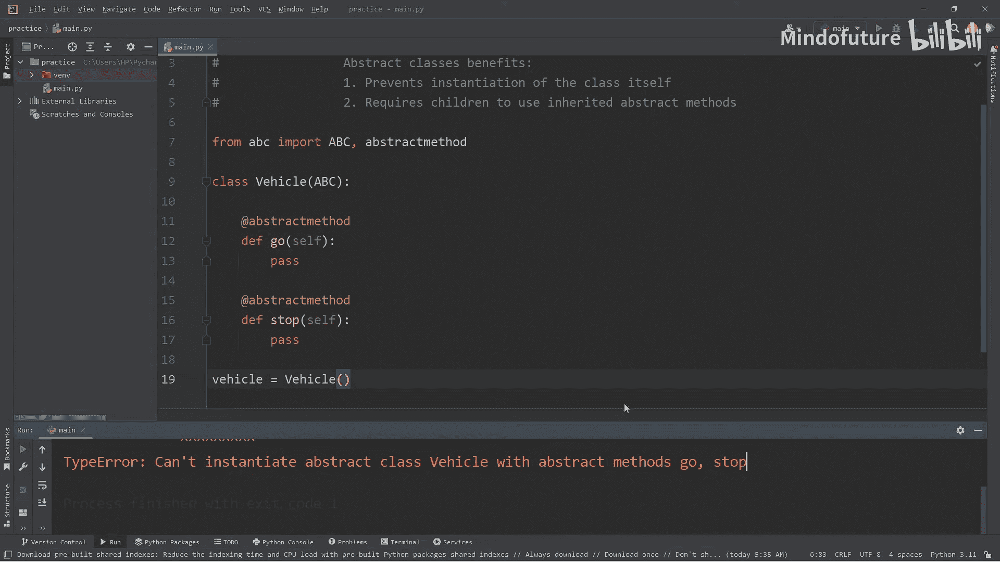
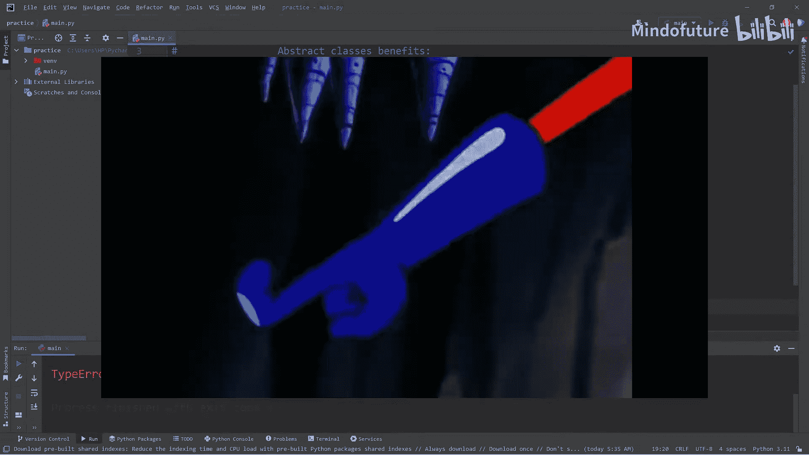
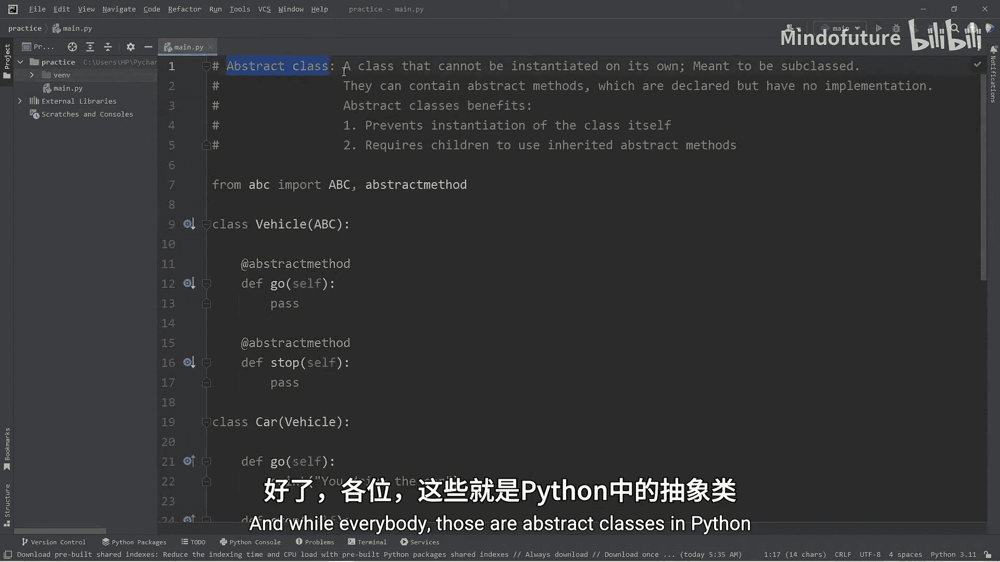

# 051：抽象类

## 概述
在本节课中，我们将要学习Python中的抽象类。抽象类是一种不能被直接实例化的类，它通常作为其他类的父类，用于定义一组必须由其子类实现的方法。通过使用抽象类，我们可以确保子类遵循特定的接口规范，从而提高代码的结构性和可维护性。

## 什么是抽象类？
抽象类是一种不能独立创建对象的类。它被设计为其他类的父类，即“基类”。抽象类可以包含抽象方法，这些方法只有声明而没有具体的实现。抽象类本身是不完整的，因此我们不希望创建不完整的对象。

## 抽象类的好处
抽象类有几个主要优点。首先，我们无法从抽象类直接创建对象，这防止了创建不完整对象的情况。其次，任何继承自抽象类的子类，如果父类中存在抽象方法，则子类必须实现这些方法。这确保了子类遵循了父类定义的接口。

## 使用抽象类
要使用抽象类，我们需要从Python的`abc`模块中导入`ABC`（抽象基类）和`abstractmethod`装饰器。

以下是导入所需模块的代码：
```python
from abc import ABC, abstractmethod
```

## 创建抽象类
接下来，我们创建一个名为`Vehicle`的抽象类。这个类将继承自`ABC`，并包含两个抽象方法：`go`和`stop`。

以下是定义抽象类的代码：
```python
class Vehicle(ABC):
    @abstractmethod
    def go(self):
        pass

    @abstractmethod
    def stop(self):
        pass
```



## 尝试实例化抽象类
为了验证抽象类不能被实例化，我们尝试创建一个`Vehicle`对象。运行代码后，我们会收到一个`TypeError`，提示无法实例化包含抽象方法的抽象类。这正是我们期望的结果。



以下是尝试实例化的代码：
```python
# 尝试创建Vehicle对象会引发错误
# vehicle = Vehicle()  # 这行代码会报错
```

## 创建子类并实现抽象方法
既然抽象类不能直接使用，我们就需要创建继承自它的子类。任何继承自抽象类的子类都必须实现父类中所有的抽象方法。

以下是创建`Car`子类的步骤：
1.  定义`Car`类，继承自`Vehicle`。
2.  在`Car`类中实现`go`和`stop`方法。

以下是`Car`类的代码：
```python
class Car(Vehicle):
    def go(self):
        print("You drive the car.")

    def stop(self):
        print("You stop the car.")
```

现在，我们可以创建`Car`对象并调用其方法：
```python
car = Car()
car.go()
car.stop()
```

## 创建更多子类
为了进一步理解，我们再创建两个子类：`Motorcycle`和`Boat`。每个子类都必须实现`go`和`stop`方法。

以下是`Motorcycle`类的代码：
```python
class Motorcycle(Vehicle):
    def go(self):
        print("You ride the motorcycle.")

    def stop(self):
        print("You stop the motorcycle.")
```

以下是`Boat`类的代码（注意：初始版本会故意遗漏`stop`方法以展示错误）：
```python
class Boat(Vehicle):
    def go(self):
        print("You sail the boat.")
    # 忘记实现stop方法会导致错误
```

如果我们尝试创建`Boat`对象而不实现`stop`方法，Python会抛出`TypeError`，提示我们遗漏了抽象方法。这体现了抽象类作为“检查与平衡”机制的作用，确保所有子类都完整实现了必要的功能。

修正后的`Boat`类代码如下：
```python
class Boat(Vehicle):
    def go(self):
        print("You sail the boat.")

    def stop(self):
        print("You anchor the boat.")
```



## 总结
本节课中我们一起学习了Python中的抽象类。抽象类是一种不能被直接实例化的类，它通过定义抽象方法来强制其子类实现特定的接口。我们学习了如何导入`ABC`和`abstractmethod`，如何创建抽象类及其子类，并理解了抽象类在确保代码结构完整性方面的重要作用。通过使用抽象类，我们可以构建出更加健壮和可维护的面向对象程序。