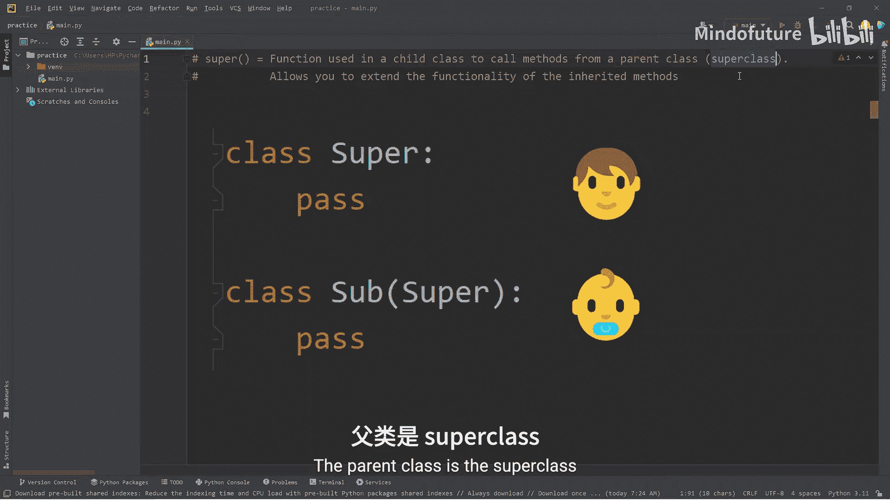
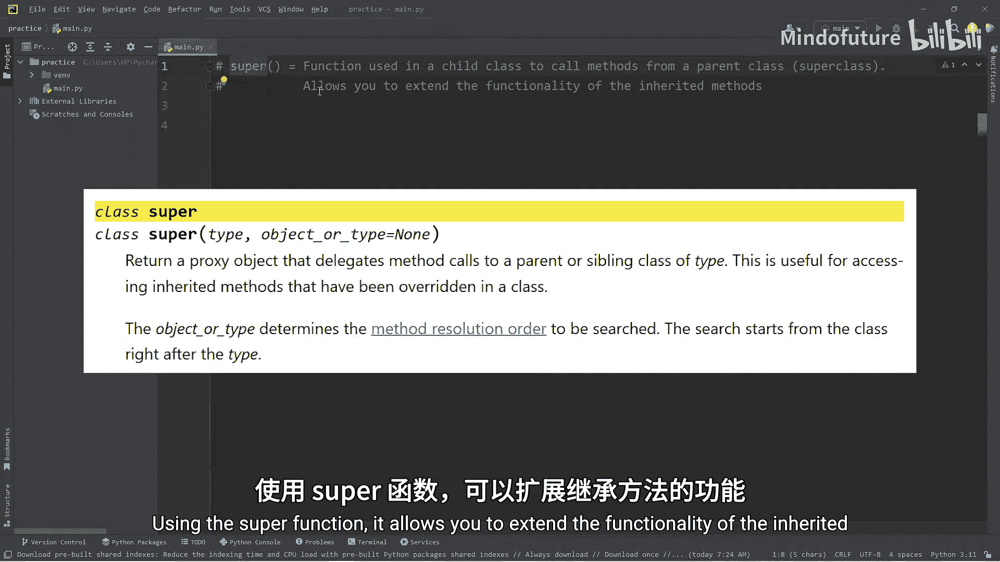
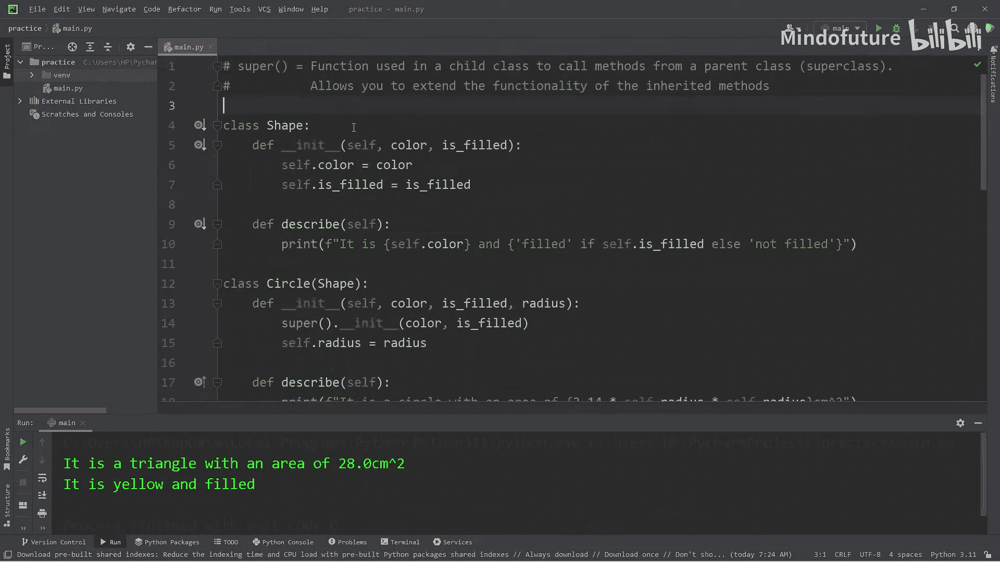

# 052：Python中的super()函数详解 🐍

在本节课中，我们将要学习Python中的`super()`函数。`super()`是一个内置函数，用于在子类中调用父类（也称为超类）的方法。通过使用`super()`，我们可以有效地复用代码，并扩展继承方法的功能。





## 继承与代码复用

上一节我们介绍了类的基本概念，本节中我们来看看如何通过继承来避免代码重复。假设我们要创建几种形状的类：圆形、正方形和三角形。它们有一些共同的属性，比如颜色和是否填充，也有一些独特的属性。

以下是这些类的初始定义，其中包含了一些重复的代码：

```python
class Circle:
    def __init__(self, color, filled, radius):
        self.color = color
        self.filled = filled
        self.radius = radius

class Square:
    def __init__(self, color, filled, width):
        self.color = color
        self.filled = filled
        self.width = width

class Triangle:
    def __init__(self, color, filled, width, height):
        self.color = color
        self.filled = filled
        self.width = width
        self.height = height
```

如果我们需要修改一个共同属性（例如将`filled`改为`is_filled`），就必须在每个类中手动更改，这既繁琐又容易出错。更好的方法是使用继承。

## 创建父类

我们可以创建一个名为`Shape`的父类，将共同的属性`color`和`is_filled`放在其中。然后让其他形状类继承这个父类。

```python
class Shape:
    def __init__(self, color, is_filled):
        self.color = color
        self.is_filled = is_filled
```

现在，子类可以通过`super()`函数来调用父类的`__init__`方法，从而初始化这些共同属性。

## 使用super()初始化

以下是使用`super()`重构后的子类：

```python
class Circle(Shape):
    def __init__(self, color, is_filled, radius):
        super().__init__(color, is_filled)  # 调用父类Shape的构造函数
        self.radius = radius

class Square(Shape):
    def __init__(self, color, is_filled, width):
        super().__init__(color, is_filled)
        self.width = width

class Triangle(Shape):
    def __init__(self, color, is_filled, width, height):
        super().__init__(color, is_filled)
        self.width = width
        self.height = height
```

这样，共同属性的初始化逻辑只存在于`Shape`类中，子类只需处理自己特有的属性。

## 创建对象并测试

现在我们可以创建对象并访问它们的属性：

```python
circle = Circle(color="red", is_filled=True, radius=5)
print(f"Circle color: {circle.color}")
print(f"Circle is filled: {circle.is_filled}")
print(f"Circle radius: {circle.radius} cm")

square = Square(color="blue", is_filled=False, width=6)
print(f"Square color: {square.color}")
print(f"Square is filled: {square.is_filled}")
print(f"Square width: {square.width} cm")

triangle = Triangle(color="yellow", is_filled=True, width=7, height=8)
print(f"Triangle color: {triangle.color}")
print(f"Triangle is filled: {triangle.is_filled}")
print(f"Triangle width: {triangle.width} cm")
print(f"Triangle height: {triangle.height} cm")
```

## 方法继承与重写

父类可以定义一些通用方法，子类会继承它们。例如，我们在`Shape`类中添加一个`describe`方法：

```python
class Shape:
    # ... __init__ 方法同上 ...
    def describe(self):
        status = "filled" if self.is_filled else "not filled"
        print(f"It is {self.color} and {status}.")
```

所有子类都将拥有这个方法：

```python
circle.describe()  # 输出: It is red and filled.
square.describe()  # 输出: It is blue and not filled.
triangle.describe() # 输出: It is yellow and filled.
```

如果子类需要不同的行为，可以重写（Override）父类的方法。例如，为`Circle`类定义一个自己的`describe`方法来计算面积：

```python
class Circle(Shape):
    # ... __init__ 方法同上 ...
    def describe(self):
        area = 3.14 * self.radius * self.radius
        print(f"It is a circle with an area of {area} cm².")
```

现在调用`circle.describe()`将使用子类自己的版本。

## 使用super()扩展方法功能

有时，我们既想使用父类方法的功能，又想添加一些子类特有的功能。这时可以在子类方法中使用`super()`来调用父类方法。

以下是扩展`describe`方法的例子：

```python
class Circle(Shape):
    # ... __init__ 方法同上 ...
    def describe(self):
        # 首先调用父类的describe方法
        super().describe()
        # 然后添加子类特有的功能
        area = 3.14 * self.radius * self.radius
        print(f"It is a circle with an area of {area} cm².")
```

调用`circle.describe()`会先输出颜色和填充状态，再输出面积信息。

我们也可以为`Square`和`Triangle`类实现类似的重写：

```python
class Square(Shape):
    # ... __init__ 方法同上 ...
    def describe(self):
        super().describe()
        area = self.width * self.width
        print(f"It is a square with an area of {area} cm².")

class Triangle(Shape):
    # ... __init__ 方法同上 ...
    def describe(self):
        super().describe()
        area = (self.width * self.height) / 2
        print(f"It is a triangle with an area of {area} cm².")
```

## 总结

本节课中我们一起学习了Python中的`super()`函数。`super()`用于在子类中调用父类（超类）的方法。它的主要用途有两个：
1.  **在构造函数中**：初始化从父类继承的共同属性，避免代码重复。
2.  **在其他方法中**：扩展继承方法的功能，可以在执行子类代码的同时保留父类方法的行为。



通过使用`super()`和继承，我们可以构建出层次清晰、易于维护的类结构。记住，`super()`让你能站在“巨人（父类）的肩膀上”构建功能。