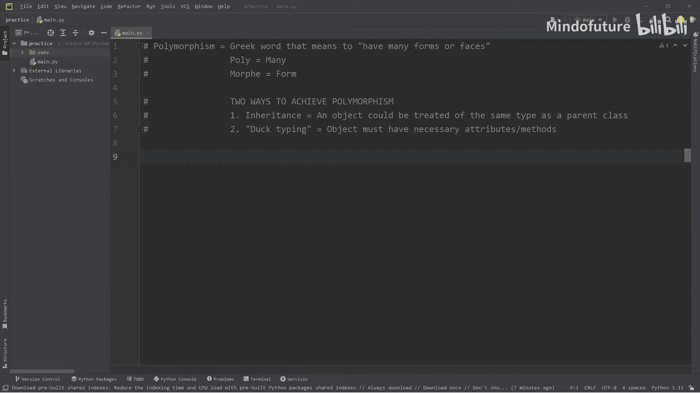
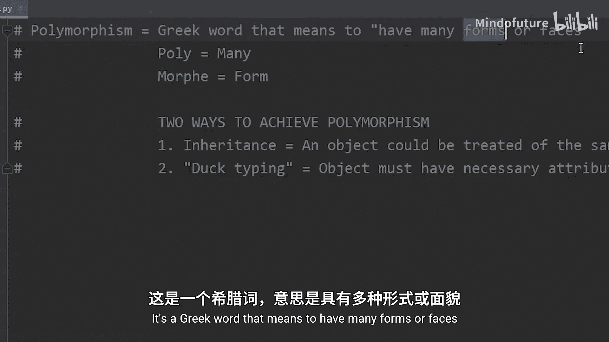
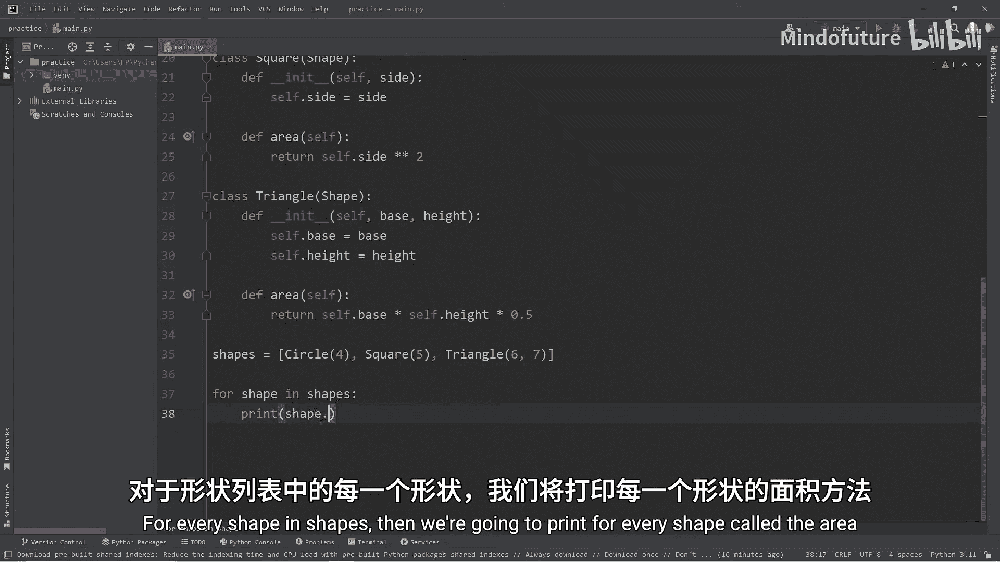
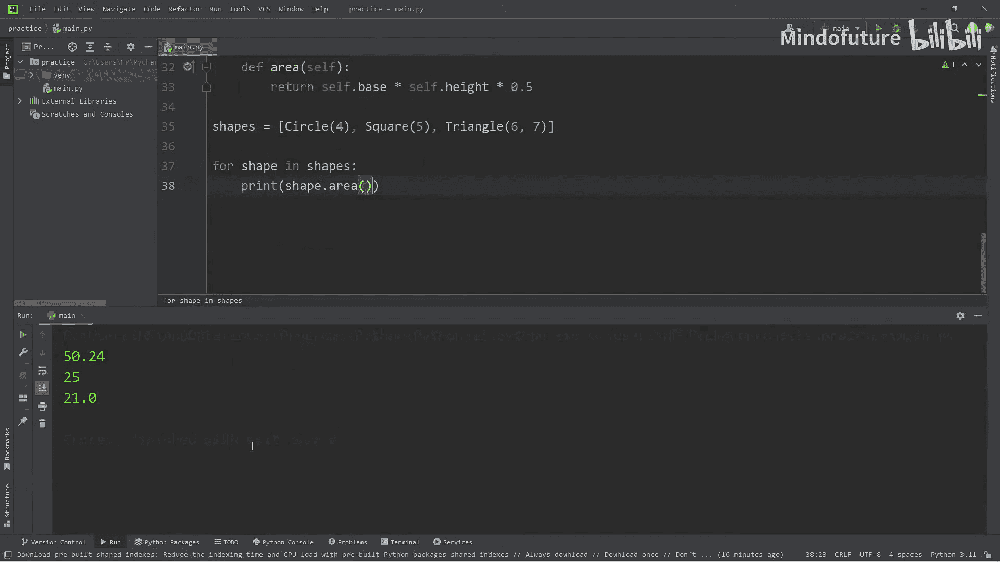
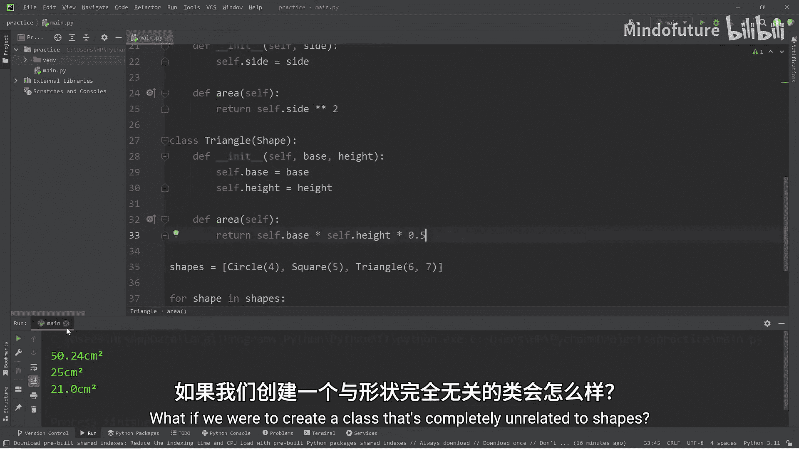
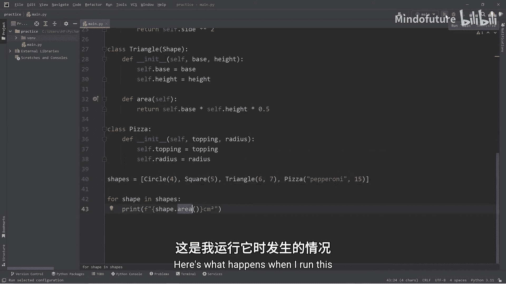
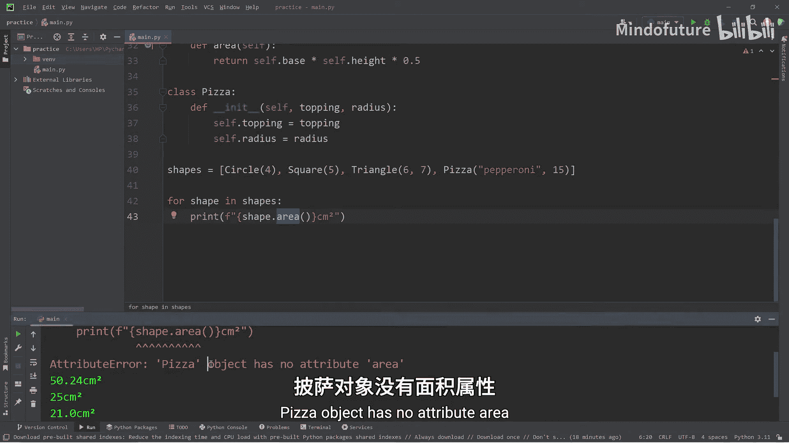
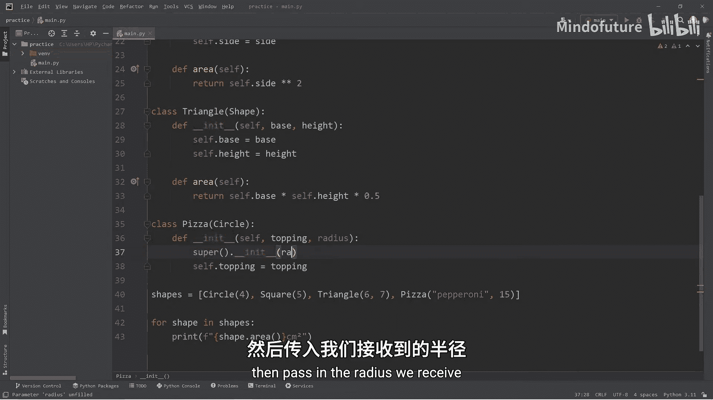
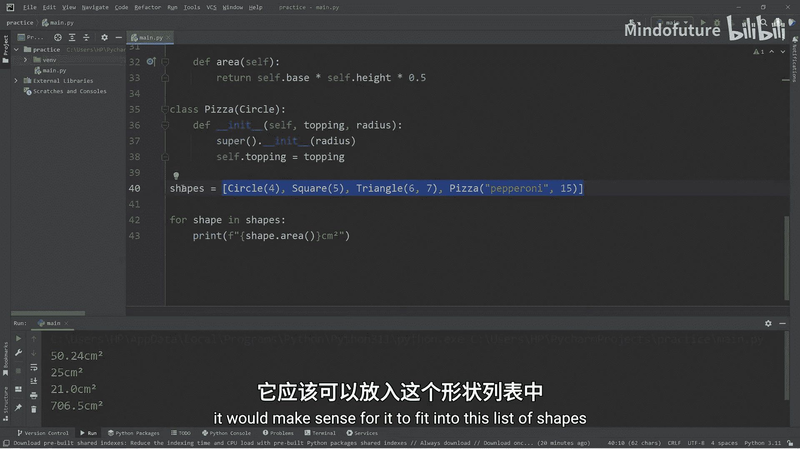
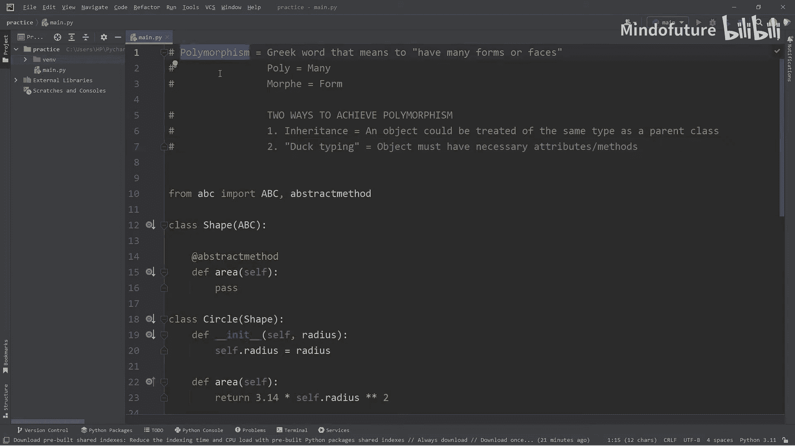

# 053：多态性

在本节课中，我们将要学习Python中的一个重要概念——多态性。多态性允许对象以多种形式存在，是面向对象编程的核心特性之一。我们将通过继承机制来理解并实现多态。

## 什么是多态性？🤔



多态性是一个编程概念。它是一个希腊词汇，意为“多种形式”或“多张面孔”。



*   **Poly** 意为“多”。
*   **Morph** 意为“形式”。

在编程中，一个对象可以呈现出多种形式之一。实现多态主要有两种方式：一种是通过**继承**，另一种是通过**鸭子类型**。本节我们将重点讨论通过继承实现的多态。

## 通过继承实现多态 🧬

上一节我们介绍了多态的基本概念，本节中我们来看看如何通过继承来实现它。当一个对象可以被视为其父类的类型时，就体现了多态。

我们将创建一个`Shape`（形状）基类，并让其他具体形状类继承它。

```python
from abc import ABC, abstractmethod

class Shape(ABC):
    @abstractmethod
    def area(self):
        pass
```

`Shape`类是一个抽象基类，它定义了一个抽象方法`area`。这意味着任何继承自`Shape`的类都必须实现自己的`area`方法。

接下来，我们创建几个具体的形状类。

```python
class Circle(Shape):
    def __init__(self, radius):
        self.radius = radius

    def area(self):
        return 3.14 * (self.radius ** 2)

class Square(Shape):
    def __init__(self, side):
        self.side = side

    def area(self):
        return self.side ** 2

class Triangle(Shape):
    def __init__(self, base, height):
        self.base = base
        self.height = height

    def area(self):
        return 0.5 * self.base * self.height
```

现在，我们可以创建这些类的对象。一个`Circle`对象既是`Circle`类型，也是`Shape`类型。这就是它的两种“形式”。同理，`Square`和`Triangle`对象也各自有两种形式。

## 多态性的应用实例 💡

理解了多态的原理后，我们来看一个实际应用的例子。我们可以创建一个`Shape`类型的列表，并统一处理其中不同类型的对象。

以下是创建形状列表并计算面积的步骤：

1.  创建一个空列表`shapes`。
2.  实例化不同的形状对象（`Circle`, `Square`, `Triangle`）并添加到列表中。
3.  遍历列表，对每个形状调用其`area`方法。



```python
shapes = []



shapes.append(Circle(4))
shapes.append(Square(5))
shapes.append(Triangle(6, 7))



for shape in shapes:
    print(f"{shape.area()} 平方厘米")
```

运行这段代码，你将看到每个形状计算出的面积。尽管列表中的对象具体类型不同，但我们可以将它们统一视为`Shape`类型来调用`area`方法，这正是多态性的威力。

## 扩展多态性：披萨的例子 🍕



为了更深入地理解，我们引入一个`Pizza`类。最初，`Pizza`类与`Shape`无关，因此无法放入`shapes`列表或调用`area`方法。



```python
class Pizza:
    def __init__(self, topping, radius):
        self.topping = topping
        self.radius = radius

# 尝试添加到shapes列表会出错，因为Pizza没有area方法
# shapes.append(Pizza("pepperoni", 15)) # 这行会引发AttributeError
```

为了让`Pizza`也能计算面积并被视为一种形状，我们可以让它继承自`Circle`类。



```python
class Pizza(Circle):
    def __init__(self, topping, radius):
        super().__init__(radius) # 调用父类Circle的构造函数来设置半径
        self.topping = topping

# 现在可以成功添加并计算面积
shapes.append(Pizza("pepperoni", 15))
```

现在，`Pizza`对象具有了三种形式：它是一个`Pizza`，也是一个`Circle`（因为继承），同时也是一个`Shape`（因为`Circle`继承自`Shape`）。因此，它可以自然地放入`shapes`列表并参与面积计算。

## 总结 📚

本节课中我们一起学习了Python中的多态性。

*   **多态性**意味着“多种形式”，它允许我们将不同的对象视为同一类型进行处理。
*   我们重点学习了通过**继承**实现多态：子类对象可以被当作父类类型使用。
*   我们创建了`Shape`类层次结构，并演示了如何将`Circle`、`Square`、`Triangle`甚至`Pizza`对象统一放入一个列表，并调用共同的`area`方法。
*   多态性提高了代码的**灵活性和可扩展性**，使得添加新功能（如新的形状）变得更容易，而无需修改处理这些对象的通用代码。





记住，实现多态的另一种常见方式是“鸭子类型”，我们将在后续主题中讨论。