# 055：理解聚合关系 🧩

在本节课中，我们将要学习面向对象编程中的一个重要概念——**聚合**。聚合描述了一种对象之间的关系，其中一个对象作为容器，可以包含一个或多个独立的对象。我们将通过创建一个简单的“图书馆”和“图书”的例子来理解这个概念。

## 什么是聚合？🤔

聚合代表一种关系，其中一个对象（整体）包含对一个或多个独立对象（部分）的引用。整体对象充当容器，它可以容纳其他对象。关键点在于，整体和部分可以独立存在，它们之间没有强制的生命周期依赖。

## 创建独立的部分：图书类 📚

首先，我们来创建代表“部分”的类。在这个例子中，我们将创建一个 `Book` 类。每本书都有标题和作者两个属性。

以下是 `Book` 类的定义：

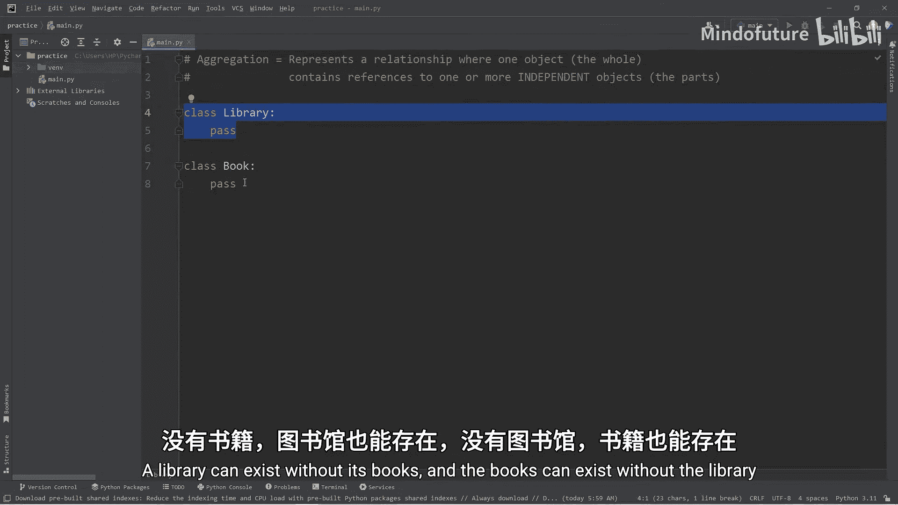

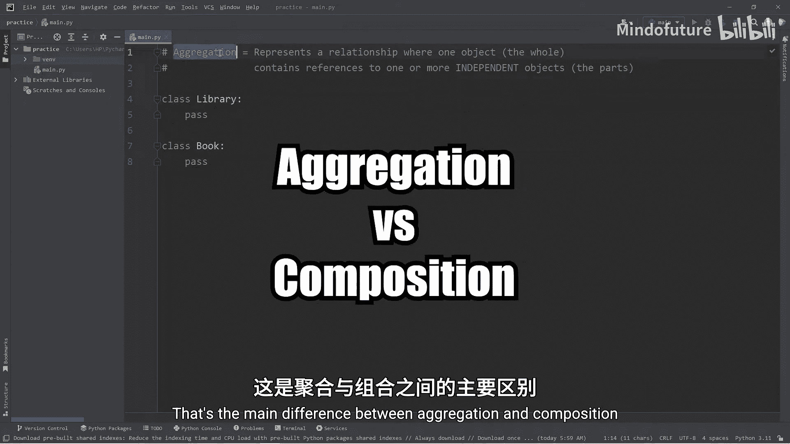

```python
class Book:
    def __init__(self, title, author):
        self.title = title
        self.author = author
```

*   `__init__` 是构造函数，在创建 `Book` 对象时自动调用。
*   `self.title = title` 将传入的 `title` 参数赋值给对象的 `title` 属性。
*   `self.author = author` 将传入的 `author` 参数赋值给对象的 `author` 属性。

## 创建整体：图书馆类 🏛️

接下来，我们创建代表“整体”的 `Library` 类。图书馆有自己的名字，并且可以容纳多本图书。我们将用一个列表来存储这些图书。

以下是 `Library` 类的初始定义：

```python
class Library:
    def __init__(self, name):
        self.name = name
        self.books = []  # 初始化一个空列表来存放图书对象
```

*   `self.name = name` 设置图书馆的名字。
*   `self.books = []` 初始化一个空列表 `books`，用于将来存放 `Book` 对象。

## 建立聚合关系：添加图书到图书馆 ➕

现在，我们需要一种方法将独立的 `Book` 对象添加到 `Library` 对象中。这通过在 `Library` 类中定义一个 `add_book` 方法来实现。

以下是 `add_book` 方法的定义：

```python
class Library:
    def __init__(self, name):
        self.name = name
        self.books = []

    def add_book(self, book):
        self.books.append(book)
```

*   `def add_book(self, book):` 定义了一个方法，它接受一个 `book` 参数（一个 `Book` 对象）。
*   `self.books.append(book)` 使用列表的 `append` 方法，将传入的 `book` 对象添加到 `self.books` 列表中。

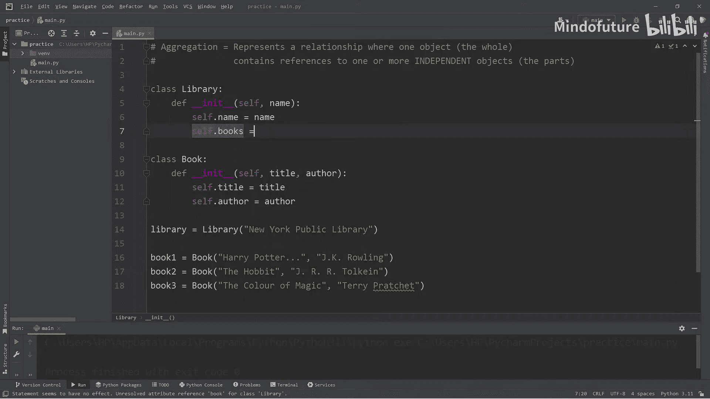

## 实践操作：创建对象并建立关系 🛠️

上一节我们介绍了如何定义类和方法，本节中我们来看看如何实际使用它们。

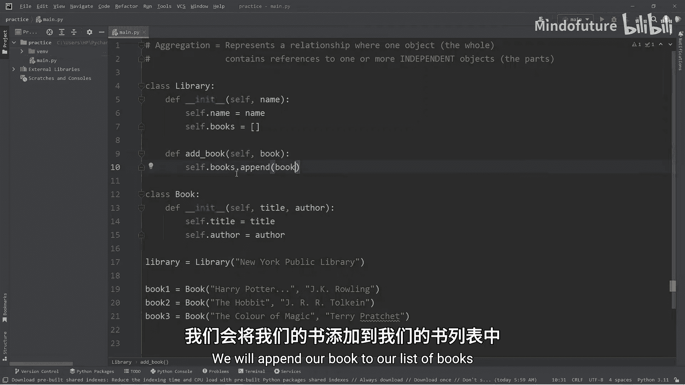

以下是创建对象并建立聚合关系的步骤：

1.  **创建图书馆对象**：`my_library = Library("纽约公共图书馆")`
2.  **创建独立的图书对象**：
    *   `book1 = Book("哈利·波特...", "J.K.罗琳")`
    *   `book2 = Book("霍比特人", "J.R.R.托尔金")`
    *   `book3 = Book("魔法的颜色", "特里·普拉切特")`
3.  **将图书添加到图书馆**：
    *   `my_library.add_book(book1)`
    *   `my_library.add_book(book2)`
    *   `my_library.add_book(book3)`

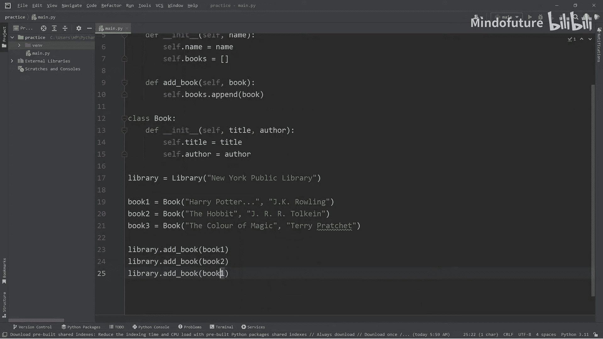

此时，`my_library` 对象通过其 `books` 列表，包含了三个 `Book` 对象的引用。这些 `Book` 对象是独立创建的，即使没有图书馆，它们依然存在。

## 查看聚合内容：列出所有图书 📃

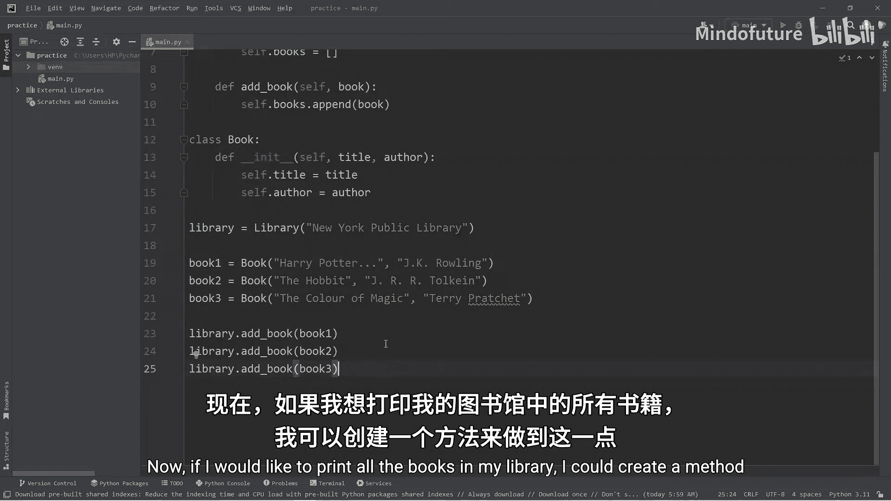

为了验证我们的聚合关系，我们可以在 `Library` 类中添加一个方法来列出所有图书。

以下是 `list_books` 方法的定义：

```python
class Library:
    # ... 之前的 __init__ 和 add_book 方法 ...

    def list_books(self):
        book_list = []
        for book in self.books:
            book_list.append(f"{book.title} 作者：{book.author}")
        return book_list
```

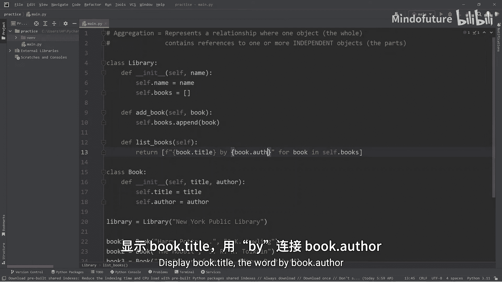

这个方法遍历 `self.books` 列表中的每一个 `Book` 对象，并将其标题和作者格式化成字符串，最后返回一个字符串列表。

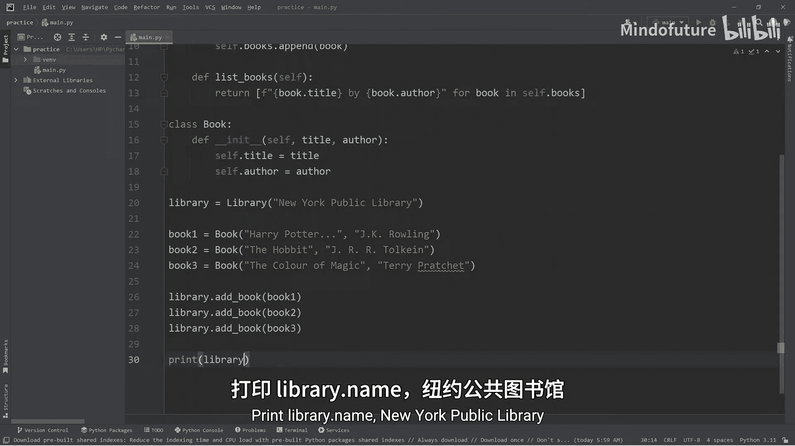

我们可以这样使用它：

```python
print(my_library.name)
for book_info in my_library.list_books():
    print(book_info)
```

输出结果将显示图书馆的名字和馆内所有图书的详细信息。

## 总结 📝

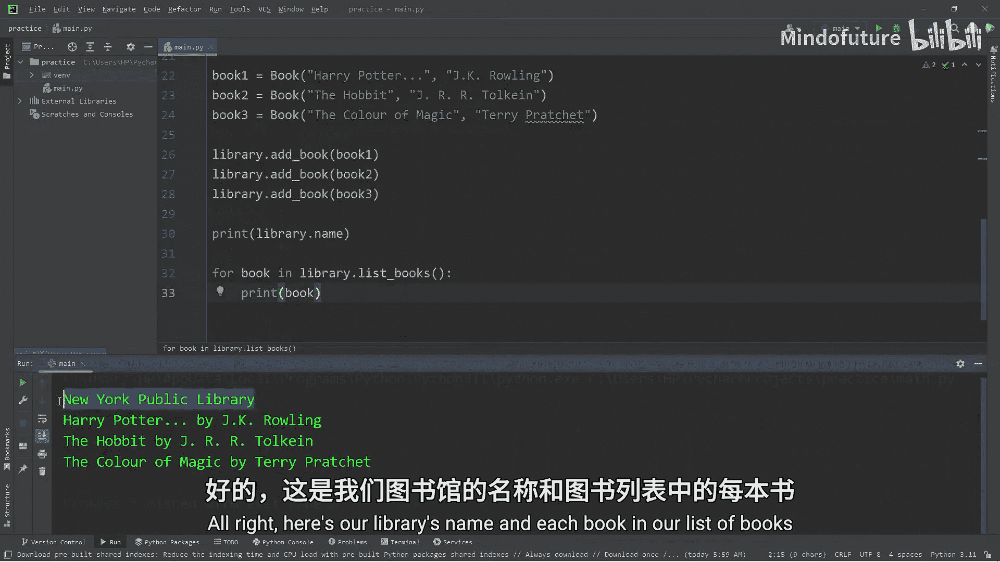

本节课中我们一起学习了Python中的**聚合**关系。我们了解到：

*   聚合是一种“整体-部分”关系，但整体和部分可以独立存在。
*   我们通过创建 `Library`（整体）和 `Book`（部分）两个类来演示。
*   `Library` 类通过一个列表属性来“包含” `Book` 对象的引用。
*   使用 `add_book` 方法可以建立聚合关系。
*   使用 `list_books` 方法可以查看聚合的内容。

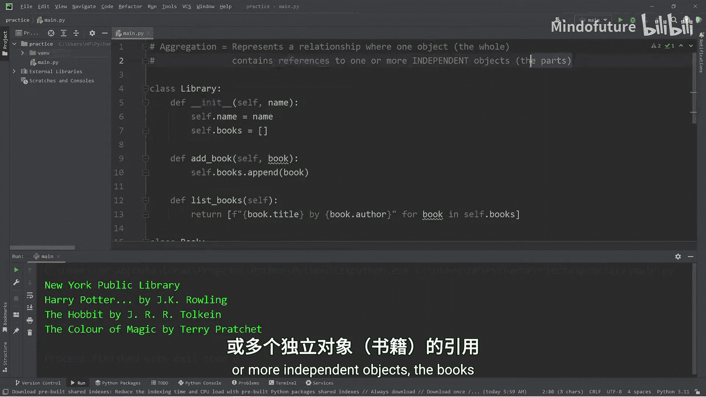

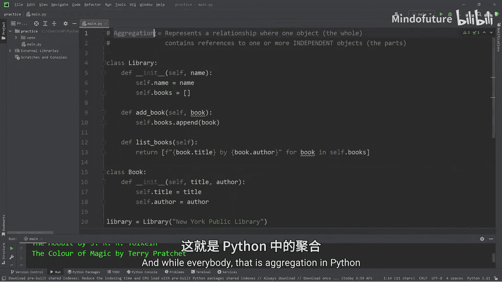

理解聚合有助于你设计更清晰、耦合度更低的面向对象程序。它与“组合”关系的主要区别在于生命周期的独立性。