Python超全入门教程：P56：组合（Composition）概念与实践

在本节课中，我们将要学习Python面向对象编程中的一个重要概念——组合。我们将通过一个汽车、引擎和车轮的实例，来理解组合与聚合的区别，并掌握如何在类中实现组合关系。

---

### 概述：组合与聚合的区别

上一节我们介绍了聚合（Aggregation），它是一种“拥有”（has-a）的关系，其中一个对象包含对其他独立对象的引用。组合（Composition）则是一种“拥有所有权”（owns-a）的关系，被组合的对象直接拥有其组件，并且这些组件不能独立存在。这类似于租房（聚合）与买房（组合）的区别。

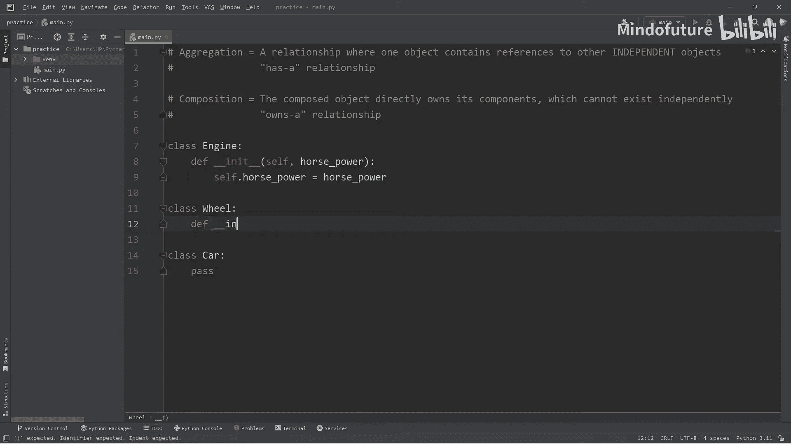

### 构建组件类：引擎与车轮

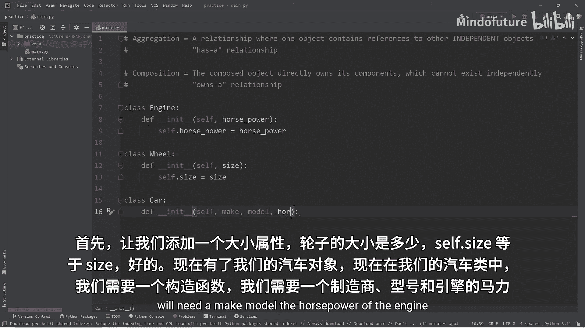

在实现组合之前，我们需要先创建将被组合的组件类。

以下是引擎（`Engine`）类的定义。它有一个构造函数，用于接收并设置马力（`horsepower`）属性。

```python
class Engine:
    def __init__(self, horsepower):
        self.horsepower = horsepower
```

以下是车轮（`Wheel`）类的定义。它同样有一个构造函数，用于接收并设置尺寸（`size`）属性。

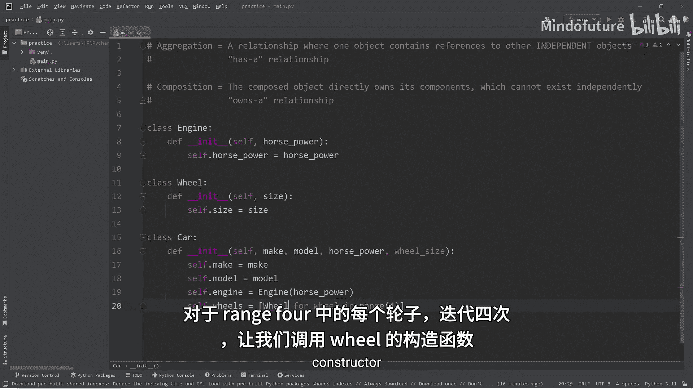

```python
class Wheel:
    def __init__(self, size):
        self.size = size
```

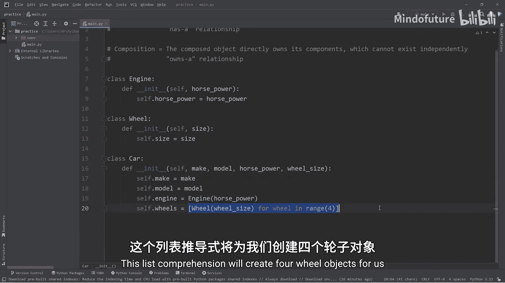

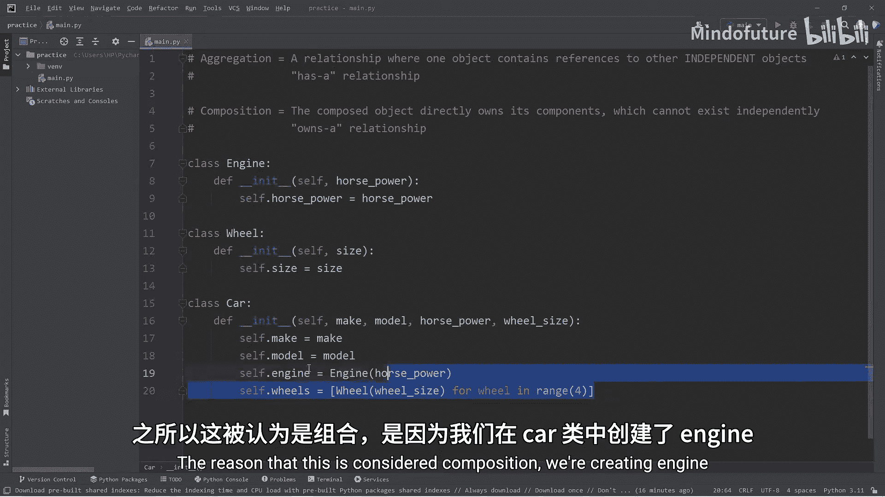

### 构建组合类：汽车

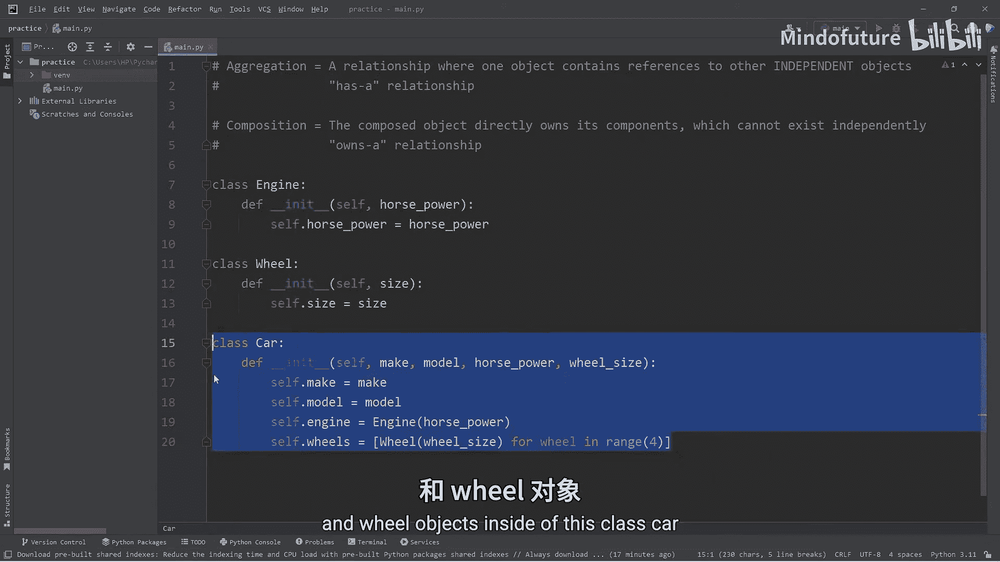

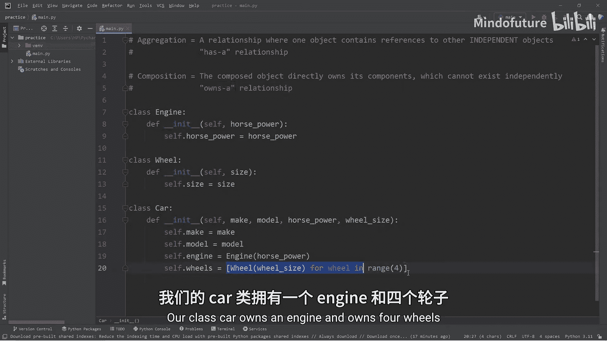

现在，我们来创建组合类——汽车（`Car`）。汽车类将“拥有”一个引擎和四个车轮。

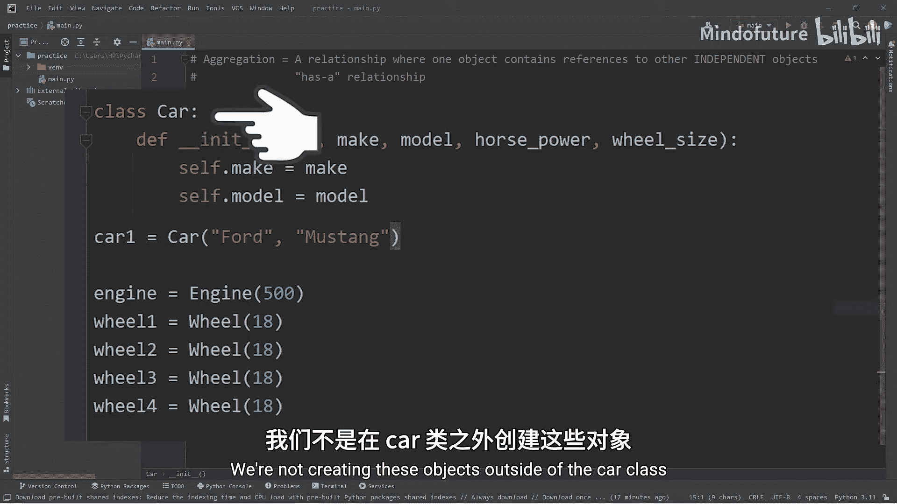

在汽车类的构造函数中，我们不仅接收汽车的基本信息（品牌、型号），还接收引擎马力和车轮尺寸。关键步骤在于，我们在构造函数内部直接创建了`Engine`和`Wheel`的实例。

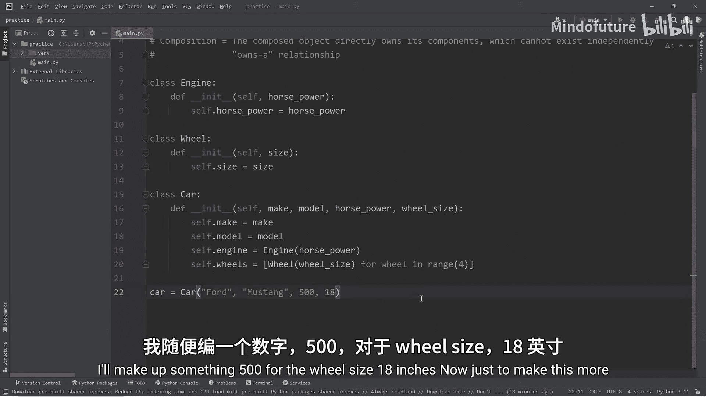

```python
class Car:
    def __init__(self, make, model, horsepower, wheel_size):
        self.make = make
        self.model = model
        # 组合：在Car内部创建并拥有一个Engine对象
        self.engine = Engine(horsepower)
        # 组合：在Car内部创建并拥有四个Wheel对象
        self.wheels = [Wheel(wheel_size) for _ in range(4)]
```

**代码解析**：
*   `self.engine = Engine(horsepower)`：这行代码在`Car`对象内部创建了一个`Engine`对象。这个引擎的生命周期与这辆汽车绑定。
*   `self.wheels = [Wheel(wheel_size) for _ in range(4)]`：这行代码使用列表推导式创建了一个包含四个`Wheel`对象的列表。这四个车轮也是由这辆汽车直接拥有。

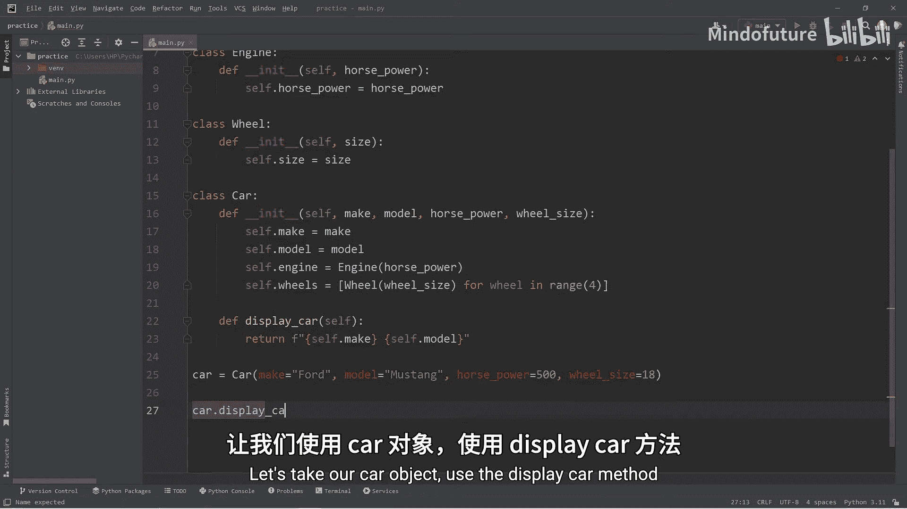

### 使用组合类

现在，我们可以创建汽车对象并访问其组件属性。

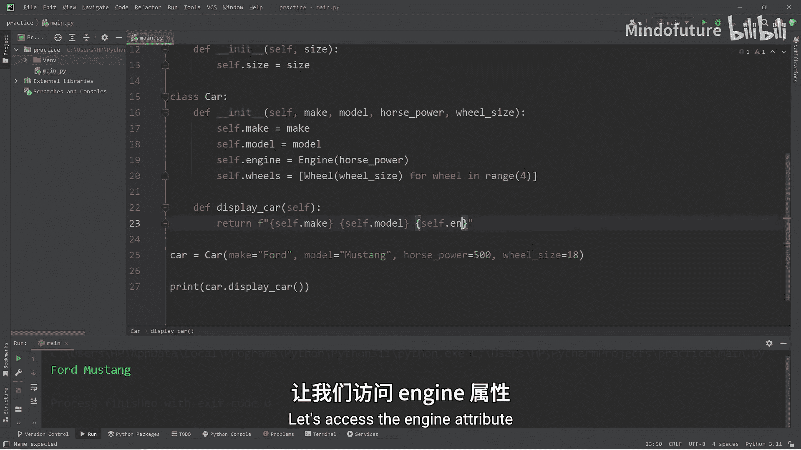

以下是创建和显示汽车对象信息的步骤。

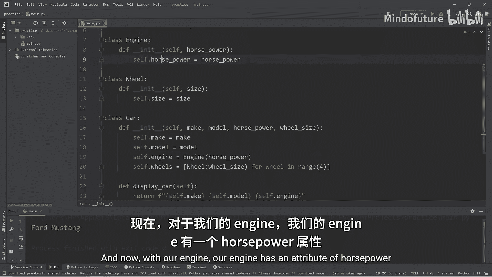

1.  **创建汽车对象**：我们使用关键字参数来提高代码可读性。
    ```python
    car1 = Car(make="Ford", model="Mustang", horsepower=500, wheel_size=18)
    ```
2.  **添加显示方法**：在`Car`类中添加一个方法来展示汽车详情。注意访问组件属性的方式：需要通过汽车对象访问其组件，再访问组件的属性。
    ```python
    class Car:
        # ... __init__ 方法同上 ...
        def display_car(self):
            return f"{self.make} {self.model} | Engine: {self.engine.horsepower}HP | Wheel Size: {self.wheels[0].size} inches"
    ```
3.  **调用显示方法**：
    ```python
    print(car1.display_car())
    # 输出：Ford Mustang | Engine: 500HP | Wheel Size: 18 inches
    ```
4.  **创建第二个对象**：组合关系是独立的，每辆车都拥有自己的一套引擎和车轮。
    ```python
    car2 = Car(make="Chevrolet", model="Corvette", horsepower=670, wheel_size=19)
    print(car2.display_car())
    # 输出：Chevrolet Corvette | Engine: 670HP | Wheel Size: 19 inches
    ```

### 组合的核心特征

让我们通过一个对比来总结组合的核心特征。

*   **组合（本例）**：`Car`对象在自身内部创建`Engine`和`Wheel`对象。如果删除`car1`或`car2`，那么它们所拥有的引擎和车轮对象也会随之被销毁，无法独立存在。
*   **聚合（上节课例子）**：`Library`对象接收外部已经存在的`Book`对象列表。如果删除图书馆对象，其中的书籍对象仍然可以独立存在。

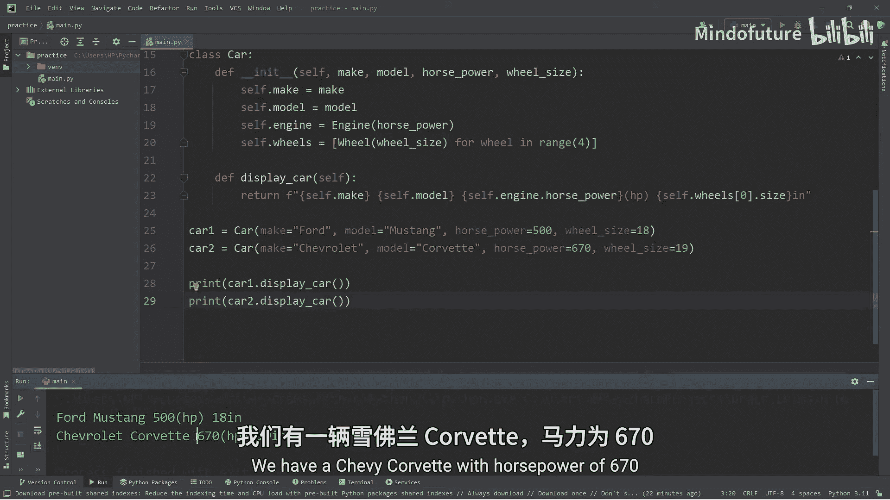

这体现了“所有权”的差异：组合是紧密的拥有关系，而聚合是松散的包含关系。

---

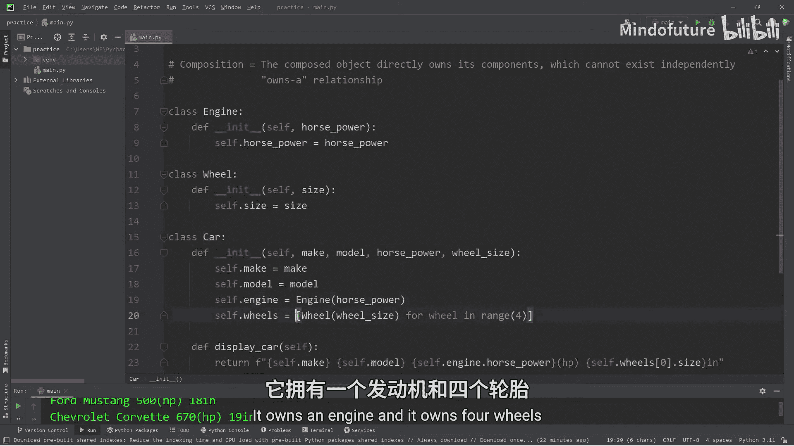

### 总结

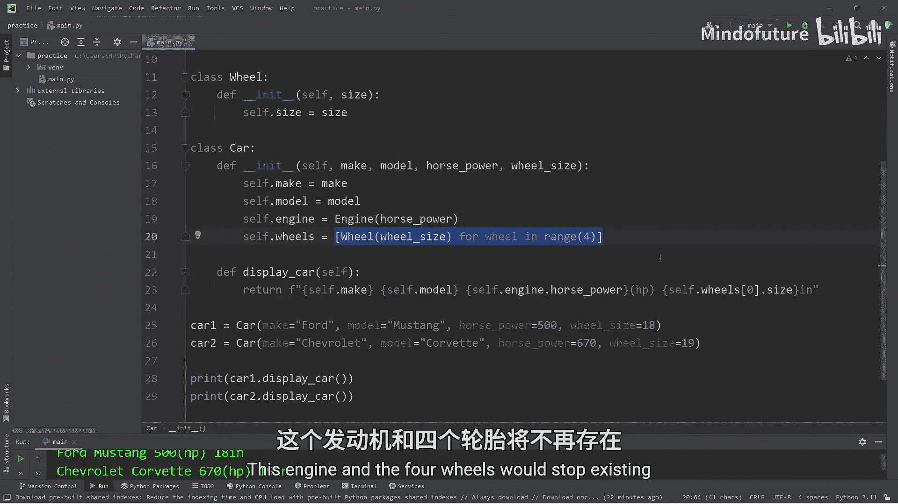

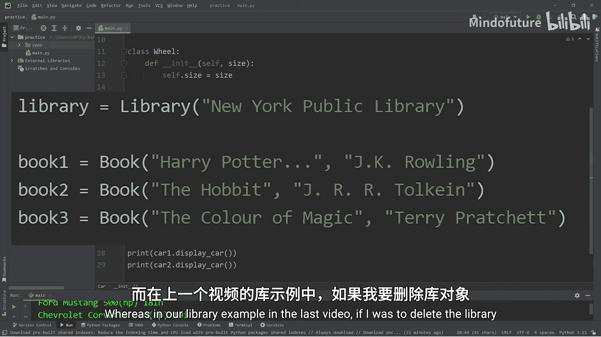

本节课中我们一起学习了Python中的组合（Composition）。
1.  我们明确了**组合是一种“owns-a”关系**，被组合对象直接创建并拥有其组件。
2.  我们通过构建`Engine`、`Wheel`和`Car`类，**实践了如何在类内部实例化其他类对象**来实现组合。
3.  我们理解了**组合与聚合的关键区别**在于组件对象的生命周期是否依赖于主体对象。
4.  我们掌握了**访问组合对象属性**的方法（如`self.engine.horsepower`）。

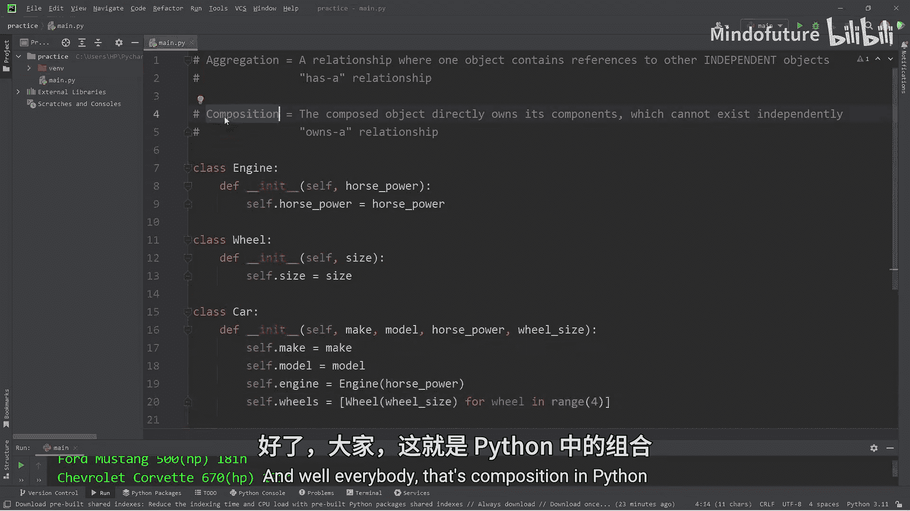

组合有助于构建更复杂、关系更紧密的对象模型，是面向对象设计中的重要工具。