# 058：静态方法详解 🧑‍🏫

在本节课中，我们将要学习Python中的静态方法。我们将了解什么是静态方法，它与实例方法有何不同，以及如何定义和使用静态方法。

---

## 什么是静态方法？

静态方法是一种属于类本身，而非属于该类任何对象的方法。我们之前已经熟悉了实例方法，它们属于从类创建的单个对象，最适合对该类的实例（即对象）进行操作。而静态方法最适合作为类内部的工具函数，它们不需要访问类的数据。

接下来，我们将通过演示来区分实例方法和静态方法。

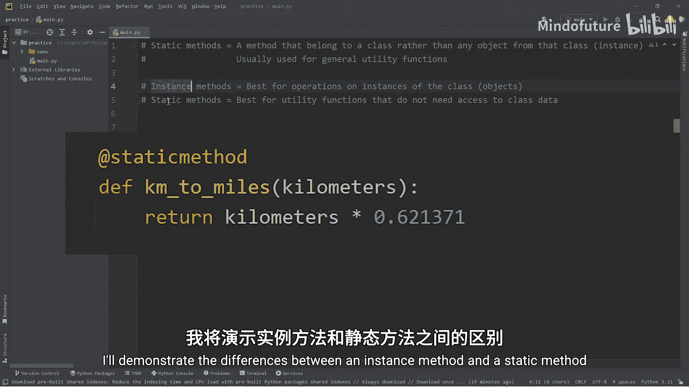

---

## 创建示例类：Employee

我们将创建一个`Employee`类。首先，我们需要一个构造函数。

```python
class Employee:
    def __init__(self, name, position):
        self.name = name
        self.position = position
```

要创建一个员工对象，我们需要姓名和职位。我们将`self.name`赋值为`name`，`self.position`赋值为`position`。

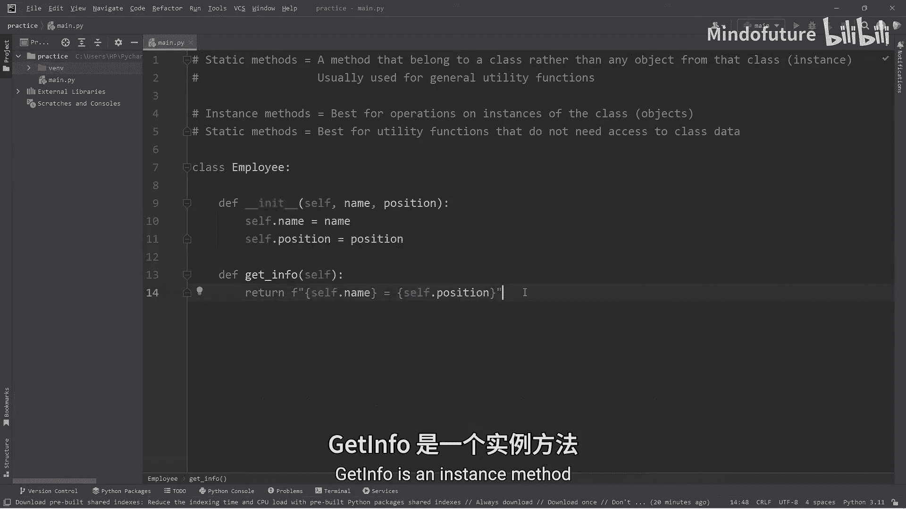

---

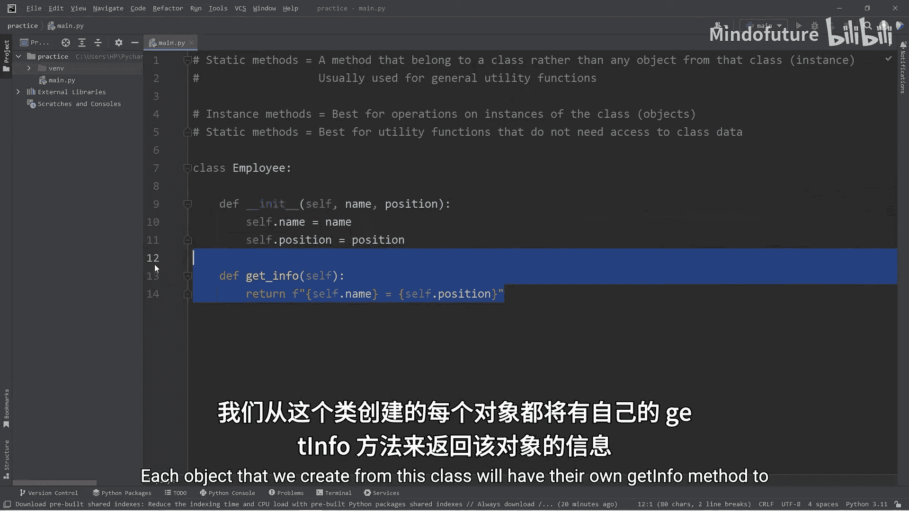

## 定义实例方法

我们将创建一个名为`get_info`的实例方法。

```python
    def get_info(self):
        return f"Employee info: {self.name} is a {self.position}."
```

`get_info`是一个实例方法。我们从这个类创建的每个对象都将拥有自己的`get_info`方法来返回该对象的信息，即对象的姓名和职位。

---

## 定义静态方法

现在我们来创建一个静态方法。要创建静态方法，我们需要使用`@staticmethod`装饰器。静态方法最适合作为类内部的通用工具函数。

我们将定义一个方法来检查某个职位是否有效，并将其命名为`is_valid_position`。

```python
    @staticmethod
    def is_valid_position(position):
        valid_positions = ["manager", "cashier", "cook", "janitor"]
        return position in valid_positions
```

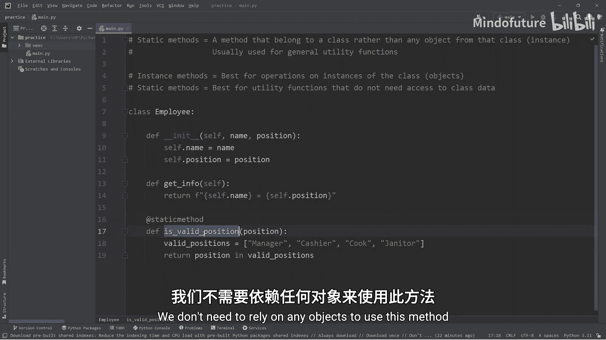

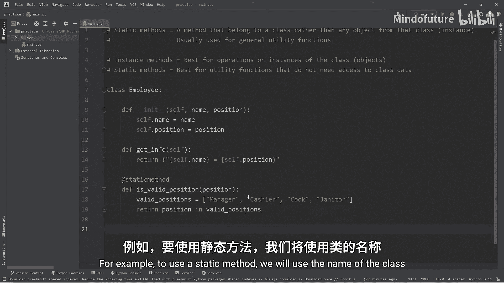

静态方法的第一个参数不是`self`，因为我们不处理从该类创建的任何对象。为了检查职位是否有效，我们将传入一个职位参数。我们创建了一个有效职位的列表，然后使用成员运算符检查传入的职位是否在我们的有效职位列表中。

这样，我们就创建了一个静态方法。我们不需要依赖任何对象来使用这个方法。

---

## 如何使用静态方法

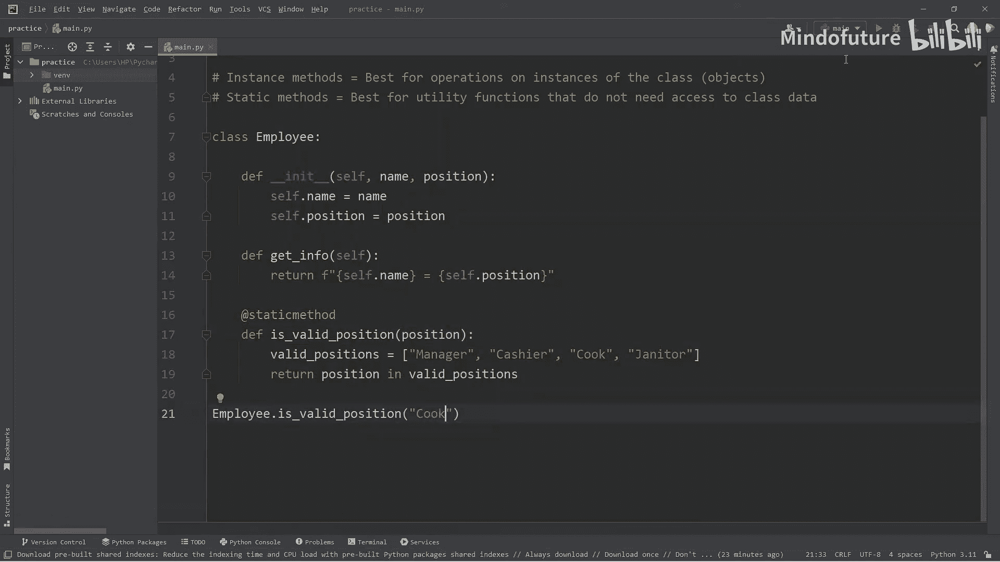

要使用静态方法，我们需要使用类名，而不是从该类创建的任何对象。

```python
print(Employee.is_valid_position("cook"))  # 输出：True
print(Employee.is_valid_position("rocket scientist"))  # 输出：False
```

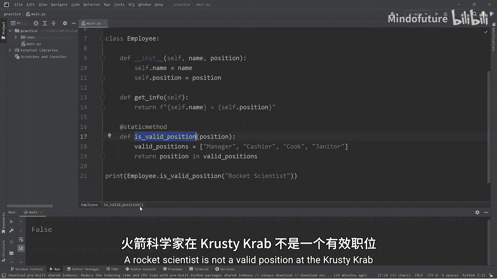

我们输入类名，后跟静态方法`is_valid_position`。这个方法接受一个参数。我们检查“cook”是否是一个有效职位，输出为`True`。再检查“rocket scientist”，输出为`False`，因为在蟹堡王，“火箭科学家”不是一个有效职位。

静态方法属于类，而不属于从该类创建的任何对象。

---

## 创建对象并使用实例方法

现在，让我们创建几个员工对象。

```python
employee1 = Employee("Eugene", "manager")
employee2 = Employee("Squidward", "cashier")
employee3 = Employee("Spongebob", "cook")
```

要调用实例方法，我们必须访问类的一个实例才能使用它。

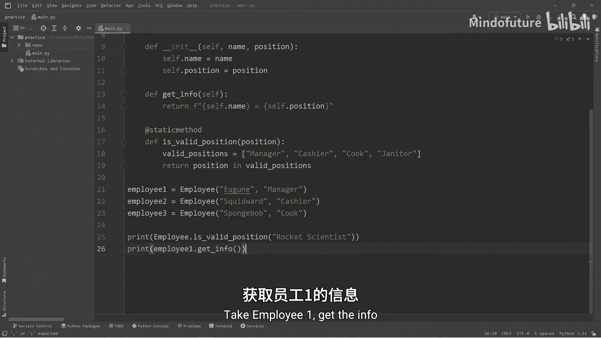

```python
print(employee1.get_info())
print(employee2.get_info())
print(employee3.get_info())
```

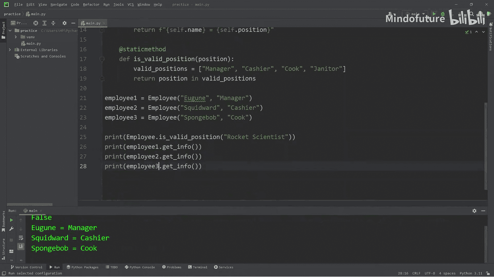

输出结果将是：
- Eugene 是经理。
- Squidward 是收银员。
- Spongebob 是厨师。

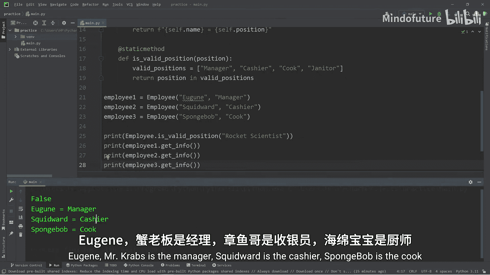

对于实例方法，你需要访问一个对象，然后调用该实例方法。

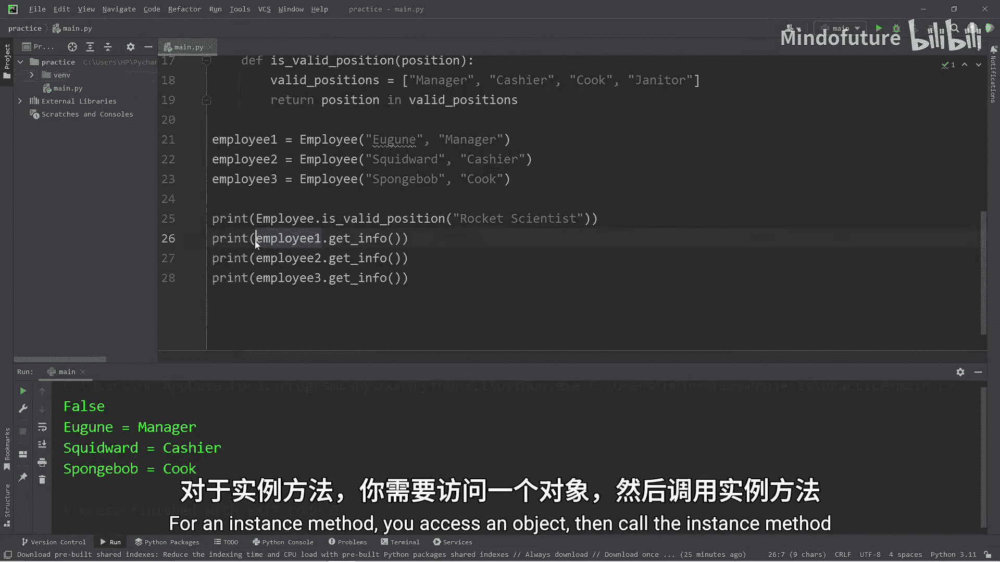

---

## 静态方法与实例方法的对比

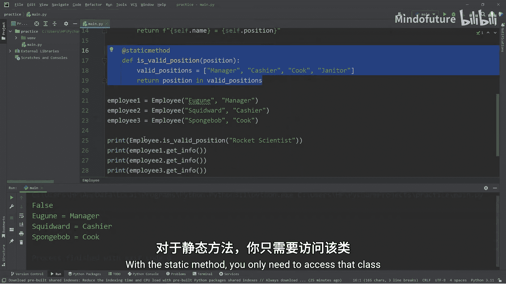

对于静态方法，你只需要访问那个类，甚至不需要从该类创建任何对象。它是一个通用的工具方法。

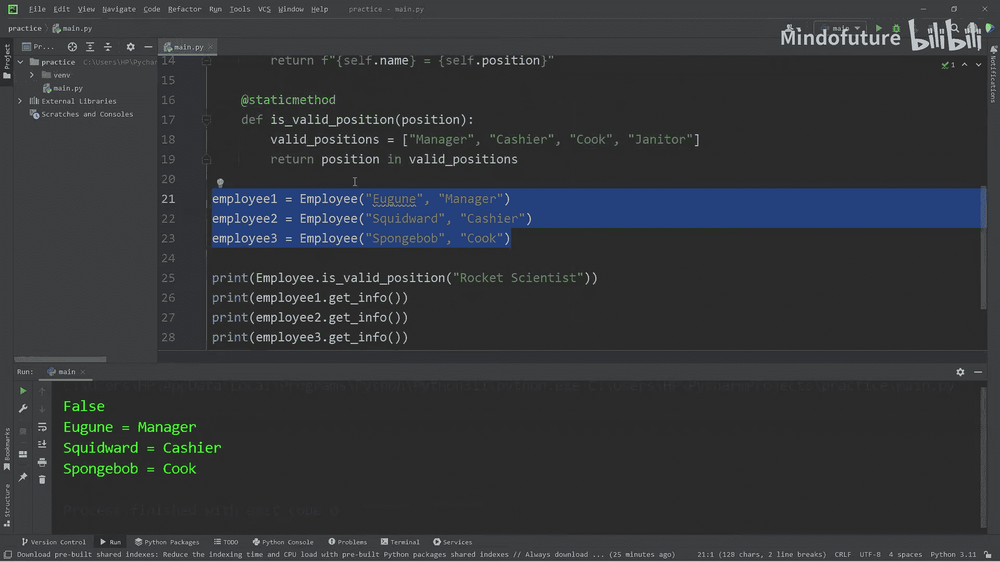

以下是关键区别总结：
*   **调用方式**：实例方法通过`对象.方法名()`调用；静态方法通过`类名.方法名()`调用。
*   **参数**：实例方法的第一个参数是`self`，代表对象自身；静态方法没有`self`参数。
*   **用途**：实例方法用于操作或访问特定对象的数据；静态方法用于执行与类相关但不依赖对象状态的通用任务。

---

## 总结

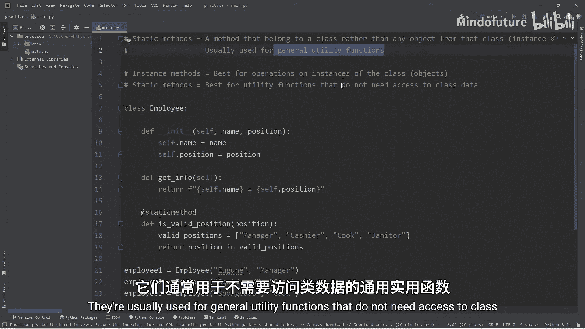

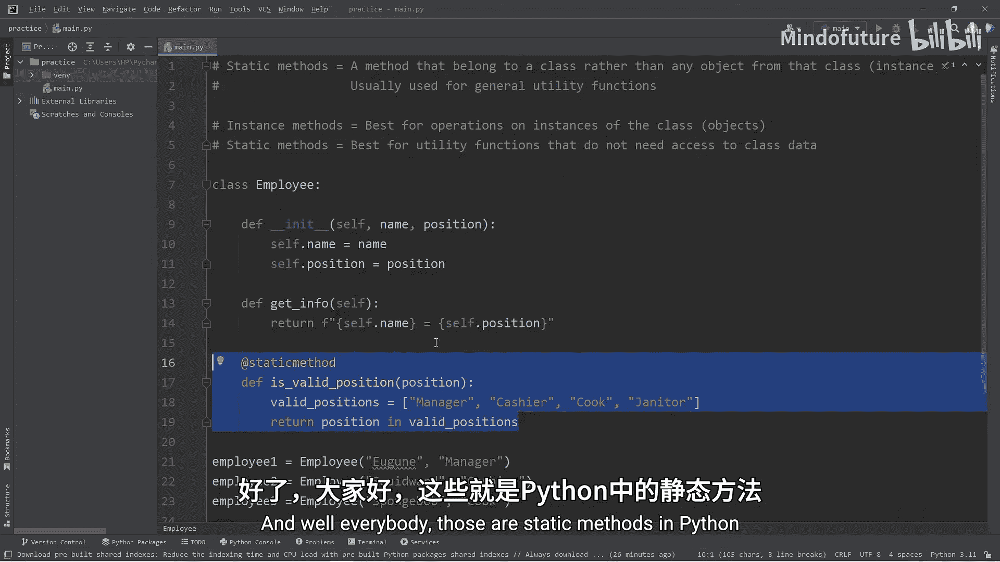

本节课中我们一起学习了Python中的静态方法。静态方法是一种属于类本身而非其实例对象的方法。它们通常用作不需要访问类数据的通用工具函数。我们通过创建`Employee`类，对比了实例方法`get_info`和静态方法`is_valid_position`的定义与调用方式，清晰地理解了两者的区别和适用场景。