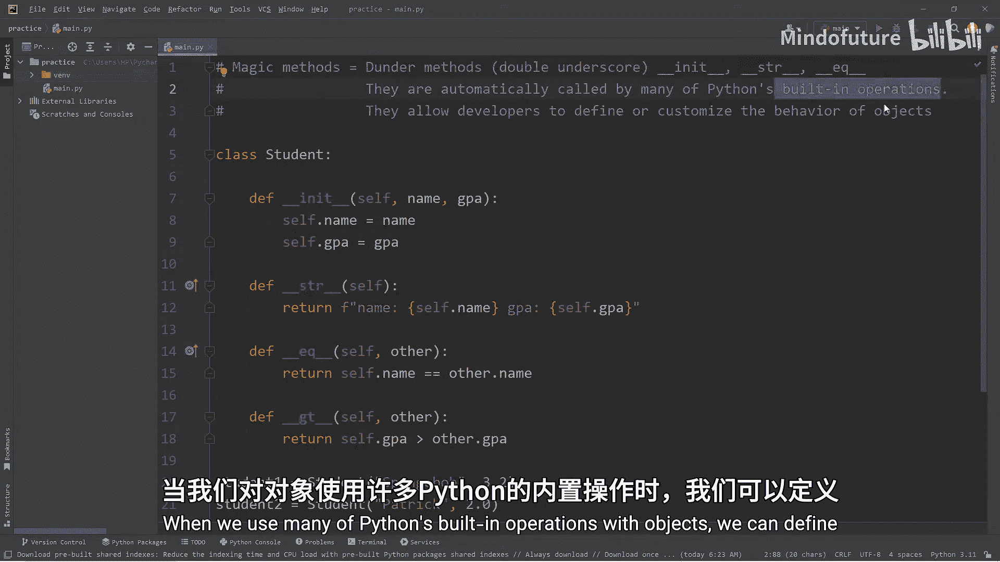
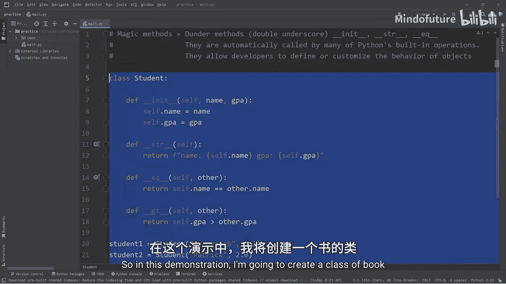
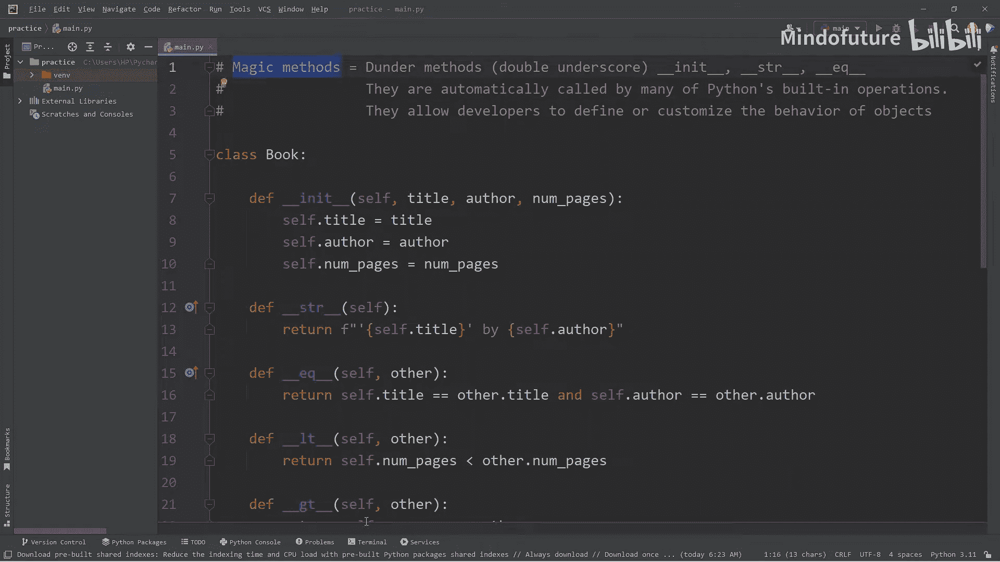

# 060：Python魔法方法详解 🪄

在本节课中，我们将要学习Python中的魔法方法。魔法方法允许我们自定义对象在使用Python内置操作（如打印、比较、相加）时的行为，是面向对象编程中非常强大的工具。

## 什么是魔法方法？

上一节我们介绍了类的基本概念，本节中我们来看看魔法方法。魔法方法，也称为“Dunder方法”（双下划线方法），其特点是方法名以双下划线开头和结尾。我们最熟悉的例子是 `__init__` 方法，它在创建对象时自动调用。但Python提供了许多其他魔法方法，用于自定义对象的各种行为。





## 创建示例类：Book

为了演示魔法方法，我们将创建一个 `Book` 类。这个类将包含书名、作者和页数三个属性。

```python
class Book:
    def __init__(self, title, author, number_of_pages):
        self.title = title
        self.author = author
        self.number_of_pages = number_of_pages
```

现在，让我们创建几个 `Book` 对象：

```python
book1 = Book("The Hobbit", "J.R.R. Tolkien", 310)
book2 = Book("Harry Potter and the Philosopher's Stone", "J.K. Rowling", 223)
book3 = Book("The Lion, the Witch and the Wardrobe", "C.S. Lewis", 172)
```

当我们调用 `Book()` 类并传入参数时，会自动调用 `__init__` 这个魔法方法，完成对象的初始化。

## 自定义打印行为：`__str__`

如果我们直接打印一个对象，Python默认会输出其内存地址，这通常不是我们想要的。

```python
print(book1)  # 输出类似：<__main__.Book object at 0x...>
```

我们可以通过定义 `__str__` 方法来定制打印对象时显示的字符串。

```python
class Book:
    # ... __init__ 方法同上 ...

    def __str__(self):
        return f"'{self.title}' by {self.author}"
```

现在，打印对象会显示更友好的信息：

```python
print(book1)  # 输出：'The Hobbit' by J.R.R. Tolkien
print(book2)  # 输出：'Harry Potter and the Philosopher's Stone' by J.K. Rowling
```

## 自定义对象比较：`__eq__` 和 `__lt__`

默认情况下，即使两个对象的属性值完全相同，Python也会认为它们是不同的对象。

```python
print(book1 == book2)  # 输出：False
```

我们可以通过 `__eq__` 方法定义“相等”的含义。例如，我们认为两本书如果书名和作者相同，就是同一本书（忽略页数差异）。

```python
class Book:
    # ... 之前的代码 ...

    def __eq__(self, other):
        return self.title == other.title and self.author == other.author
```

现在，如果创建另一本《霍比特人》，即使页数不同，也会被视为相等。

```python
book1_alt = Book("The Hobbit", "J.R.R. Tolkien", 400)
print(book1 == book1_alt)  # 输出：True
```

同样，我们可以用 `__lt__`（小于）和 `__gt__`（大于）方法来比较对象。这里我们根据页数来比较。

```python
class Book:
    # ... 之前的代码 ...

    def __lt__(self, other):
        return self.number_of_pages < other.number_of_pages

    def __gt__(self, other):
        return self.number_of_pages > other.number_of_pages

print(book2 < book3)  # 输出：False (223 < 172 为假)
print(book2 > book3)  # 输出：True  (223 > 172 为真)
```

## 自定义加法操作：`__add__`

尝试将两个书对象相加会引发错误。我们可以用 `__add__` 方法定义“加法”的意义，例如计算两本书的总页数。

```python
class Book:
    # ... 之前的代码 ...

    def __add__(self, other):
        total_pages = self.number_of_pages + other.number_of_pages
        return f"{total_pages} pages"

print(book2 + book3)  # 输出：395 pages
```

## 自定义成员检查：`__contains__`

我们可能想检查某个关键词（如“Lion”）是否出现在书的标题或作者名中。默认使用 `in` 操作符会报错。

```python
# print(“Lion” in book3)  # 会引发 TypeError
```

定义 `__contains__` 方法可以实现这个功能。

```python
class Book:
    # ... 之前的代码 ...

    def __contains__(self, keyword):
        return keyword in self.title or keyword in self.author

print("Lion" in book3)   # 输出：True
print("Rowling" in book2) # 输出：True
print("Rowling" in book3) # 输出：False
```

## 自定义索引访问：`__getitem__`

我们可能希望通过类似字典键的方式访问对象的属性。默认情况下，对象不支持下标操作。

```python
# print(book1[“title”])  # 会引发 TypeError
```

`__getitem__` 方法允许我们自定义这种行为。

```python
class Book:
    # ... 之前的代码 ...

    def __getitem__(self, key):
        if key == "title":
            return self.title
        elif key == "author":
            return self.author
        elif key == "pages":
            return self.number_of_pages
        else:
            return f"Key '{key}' was not found"

print(book1["title"])   # 输出：The Hobbit
print(book2["author"])  # 输出：J.K. Rowling
print(book3["pages"])   # 输出：172
print(book1["audio"])   # 输出：Key 'audio' was not found
```

## 总结



本节课中我们一起学习了Python的魔法方法。魔法方法是名称以双下划线包围的特殊方法，当对象参与Python的内置操作（如打印、比较、相加、使用 `in` 或 `[]` 操作符）时，它们会被自动调用。通过定义这些方法，我们可以深度定制对象的行为，使代码更直观、更符合逻辑。掌握魔法方法是编写高级、优雅的Python面向对象代码的关键一步。