# 061：理解Python的property装饰器 🏗️

在本节课中，我们将要学习Python中的`property`装饰器。这个装饰器允许我们将一个方法定义为属性，从而可以像访问属性一样访问它。其主要好处在于，当我们读取、写入或删除属性时，可以添加额外的逻辑控制。

## 创建基础类

首先，我们创建一个`Rectangle`（矩形）类。这个类需要一个构造函数来初始化矩形的宽度和高度。

```python
class Rectangle:
    def __init__(self, width, height):
        self._width = width
        self._height = height
```

在上面的代码中，我们使用了下划线前缀（如`_width`）来命名属性。这是一种约定，表示这些属性是“受保护的”，建议仅在类内部使用，而不直接从外部访问。

## 使用Getter方法读取属性

上一节我们介绍了基础类的创建，本节中我们来看看如何使用`property`装饰器来创建getter方法。Getter方法允许我们在读取属性时执行额外的逻辑。

以下是创建getter方法的步骤：

1.  为每个属性定义一个方法。
2.  在该方法上方使用`@property`装饰器。
3.  在方法内部返回处理后的属性值。

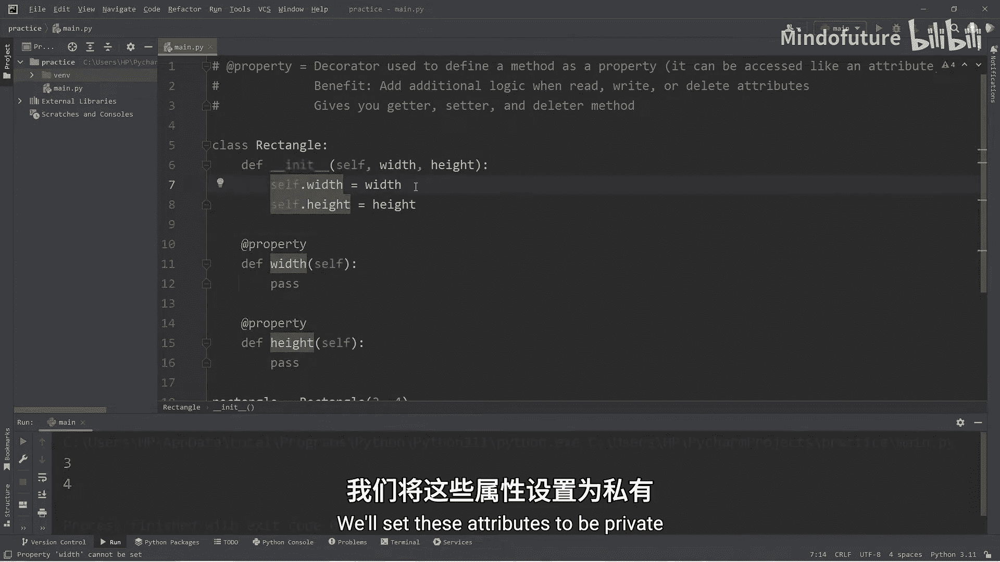

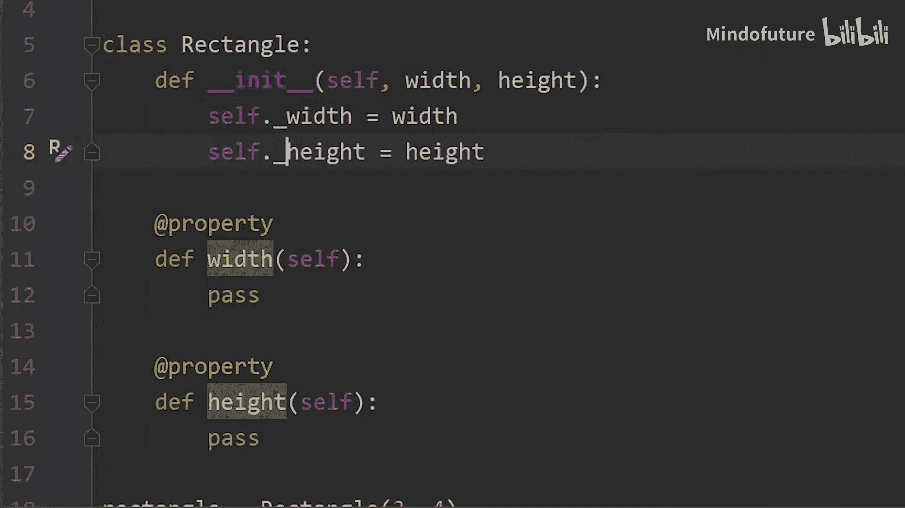

```python
class Rectangle:
    def __init__(self, width, height):
        self._width = width
        self._height = height

    @property
    def width(self):
        # 添加逻辑：返回带一位小数和单位的字符串
        return f"{self._width:.1f} centimeters"

    @property
    def height(self):
        return f"{self._height:.1f} centimeters"
```

现在，当我们访问`rectangle.width`时，实际上调用的是`width()`方法，它会返回格式化后的字符串，而不是原始的`_width`值。

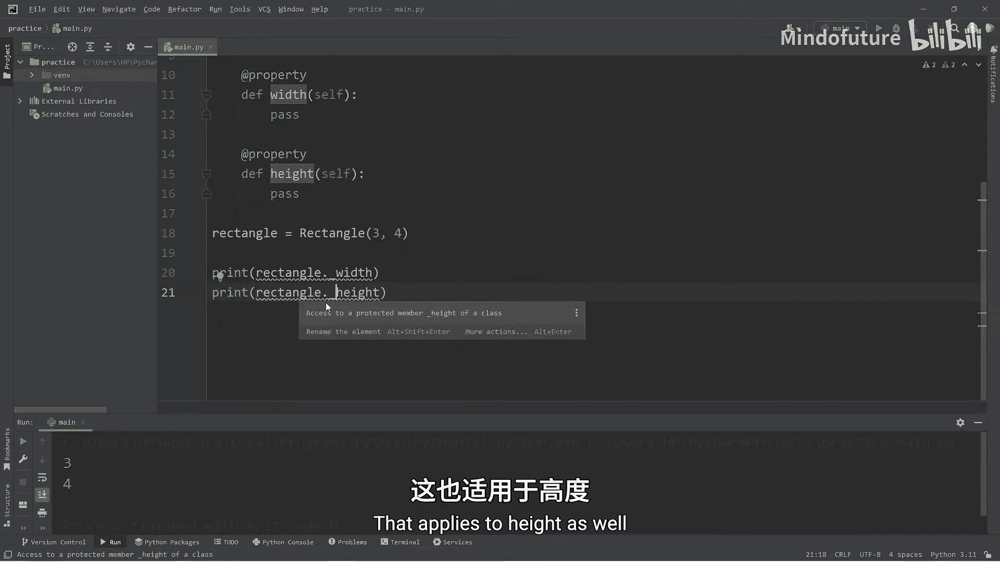

## 使用Setter方法写入属性

我们已经学会了如何安全地读取属性，接下来看看如何安全地设置属性。Setter方法允许我们在给属性赋值时添加验证逻辑。

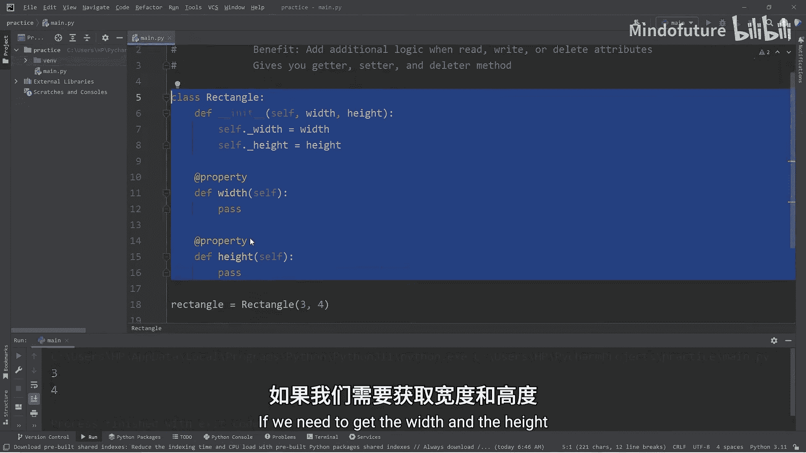

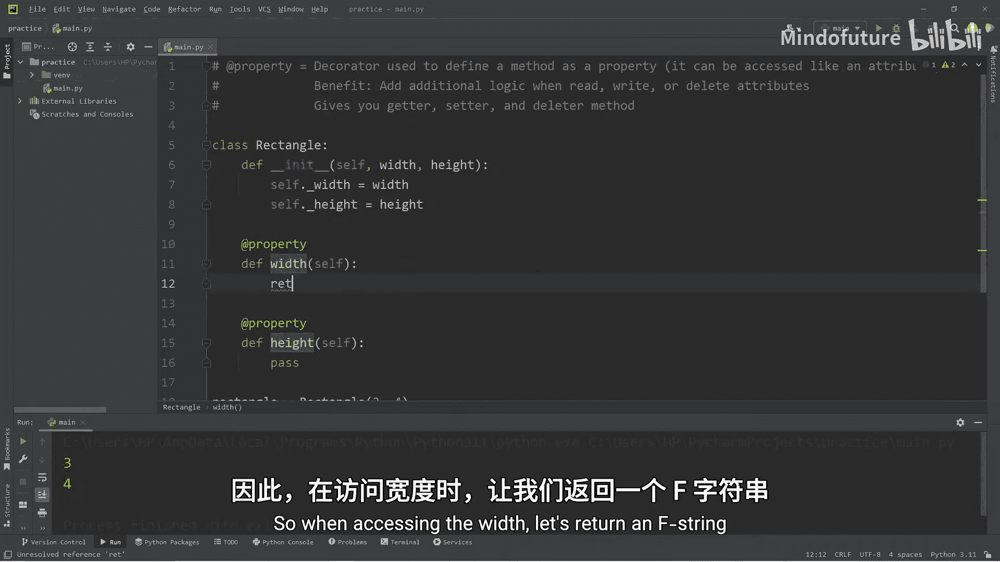

以下是创建setter方法的步骤：

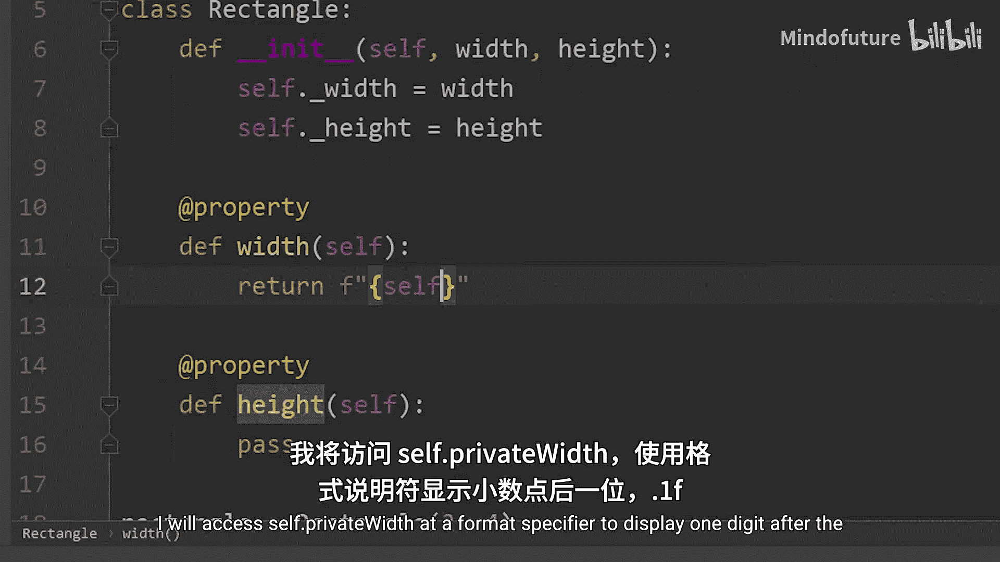

1.  首先确保已用`@property`定义了getter方法。
2.  使用`@属性名.setter`装饰器来定义setter方法。
3.  在方法内部对传入的值进行验证。

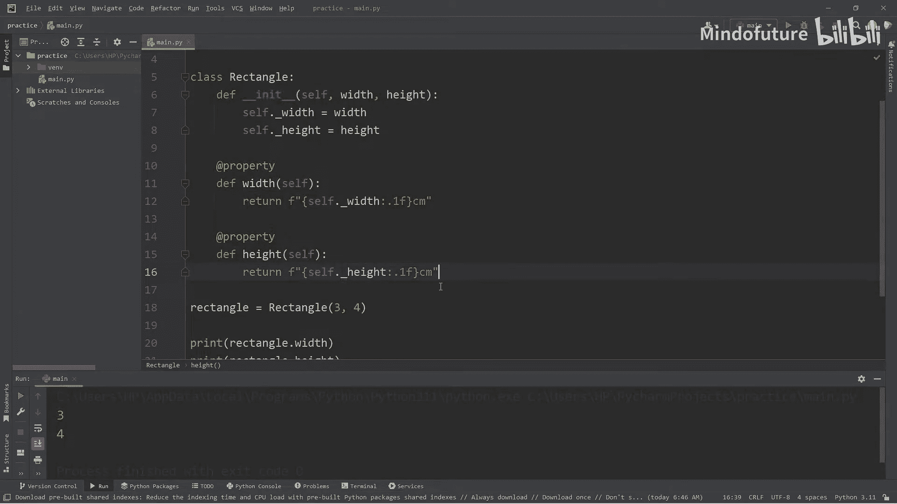

```python
class Rectangle:
    # ... __init__ 和 getter 方法同上 ...

    @width.setter
    def width(self, new_width):
        if new_width > 0:
            self._width = new_width
        else:
            print("Width must be greater than 0")

    @height.setter
    def height(self, new_height):
        if new_height > 0:
            self._height = new_height
        else:
            print("Height must be greater than 0")
```

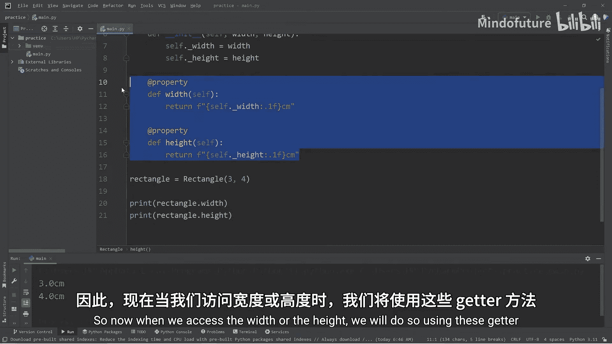

现在，当我们尝试设置`rectangle.width = -5`时，setter方法会拦截这个操作，检查值是否大于0，并打印错误信息，而内部的`_width`属性不会被修改。

## 使用Deleter方法删除属性

最后，我们来了解如何定义deleter方法。虽然在实际编程中不常用，但它允许我们在删除属性时执行清理操作。

以下是创建deleter方法的步骤：

1.  使用`@属性名.deleter`装饰器。
2.  定义同名方法，在方法内部执行删除操作。

```python
class Rectangle:
    # ... __init__, getter, setter 方法同上 ...

    @width.deleter
    def width(self):
        del self._width
        print("Width has been deleted")

    @height.deleter
    def height(self):
        del self._height
        print("Height has been deleted")
```

当我们执行`del rectangle.width`时，会调用这个deleter方法，删除内部的`_width`属性并打印确认信息。

## 完整代码示例与运行

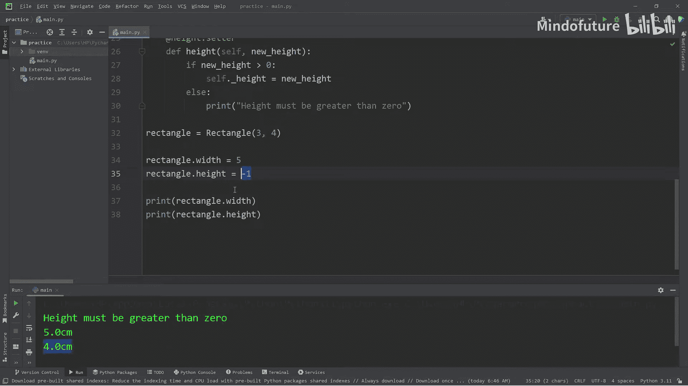

让我们将以上所有部分组合起来，看看完整的类是如何工作的。

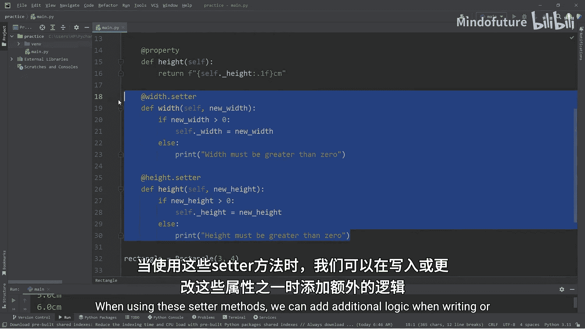

```python
class Rectangle:
    def __init__(self, width, height):
        self._width = width
        self._height = height

    @property
    def width(self):
        return f"{self._width:.1f} centimeters"

    @width.setter
    def width(self, new_width):
        if new_width > 0:
            self._width = new_width
        else:
            print("Width must be greater than 0")

    @width.deleter
    def width(self):
        del self._width
        print("Width has been deleted")

    @property
    def height(self):
        return f"{self._height:.1f} centimeters"

    @height.setter
    def height(self, new_height):
        if new_height > 0:
            self._height = new_height
        else:
            print("Height must be greater than 0")

    @height.deleter
    def height(self):
        del self._height
        print("Height has been deleted")

# 使用示例
rectangle = Rectangle(3, 4)
print(rectangle.width)   # 输出: 3.0 centimeters
print(rectangle.height)  # 输出: 4.0 centimeters

rectangle.width = 5      # 成功设置
print(rectangle.width)   # 输出: 5.0 centimeters

rectangle.height = -1    # 触发验证，打印: Height must be greater than 0
print(rectangle.height)  # 输出: 4.0 centimeters (值未改变)

del rectangle.width      # 打印: Width has been deleted
# 此时再访问 rectangle.width 会引发 AttributeError
```

## 总结

本节课中我们一起学习了Python的`property`装饰器。我们了解到：

*   `@property` 可以将一个方法变成“属性式”的getter。
*   `@属性名.setter` 可以创建setter方法，在赋值时添加验证逻辑。
*   `@属性名.deleter` 可以创建deleter方法，在删除属性时执行特定操作。

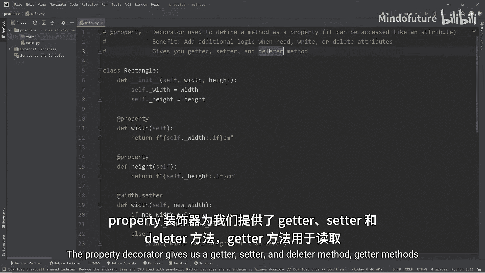

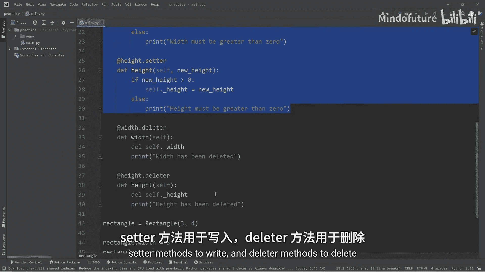

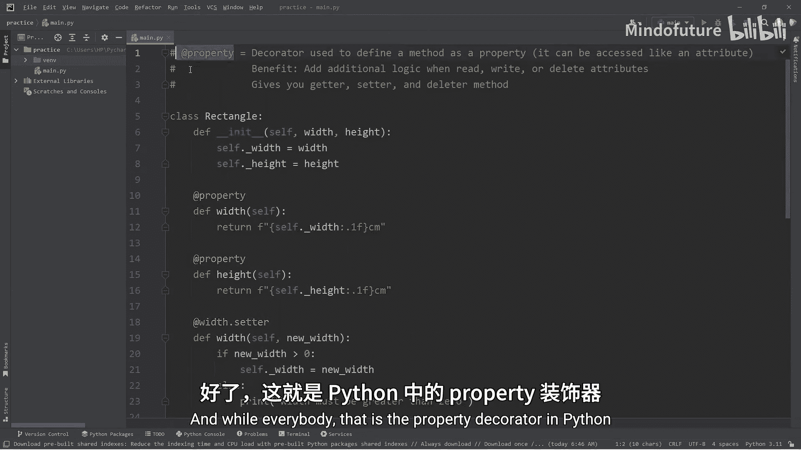

通过使用`property`，我们能够以更优雅和安全的方式控制对类属性的访问、修改和删除，这是封装（Encapsulation）原则的一个重要体现。