Python超全入门教程：P64：map()函数详解 🗺️

在本节课中，我们将要学习Python中的`map()`函数。`map()`函数是一个强大的内置函数，它能够将一个指定的函数应用到集合（如列表）中的每一个元素上，并返回一个包含所有结果的新迭代器。我们将通过一个将摄氏温度转换为华氏温度的例子来详细讲解其用法。

---

### 概述

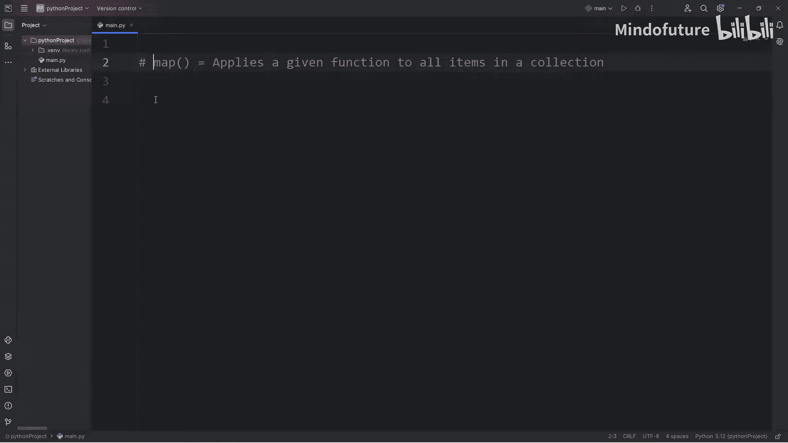

`map()`函数的核心作用是将一个函数映射到一个可迭代对象的所有元素上。它至少需要两个参数：一个函数和一个可迭代对象（如列表）。函数会被应用到可迭代对象的每个元素上。

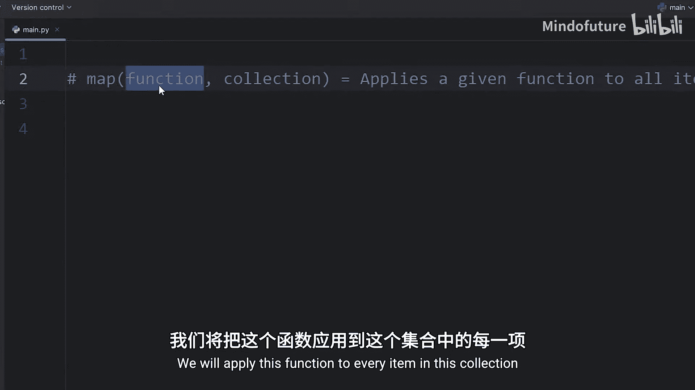

其基本语法可以表示为：
```python
map(function, iterable, ...)
```

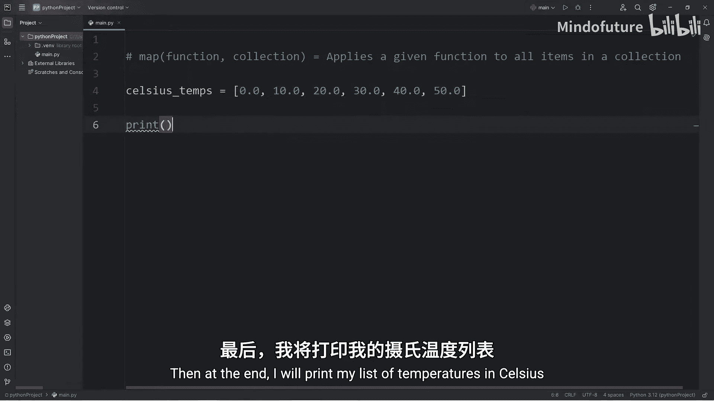

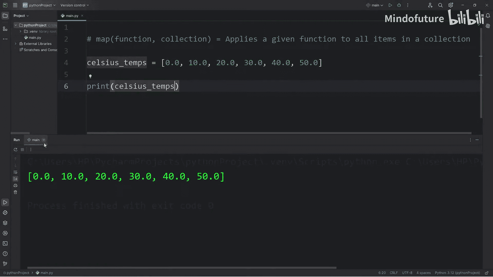

---

### 准备数据：创建摄氏温度列表

首先，我们需要一个待处理的数据集合。这里我们创建一个包含多个摄氏温度的列表。

```python
celsius_temps = [0, 10, 20, 30, 40]
print(celsius_temps)
```

---

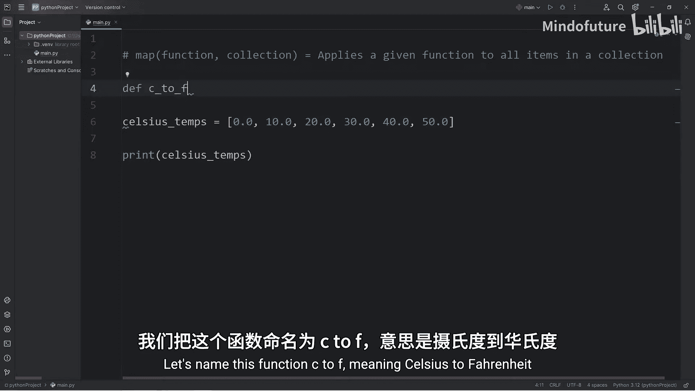

### 方法一：使用预定义函数

上一节我们创建了数据，本节中我们来看看如何使用`map()`函数进行转换。首先，我们需要定义一个转换函数。

以下是转换函数`celsius_to_fahrenheit`的定义，它实现了摄氏温度到华氏温度的转换公式：`F = C * 9/5 + 32`。

```python
def celsius_to_fahrenheit(temp):
    return temp * 9 / 5 + 32
```

定义好函数后，我们就可以将其与温度列表一起传入`map()`函数。

```python
fahrenheit_temps_map = map(celsius_to_fahrenheit, celsius_temps)
```

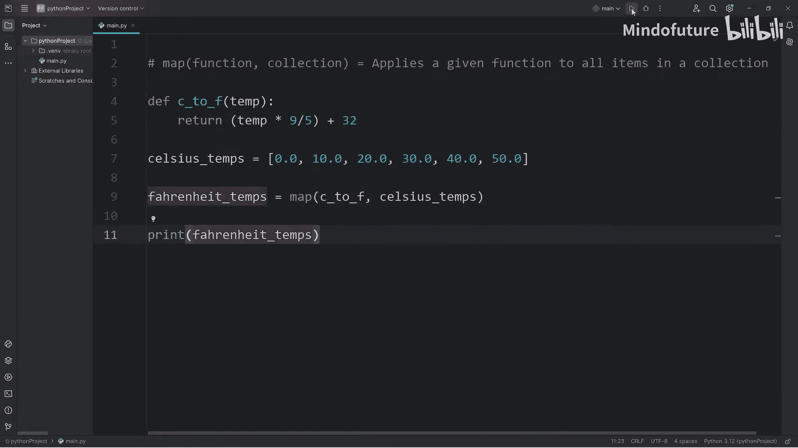

`map()`函数返回的是一个`map`对象，它是一个迭代器。我们可以直接遍历它。

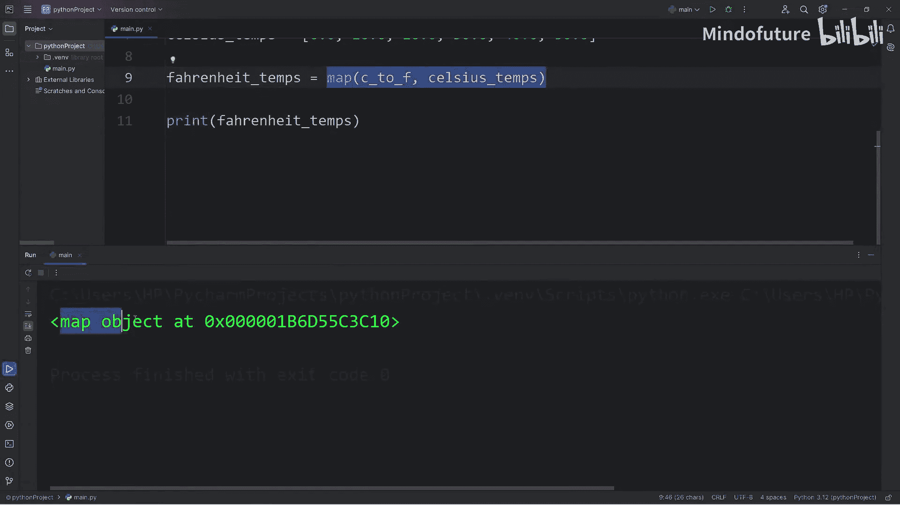

以下是遍历`map`对象并打印结果的代码：

```python
for temp in fahrenheit_temps_map:
    print(temp)
```

如果你希望直接得到一个列表，可以使用`list()`函数将`map`对象转换。

```python
fahrenheit_temps_list = list(map(celsius_to_fahrenheit, celsius_temps))
print(fahrenheit_temps_list)
```

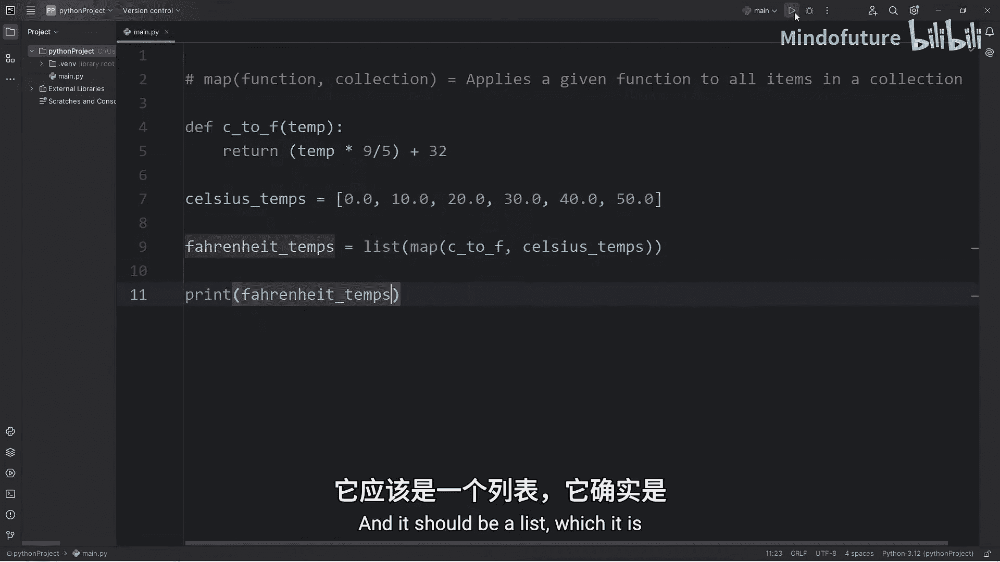

---

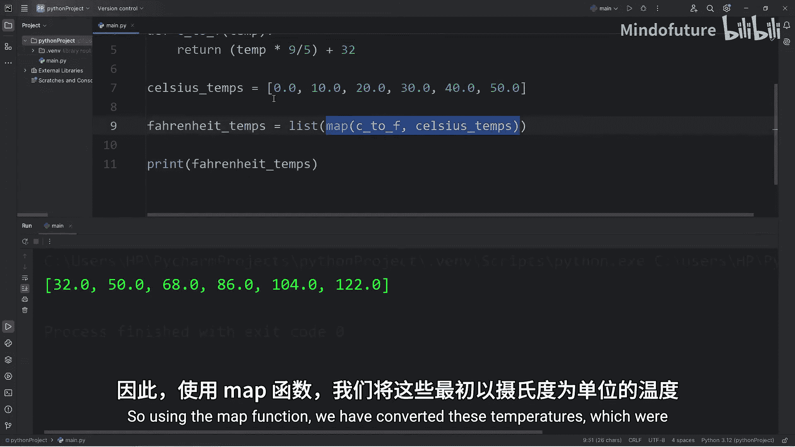

### 方法二：使用Lambda函数

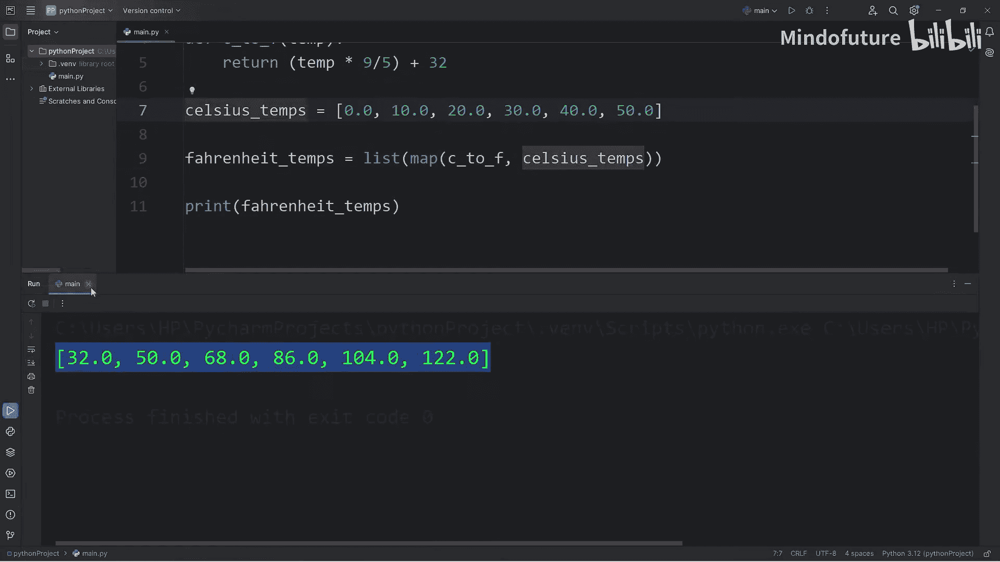

除了预定义函数，我们还可以使用更简洁的Lambda（匿名）函数作为`map()`的参数，这样可以避免为简单的操作单独命名函数。

Lambda函数的语法是：`lambda 参数: 表达式`。

以下是使用Lambda函数实现同样转换的代码：

```python
fahrenheit_temps_lambda = list(map(lambda temp: temp * 9 / 5 + 32, celsius_temps))
print(fahrenheit_temps_lambda)
```

这种方法代码更加紧凑，特别适合只使用一次的小型操作。

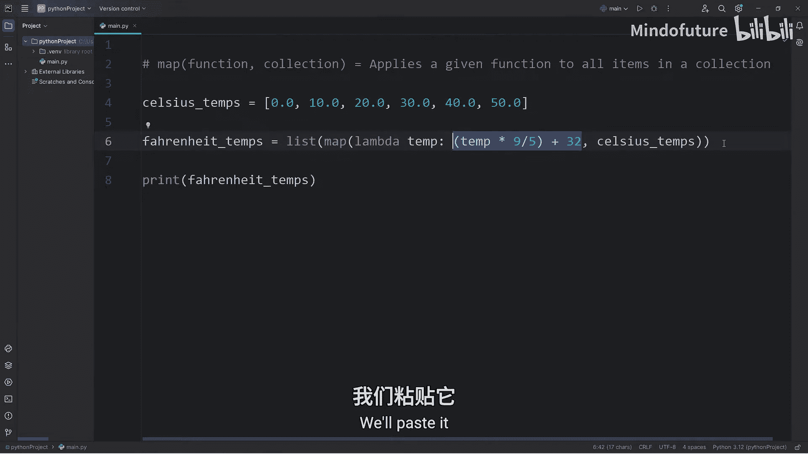

---

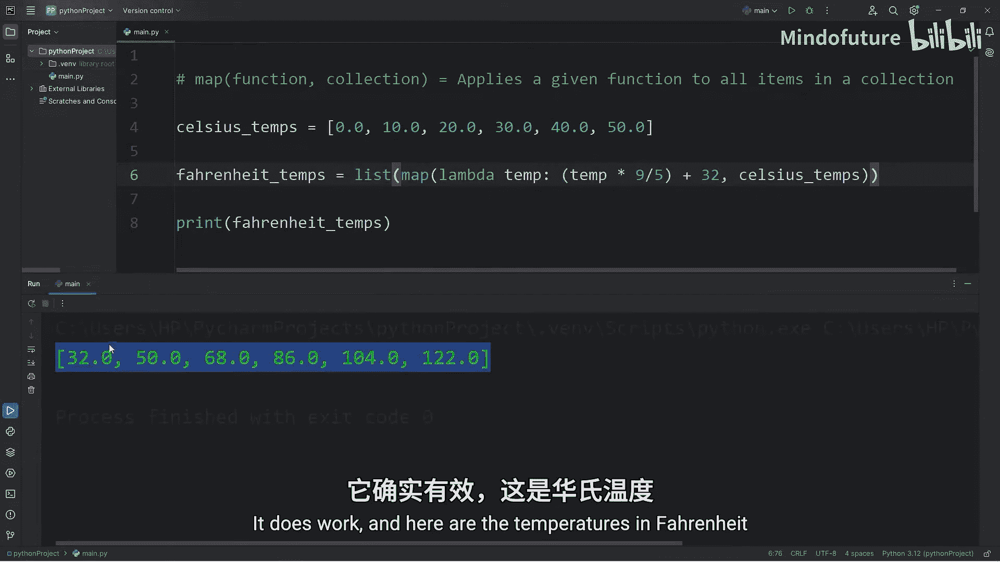

### 总结

本节课中我们一起学习了Python的`map()`函数。
*   `map()`函数用于将指定函数应用于可迭代对象的每个元素。
*   它接受一个函数和一个可迭代对象作为主要参数。
*   其返回值是一个`map`对象迭代器，可以遍历或转换为列表。
*   我们可以传递预定义的函数名，也可以直接使用Lambda匿名函数来实现映射操作。

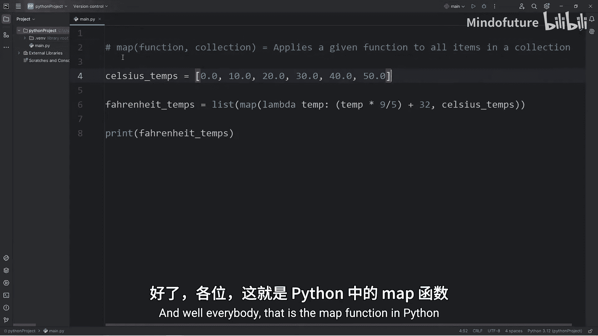

通过将摄氏温度列表转换为华氏温度的实际例子，你应该已经掌握了`map()`函数的基本用法。它是一个用于数据批量处理的实用工具。