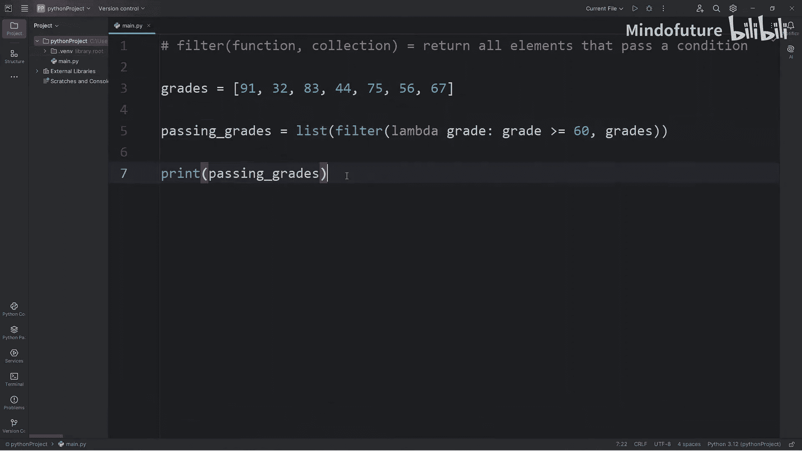
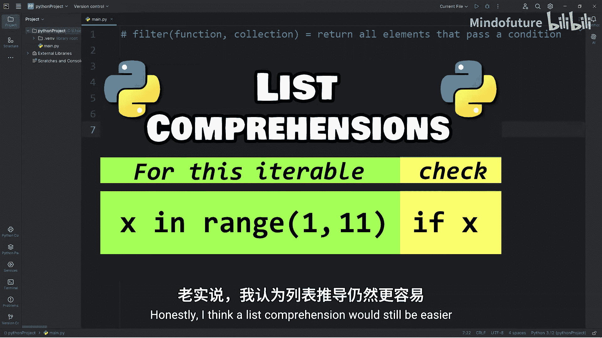
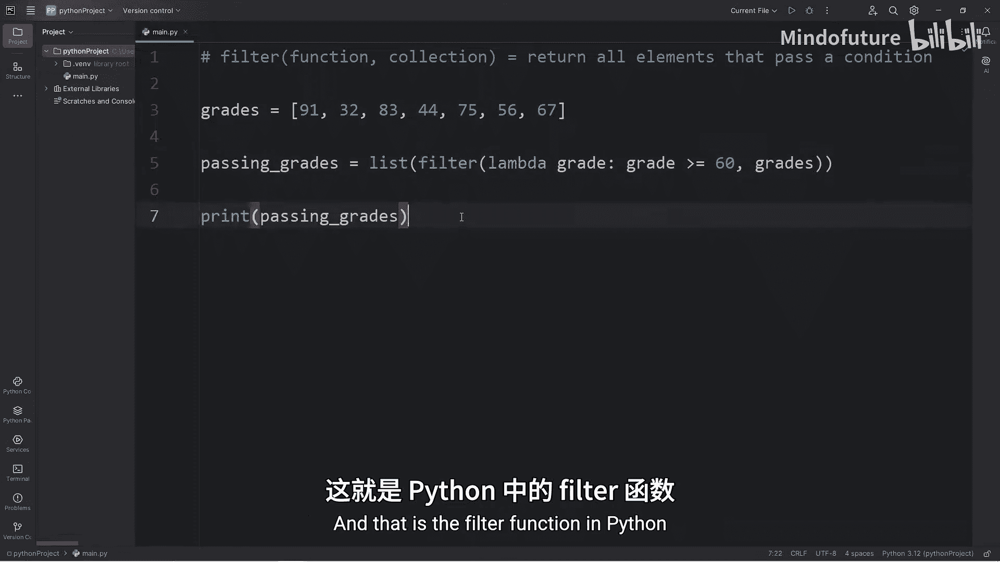

Python入门教程：P65：filter()函数详解 🎯

在本节课中，我们将学习Python中的`filter()`函数。`filter()`函数用于从可迭代对象中筛选出满足特定条件的元素，并返回一个迭代器。我们将通过具体示例来理解其工作原理和使用方法。

---

### **什么是filter()函数？**

`filter()`函数返回所有通过某个条件测试的元素。它接受一个函数和一个可迭代对象作为参数。在下面的示例中，我们将创建一个学生成绩列表，并筛选出及格（60分及以上）的成绩。

---

### **使用自定义函数筛选**

首先，我们声明一个自定义函数来检查成绩是否及格。以下是具体步骤：

1. 定义一个名为`is_passing`的函数，它接受一个成绩作为参数。
2. 在函数内部，检查成绩是否大于或等于60。
3. 如果条件成立，返回`True`；否则返回`False`。

以下是代码示例：

```python
grades = [91, 83, 75, 67, 45, 52, 60]

def is_passing(grade):
    return grade >= 60

passing_grades = filter(is_passing, grades)
```

如果直接打印`passing_grades`，会得到一个`filter`对象。为了查看具体元素，我们可以遍历它：

```python
for grade in passing_grades:
    print(grade)
```

输出结果为：91, 83, 75, 67, 60。所有成绩均大于或等于60分。

如果需要将结果转换为列表，可以使用`list()`函数进行类型转换：

```python
passing_grades_list = list(filter(is_passing, grades))
print(passing_grades_list)
```

输出结果为：[91, 83, 75, 67, 60]。

---

### **使用Lambda函数简化代码**

除了自定义函数，我们还可以使用Lambda函数来简化代码。Lambda函数是一种匿名函数，适用于简单的条件检查。

以下是使用Lambda函数的示例：

```python
passing_grades = filter(lambda grade: grade >= 60, grades)
print(list(passing_grades))
```

输出结果与之前相同：[91, 83, 75, 67, 60]。使用Lambda函数可以避免为简单函数命名，保持代码简洁。

---

### **filter()函数与列表推导式的比较**

虽然`filter()`函数功能强大，但列表推导式是另一种实现相同功能的简洁方法。以下是使用列表推导式筛选及格成绩的示例：

```python
passing_grades = [grade for grade in grades if grade >= 60]
print(passing_grades)
```

输出结果同样为：[91, 83, 75, 67, 60]。列表推导式通常更直观，但了解`filter()`函数的使用场景仍然很重要。

---





### **总结**



本节课中，我们一起学习了Python中的`filter()`函数。我们了解了如何通过自定义函数或Lambda函数来筛选可迭代对象中的元素，并将结果转换为列表。此外，我们还比较了`filter()`函数与列表推导式的异同。掌握这两种方法将帮助你在不同场景下灵活处理数据筛选任务。