# 066：reduce()函数详解 🧮

在本节课中，我们将要学习Python中的`reduce()`函数。这个函数用于将一个集合（如列表）中的所有元素“缩减”为单个值，例如计算总和。虽然在实际编程中，`for`循环通常是更常见的选择，但了解`reduce()`函数有助于你理解函数式编程的思路，并在阅读他人代码时能够识别它。

## 概述与导入

`reduce()`函数并非Python内置函数，要使用它，需要从`functools`模块中导入。

```python
from functools import reduce
```

## 基本用法

`reduce()`函数的基本工作原理是：接收一个函数和一个集合作为参数。该函数必须接受两个参数。`reduce()`会使用该函数对集合中的前两个元素进行计算，然后将结果与第三个元素进行计算，依此类推，直到遍历完整个集合，最终得到一个单一的结果。

上一节我们介绍了`reduce()`的基本概念，本节中我们来看看它的具体应用。

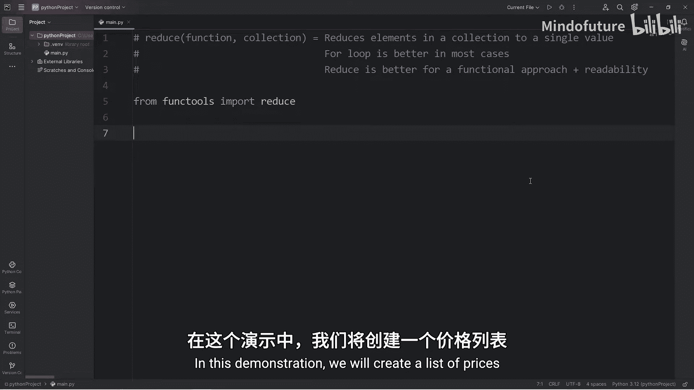

### 示例：计算价格总和

假设我们有一个包含多个价格的列表，目标是计算所有价格的总和。

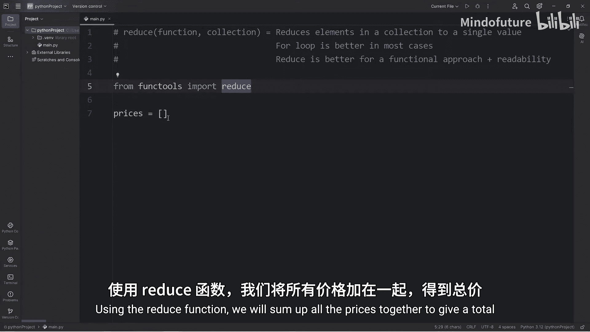

首先，我们创建一个价格列表：

```python
prices = [10.99, 4.99, 7.50, 12.75, 14.49]
```

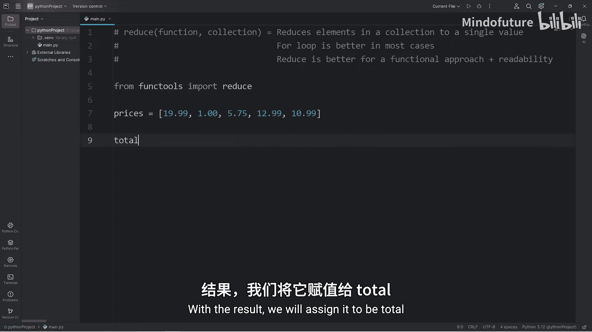

接下来，我们使用`reduce()`函数来计算总和。我们需要定义一个函数来告诉`reduce()`如何组合两个元素。在这个例子中，就是简单的加法。

以下是使用`reduce()`的步骤：

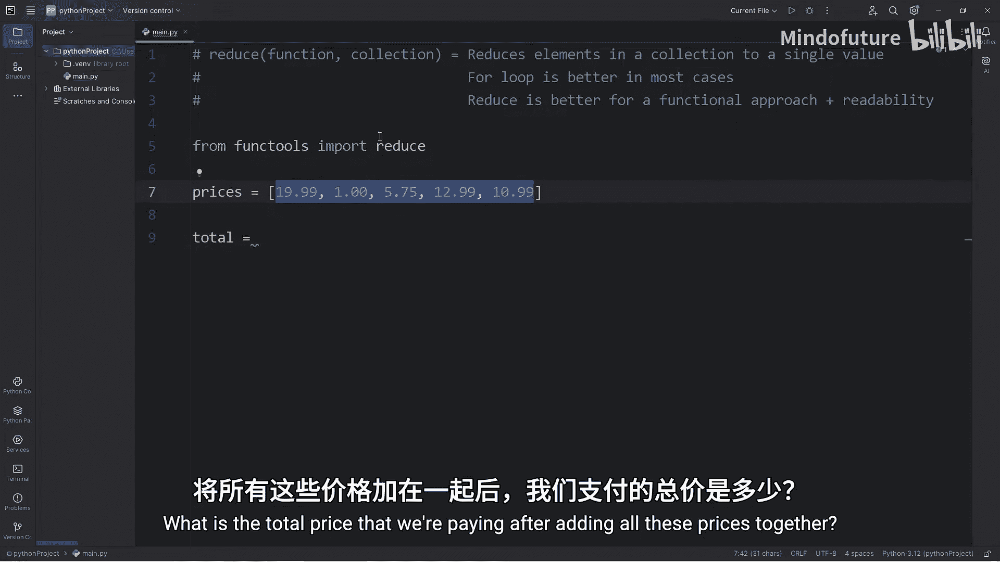

1.  定义一个加法函数。
2.  将该函数和价格列表传递给`reduce()`。
3.  接收并打印结果。

```python
from functools import reduce

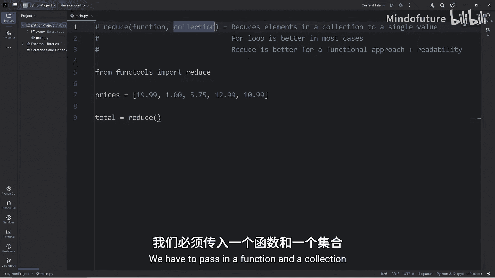

prices = [10.99, 4.99, 7.50, 12.75, 14.49]

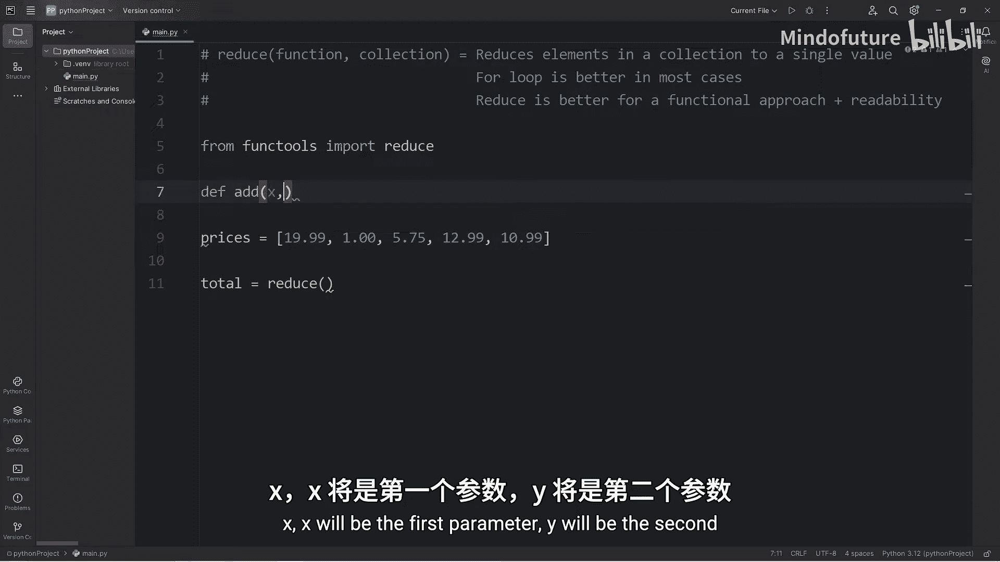

def add(x, y):
    return x + y

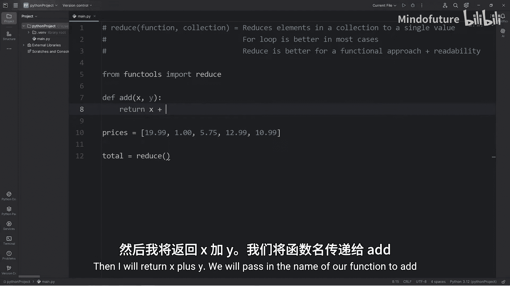

total = reduce(add, prices)
print(f"总价为：${total:.2f}")
```

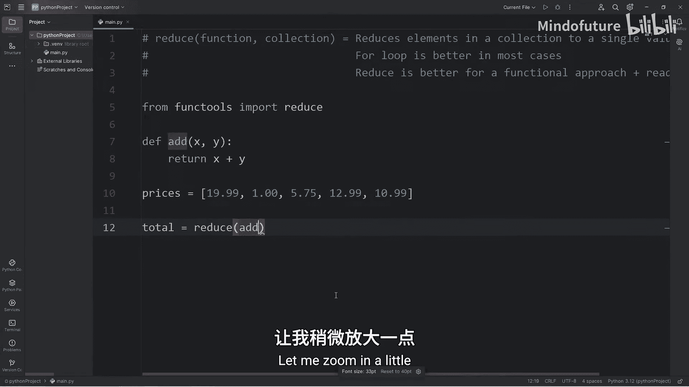

运行这段代码，输出结果为：`总价为：$50.72`。

## 使用Lambda表达式简化代码

在Python中，对于这种简单的、只用一次的函数，我们通常使用`lambda`表达式来定义匿名函数，这样可以使代码更简洁。

以下是使用`lambda`表达式重写的代码：

```python
from functools import reduce

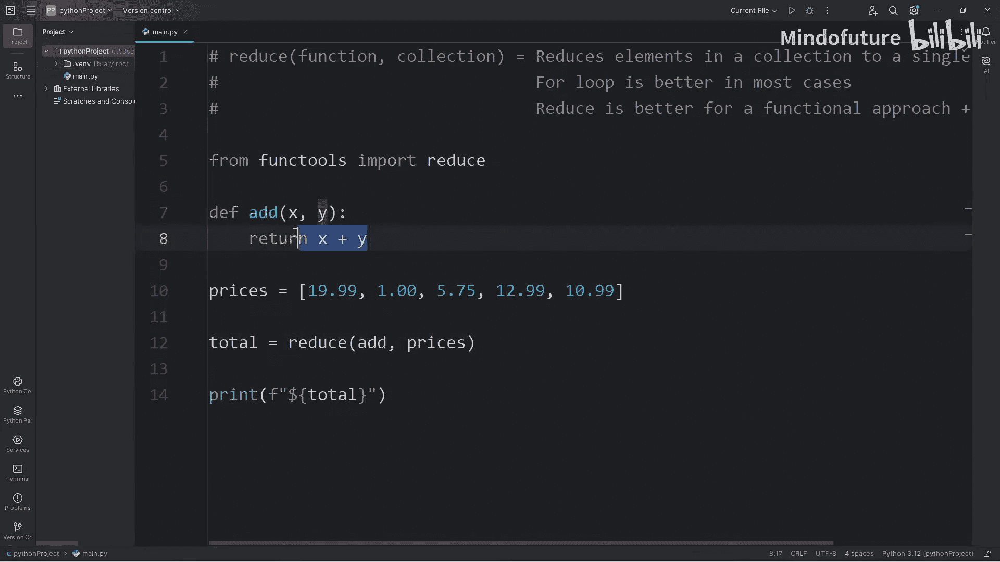

prices = [10.99, 4.99, 7.50, 12.75, 14.49]

total = reduce(lambda x, y: x + y, prices)
print(f"总价为：${total:.2f}")
```

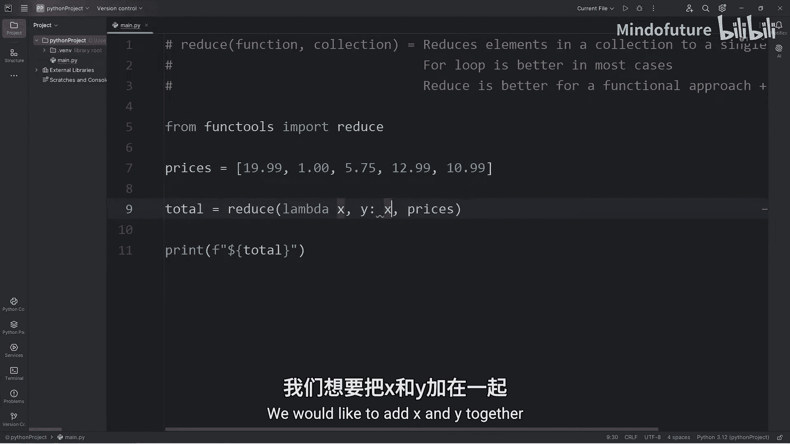

这段代码的功能与之前完全相同。`lambda x, y: x + y`定义了一个匿名函数，它接受两个参数`x`和`y`，并返回它们的和。

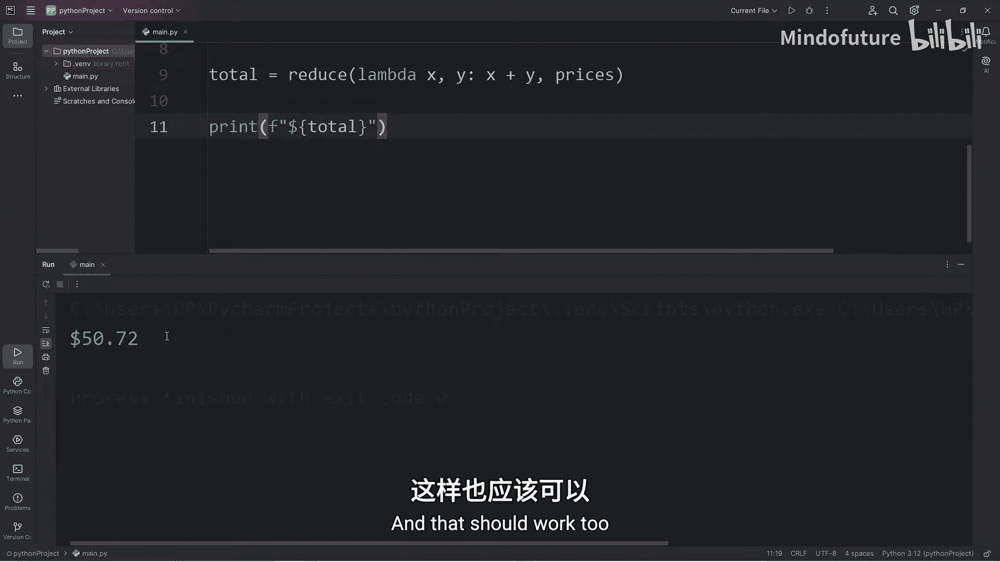

## 工作原理详解

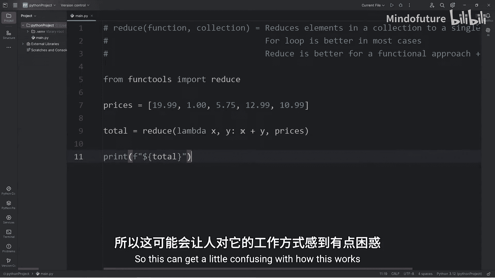

`reduce()`函数的工作流程可以分解为以下几个步骤，以列表`[10.99, 4.99, 7.50, 12.75, 14.49]`为例：

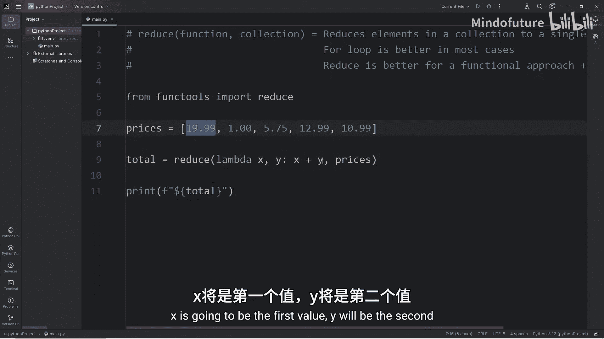

1.  取前两个元素：`10.99` 和 `4.99`，执行 `add(10.99, 4.99)`，得到 `15.98`。
2.  将上一步的结果 `15.98` 与第三个元素 `7.50` 结合，执行 `add(15.98, 7.50)`，得到 `23.48`。
3.  将结果 `23.48` 与第四个元素 `12.75` 结合，执行 `add(23.48, 12.75)`，得到 `36.23`。
4.  最后，将结果 `36.23` 与第五个元素 `14.49` 结合，执行 `add(36.23, 14.49)`，得到最终结果 `50.72`。

这个过程就像是将列表“折叠”成了一个值。

## `reduce()`与`for`循环的对比

`reduce()`函数提供了一种函数式编程的解决方案。它的优点是意图明确——看到`reduce`就知道代码的目的是将集合归约为一个值，有时可读性更好。

然而，在大多数情况下，使用`for`循环来实现同样的功能可能对初学者更直观，也更容易调试。例如，计算总和的`for`循环版本：

```python
prices = [10.99, 4.99, 7.50, 12.75, 14.49]
total = 0
for price in prices:
    total += price
print(f"总价为：${total:.2f}")
```

两种方法都可以达到目的。选择哪一种取决于个人习惯、团队规范以及具体的应用场景。了解`reduce()`函数有助于你成为一个更全面的Python程序员。

## 总结

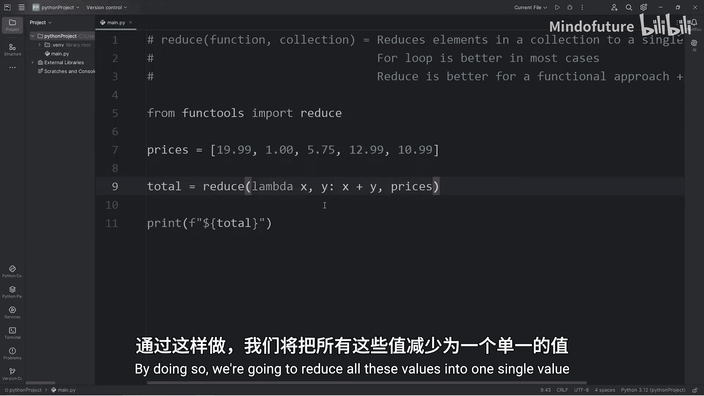

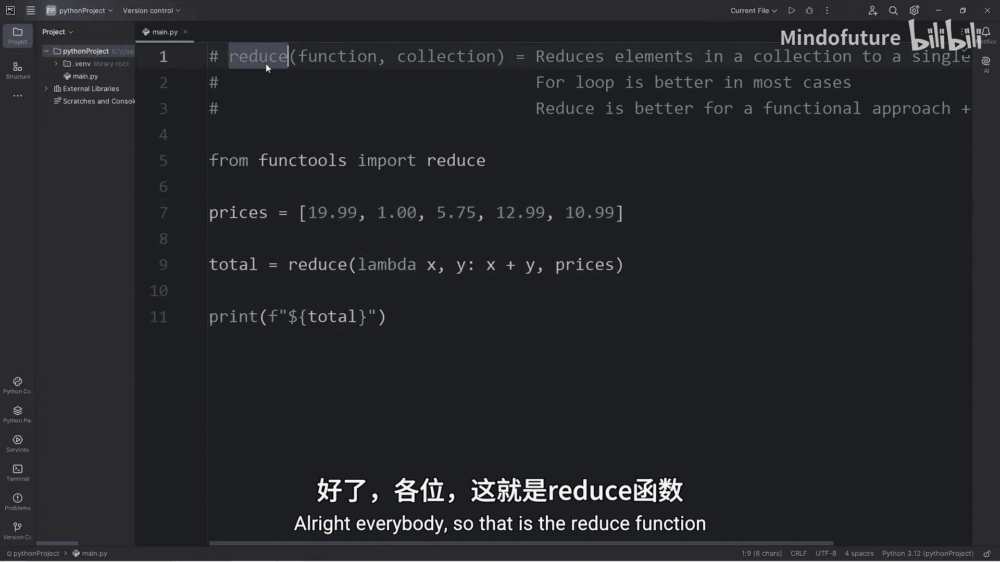

本节课中我们一起学习了Python的`reduce()`函数。

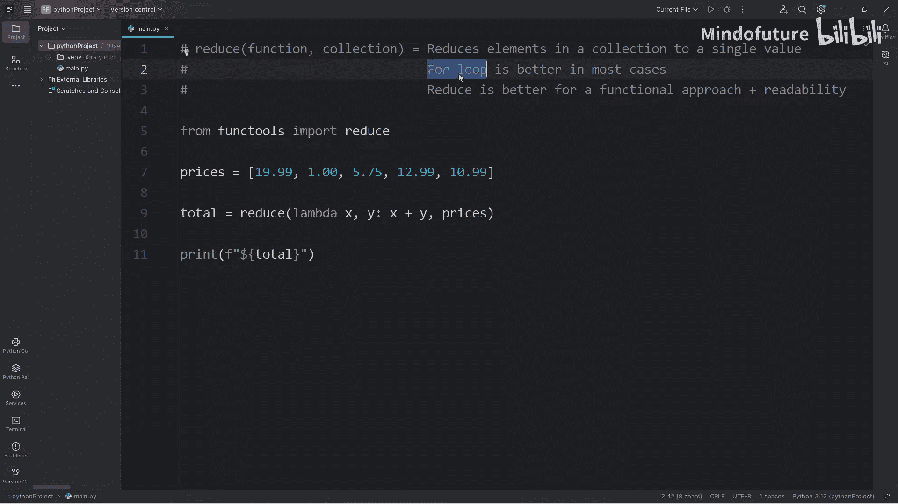

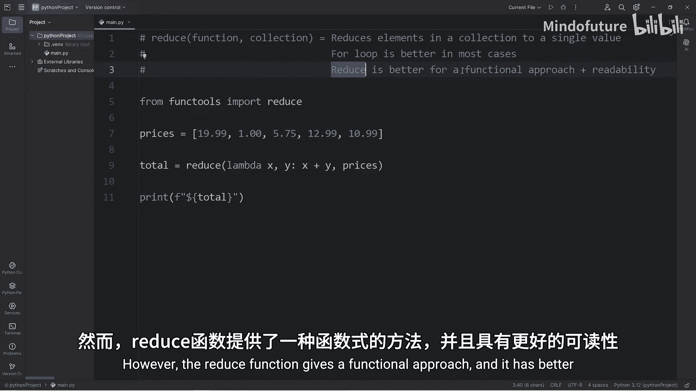

*   **功能**：`reduce()`函数用于将一个集合中的所有元素通过指定的函数累积计算，最终缩减为一个单一的值。
*   **导入**：使用前需要从`functools`模块导入：`from functools import reduce`。
*   **语法**：`reduce(function, iterable)`，其中`function`是一个接受两个参数的函数。
*   **常用写法**：通常与`lambda`表达式结合使用，使代码更简洁，例如 `reduce(lambda x, y: x + y, list)`。
*   **对比**：`reduce()`提供了函数式编程风格，而`for`循环是更命令式的风格。两者各有适用场景，掌握`reduce()`有助于理解更广泛的代码。

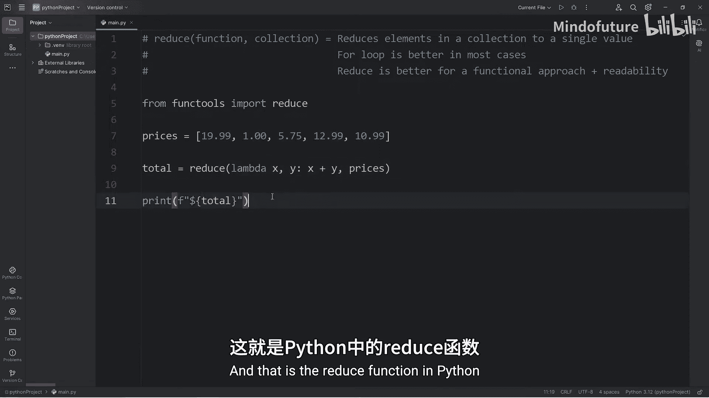

现在，你已经掌握了`reduce()`函数的基本用法，可以在需要将序列“折叠”成单一结果时考虑使用它了。