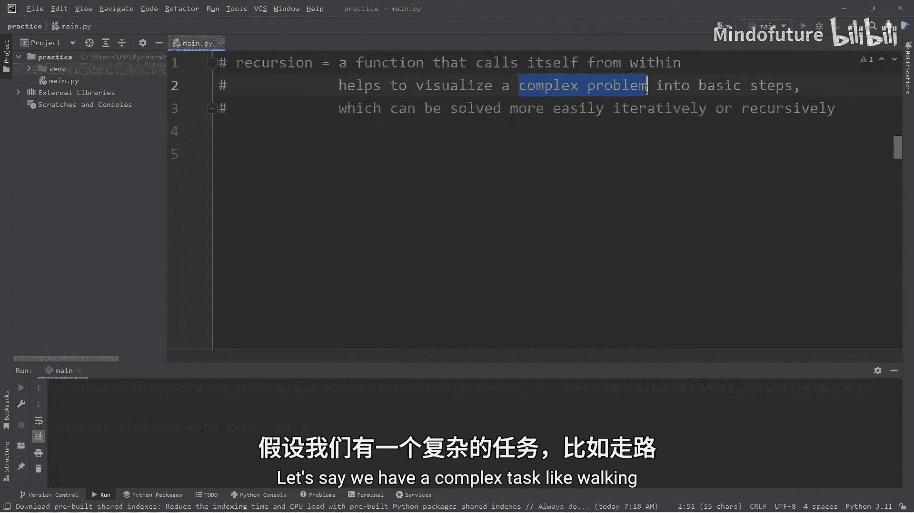
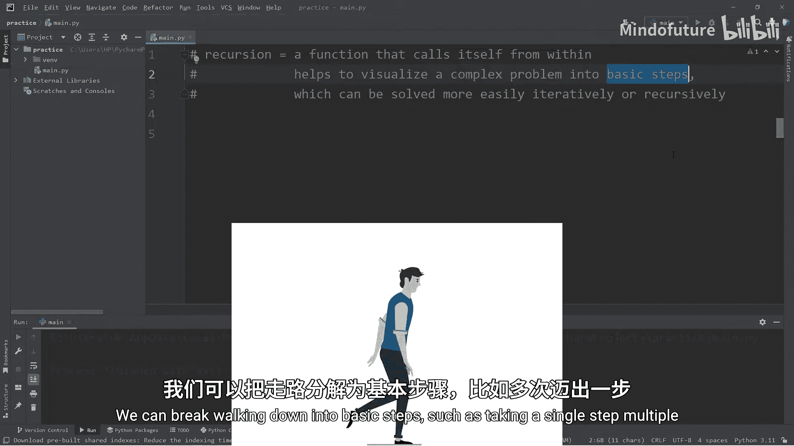
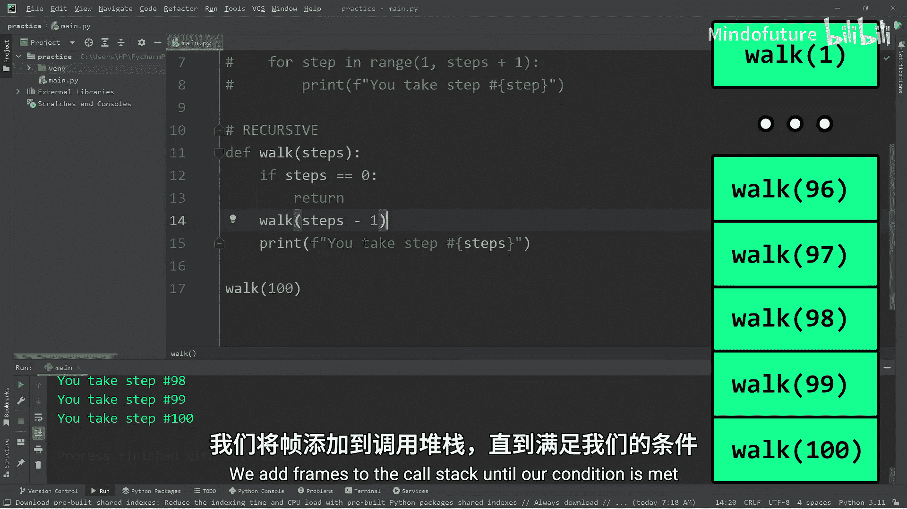
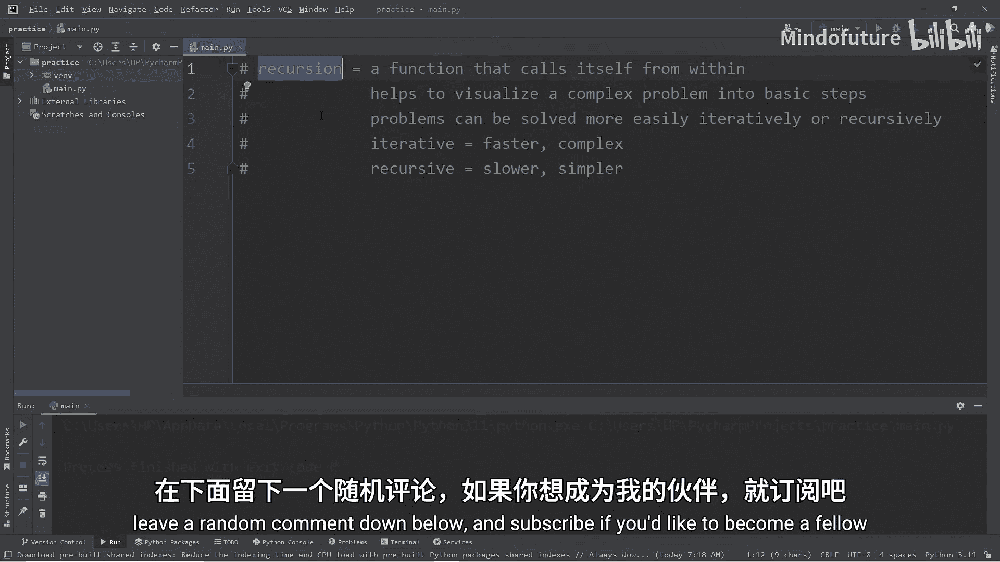

# 068：递归入门 🧠

在本节课中，我们将要学习一个重要的编程概念——递归。我们将通过简单的例子，对比迭代与递归两种方法，帮助你理解递归的工作原理、优点和需要注意的问题。

## 什么是递归？

递归可以被看作是一个**在自身内部调用自己**的函数。它的核心思想是将一个复杂问题分解成一系列可重复的基本步骤。这些步骤既可以用循环（如 `for` 或 `while` 循环）迭代解决，也可以用我们即将讨论的递归方法解决。





## 迭代与递归的对比：以“行走”为例

为了更好地理解，我们以一个“行走”的任务为例。行走可以被分解为重复执行“迈出一步”这个基本动作。

以下是实现“行走”功能的两种方法。

### 迭代方法

在迭代方法中，我们在函数内部使用循环来重复执行动作。

```python
def walk_iterative(steps):
    for step in range(1, steps + 1):
        print(f"You take step number {step}.")

# 调用函数，行走100步
walk_iterative(100)
```

这段代码通过一个 `for` 循环，将“迈出一步”的动作重复了100次，从而模拟了行走的过程。这是一种直观的迭代解决方案。

### 递归方法

现在，让我们看看如何用递归解决同样的问题。递归的关键在于函数在内部调用自身。

```python
def walk_recursive(steps):
    if steps == 0:  # 基线条件：何时停止
        return
    walk_recursive(steps - 1)  # 函数调用自身
    print(f"You take step number {steps}.")

# 调用函数
walk_recursive(100)
```

**代码解析**：
1.  **基线条件**：`if steps == 0: return`。这是递归的停止条件，防止函数无限调用自身。
2.  **递归调用**：`walk_recursive(steps - 1)`。函数用更小的参数（`steps - 1`）调用自己，逐步逼近基线条件。
3.  **打印步骤**：在递归调用*之后*打印，实现了从1到100的计数。

**递归的工作原理与调用栈**：
每次函数调用自身时，都会在内存的“调用栈”上添加一个“帧”。程序会从最新的帧（栈顶）开始执行，直到满足基线条件，然后依次返回并解决之前的帧。如果递归层次过深（例如尝试 `walk_recursive(1000)`），可能会超出调用栈的最大深度限制，引发 `RecursionError`。

## 另一个例子：计算阶乘



阶乘是另一个展示递归简洁性的经典例子。`n` 的阶乘（记作 `n!`）是所有小于及等于 `n` 的正整数的积。

### 迭代方法计算阶乘

```python
def factorial_iterative(x):
    result = 1
    for y in range(1, x + 1):
        result *= y
    return result

print(factorial_iterative(10))  # 输出：3628800
```

### 递归方法计算阶乘

```python
def factorial_recursive(x):
    if x == 1:  # 基线条件
        return 1
    else:
        return x * factorial_recursive(x - 1)  # 递归调用

print(factorial_recursive(10))  # 输出：3628800
```

**公式表示**：
`factorial(n) = n * factorial(n-1)`，且 `factorial(1) = 1`。

对于阶乘这类问题，递归的代码通常比迭代更简洁、更直观地反映了问题的数学定义。

## 如何选择：迭代 vs. 递归

以下是选择时需要考虑的几个要点：
*   **性能**：递归通常比迭代慢，因为涉及多次函数调用和调用栈操作。
*   **可读性**：对于某些问题（如遍历树形结构、分治算法），递归的代码更简洁、更易于理解。
*   **栈溢出风险**：递归深度过大可能导致 `RecursionError`。
*   **问题本质**：如果问题天然具有自相似性（“重复相同的模式”），递归可能是更自然的解决方案。

## 总结

本节课中我们一起学习了递归的核心概念。我们了解到：
1.  递归是函数**在内部调用自身**的一种技术。
2.  递归必须包含一个**基线条件**，以确保递归能够停止。
3.  递归通过**调用栈**来管理函数调用，深度过大会导致栈溢出。
4.  递归能将复杂问题分解为重复的基本步骤，虽然可能比迭代慢，但代码通常更简洁优雅。
5.  在编程中，应根据问题的性质、性能要求和代码可读性，在迭代和递归之间做出合适的选择。



掌握递归思维，将为学习更复杂的数据结构（如树、图）和算法（如快速排序、深度优先搜索）打下坚实的基础。