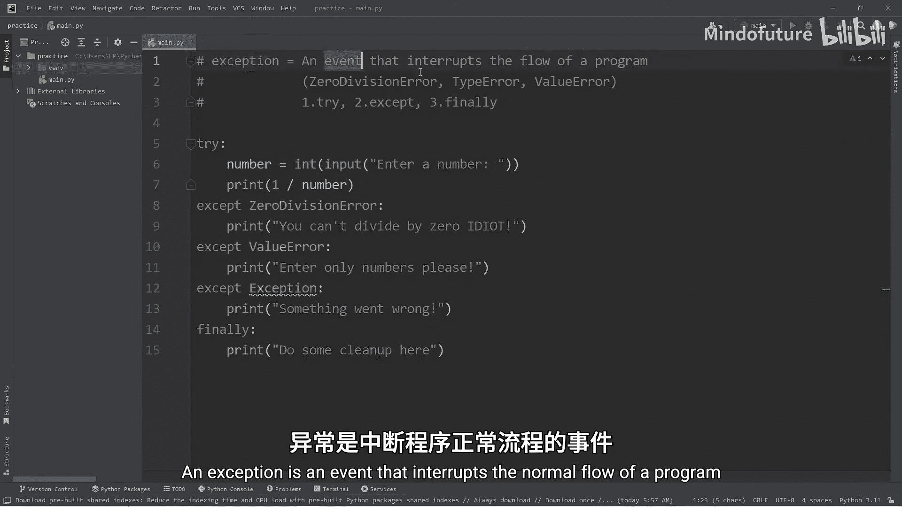
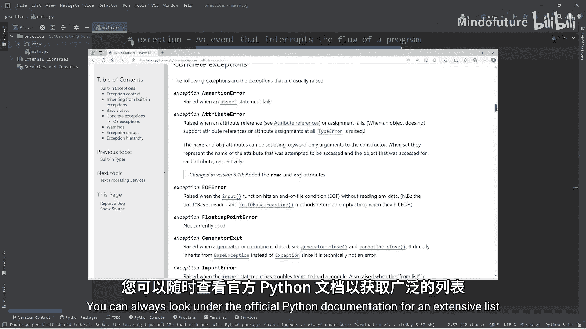
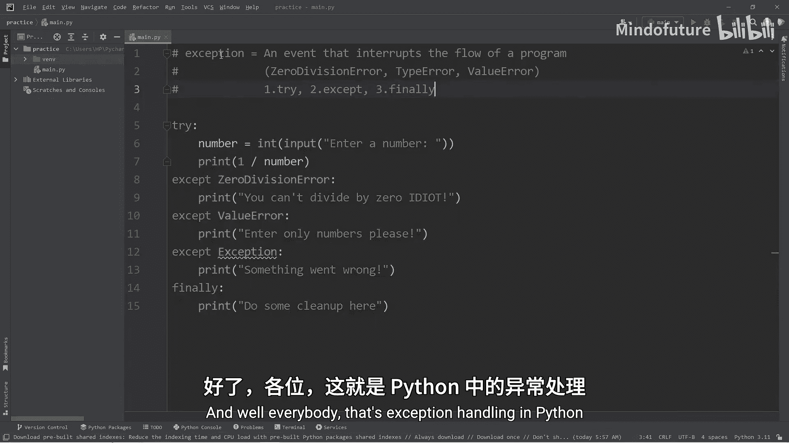

# 069：异常处理 🚨

在本节课中，我们将要学习Python中的异常处理。异常是程序运行过程中可能遇到的错误或意外情况，它会中断程序的正常流程。通过学习如何处理异常，我们可以让程序更加健壮和友好。

## 什么是异常？

异常是一个中断程序正常流程的事件。当Python解释器遇到无法处理的错误时，它会创建一个异常对象并“抛出”它。如果这个异常没有被捕获和处理，程序就会崩溃并停止运行。

## 常见的异常类型

以下是几种常见的Python异常类型：

*   **`ZeroDivisionError`**：当你尝试将一个数字除以零时触发。例如，执行 `1 / 0` 会引发此异常。
*   **`TypeError`**：当你尝试对一个错误数据类型的值执行操作时触发。例如，执行 `1 + “one”` 会引发此异常。
*   **`ValueError`**：当你尝试将一个错误数据类型的值进行类型转换时触发。例如，执行 `int(“pizza”)` 会引发此异常，因为“pizza”无法转换为整数。

## 如何处理异常：`try`、`except`、`finally`

上一节我们介绍了异常的概念，本节中我们来看看如何优雅地处理它们。Python使用 `try`、`except` 和 `finally` 代码块来捕获和处理异常。

### 1. `try` 块

`try` 块用于包裹可能引发异常的“危险”代码。例如，任何接收用户输入的代码都应放在 `try` 块中，因为用户可能输入任何内容。

```python
try:
    number = int(input(“请输入一个数字：”))
    result = 1 / number
    print(f“1 除以 {number} 的结果是 {result}”)
```

### 2. `except` 块

`except` 块紧随 `try` 块之后。如果 `try` 块中的代码引发了异常，程序会立即跳转到对应的 `except` 块执行，而不会让程序崩溃。

以下是处理特定异常的方法：

```python
try:
    number = int(input(“请输入一个数字：”))
    result = 1 / number
    print(f“1 除以 {number} 的结果是 {result}”)
except ZeroDivisionError:
    print(“不能除以零。”)
except ValueError:
    print(“请输入有效的数字。”)
```

**注意**：虽然可以捕获所有异常（`except Exception:`），但这通常被视为不好的做法，因为它过于宽泛，无法向用户提供具体的错误信息。最佳实践是尽可能捕获并处理特定的异常。

### 3. `finally` 块

`finally` 块是可选的，但它一旦被定义，其中的代码**无论是否发生异常都会执行**。它通常用于执行一些清理工作，例如关闭文件或释放资源。

```python
try:
    number = int(input(“请输入一个数字：”))
    result = 1 / number
    print(f“1 除以 {number} 的结果是 {result}”)
except ZeroDivisionError:
    print(“不能除以零。”)
except ValueError:
    print(“请输入有效的数字。”)
finally:
    print(“程序执行完毕，进行清理工作。”)
```

## 总结







本节课中我们一起学习了Python异常处理的核心知识。我们了解到异常是程序运行时的错误事件，并掌握了使用 `try`、`except` 和 `finally` 代码块来捕获和处理异常的方法。记住，良好的异常处理能让你的程序更稳定，并为用户提供更清晰的反馈。你可以查阅官方Python文档以获取更详尽的异常类型列表。