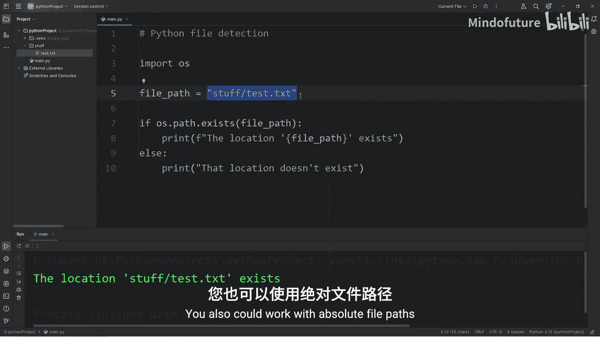
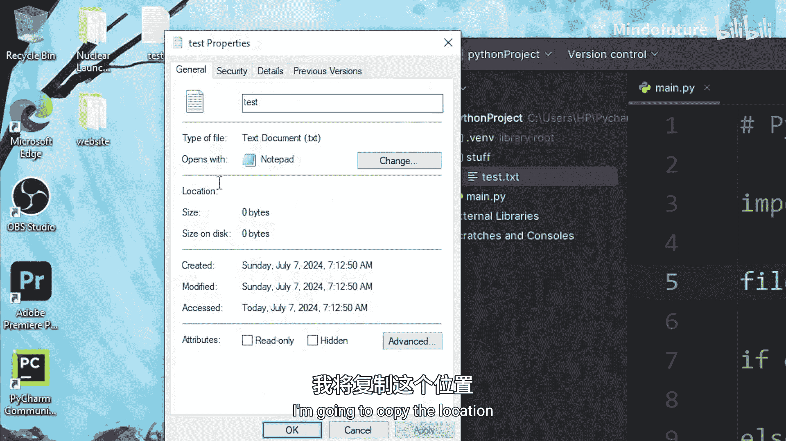
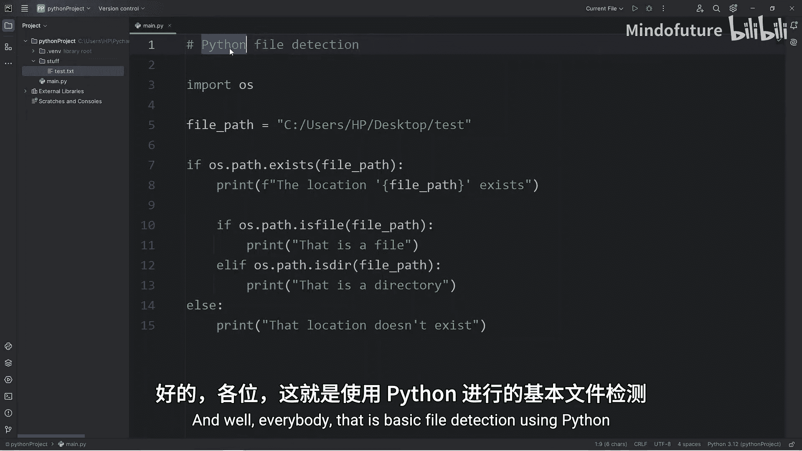

# 070：Python文件检测

在本节课中，我们将学习如何使用Python进行基本的文件检测。这是Python文件处理系列的第一个主题。在开始读写文件之前，我们首先需要掌握如何检测文件是否存在以及判断其类型。

我们将导入`os`模块，该模块为Python程序提供了与操作系统交互的功能。请确保在代码顶部导入此模块。

## 导入模块与准备工作

首先，我们需要导入`os`模块。

```python
import os
```

为了演示，我在项目文件夹中创建了一个名为`test.txt`的纯文本文件。文件内容无关紧要，我们暂时不涉及文件读取。

## 使用相对路径检测文件

我们可以使用相对文件路径或绝对文件路径。首先介绍相对路径。如果目标文件与Python脚本位于同一目录，相对路径只需包含文件名和扩展名。

以下是检测文件是否存在的基本步骤。

```python
fpath = "test.txt"
if os.path.exists(fpath):
    print(f"The location '{fpath}' exists.")
else:
    print(f"That location doesn't exist.")
```

运行上述代码，如果`test.txt`文件存在，将输出“The location 'test.txt' exists.”。如果文件扩展名错误或文件不存在，则会输出“That location doesn't exist.”。

如果文件位于子目录中，例如`stuff`文件夹内，则需要在路径中包含目录名。

```python
fpath = "stuff/test.txt"
```

## 使用绝对路径检测文件

绝对路径指定了文件在计算机上的完整位置。例如，在Windows系统上，路径可能类似于`C:\Users\Name\Desktop\test.txt`。

在Python字符串中，反斜杠`\`是转义字符。我们可以通过使用双反斜杠`\\`或正斜杠`/`来解决这个问题。

```python
fpath = "C:/Users/Name/Desktop/test.txt"
# 或
fpath = "C:\\Users\\Name\\Desktop\\test.txt"
```



使用绝对路径检测文件的方法与相对路径相同。

## 判断路径是文件还是目录



检测到路径存在后，我们还可以进一步判断它是文件还是目录（文件夹）。

`os.path`模块提供了`isfile()`和`isdir()`方法来实现这一功能。

以下是判断路径类型的完整示例。

```python
fpath = "C:/Users/Name/Desktop/test.txt"

if os.path.exists(fpath):
    if os.path.isfile(fpath):
        print(f"That is a file.")
    elif os.path.isdir(fpath):
        print(f"That is a directory.")
else:
    print(f"That location doesn't exist.")
```

运行代码，如果路径指向一个文件，将输出“That is a file.”；如果指向一个目录，则输出“That is a directory.”。

## 核心方法总结

本节我们介绍了文件检测的核心方法，以下是它们的简要说明。

*   `os.path.exists(path)`：检查指定路径是否存在，返回布尔值。
*   `os.path.isfile(path)`：检查指定路径是否是一个文件。
*   `os.path.isdir(path)`：检查指定路径是否是一个目录。

## 课程总结



本节课中，我们一起学习了Python基础文件检测。我们首先导入了`os`模块，然后学习了如何使用相对路径和绝对路径来检测文件或目录是否存在。最后，我们还掌握了如何区分一个路径指向的是文件还是目录。掌握这些基础知识是后续进行文件读写操作的重要前提。在接下来的课程中，我们将开始学习如何读取和写入文件。