# 071：使用Python写入文件 (.txt, .json, .csv) 📝

在本节课中，我们将学习如何使用Python将数据写入到不同类型的文件中。我们将涵盖三种最常用的文件格式：纯文本文件 (.txt)、JSON文件 (.json) 和 CSV文件 (.csv)。通过学习，你将能够将程序中的数据持久化保存到本地磁盘。

---

## 写入纯文本文件 (.txt) 📄

我们首先从最简单的纯文本文件开始。假设我们有一些文本数据需要保存到文件中。

以下是写入文本文件的基本步骤：

1.  定义一个变量来存储文本数据。
2.  创建一个文件路径，可以是相对路径或绝对路径。
3.  使用 `with open(...) as ...` 语句打开文件。
4.  使用文件对象的 `.write()` 方法写入数据。

让我们通过一个例子来实践。我们想保存一句话：“I like pizza”。

```python
# 定义要保存的文本数据
text_data = "I like pizza"

# 定义文件路径（相对路径，文件将保存在与.py文件相同的目录下）
file_path = "output.txt"

# 使用 with 语句打开文件并写入
with open(file_path, "w") as file:
    file.write(text_data)

print(f"文本文件 '{file_path}' 已创建。")
```

运行这段代码后，你会在当前目录下看到一个名为 `output.txt` 的新文件，其内容就是 “I like pizza”。

### 理解代码细节

*   **`with` 语句**：这是一个上下文管理器。它确保文件在使用完毕后会被正确关闭，即使过程中发生错误也是如此。这是一种最佳实践，可以避免因未关闭文件而导致的问题。
*   **`open()` 函数**：用于打开文件。它接收两个主要参数：
    *   `file_path`：文件的路径。
    *   `mode`：打开文件的模式。`"w"` 表示写入模式。如果文件已存在，`"w"` 模式会**覆盖**原有内容。
*   **文件对象**：`open()` 函数返回一个文件对象（这里命名为 `file`）。我们可以调用这个对象的方法，例如 `.write()` 来写入内容。

### 文件路径：相对路径与绝对路径

在上面的例子中，我们使用了相对路径 `"output.txt"`。这意味着文件会创建在当前Python脚本所在的目录。

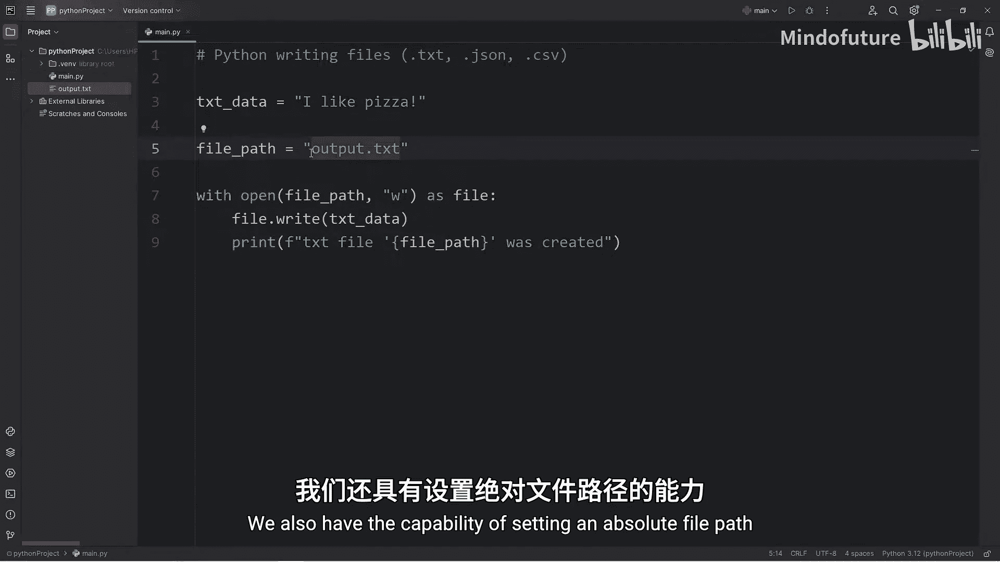

你也可以使用绝对路径，将文件保存到系统的任何位置，例如你的桌面。

```python
# Windows 系统的绝对路径示例（使用双反斜杠或正斜杠）
file_path_absolute = "C:\\Users\\YourName\\Desktop\\output.txt"
# 或者
file_path_absolute = "C:/Users/YourName/Desktop/output.txt"

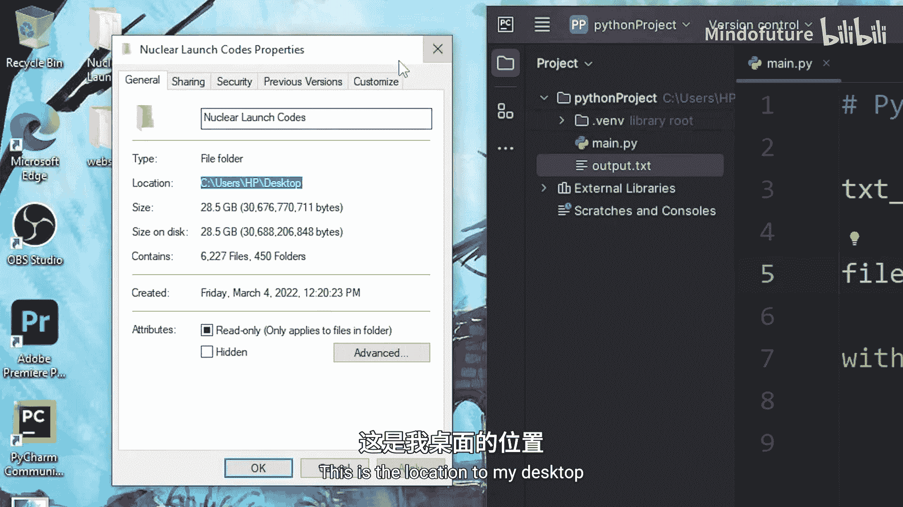

with open(file_path_absolute, "w") as file:
    file.write(text_data)
```

### 文件打开模式

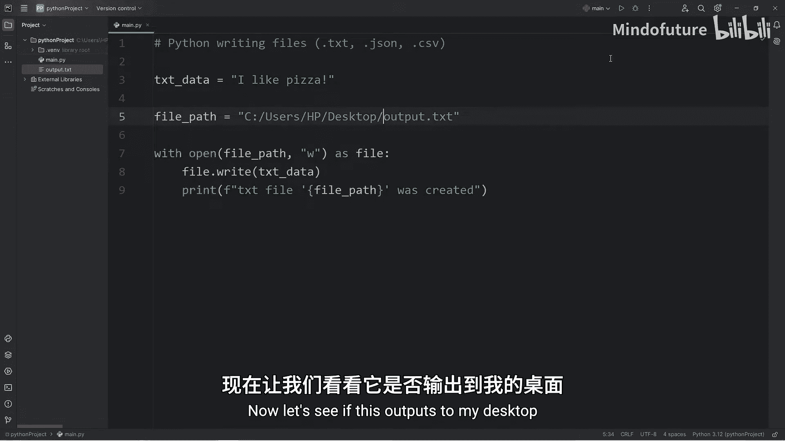

除了 `"w"`（写入）模式，还有其他几种有用的模式：

*   `"x"`：独占创建模式。只有当文件**不存在**时才会创建并写入。如果文件已存在，则会引发 `FileExistsError` 错误。这可以防止意外覆盖重要文件。
*   `"a"`：追加模式。如果文件存在，新内容会添加在文件末尾，而不是覆盖原有内容。


让我们看看如何使用 `"x"` 模式并处理可能出现的错误：

```python
file_path = "output.txt"
try:
    with open(file_path, "x") as file:
        file.write("这是新内容。")
    print(f"文件 '{file_path}' 已创建。")
except FileExistsError:
    print(f"错误：文件 '{file_path}' 已存在，未执行写入操作。")
```

对于 `"a"`（追加）模式，我们可以这样使用：

```python
file_path = "output.txt"
with open(file_path, "a") as file:
    file.write("\n这是追加的一行。")  # `\n` 是换行符
```

### 写入列表等集合数据

如果你想写入一个列表中的所有项目，不能直接将列表传递给 `.write()` 方法，因为它只接受字符串。你需要遍历列表，逐项写入。

```python
employees = ["Eugene", "Squidward", "SpongeBob", "Patrick"]
file_path = "employees.txt"

with open(file_path, "w") as file:
    for employee in employees:
        file.write(employee + "\n")  # 在每个名字后添加换行符

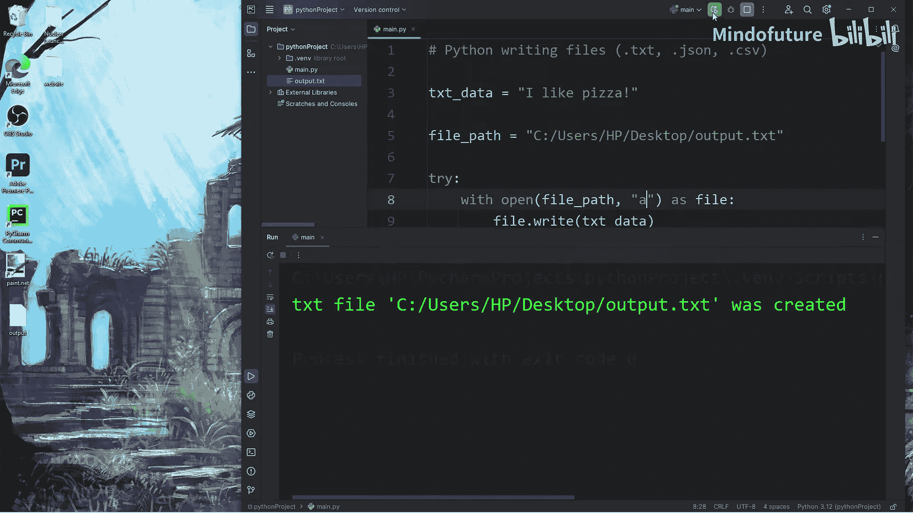

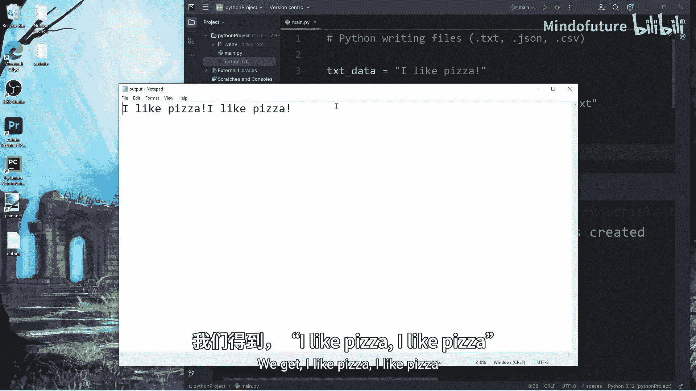

print(f"列表已写入文件 '{file_path}'。")
```

运行后，`employees.txt` 文件中的内容将是每个名字单独占一行。

---

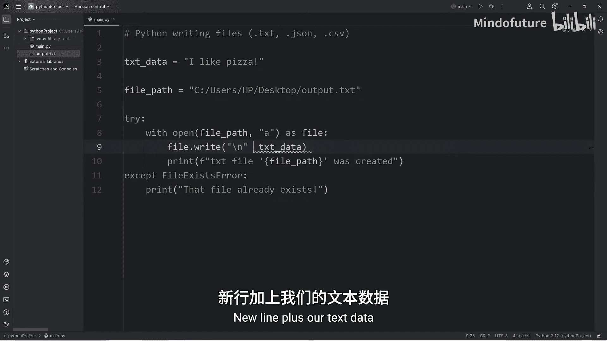

上一节我们介绍了如何写入纯文本文件，本节中我们来看看如何写入结构更清晰的JSON文件。


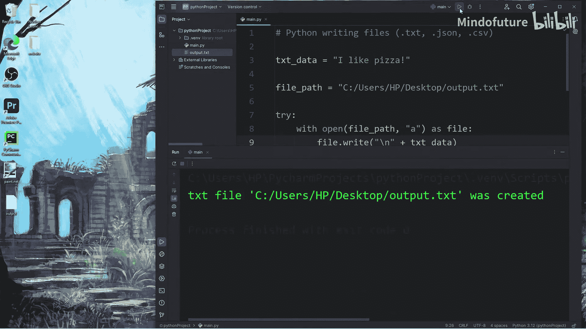

## 写入JSON文件 (.json) 🗂️


JSON（JavaScript Object Notation）是一种轻量级的数据交换格式，使用“键-值对”来组织数据，非常适合存储结构化的信息，比如字典。

Python的 `json` 模块可以轻松地将字典等对象转换为JSON格式的字符串并写入文件。

以下是写入JSON文件的步骤：

1.  导入 `json` 模块。
2.  准备一个字典形式的数据。
3.  使用 `with open(...) as ...` 语句打开文件（模式为 `"w"`）。
4.  使用 `json.dump()` 方法将字典写入文件。

让我们看一个例子，保存一个员工的详细信息：

```python
import json

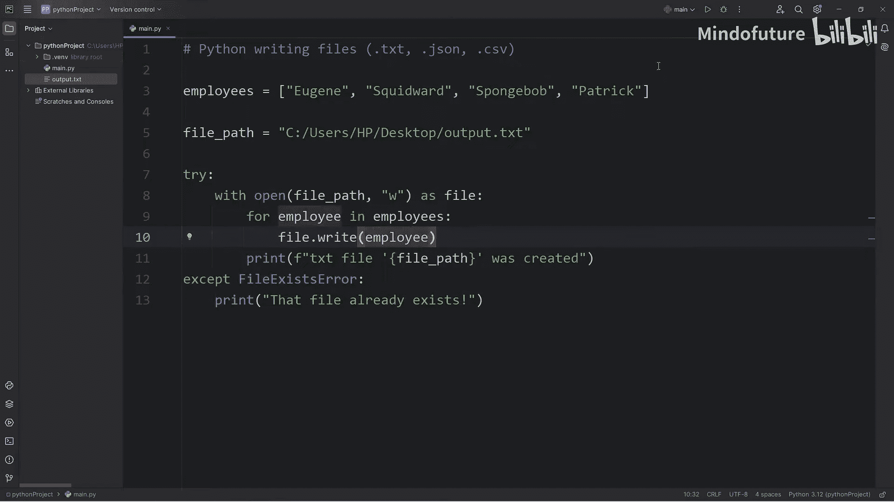

# 准备要保存的字典数据
employee_data = {
    "name": "SpongeBob",
    "age": 30,
    "job": "cook"
}

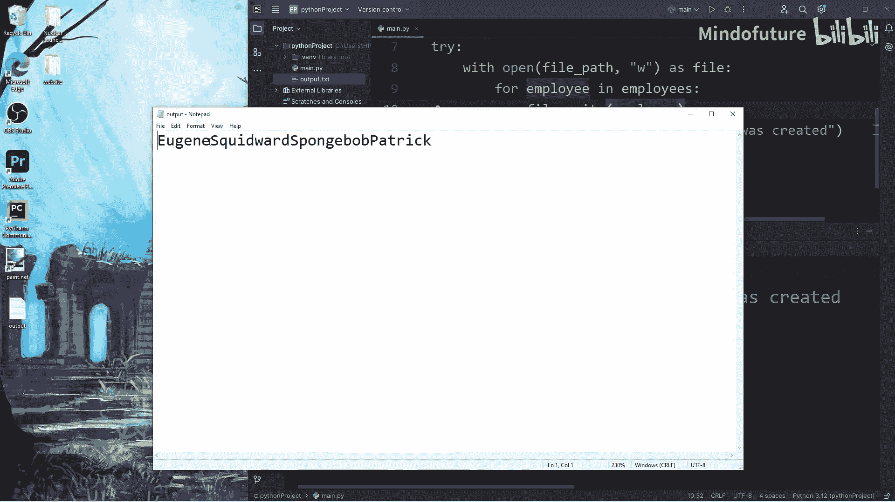

file_path = "employee.json"

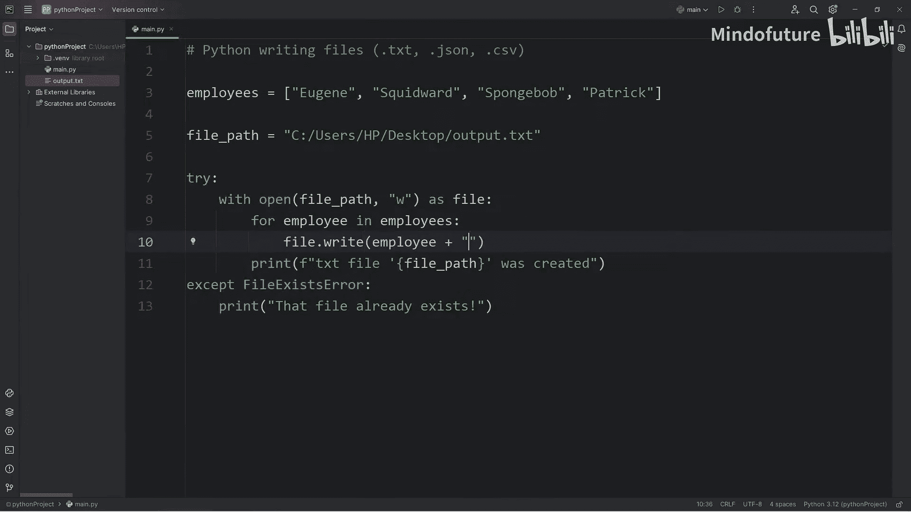

# 写入JSON文件
with open(file_path, "w") as file:
    json.dump(employee_data, file)

print(f"JSON文件 '{file_path}' 已创建。")
```


打开生成的 `employee.json` 文件，你会看到类似这样的内容：
```json
{"name": "SpongeBob", "age": 30, "job": "cook"}
```

### 美化JSON输出

默认输出的JSON是紧凑格式，没有缩进。为了提高可读性，`json.dump()` 方法提供了一个 `indent` 参数。

```python
with open(file_path, "w") as file:
    json.dump(employee_data, file, indent=4)  # 使用4个空格进行缩进
```

使用 `indent=4` 后，文件内容将变得层次分明：
```json
{
    "name": "SpongeBob",
    "age": 30,
    "job": "cook"
}
```

---

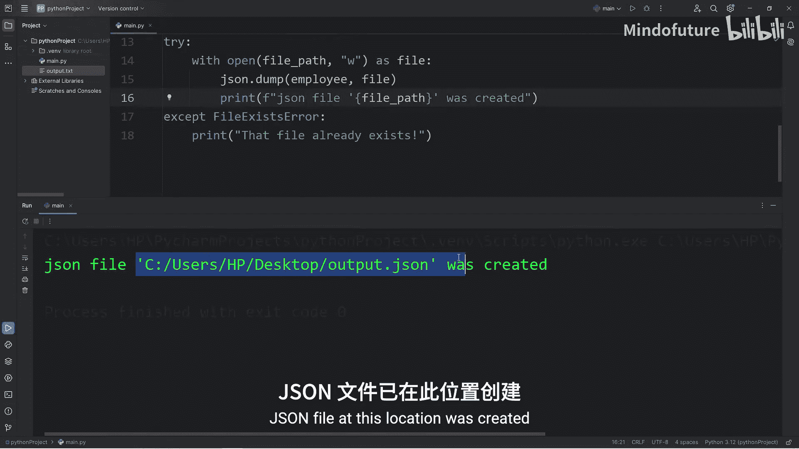

我们已经学会了如何写入文本和JSON文件，最后我们来处理表格数据常用的CSV格式。

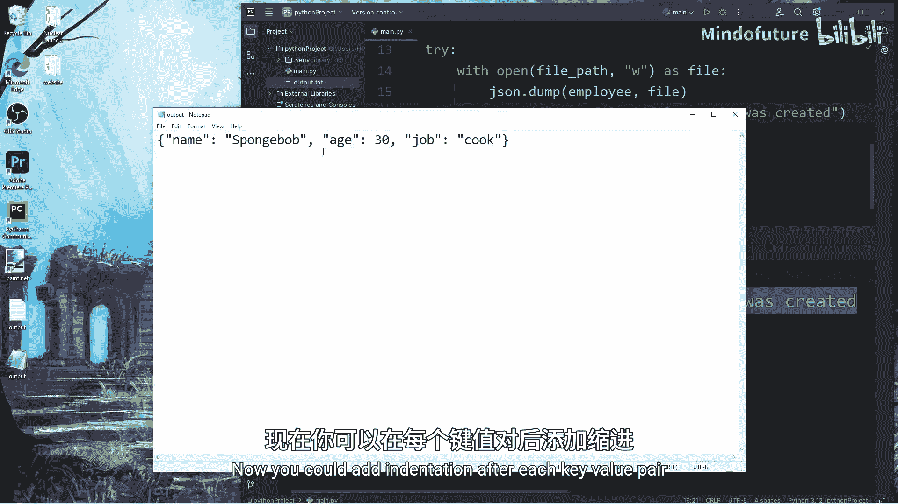

## 写入CSV文件 (.csv) 📊

CSV（Comma-Separated Values，逗号分隔值）文件通常用于存储表格数据，类似于Excel表格。每一行代表一条记录，每个字段由逗号分隔。

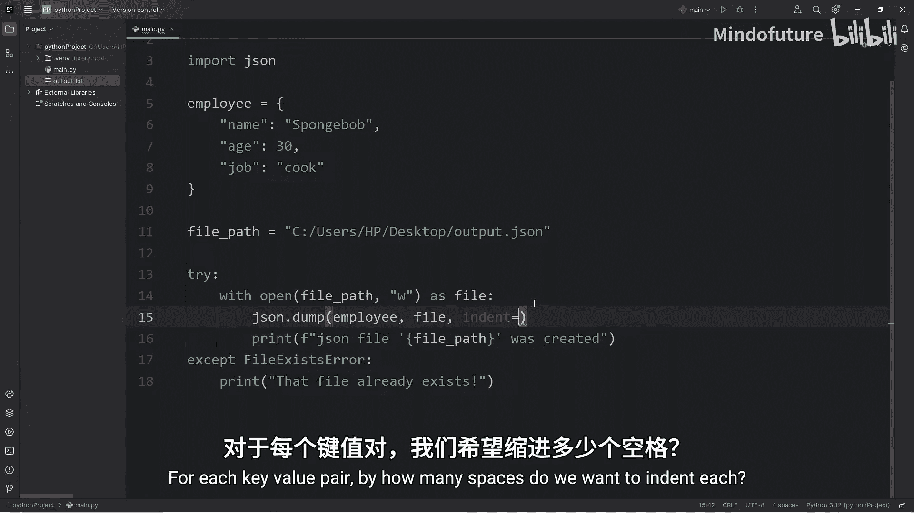

Python的 `csv` 模块专门用于读写CSV文件。


以下是写入CSV文件的步骤：

1.  导入 `csv` 模块。
2.  准备一个二维列表（列表的列表）作为数据。外层列表的每个元素代表一行，内层列表的元素代表该行的各列。
3.  使用 `with open(...) as ...` 语句打开文件（模式为 `"w"`，并建议设置 `newline=''` 以避免多余空行）。
4.  创建一个 `csv.writer` 对象。
5.  使用 `writer.writerows()` 方法一次性写入所有行，或使用 `writer.writerow()` 方法逐行写入。

让我们创建一个包含员工信息的表格：

```python
import csv

# 准备二维列表数据：第一行是表头，后面是数据行
employees_2d = [
    ["name", "age", "job"],        # 表头
    ["SpongeBob", 30, "cook"],     # 第一行数据
    ["Patrick", 37, "unemployed"], # 第二行数据
    ["Sandy", 27, "scientist"]     # 第三行数据
]

file_path = "employees.csv"

# 写入CSV文件。设置 newline='' 防止在Windows系统下出现多余空行
with open(file_path, "w", newline='') as file:
    writer = csv.writer(file)
    writer.writerows(employees_2d)  # 一次性写入所有行

print(f"CSV文件 '{file_path}' 已创建。")
```

运行代码后，你会得到一个 `employees.csv` 文件。用文本编辑器打开，内容如下：
```
name,age,job
SpongeBob,30,cook
Patrick,37,unemployed
Sandy,27,scientist
```
如果用Excel或Numbers等电子表格软件打开，它会自动识别为表格。

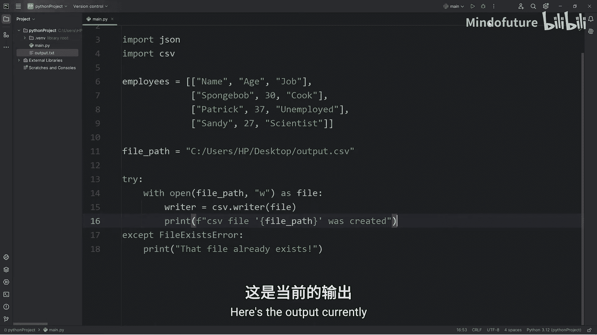

### 逐行写入

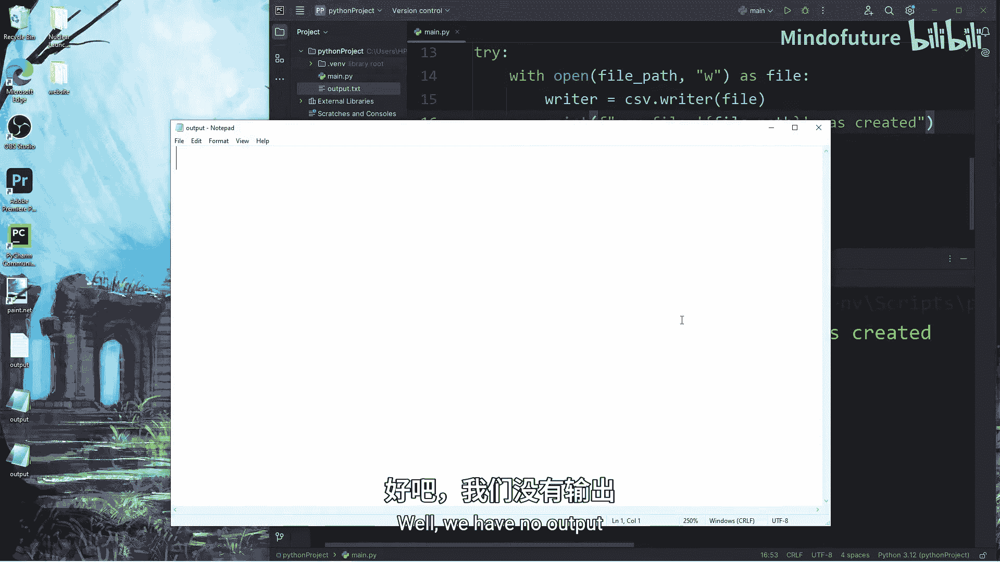

除了 `writerows()`，你也可以使用 `writerow()` 来逐行写入，这在动态生成数据时很有用。

```python
with open(file_path, "w", newline='') as file:
    writer = csv.writer(file)
    for row in employees_2d:
        writer.writerow(row)
```

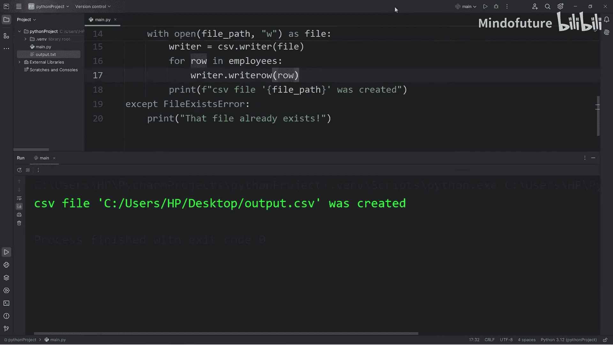

---

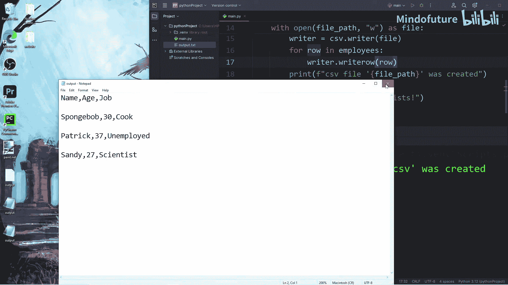

## 总结 🎯

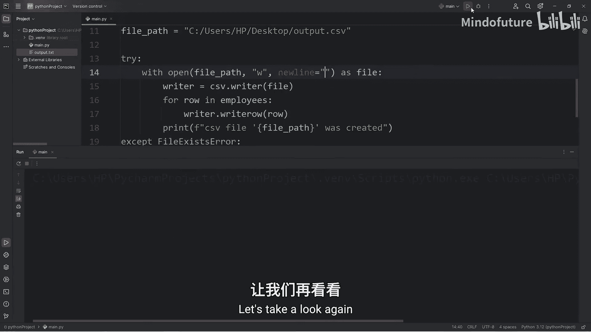

本节课中我们一起学习了使用Python写入三种常见文件格式的方法：

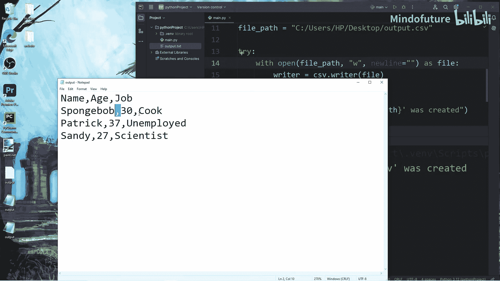

1.  **纯文本文件 (.txt)**：使用 `open(file_path, “w”)` 和文件对象的 `.write()` 方法。适用于保存简单的字符串或日志。
2.  **JSON文件 (.json)**：使用 `json` 模块的 `json.dump(data, file)` 方法。非常适合保存字典等结构化的“键-值对”数据，并可利用 `indent` 参数美化输出。
3.  **CSV文件 (.csv)**：使用 `csv` 模块的 `csv.writer` 对象及其 `.writerows()` 或 `.writerow()` 方法。是存储和交换表格数据的标准格式。

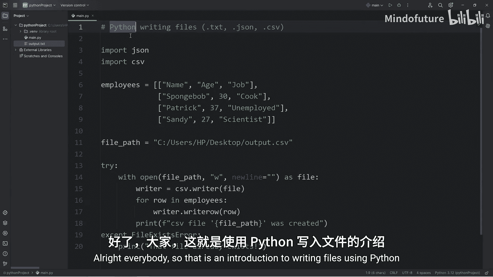

关键点在于理解不同的文件格式对应不同的数据结构和Python模块。通过 `with` 语句管理文件操作，可以确保资源被正确释放，是编写健壮代码的好习惯。现在，你可以尝试将程序中的数据输出到文件，实现数据的持久化存储了。