# 072：使用Python读取文件（.txt, .json, .csv）📁

在本节课中，我们将学习如何使用Python读取三种常见格式的文件：纯文本文件（.txt）、JSON文件（.json）和CSV文件（.csv）。我们将从文件路径的指定开始，逐步讲解读取每种文件的具体方法，并学习如何处理可能出现的异常。

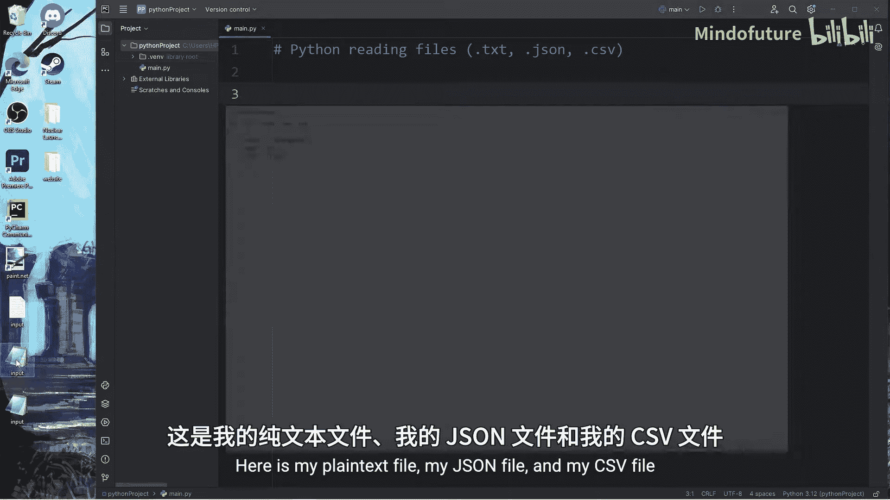

---


## 概述

在之前的课程中，我们已经创建了一些示例文件用于练习。本节课的目标是掌握读取这些文件内容的核心技巧。我们将使用Python内置的`open()`函数以及`json`和`csv`模块来完成这项任务。

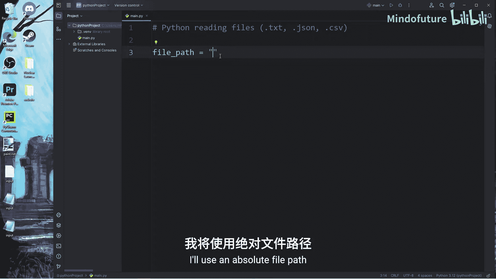

---

## 准备工作：指定文件路径

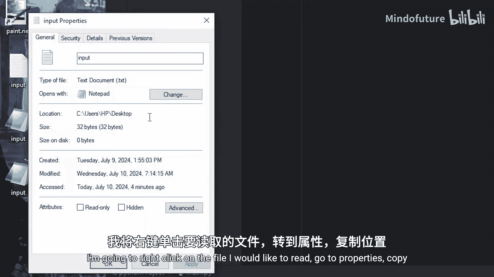

首先，我们需要告诉Python要读取哪个文件。这通过指定文件路径来实现。文件路径可以是相对路径，也可以是绝对路径。为了清晰起见，这里我们使用绝对路径。

在Windows系统中，复制文件路径时得到的是反斜杠`\`。在Python字符串中，反斜杠是转义字符，因此我们需要将其替换为双反斜杠`\\`或正斜杠`/`。

以下是获取并设置文本文件路径的示例：

```python
file_path = "C:/Users/YourName/Desktop/input.txt"
```

---

## 读取纯文本文件 (.txt)

上一节我们介绍了如何指定文件路径，本节中我们来看看如何安全地打开并读取一个纯文本文件。

读取文件时，使用`with`语句是一种最佳实践。`with`语句是一个上下文管理器，它会自动处理文件的打开和关闭，确保资源被正确释放，避免因未关闭文件而导致程序出现意外行为。

`open()`函数接受两个主要参数：文件路径和模式。要读取文件，模式应设置为`'r'`（代表read，读取）。

以下是读取文本文件的完整代码示例：

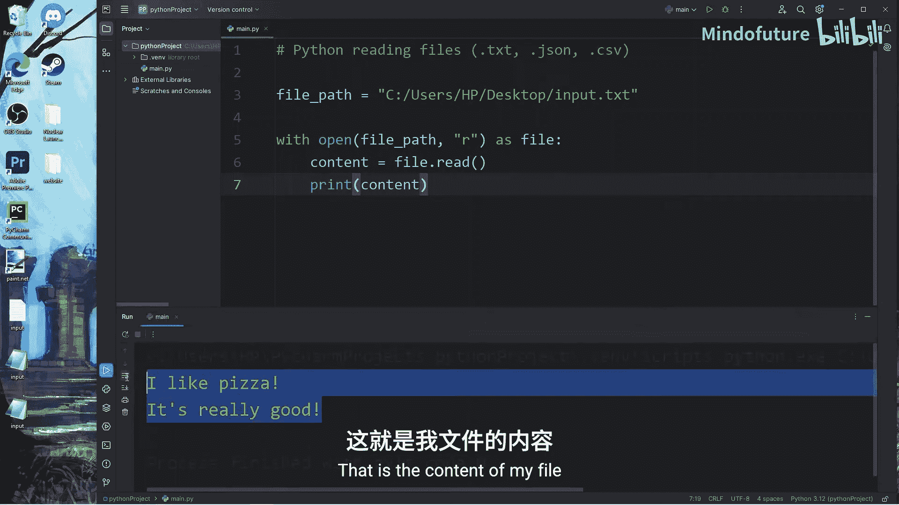

```python
try:
    with open(file_path, 'r') as file:
        content = file.read()
        print(content)
except FileNotFoundError:
    print("文件未找到。")
except PermissionError:
    print("您没有读取该文件的权限。")
```

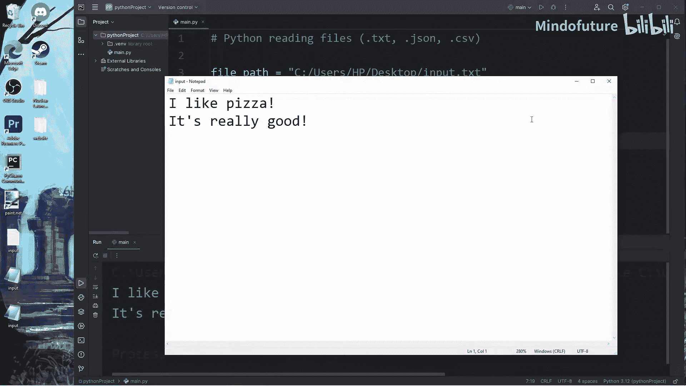

**代码解释：**
1.  `with open(...) as file:`：打开文件并将返回的文件对象赋值给变量`file`。
2.  `content = file.read()`：调用文件对象的`.read()`方法，将文件的全部内容作为一个字符串读取到变量`content`中。
3.  `try...except`：用于捕获并处理可能出现的`FileNotFoundError`（文件未找到）和`PermissionError`（权限不足）异常，使程序更加健壮。

执行上述代码后，如果文件存在且可读，控制台将输出文件内容，例如：“I like pizza. It's really good.”

---

## 读取JSON文件 (.json)

读取JSON文件与读取文本文件略有不同，因为我们需要将JSON字符串解析为Python能够操作的数据结构（如字典或列表）。为此，我们需要导入Python内置的`json`模块。

以下是读取JSON文件的步骤：

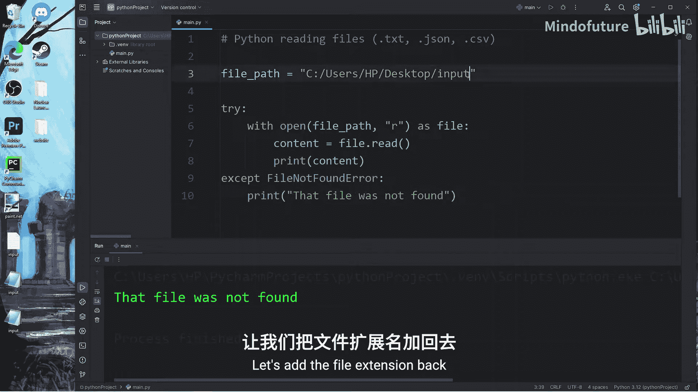

首先，导入`json`模块并指定JSON文件的路径。

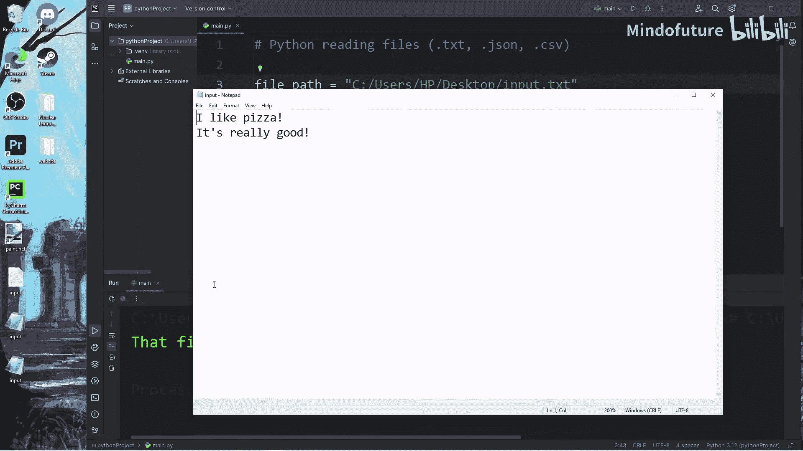

```python
import json

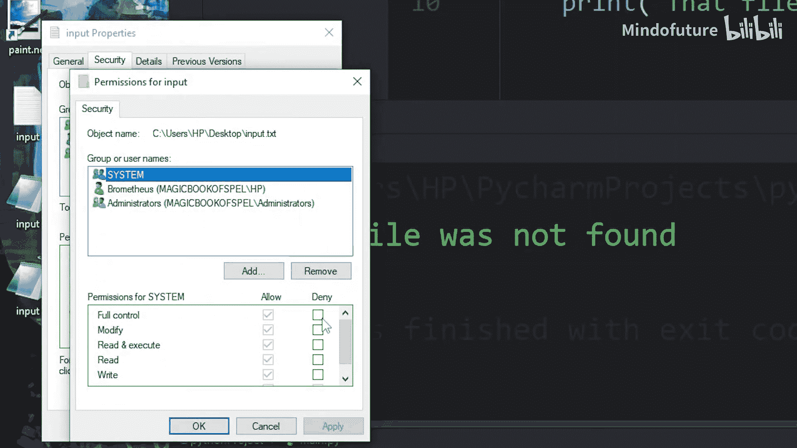

json_file_path = "C:/Users/YourName/Desktop/input.json"
```

然后，使用`with`语句打开文件，并利用`json.load()`方法加载文件内容。

```python
try:
    with open(json_file_path, 'r') as file:
        content = json.load(file)
        print(content)
except FileNotFoundError:
    print("JSON文件未找到。")
except PermissionError:
    print("您没有读取该JSON文件的权限。")
```

`json.load(file)`方法会读取文件内容，并自动将其解析为Python字典或列表。之后，你就可以像操作普通Python字典一样访问其中的数据了。

例如，如果`input.json`文件内容如下：
```json
{"name": "Spongebob", "age": 30, "job": "Cook"}
```
你可以通过键来访问对应的值：
```python
print(content['name'])  # 输出: Spongebob
print(content['age'])   # 输出: 30
print(content['job'])   # 输出: Cook
```

---

## 读取CSV文件 (.csv)

CSV（逗号分隔值）文件通常用于存储表格数据。要读取CSV文件，我们需要导入Python内置的`csv`模块。

以下是读取CSV文件的核心步骤：

首先，导入`csv`模块并指定CSV文件的路径。

```python
import csv

csv_file_path = "C:/Users/YourName/Desktop/input.csv"
```

然后，使用`with`语句打开文件，并利用`csv.reader()`方法创建一个读取器对象。

```python
try:
    with open(csv_file_path, 'r') as file:
        csv_reader = csv.reader(file)
        for row in csv_reader:
            print(row)
except FileNotFoundError:
    print("CSV文件未找到。")
except PermissionError:
    print("您没有读取该CSV文件的权限。")
```

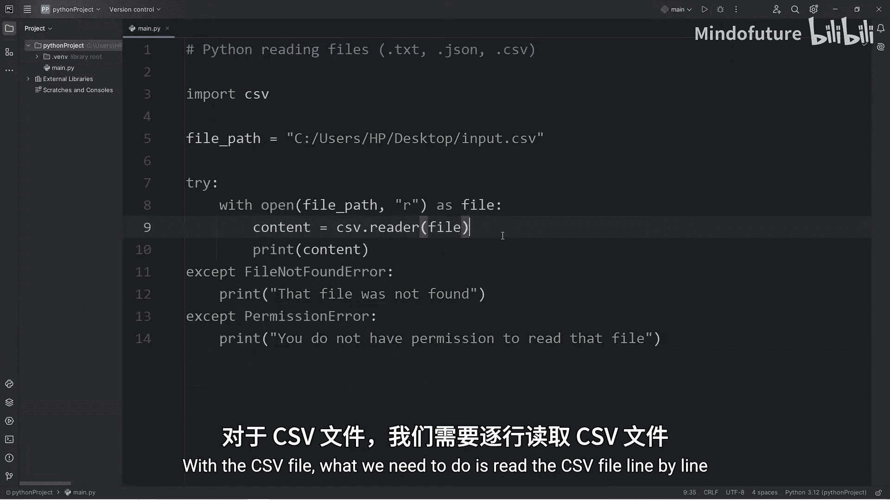

**代码解释：**
1.  `csv.reader(file)`：创建一个CSV读取器对象`csv_reader`。
2.  `for row in csv_reader:`：遍历读取器对象。每次迭代，`row`变量都是一个列表，代表CSV文件中的一行数据，列表中的每个元素对应该行的一个单元格。

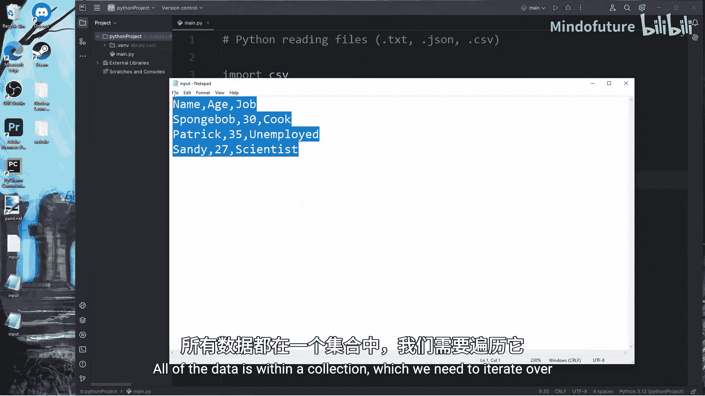

假设`input.csv`内容如下：
```
name,age,job
Spongebob,30,Cook
Patrick,35,Unemployed
Sandy,27,Scientist
```
上述代码将逐行输出：
```
['name', 'age', 'job']
['Spongebob', '30', 'Cook']
['Patrick', '35', 'Unemployed']
['Sandy', '27', 'Scientist']
```

如果需要获取特定列的数据，可以通过列表索引来访问每一行的元素。例如，要获取所有人的姓名（第一列），可以这样做：

```python
for row in csv_reader:
    print(row[0])  # 打印每行的第一个元素（姓名列）
```

---

## 总结

本节课中我们一起学习了使用Python读取三种常见文件格式的方法：
1.  **读取.txt文件**：使用`open(file_path, 'r')`和`.read()`方法，并结合`try-except`块处理异常。
2.  **读取.json文件**：导入`json`模块，使用`json.load()`方法将文件内容解析为Python数据结构。
3.  **读取.csv文件**：导入`csv`模块，使用`csv.reader()`创建读取器对象，并通过循环遍历来获取每一行数据。

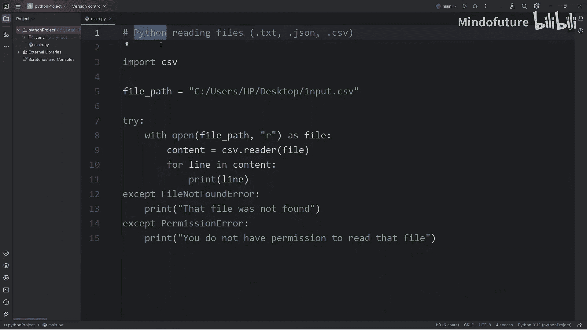

掌握这些基础的文件读取操作，是进行数据处理、分析和自动化任务的重要第一步。