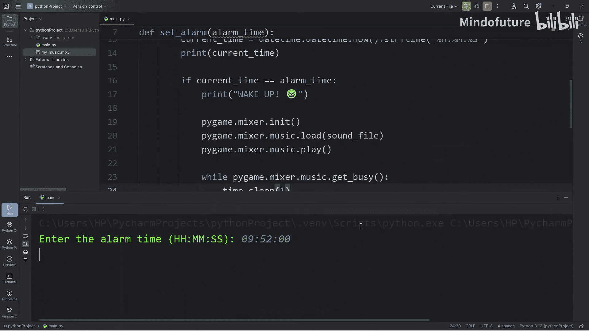
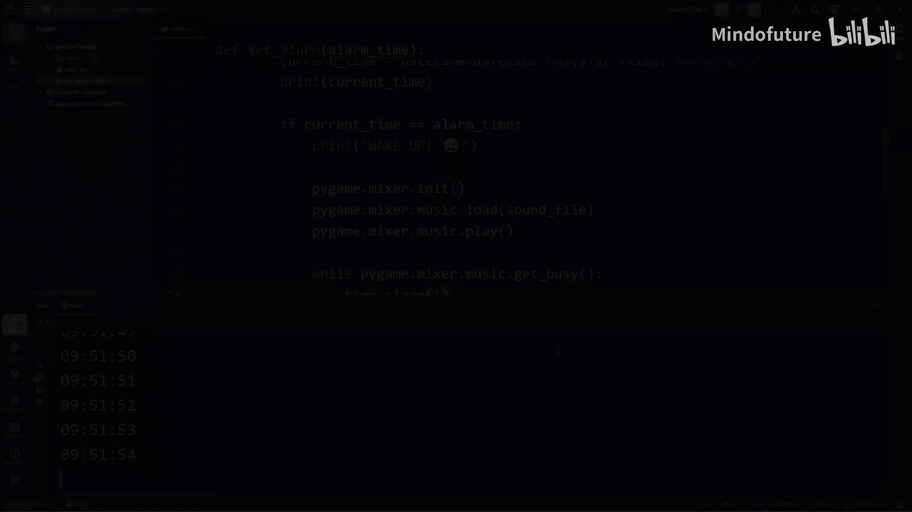
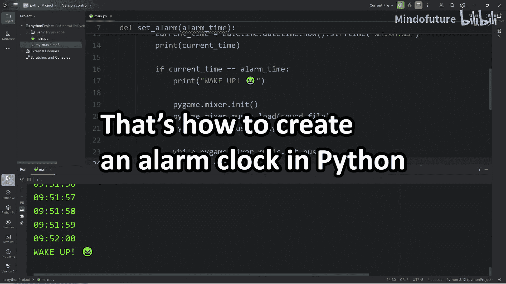

# 075：用Python编写一个闹钟 🕰️

在本节课中，我们将学习如何使用Python创建一个功能完整的闹钟程序。我们将使用`time`、`datetime`和`pygame`模块来实现时间获取、时间比较以及播放提示音的功能。

---

## 准备工作

上一节我们介绍了项目目标，本节中我们来看看实现这个闹钟需要哪些准备工作。

以下是实现闹钟所需的导入模块：

*   `import time`
    *   用于控制程序每秒更新一次。
*   `import datetime`
    *   用于处理时间的字符串表示形式。
*   `import pygame`
    *   用于播放闹钟提示音。

**注意**：你可能需要安装`pygame`包。安装方法是在终端中运行以下命令：
```python
pip install pygame
```

---

## 设置闹钟时间

准备工作完成后，我们开始编写核心功能。首先，创建一个函数来设置闹钟。

我们定义一个`set_alarm`函数，它接收一个代表军用时间格式（HH:MM:SS）的字符串参数`alarm_time`。

```python
def set_alarm(alarm_time):
    pass
```

为了确保程序在直接运行时才执行设置闹钟的逻辑，我们使用以下判断语句：

```python
if __name__ == "__main__":
```

在这个判断语句内，我们提示用户输入闹钟时间，并调用`set_alarm`函数。

```python
    alarm_time = input("请输入闹钟时间 (格式：HH:MM:SS): ")
    set_alarm(alarm_time)
```

在`set_alarm`函数内部，我们先打印一条设置成功的消息。

```python
def set_alarm(alarm_time):
    print(f"闹钟已设置为：{alarm_time}")
```

---

## 获取并比较时间

设置好闹钟时间后，我们需要持续检查当前时间是否到了设定的闹钟时间。

在`set_alarm`函数中，我们创建一个布尔变量`is_running`来控制主循环。

```python
    is_running = True
```

然后，我们进入一个`while`循环。在循环中，我们使用`datetime`模块获取当前的时、分、秒。

```python
    while is_running:
        current_time = datetime.datetime.now().strftime("%H:%M:%S")
        print(current_time)
```

获取当前时间后，我们将其与用户设定的`alarm_time`进行比较。如果两者相等，则触发闹钟。

```python
        if current_time == alarm_time:
            print("时间到！该起床了！⏰")
            is_running = False
```

为了让时钟每秒更新一次，而不是疯狂循环，我们在每次循环结束时让程序暂停一秒。

```python
        time.sleep(1)
```

---

## 播放提示音

当时间匹配时，除了打印信息，我们还需要播放声音来提醒用户。这就是`pygame`发挥作用的地方。

首先，你需要一个MP3格式的音频文件。你可以从YouTube音频库等资源中下载非商业用途的音效或音乐，并将其放在项目文件夹中。

假设音频文件名为`my_music.mp3`，我们在函数开头定义其路径。

```python
    sound_file = "my_music.mp3"
```

在触发闹钟的`if`语句内部（即打印“该起床了”之后），我们初始化`pygame`的混音器并加载、播放音乐。

```python
            pygame.mixer.init()
            pygame.mixer.music.load(sound_file)
            pygame.mixer.music.play()
```

默认情况下，程序会在播放声音后立即结束。为了让声音持续播放直到结束，我们添加一个循环，检查音乐是否仍在播放。

```python
            while pygame.mixer.music.get_busy():
                time.sleep(1)
```

**可选步骤**：如果你运行程序时看到“Hello from the pygame community...”的输出，可以进入Python环境下的`pygame`包目录，找到`__init__.py`文件，注释掉或删除底部的相关打印语句来屏蔽它。

---

## 总结

本节课中我们一起学习了如何用Python构建一个简单的命令行闹钟。我们主要完成了以下工作：



1.  使用`datetime`模块获取和格式化当前时间。
2.  通过循环和`time.sleep(1)`实现时钟的每秒更新。
3.  比较当前时间与用户输入的闹钟时间。
4.  利用`pygame.mixer`模块加载并播放MP3音频文件作为闹铃。
5.  通过检查`pygame.mixer.music.get_busy()`的状态让铃声持续播放。





这个项目涵盖了时间处理、用户输入、条件判断和外部库使用等多个基础概念，是一个很好的综合练习。你可以尝试为其添加更多功能，例如设置多个闹钟、选择不同的铃声或添加图形界面。