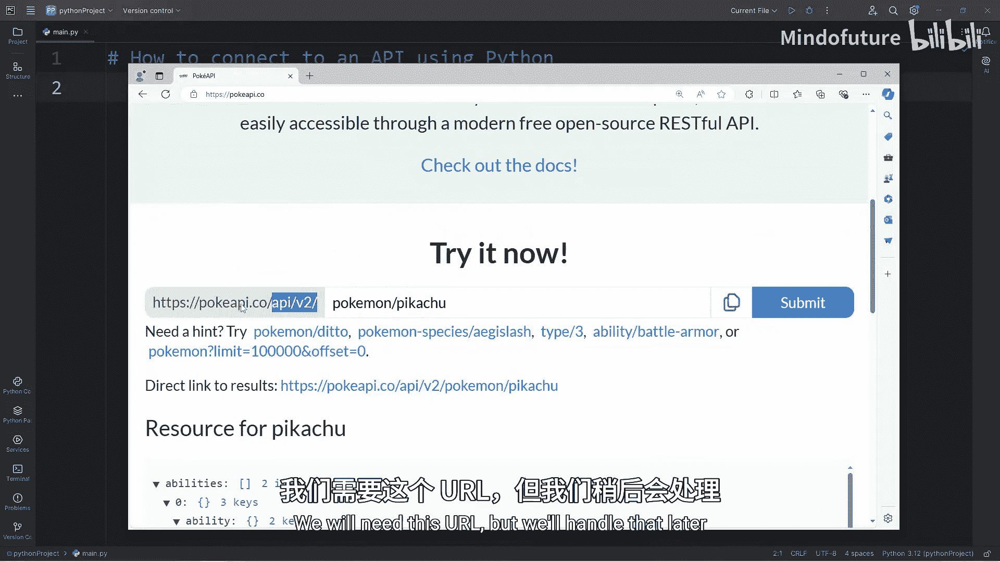
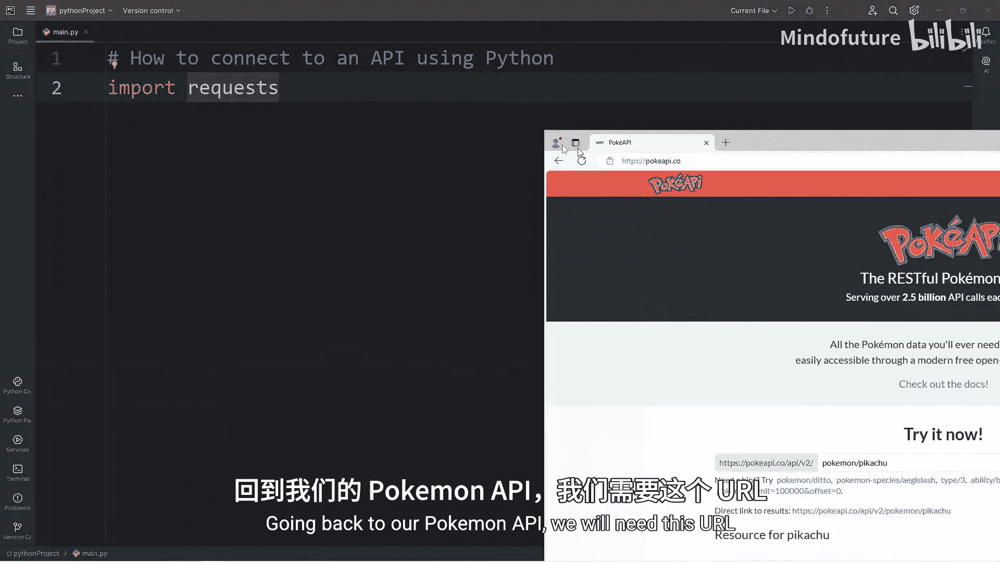
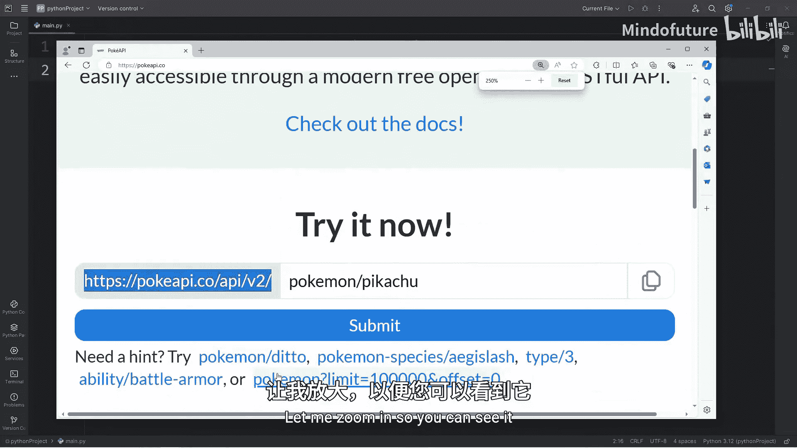
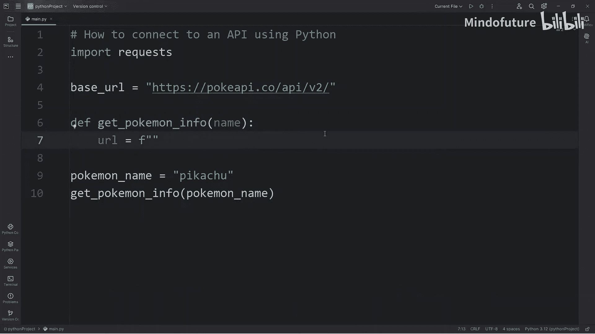
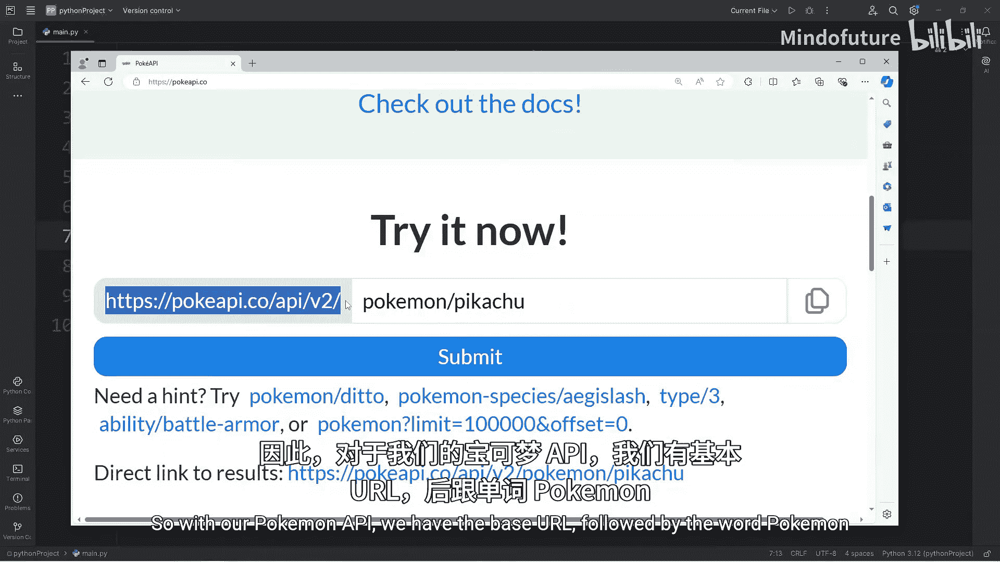
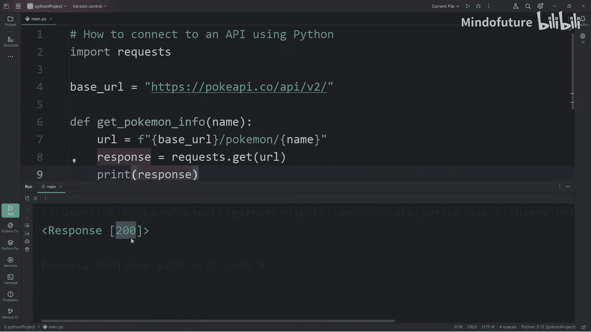
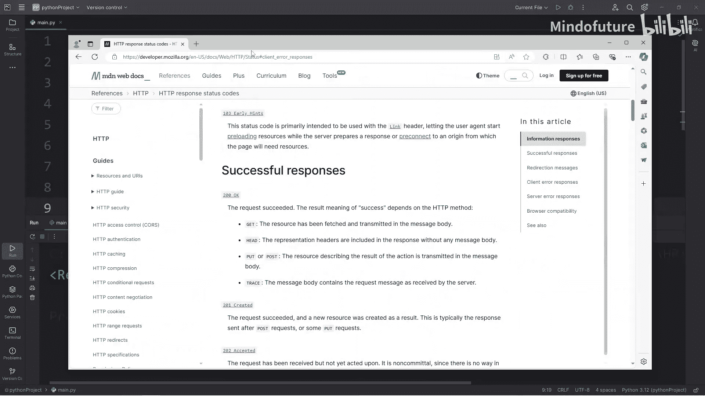
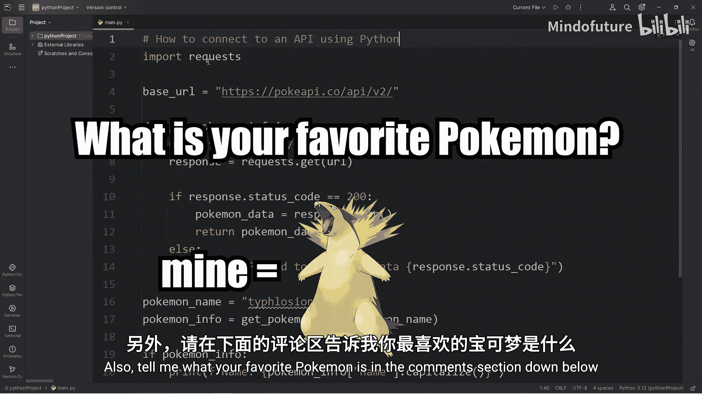

# 077：使用Python连接API获取数据 🐍

在本节课中，我们将学习如何使用Python连接到一个外部API，并从中获取数据。我们将以有趣的宝可梦API为例，演示如何查询特定宝可梦的信息，例如它的名字、ID、身高和体重。

---

## 第一步：导入必要的库



首先，我们需要导入`requests`库来发送HTTP请求。这个库不是Python标准库的一部分，所以可能需要先安装它。

```python
import requests
```

如果运行上述代码时出现“ModuleNotFoundError: No module named 'requests'”的错误，说明你需要安装这个库。

以下是安装步骤：
1.  打开你的终端（在PyCharm或VS Code中通常有内置终端）。
2.  输入命令：`pip install requests`。
3.  等待安装完成。

安装成功后，再次运行导入语句就不会报错了。

---



## 第二步：理解API与构建请求URL



上一节我们介绍了如何准备开发环境，本节中我们来看看如何构建API请求。

我们将使用一个公开的宝可梦API。根据其文档，要查询一个宝可梦（例如皮卡丘），我们需要使用特定的URL格式。

基础URL是：`https://pokeapi.co/api/v2/`
要查询宝可梦，需要在后面加上`pokemon/`和宝可梦的名字。

因此，完整的请求URL格式为：
```
{基础URL}pokemon/{宝可梦名称}
```
例如，查询皮卡丘的URL就是：`https://pokeapi.co/api/v2/pokemon/pikachu`

为了方便，我们首先将基础URL存储在一个变量中。



```python
base_url = "https://pokeapi.co/api/v2/"
```



---

## 第三步：创建函数并发送请求

接下来，我们创建一个函数来获取宝可梦信息。这个函数将接收一个宝可梦的名字作为参数。

```python
def get_pokemon_info(pokemon_name):
    # 构建完整的请求URL
    url = f"{base_url}pokemon/{pokemon_name.lower()}"
    # 发送GET请求
    response = requests.get(url)
    return response
```



在函数外部，我们可以指定想查询的宝可梦，并调用这个函数。



```python
my_pokemon = "Pikachu"
pokemon_response = get_pokemon_info(my_pokemon)
```

---

## 第四步：处理API响应

发送请求后，我们会收到一个响应对象。我们需要检查这个响应的状态码，以确保请求成功（例如，状态码200表示成功）。

以下是常见的HTTP状态码：
*   **200**: 成功 (OK)
*   **404**: 未找到 (Not Found)

我们在函数中添加逻辑来处理响应：

```python
def get_pokemon_info(pokemon_name):
    url = f"{base_url}pokemon/{pokemon_name.lower()}"
    response = requests.get(url)

    if response.status_code == 200:
        # 请求成功，将JSON格式的响应内容转换为Python字典
        pokemon_data = response.json()
        return pokemon_data
    else:
        # 请求失败，打印错误信息
        print(f"Failed to retrieve data. Status code: {response.status_code}")
        return None
```

现在，当我们调用`get_pokemon_info(“Pikachu”)`时，如果成功，它将返回一个包含皮卡丘所有信息的字典。

---

## 第五步：提取并显示所需信息

成功获取数据字典后，我们就可以从中提取我们关心的具体信息了。

字典通过`键`来访问对应的`值`。从API返回的数据中，我们可以找到`name`、`id`、`height`、`weight`等键。

```python
# 获取宝可梦信息字典
pokemon_info = get_pokemon_info(“Pikachu”)

if pokemon_info: # 检查字典是否存在（即请求是否成功）
    name = pokemon_info[‘name‘].capitalize()
    id_num = pokemon_info[‘id‘]
    height = pokemon_info[‘height‘]
    weight = pokemon_info[‘weight‘]

    print(f“Name: {name}“)
    print(f“ID: {id_num}“)
    print(f“Height: {height}“)
    print(f“Weight: {weight}“)
```

运行代码，你将会看到皮卡丘的信息被打印出来。你可以尝试将`“Pikachu”`替换成其他宝可梦的名字（如`“charizard”`、`“bulbasaur”`）来查询不同的数据。

---

## 总结 🎯

本节课中我们一起学习了使用Python连接API的核心步骤：
1.  **安装并导入** `requests` 库。
2.  **理解API文档**，构建正确的请求URL。
3.  **发送GET请求** 并获取响应对象。
4.  **检查HTTP状态码** 以确认请求成功。
5.  将成功的响应从**JSON格式转换为Python字典**。
6.  从字典中**提取并处理**我们需要的数据。



这就是使用Python从外部API获取数据的基本流程。你可以将这个方法应用到其他提供API的服务上，获取各种各样的数据。