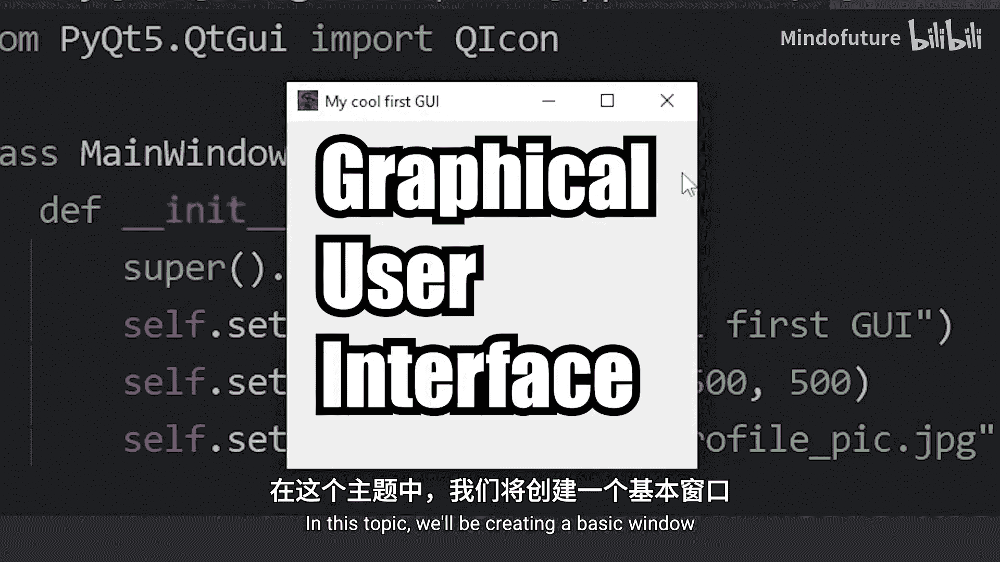
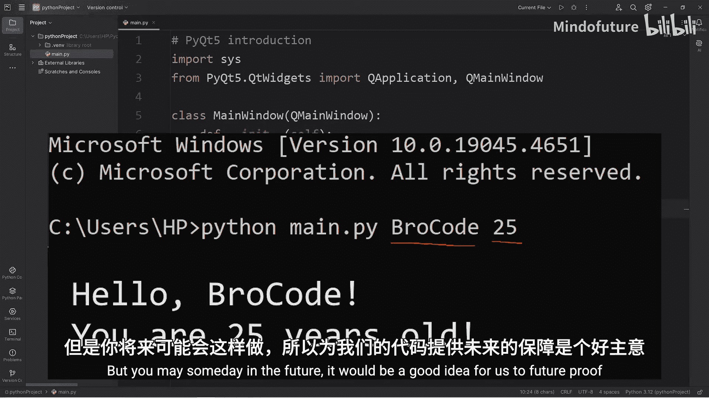
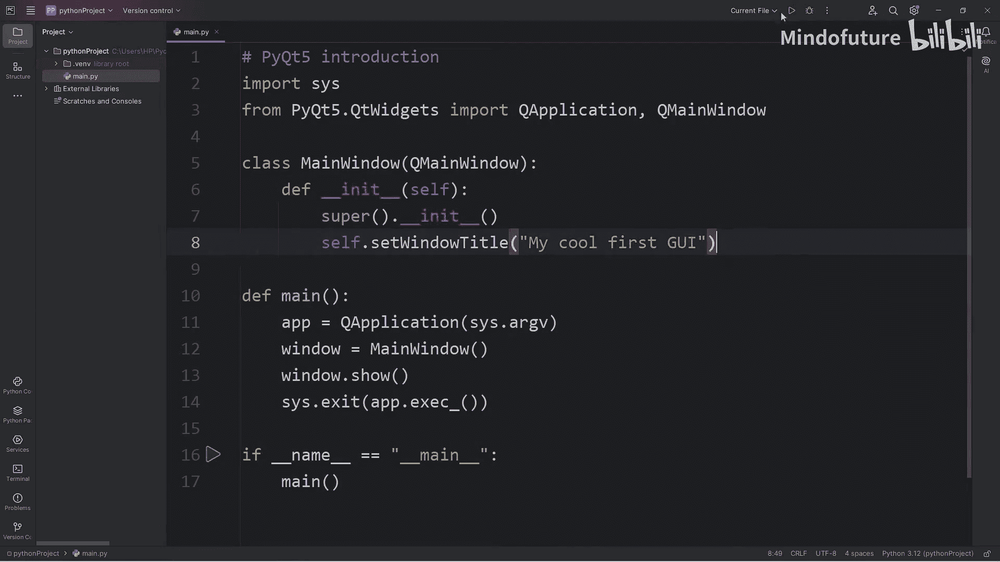
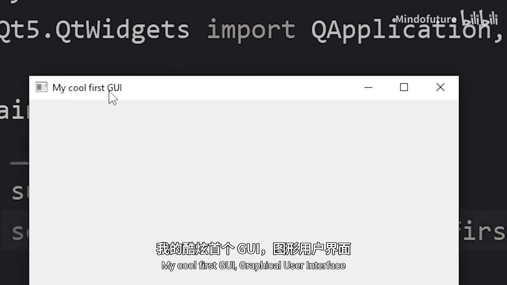
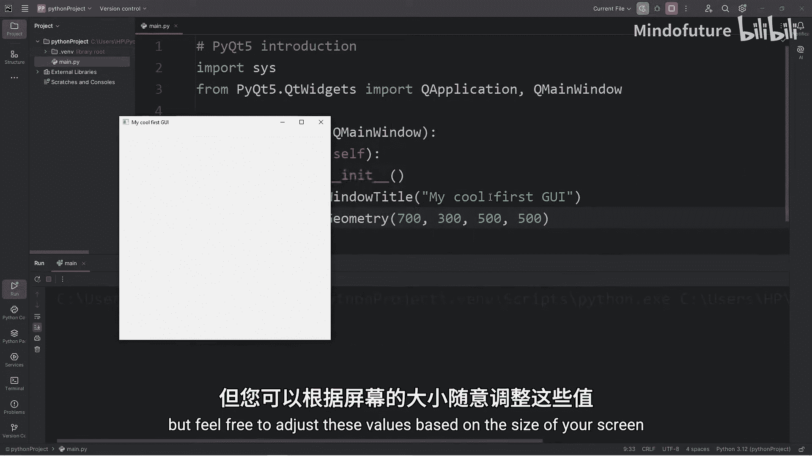
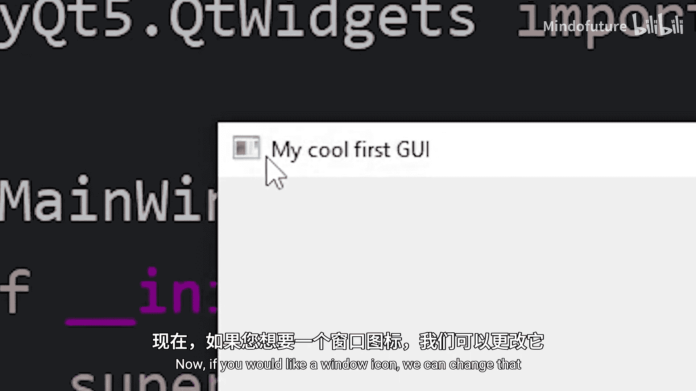
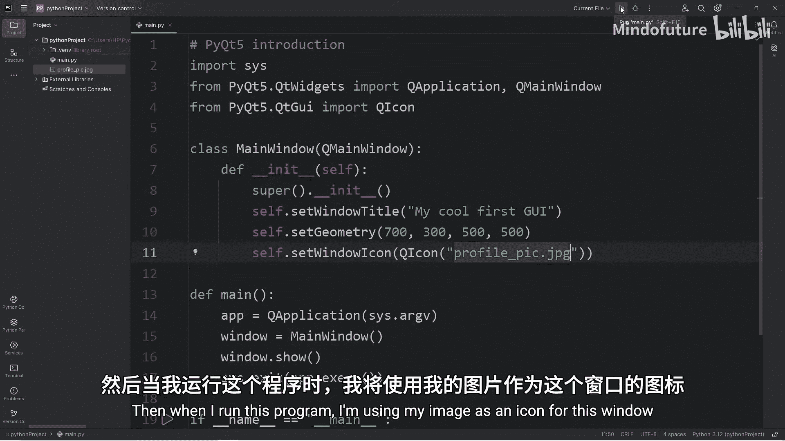
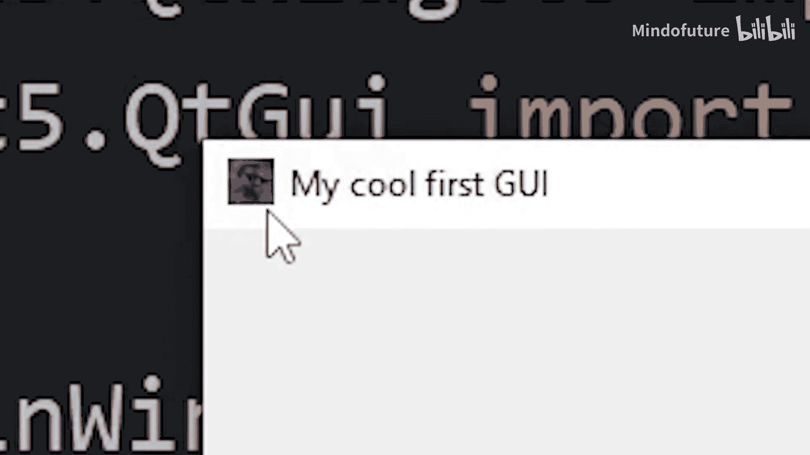
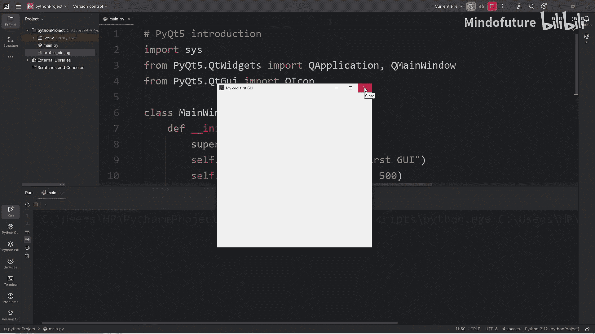

# 078：使用PyQt5搭建基础GUI应用 🖥️

在本节课中，我们将学习如何使用PyQt5库创建一个基础的图形用户界面（GUI）应用程序。我们将从安装PyQt5开始，逐步构建一个带有自定义标题、尺寸和图标的基本窗口。



---

## 概述

PyQt5是一个强大的Python GUI框架，允许我们创建具有丰富功能的桌面应用程序。本节将引导你完成搭建第一个PyQt5窗口的所有必要步骤。

---

## 安装PyQt5包

首先，我们需要安装PyQt5包。我们将使用Python的包管理器Pip来完成这个任务。

以下是安装步骤：
1.  打开终端（Pycharm或VS Code都内置了终端）。
2.  输入命令：`pip install PyQt5`。
3.  等待下载和安装完成。

安装完成后，你的Python环境中的`site-packages`文件夹内将包含PyQt5包，我们可以通过导入来使用它。

---

## 导入必要的模块

要开始编写代码，我们需要导入一些必要的模块。

```python
import sys
from PyQt5.QtWidgets import QApplication, QMainWindow
```

*   `sys`模块提供了对Python解释器使用的变量的访问。
*   从`PyQt5.QtWidgets`模块中，我们导入`QApplication`和`QMainWindow`。`QMainWindow`是创建主窗口的基础类。

---

## 创建主窗口类



上一节我们导入了必要的模块，本节中我们来看看如何创建自定义的主窗口。

我们将创建一个继承自`QMainWindow`的类，这允许我们定制自己的窗口。

```python
class MainWindow(QMainWindow):
    def __init__(self):
        super().__init__()
```

*   我们定义了一个名为`MainWindow`的类，它继承自`QMainWindow`。
*   在类的`__init__`构造函数中，我们调用`super().__init__()`来初始化父类。目前我们没有额外的参数需要传递。

---

## 编写应用程序启动代码

定义了窗口类之后，我们需要编写启动应用程序的代码。

以下是启动PyQt5应用程序的标准流程：
1.  创建一个`QApplication`实例。
2.  创建我们的`MainWindow`实例。
3.  显示窗口。
4.  启动应用程序的事件循环。

```python
def main():
    app = QApplication(sys.argv)
    window = MainWindow()
    window.show()
    sys.exit(app.exec_())

if __name__ == "__main__":
    main()
```

*   `QApplication(sys.argv)`创建应用程序对象，`sys.argv`参数允许PyQt5处理可能存在的命令行参数。
*   `MainWindow()`创建我们的窗口对象。
*   `window.show()`方法将默认隐藏的窗口显示出来。
*   `app.exec_()`方法启动应用程序的事件循环，它会等待用户输入（如点击按钮、按键或关闭窗口）。
*   `sys.exit(app.exec_())`确保程序能够干净地退出。

---





## 自定义窗口属性

现在我们已经有了一个可以运行的基本窗口，接下来让我们对其进行一些自定义设置，比如标题、大小和位置。

在`MainWindow`类的`__init__`方法中，我们可以添加以下代码：

```python
class MainWindow(QMainWindow):
    def __init__(self):
        super().__init__()
        self.setWindowTitle("我的第一个酷炫GUI")
        self.setGeometry(700, 300, 500, 500)
```

*   `self.setWindowTitle("我的第一个酷炫GUI")`：设置窗口的标题。
*   `self.setGeometry(x, y, width, height)`：设置窗口的初始位置和大小。参数依次是：X坐标、Y坐标、宽度、高度。例如，`(700, 300, 500, 500)`表示窗口出现在屏幕坐标(700, 300)的位置，并且宽高均为500像素。

---

## 设置窗口图标

为了让我们的应用程序更具个性化，我们可以为窗口设置一个自定义图标。



首先，需要从`PyQt5.QtGui`模块导入`QIcon`类。



```python
from PyQt5.QtGui import QIcon
```

然后，在`MainWindow`的`__init__`方法中，在设置几何属性之后，添加设置图标的代码：

```python
        self.setWindowIcon(QIcon("profile_p.jpg"))
```

*   `self.setWindowIcon(QIcon("profile_p.jpg"))`：将当前目录下名为`profile_p.jpg`的图片设置为窗口图标。你需要将这里的文件名替换为你自己的图片文件名。

确保你的图片文件与Python脚本文件在同一个目录下，或者提供正确的相对或绝对路径。

---





## 总结



本节课中我们一起学习了如何使用PyQt5创建基础的GUI应用程序。我们完成了从安装PyQt5、导入模块、创建主窗口类、编写应用程序启动代码，到自定义窗口标题、大小、位置和图标的完整流程。你现在已经拥有了一个可以运行和显示的基本窗口，这是构建更复杂GUI应用的第一步。在接下来的课程中，我们将学习如何向这个窗口添加标签、按钮等更多控件。