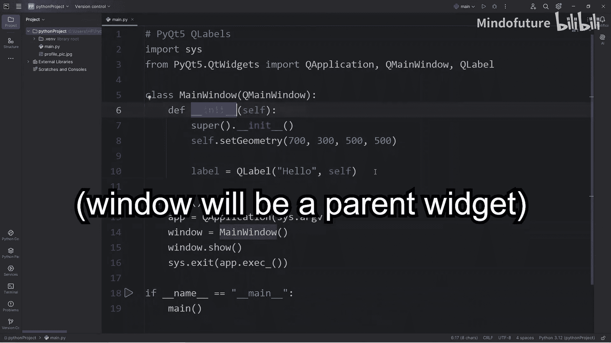
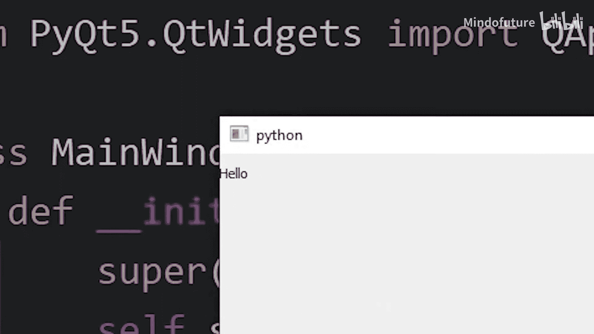
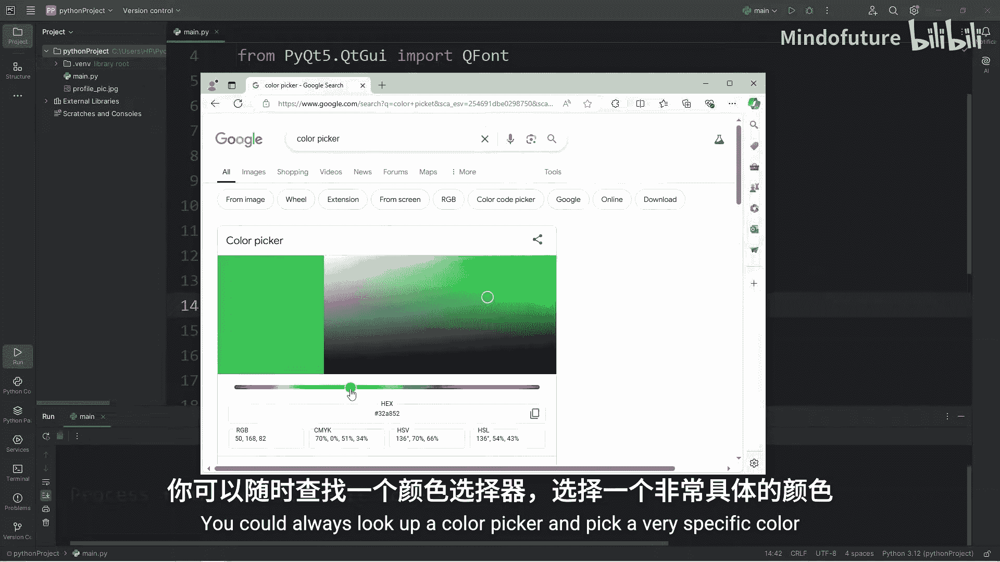
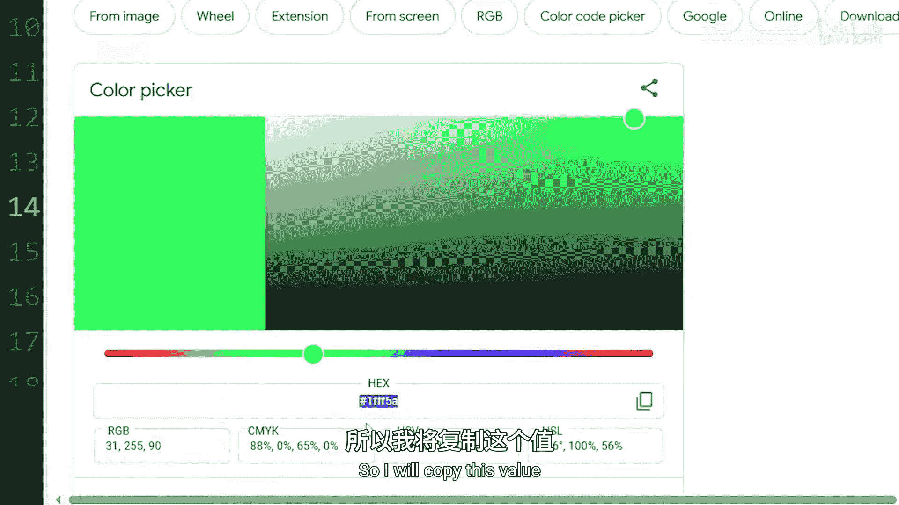
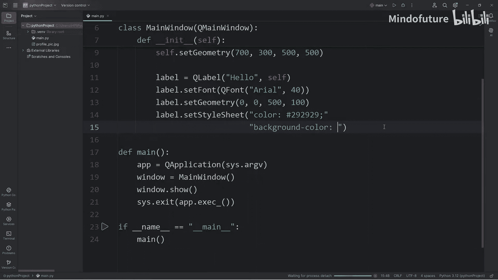
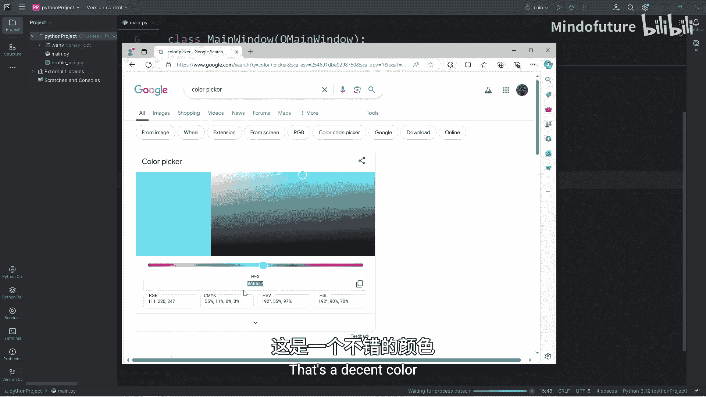
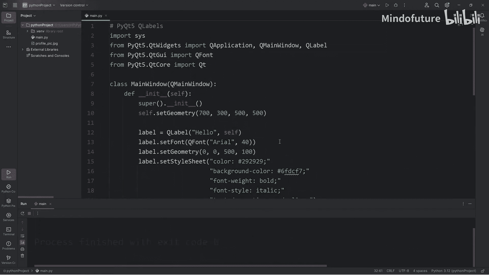

# 079：PyQt5标签控件入门 🏷️

在本节课中，我们将学习如何使用PyQt5创建和自定义标签控件。标签是图形用户界面中用于显示文本或图像的基本元素。我们将从创建一个简单的标签开始，逐步学习如何设置其字体、大小、颜色、背景、样式以及对齐方式。

---

## 导入必要的模块

首先，我们需要导入创建标签所需的PyQt5模块。核心的标签类位于 `QWidget` 模块中。



```python
from PyQt5.QtWidgets import QApplication, QMainWindow, QLabel
```



---

## 创建主窗口和标签

在上一节中，我们导入了必要的模块。本节中，我们来看看如何创建主窗口并在其中添加一个标签。

我们将在主窗口的构造函数中创建标签。首先，声明一个 `QLabel` 对象，并传入要显示的文本作为第一个参数。第二个参数 `self` 表示当前的主窗口对象。

```python
class MyWindow(QMainWindow):
    def __init__(self):
        super().__init__()
        self.setGeometry(100, 100, 800, 600)  # 设置窗口位置和大小

        # 创建一个标签
        self.label = QLabel("Hello", self)
```

运行程序后，你会看到一个显示“Hello”的标签，但字体可能非常小。

---

## 设置标签字体

为了让标签文本更清晰，我们需要设置字体。这需要导入 `QFont` 类。

```python
from PyQt5.QtGui import QFont
```

以下是设置标签字体的步骤：
1.  调用标签的 `setFont` 方法。
2.  在方法中创建一个 `QFont` 对象，指定字体名称和大小。

```python
        # 设置字体
        font = QFont("Arial", 40)
        self.label.setFont(font)
```



设置后，标签文本将使用指定的字体和大小显示。

---



## 设置标签几何属性

接下来，我们调整标签在窗口中的位置和尺寸。使用 `setGeometry` 方法可以设置标签的X坐标、Y坐标、宽度和高度。



```python
        # 设置标签的位置和大小 (x, y, width, height)
        self.label.setGeometry(0, 0, 500, 100)
```



现在，标签位于窗口左上角，宽度为500像素，高度为100像素。

---

## 使用样式表美化标签

PyQt5支持类似CSS的样式表，可以方便地设置控件的外观。我们将为标签添加颜色、背景等样式。

以下是可用的样式属性示例：
*   **颜色**：使用 `color` 属性设置文本颜色，值可以是颜色名、RGB值或十六进制值。
*   **背景色**：使用 `background-color` 属性设置背景颜色。
*   **字体粗细**：使用 `font-weight` 属性设置字体为粗体。
*   **字体样式**：使用 `font-style` 属性设置字体为斜体。
*   **文本装饰**：使用 `text-decoration` 属性为文本添加下划线。

```python
        # 设置样式表
        self.label.setStyleSheet("""
            color: #333333;                /* 深灰色文本 */
            background-color: #87CEEB;     /* 浅蓝色背景 */
            font-weight: bold;             /* 粗体 */
            font-style: italic;            /* 斜体 */
            text-decoration: underline;    /* 下划线 */
        """)
```

应用样式表后，标签将具有自定义的颜色和样式。

---

## 设置标签文本对齐方式

为了精确控制文本在标签区域内的位置，我们需要设置对齐方式。这需要导入 `Qt` 模块，它包含了对齐标志。

```python
from PyQt5.QtCore import Qt
```

`setAlignment` 方法用于设置对齐方式。你可以使用 `Qt` 类中的标志来指定水平和垂直对齐。

以下是基本的对齐操作：
*   **垂直对齐**：
    *   `Qt.AlignTop`：顶部对齐
    *   `Qt.AlignBottom`：底部对齐
    *   `Qt.AlignVCenter`：垂直居中（默认）
*   **水平对齐**：
    *   `Qt.AlignLeft`：左对齐（默认）
    *   `Qt.AlignRight`：右对齐
    *   `Qt.AlignHCenter`：水平居中

```python
        # 垂直顶部对齐
        self.label.setAlignment(Qt.AlignTop)
        # 水平居中对齐
        self.label.setAlignment(Qt.AlignHCenter)
```

要同时设置水平和垂直对齐，可以使用按位或运算符 `|` 来组合标志。

```python
        # 同时设置水平居中和垂直顶部对齐
        self.label.setAlignment(Qt.AlignHCenter | Qt.AlignTop)
```

此外，`Qt.AlignCenter` 是同时实现水平和垂直居中的快捷方式。

```python
        # 文本在标签区域内完全居中（水平+垂直）
        self.label.setAlignment(Qt.AlignCenter)
```

---

## 课程总结 🎯



本节课中我们一起学习了PyQt5标签控件的基础知识。我们从创建最简单的文本标签开始，然后逐步学会了如何通过设置字体、调整几何尺寸、应用CSS-like样式表以及控制文本对齐方式来全方位地自定义标签的外观。掌握这些技能是构建更复杂、更美观的PyQt5图形界面的重要第一步。