# 081：PyQt5布局管理器详解 🧩

在本节课中，我们将要学习PyQt5中的布局管理器。布局管理器是用于自动排列窗口内控件（如按钮、标签）的工具，它能帮助我们创建整洁、响应式的用户界面，而无需手动计算每个控件的位置。

我们将讨论三种主要的布局管理器：垂直布局、水平布局和网格布局。为了保持代码的整洁和可维护性，我们还会学习一种常见的代码组织方法。

---

## 导入必要的模块

首先，我们需要导入PyQt5中用于创建布局和控件的相关类。以下是所需的导入语句：

```python
from PyQt5.QtWidgets import QLabel, QWidget, QVBoxLayout, QHBoxLayout, QGridLayout
```

*   `QLabel`：用于创建文本或图像标签。
*   `QWidget`：一个通用的窗口控件，可以作为其他控件的容器。
*   `QVBoxLayout`：垂直布局管理器。
*   `QHBoxLayout`：水平布局管理器。
*   `QGridLayout`：网格布局管理器。

---

## 组织代码：初始化用户界面函数

在PyQt5编程中，一个常见的良好实践是将所有与用户界面设置相关的代码集中在一个单独的函数中。这有助于保持主窗口类的代码清晰有序。

我们将在主窗口类中定义一个名为 `initUI` 的函数：

```python
def initUI(self):
    # 所有UI初始化代码将写在这里
    pass
```

当创建窗口对象后，我们会调用 `self.initUI()` 来初始化界面。

---

## 理解中央控件

`QMainWindow` 主窗口对象有特定的设计结构，不能直接设置布局管理器。我们需要一个中间步骤：

1.  创建一个通用的 `QWidget` 作为**中央控件**。
2.  将布局管理器设置给这个中央控件。
3.  最后，将这个中央控件设置为主窗口的中央部件。

以下是实现代码：

```python
def initUI(self):
    # 1. 创建中央控件
    central_widget = QWidget()
    # 2. 将中央控件设置给主窗口
    self.setCentralWidget(central_widget)
    # 后续的布局和控件都将添加到这个 central_widget 上
```

---

## 创建示例控件

为了演示布局的效果，我们需要一些控件。让我们创建五个带有不同背景颜色的标签：

```python
# 创建五个标签
label1 = QLabel(“标签 1”)
label1.setStyleSheet(“background-color: red;”)

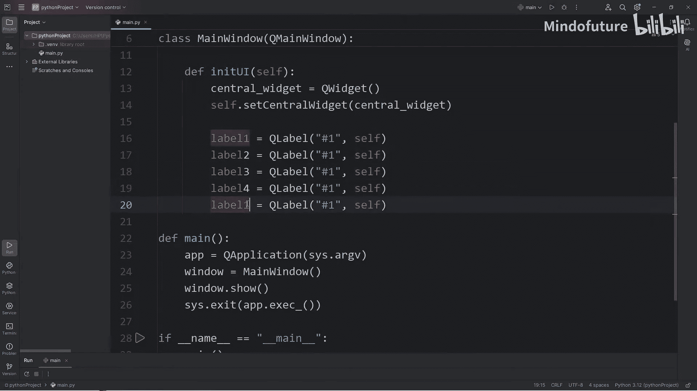

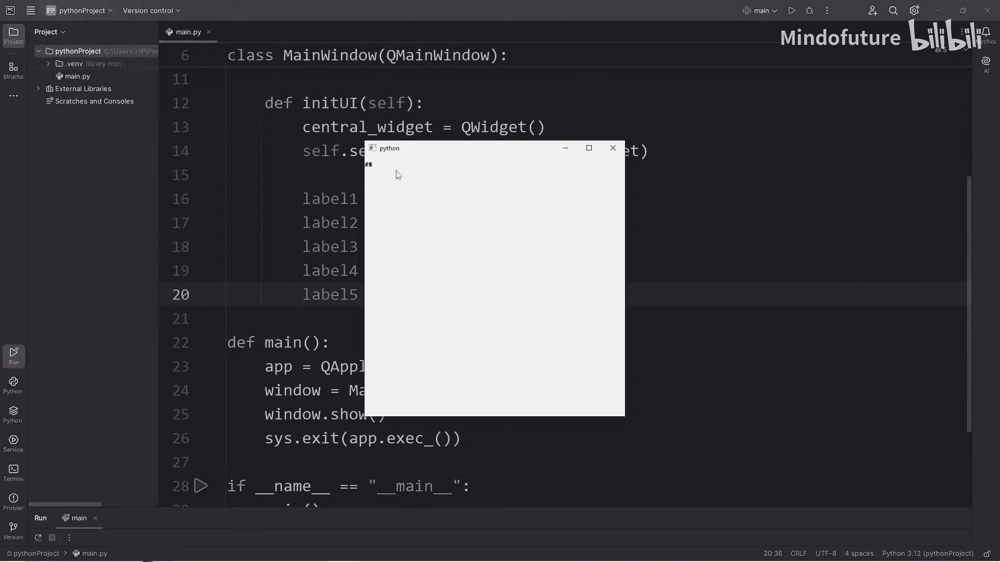

label2 = QLabel(“标签 2”)
label2.setStyleSheet(“background-color: yellow;”)

label3 = QLabel(“标签 3”)
label3.setStyleSheet(“background-color: green;”)

label4 = QLabel(“标签 4”)
label4.setStyleSheet(“background-color: blue;”)

label5 = QLabel(“标签 5”)
label5.setStyleSheet(“background-color: purple;”)
```

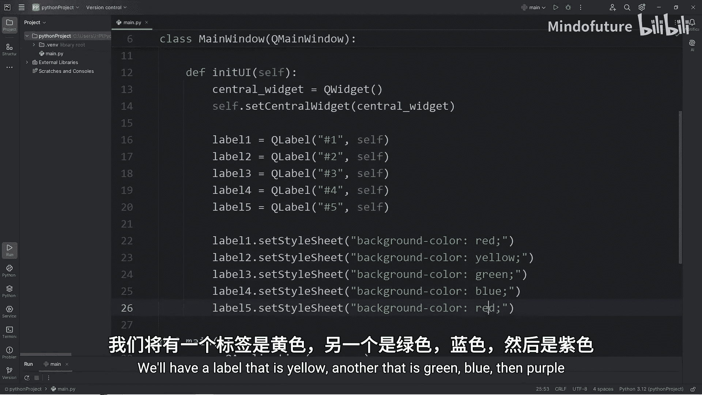

如果不使用布局管理器，这些标签会相互重叠，只能看到最上面的一个。

---

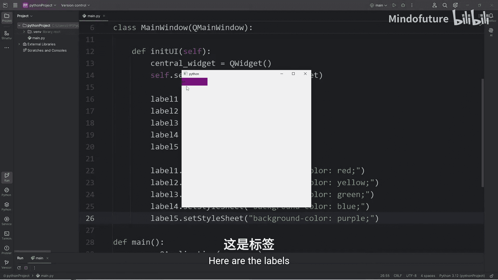

## 使用垂直布局管理器 📏

上一节我们创建了控件，本节中我们来看看如何使用垂直布局管理器将它们有序排列。

垂直布局会将控件从上到下依次排列。

以下是使用垂直布局的步骤：

1.  创建 `QVBoxLayout` 对象。
2.  使用 `addWidget()` 方法将控件逐个添加到布局中。
3.  将这个布局设置给之前创建的中央控件。

```python
# 创建垂直布局
v_layout = QVBoxLayout()
# 将标签添加到布局中
v_layout.addWidget(label1)
v_layout.addWidget(label2)
v_layout.addWidget(label3)
v_layout.addWidget(label4)
v_layout.addWidget(label5)
# 将布局设置给中央控件
central_widget.setLayout(v_layout)
```

执行后，五个标签将垂直排列。

---

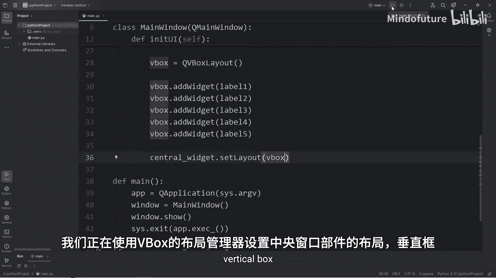

## 使用水平布局管理器 ↔️

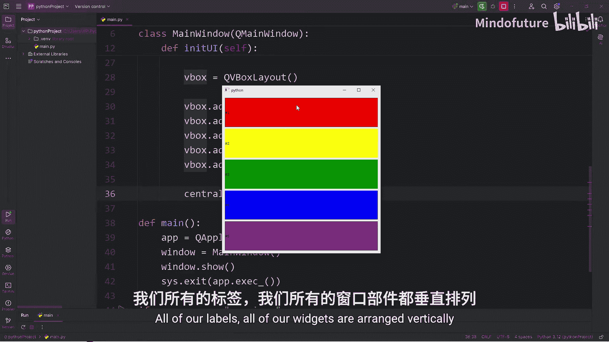

理解了垂直布局后，水平布局就很容易掌握了。它的逻辑相同，只是排列方向变为从左到右。

只需将 `QVBoxLayout` 替换为 `QHBoxLayout`：

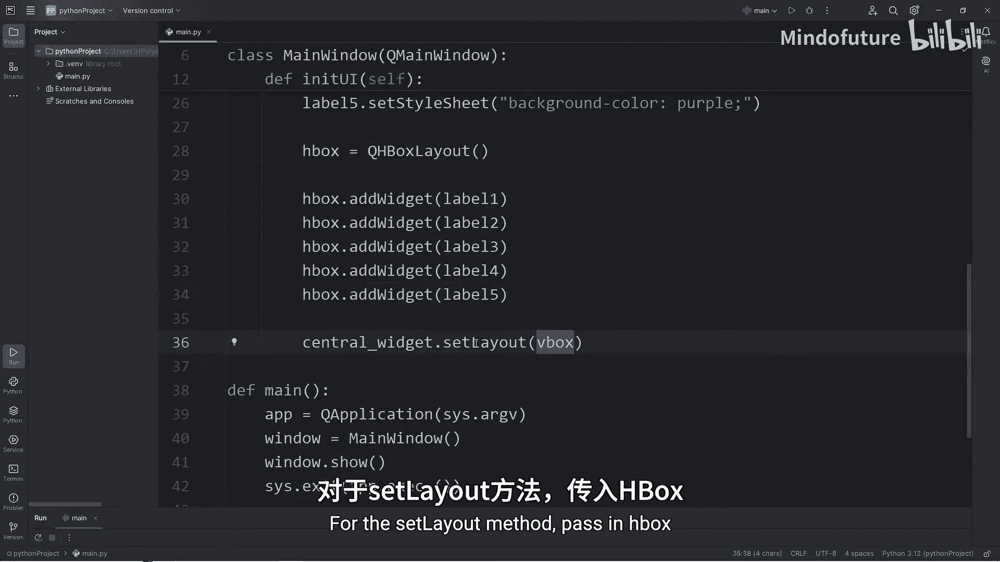

```python
# 创建水平布局
h_layout = QHBoxLayout()
h_layout.addWidget(label1)
h_layout.addWidget(label2)
h_layout.addWidget(label3)
h_layout.addWidget(label4)
h_layout.addWidget(label5)
central_widget.setLayout(h_layout)
```

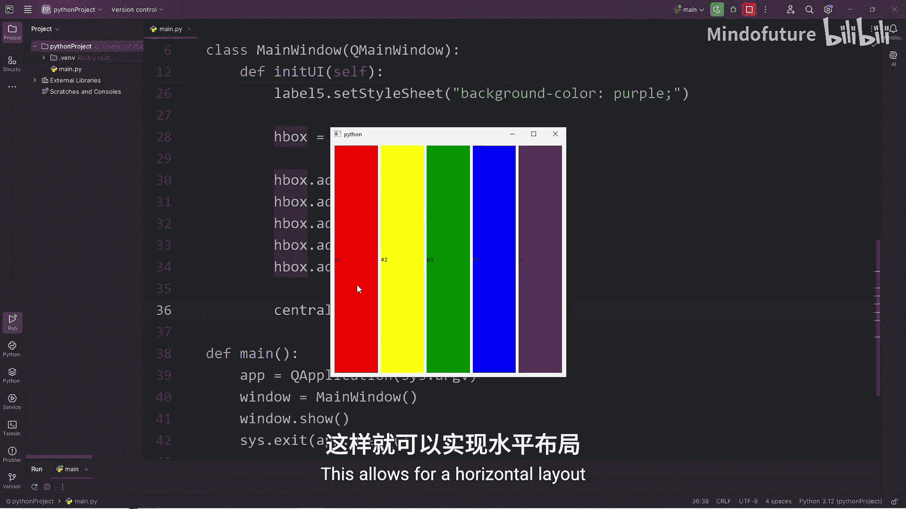

现在，五个标签将水平排列。

---

## 使用网格布局管理器 🔲

对于更复杂的界面，我们需要网格布局。它允许我们将控件放置在一个由行和列组成的网格中。

使用 `QGridLayout` 时，在添加控件时需要额外指定该控件所在的行和列索引（索引从0开始）。

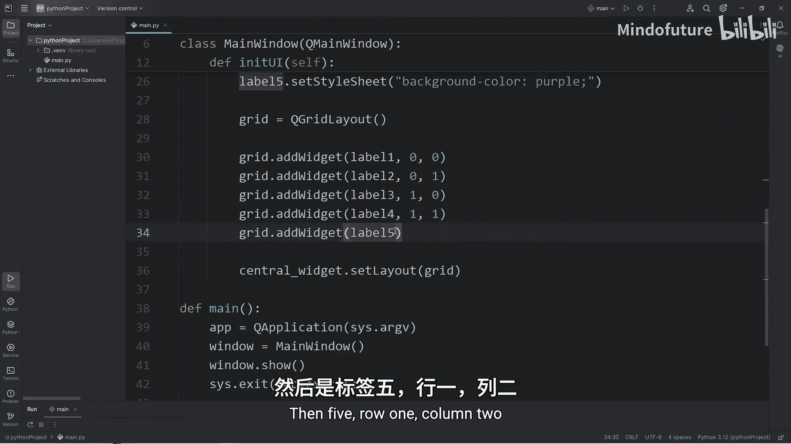

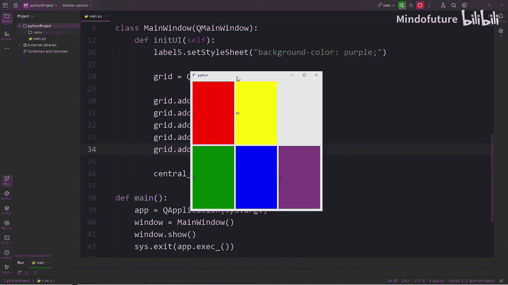

以下是使用网格布局的示例：

```python
# 创建网格布局
grid_layout = QGridLayout()
# 添加控件，并指定位置 (行, 列)
grid_layout.addWidget(label1, 0, 0) # 第0行，第0列
grid_layout.addWidget(label2, 0, 1) # 第0行，第1列
grid_layout.addWidget(label3, 1, 0) # 第1行，第0列
grid_layout.addWidget(label4, 1, 1) # 第1行，第1列
grid_layout.addWidget(label5, 1, 2) # 第1行，第2列
central_widget.setLayout(grid_layout)
```

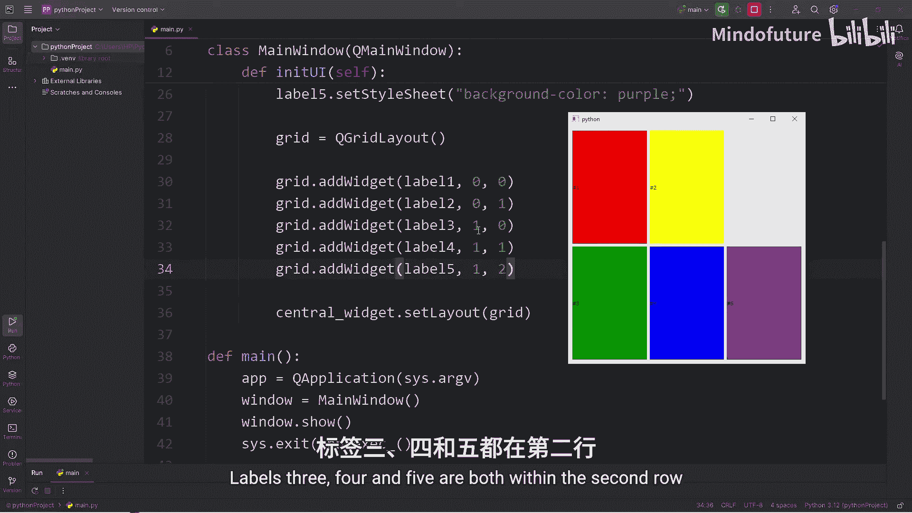

通过调整行和列的索引，你可以自由地控制每个控件在窗口中的位置。

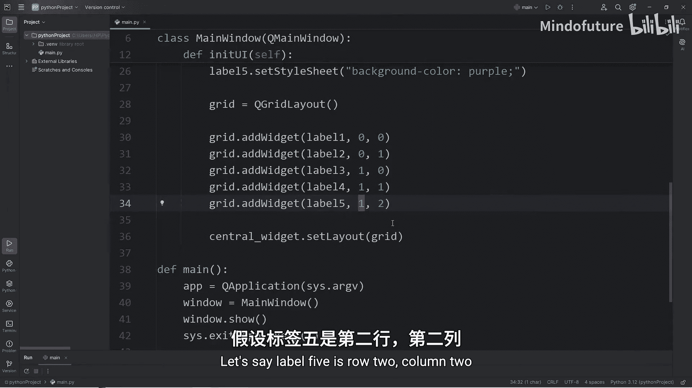

---

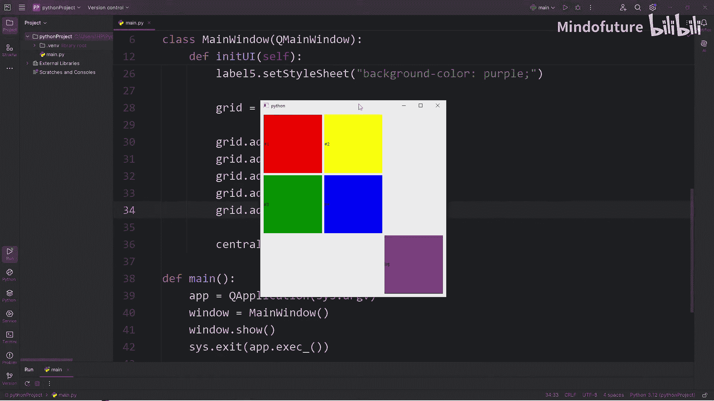

## 总结

本节课中我们一起学习了PyQt5中三种核心的布局管理器：

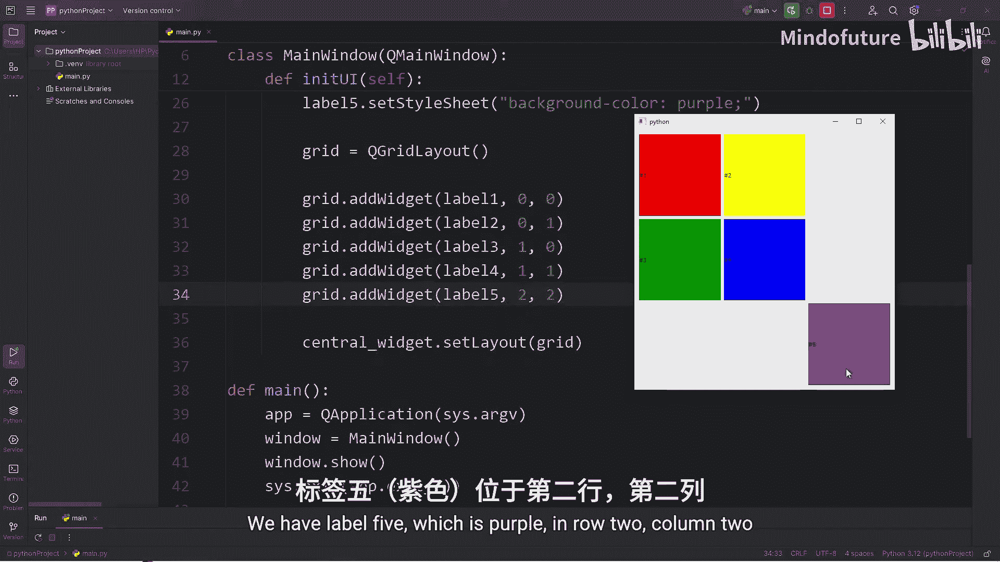

1.  **垂直布局 (`QVBoxLayout`)**：用于将控件从上到下排列。
2.  **水平布局 (`QHBoxLayout`)**：用于将控件从左到右排列。
3.  **网格布局 (`QGridLayout`)**：用于将控件放入一个灵活的网格中，通过行和列索引精确定位。

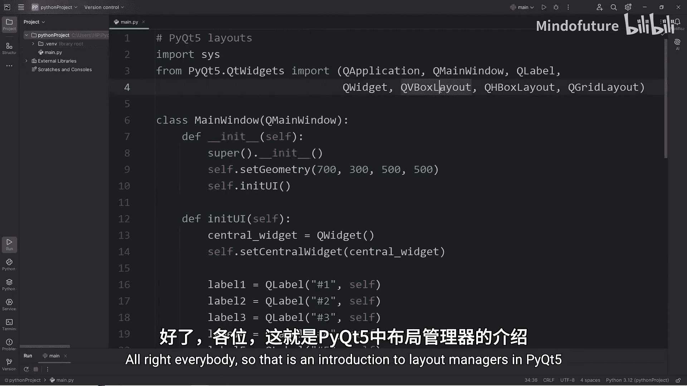

我们还学习了通过创建 `initUI` 函数来组织UI代码，以及理解 `QMainWindow` 需要通过中央控件 (`QWidget`) 来使用布局管理器这一重要概念。掌握这些布局工具是构建结构清晰、美观的PyQt5应用程序的基础。