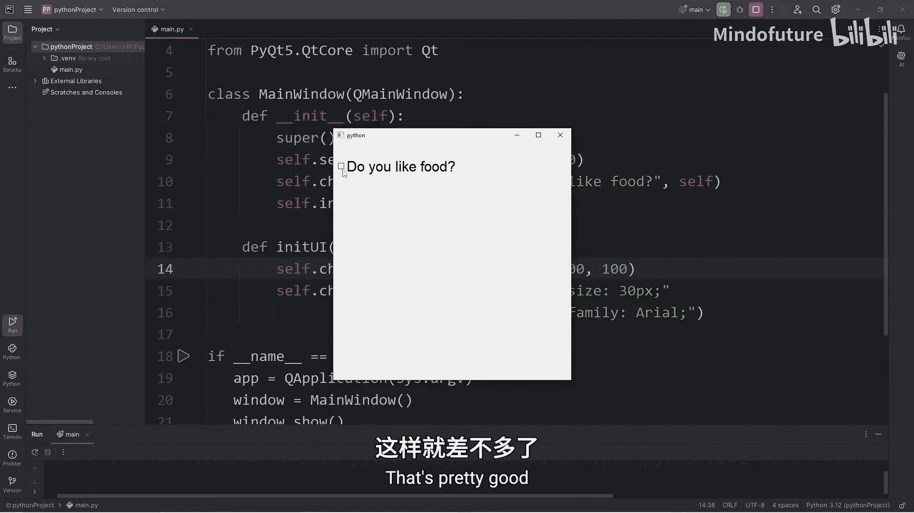
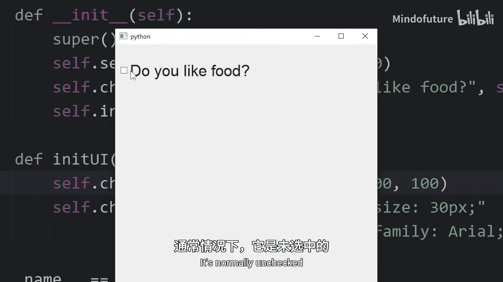
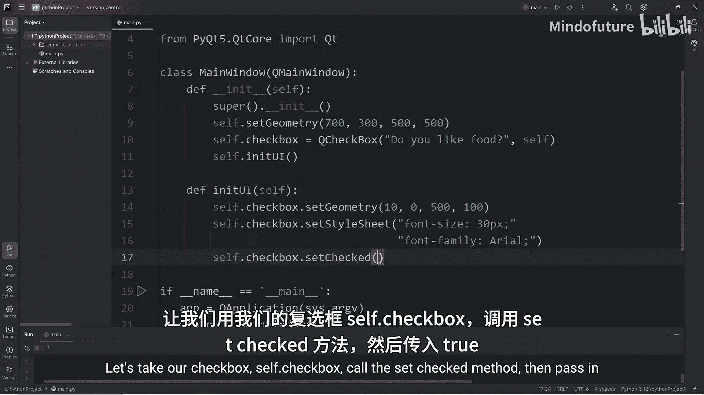
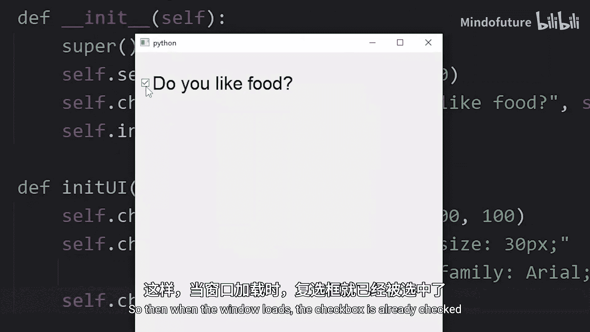
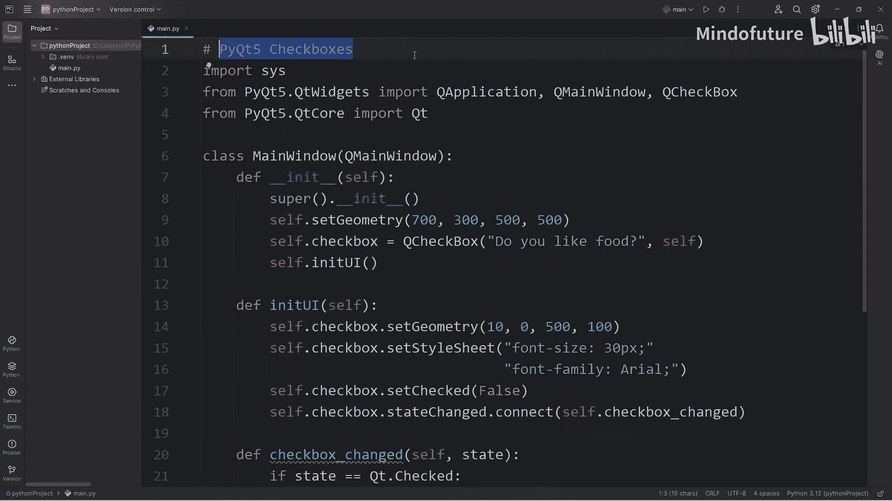

# 083：PyQt5复选框使用指南 🎯

在本节课中，我们将学习如何在PyQt5中使用复选框（Checkbox）控件。我们将从创建复选框开始，逐步学习如何设置其样式、初始状态，以及如何为其添加交互功能。

## 导入必要模块

要使用复选框，首先需要导入相关的模块。以下是必需的导入语句：

```python
from PyQt5.QtWidgets import QCheckBox
from PyQt5.QtCore import Qt
```

`QCheckBox`类用于创建复选框控件。`Qt`模块包含了许多非GUI相关的核心类，其中定义了一些有用的常量，例如表示复选框状态的`Qt.Checked`。

## 创建复选框

上一节我们介绍了必要的导入，本节中我们来看看如何在主窗口的构造函数中创建一个复选框。

```python
self.checkbox = QCheckBox("你喜欢食物吗？", self)
```

以上代码创建了一个文本为“你喜欢食物吗？”的复选框，并将其父窗口设置为当前窗口（`self`）。第一个参数是复选框显示的文本，第二个参数是其父控件。

## 设置样式与几何属性



创建复选框后，我们可能希望调整其外观和位置。以下是设置样式和几何属性的方法：

```python
self.checkbox.setStyleSheet("font-size: 30px; font-family: Arial;")
self.checkbox.setGeometry(10, 10, 500, 100)
```



`setStyleSheet`方法允许我们使用类似CSS的语法来设置控件样式，例如字体大小和字体族。`setGeometry`方法用于设置控件的位置和大小，参数依次为x坐标、y坐标、宽度和高度。





## 设置初始状态

默认情况下，复选框处于未选中状态。我们可以通过编程方式设置其初始状态。

```python
self.checkbox.setChecked(True)  # 设置为选中状态
self.checkbox.setChecked(False) # 设置为未选中状态
```

调用`setChecked`方法并传入`True`或`False`，可以分别在窗口加载时将复选框设置为选中或未选中状态。

## 添加交互功能

目前复选框还没有任何交互功能。我们需要将复选框的状态变化信号连接到一个槽函数上，以实现交互。

首先，在主窗口类中定义一个方法作为槽函数：

```python
def checkbox_changed(self, state):
    if state == Qt.Checked:
        print("你喜欢食物。")
    else:
        print("你不喜欢食物。")
```

然后，将复选框的`stateChanged`信号连接到这个槽函数：

```python
self.checkbox.stateChanged.connect(self.checkbox_changed)
```

当用户点击复选框时，`stateChanged`信号会被触发，并调用`checkbox_changed`方法。该方法的`state`参数会接收复选框的当前状态值。

## 理解状态值

在槽函数中，我们通过判断`state`参数的值来执行不同的操作。复选框的状态值如下：

*   **0 (`Qt.Unchecked`)**: 表示复选框未选中。
*   **2 (`Qt.Checked`)**: 表示复选框已选中。
*   **1 (`Qt.PartiallyChecked`)**: 表示部分选中状态（通常用于三态复选框，本课不涉及）。

在代码中直接使用数字（如2）不够直观。使用`Qt.Checked`和`Qt.Unchecked`这些常量会使代码更易读、更易维护。



本节课中我们一起学习了PyQt5中复选框的基本用法。我们掌握了如何创建复选框、设置其样式和位置、控制其初始状态，以及最重要的——如何通过信号与槽机制为其添加交互逻辑，从而根据用户的选择执行不同的操作。