# 084：PyQt5单选按钮教程 🎛️

在本节课中，我们将学习如何在PyQt5中使用单选按钮（Radio Buttons）。我们将涵盖如何创建单选按钮、如何将它们分组，以及如何响应用户的选择。

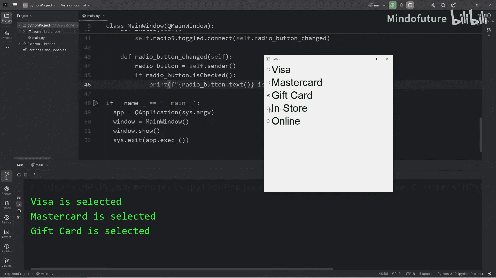

---

## 导入必要的模块

首先，我们需要从PyQt5的QtWidgets模块中导入必要的类。

```python
from PyQt5.QtWidgets import QRadioButton, QButtonGroup
```

`QRadioButton` 类用于创建单选按钮，而 `QButtonGroup` 类用于将多个单选按钮组合在一起，确保同一时间只能选择组内的一个选项。

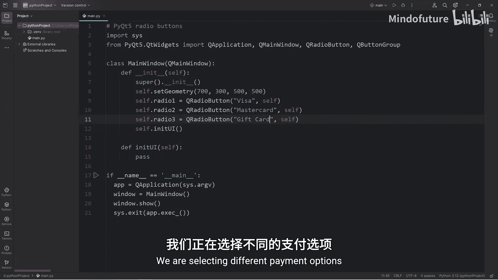

---

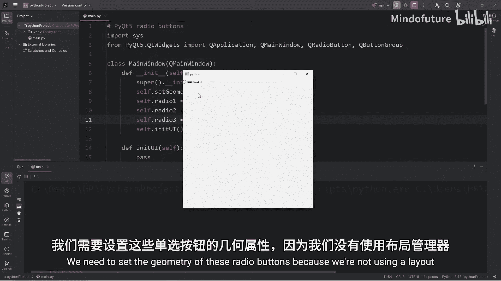

## 创建单选按钮

在窗口的构造函数中，我们将创建三个单选按钮，代表不同的支付方式。

```python
self.radio1 = QRadioButton("Visa", self)
self.radio2 = QRadioButton("Mastercard", self)
self.radio3 = QRadioButton("Gift Card", self)
```

以上代码创建了三个单选按钮，分别对应Visa、Mastercard和Gift Card三种支付选项。

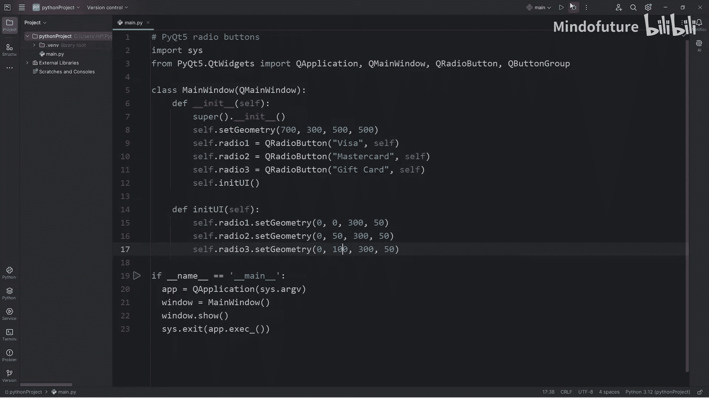

---

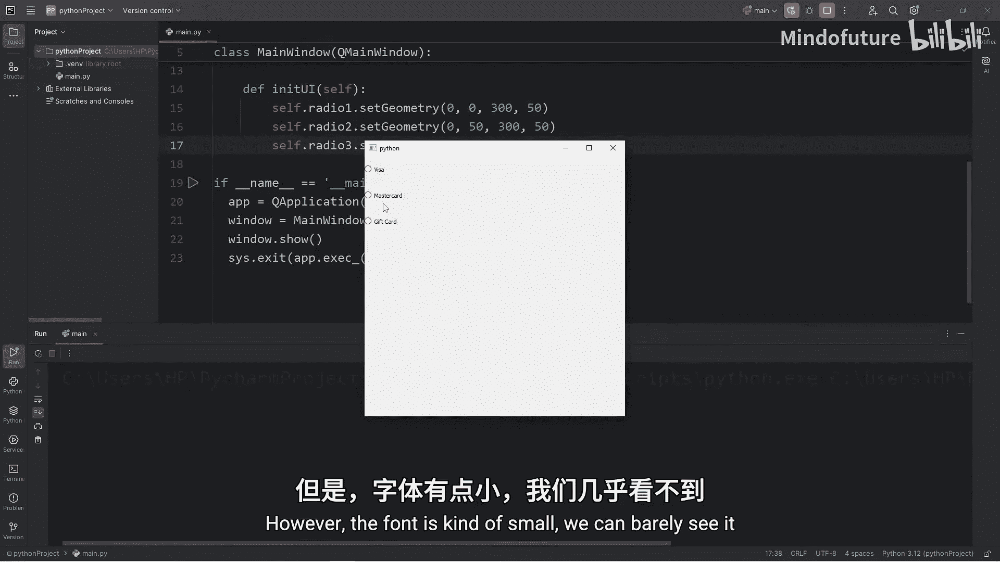

## 设置单选按钮的位置

由于我们没有使用布局管理器，需要手动设置每个单选按钮的位置和大小。

```python
self.radio1.setGeometry(0, 0, 300, 50)
self.radio2.setGeometry(0, 50, 300, 50)
self.radio3.setGeometry(0, 100, 300, 50)
```

这里，我们使用 `setGeometry` 方法设置每个按钮的坐标和尺寸。Y坐标依次增加50像素，使按钮垂直排列。

---

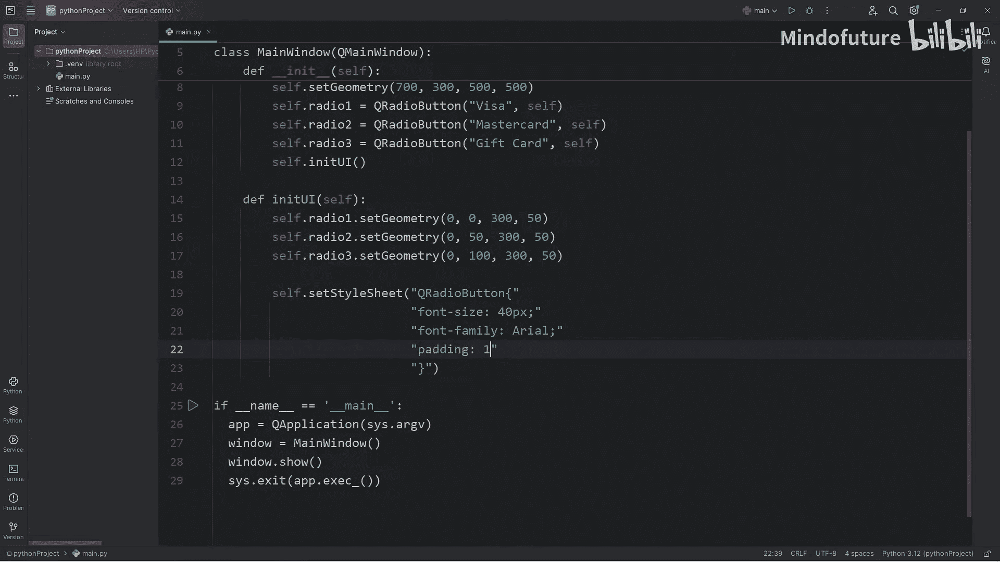

## 应用样式表

默认的字体可能较小，我们可以使用样式表来统一设置所有单选按钮的样式。

```python
self.setStyleSheet("""
    QRadioButton {
        font-size: 40px;
        font-family: Arial;
        padding: 10px;
    }
""")
```

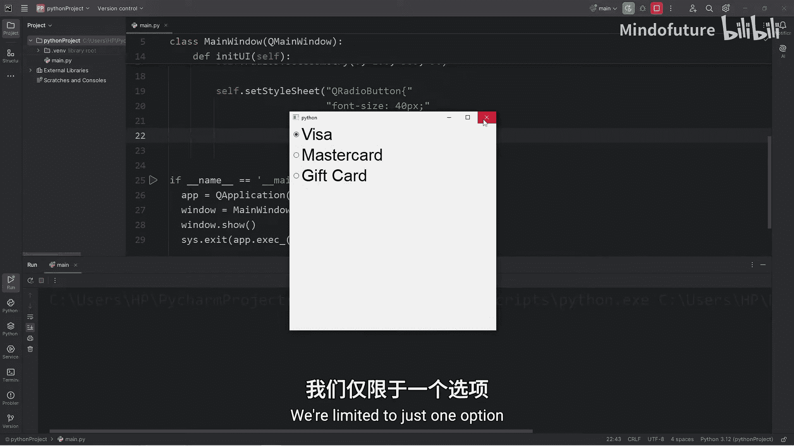

这段代码将窗口内所有 `QRadioButton` 的字体大小设置为40像素，字体为Arial，并添加10像素的内边距。

---

## 理解单选按钮分组

默认情况下，所有单选按钮都属于同一个组，这意味着只能同时选中一个。但在实际应用中，我们可能需要多个独立的选项组。

例如，除了支付方式，我们可能还需要选择支付场景（店内支付或在线支付）。为此，我们创建另外两个单选按钮。

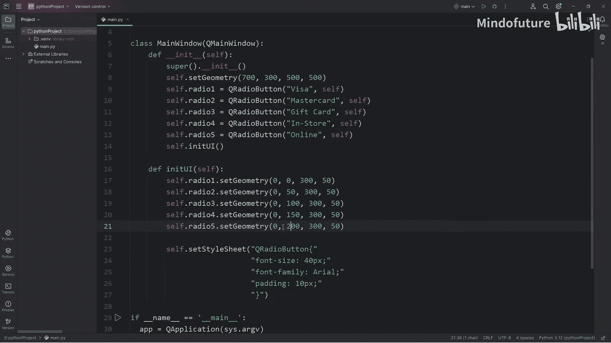

```python
self.radio4 = QRadioButton("In Store", self)
self.radio5 = QRadioButton("Online", self)
self.radio4.setGeometry(0, 150, 300, 50)
self.radio5.setGeometry(0, 200, 300, 50)
```

现在，我们有五个单选按钮，但前三个（支付方式）和后两个（支付场景）在逻辑上应该属于不同的组。

---

## 创建按钮组

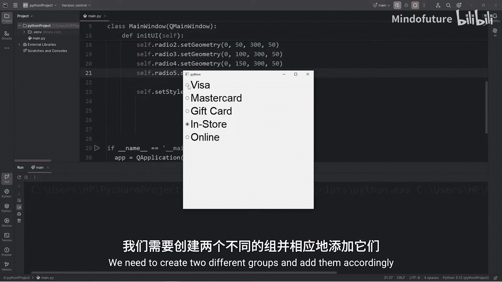

为了实现独立的分组，我们需要使用 `QButtonGroup` 类。

```python
self.button_group1 = QButtonGroup(self)
self.button_group2 = QButtonGroup(self)

self.button_group1.addButton(self.radio1)
self.button_group1.addButton(self.radio2)
self.button_group1.addButton(self.radio3)

self.button_group2.addButton(self.radio4)
self.button_group2.addButton(self.radio5)
```

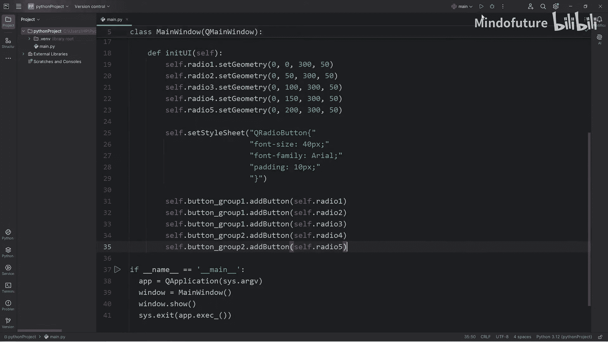

这样，`radio1`、`radio2` 和 `radio3` 属于 `button_group1`，而 `radio4` 和 `radio5` 属于 `button_group2`。用户可以在每个组内独立选择一个选项。

---

## 连接信号与槽

为了让单选按钮在用户选择时执行某些操作，我们需要将它们的 `toggled` 信号连接到一个自定义的槽函数。

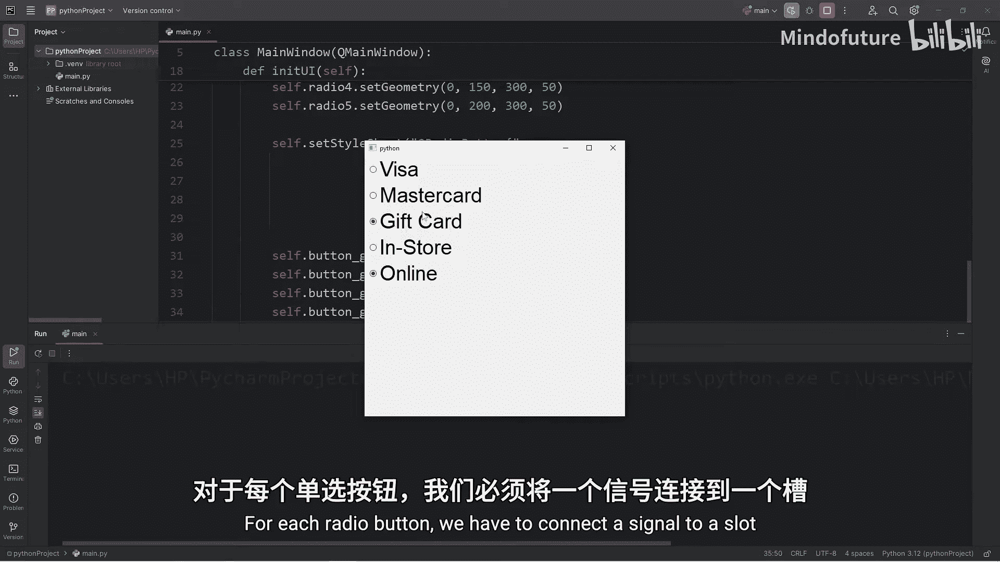

首先，定义一个槽函数。

```python
def radio_button_changed(self):
    pass  # 暂时留空
```

然后，将每个单选按钮的 `toggled` 信号连接到这个槽函数。

```python
self.radio1.toggled.connect(self.radio_button_changed)
self.radio2.toggled.connect(self.radio_button_changed)
self.radio3.toggled.connect(self.radio_button_changed)
self.radio4.toggled.connect(self.radio_button_changed)
self.radio5.toggled.connect(self.radio_button_changed)
```

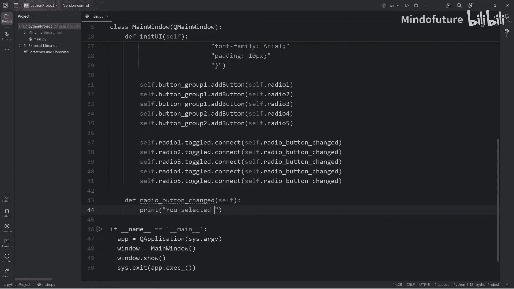

---

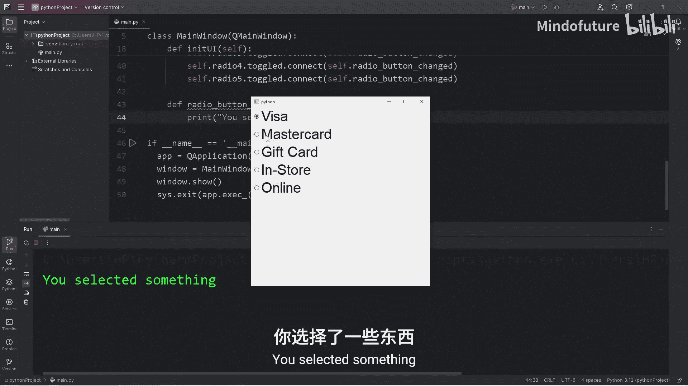

## 确定被选中的按钮

在槽函数中，我们需要确定是哪个单选按钮发出了信号，以及它是否被选中。

```python
def radio_button_changed(self):
    radio_button = self.sender()  # 获取发出信号的按钮
    if radio_button.isChecked():  # 检查按钮是否被选中
        print(f"{radio_button.text()} is selected")
```

`self.sender()` 方法返回发出信号的控件对象。`isChecked()` 方法返回一个布尔值，表示按钮是否被选中。通过 `text()` 方法可以获取按钮上显示的文本。

---

## 测试功能

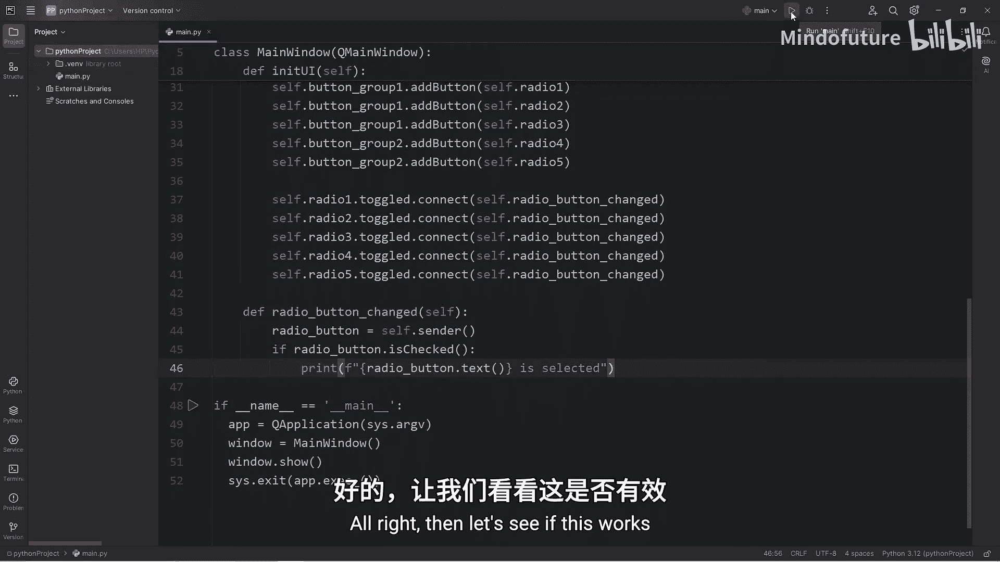

运行程序，点击不同的单选按钮，控制台将输出相应的选择信息。例如，选择“Visa”和“In Store”会分别打印：
```
Visa is selected
In Store is selected
```

---

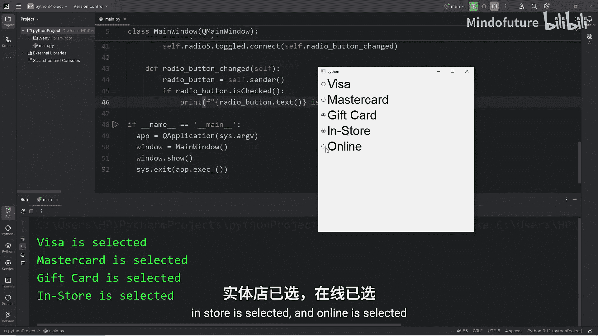

## 总结

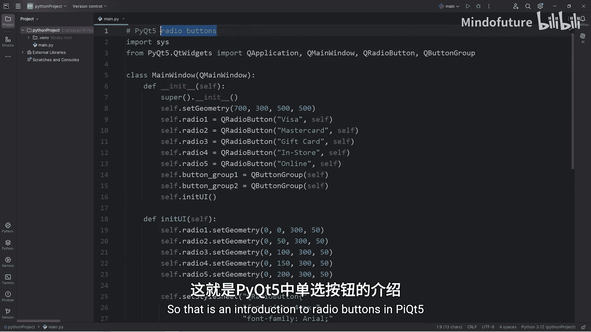

本节课中，我们一起学习了PyQt5中单选按钮的基本用法。我们掌握了如何创建和定位单选按钮，如何使用样式表美化界面，以及如何通过 `QButtonGroup` 实现独立的分组逻辑。最后，我们学习了如何连接信号与槽来响应用户的选择，并获取被选中按钮的信息。这些知识是构建交互式GUI应用程序的基础。