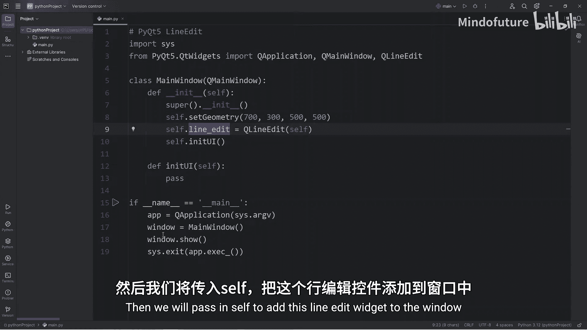
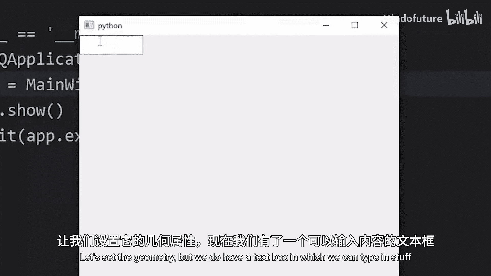
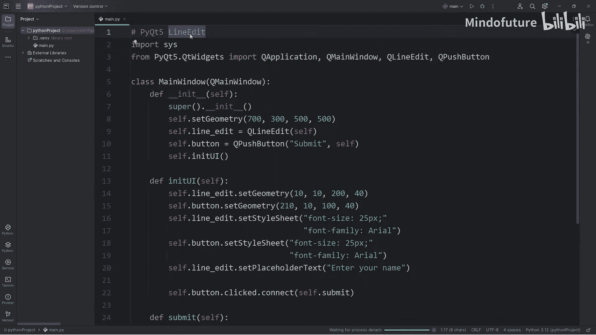

# 085：PyQt5中的单行文本输入框

在本节课中，我们将学习如何在PyQt5中创建和使用单行文本输入框，即`QLineEdit`部件。我们将学习如何创建它、设置其样式、获取用户输入的文本，并将其与按钮点击事件结合，实现一个简单的交互功能。

## 导入模块与创建窗口

首先，我们需要从`PyQt5.QtWidgets`模块中导入必要的类，包括`QApplication`、`QMainWindow`、`QLineEdit`和`QPushButton`。我们将创建一个主窗口类，并在其中初始化用户界面。





```python
from PyQt5.QtWidgets import QApplication, QMainWindow, QLineEdit, QPushButton
import sys

class MyWindow(QMainWindow):
    def __init__(self):
        super().__init__()
        self.initUI()

    def initUI(self):
        # 设置窗口标题和初始大小
        self.setWindowTitle('Line Edit 示例')
        self.setGeometry(100, 100, 400, 200)
```

## 创建单行文本输入框

上一节我们介绍了窗口的创建，本节中我们来看看如何添加一个单行文本输入框。在`initUI`方法中，我们创建一个`QLineEdit`实例，并将其添加到窗口中。

```python
        # 创建一个单行文本输入框
        self.line_edit = QLineEdit(self)
        self.line_edit.setGeometry(10, 10, 200, 40)
```

## 设置输入框样式

创建输入框后，其默认字体可能较小。我们可以使用样式表（StyleSheet）来调整其外观，例如增大字体和更改字体族。

```python
        # 设置输入框的样式（字体大小和字体族）
        self.line_edit.setStyleSheet("font-size: 25px; font-family: Arial;")
```

## 添加按钮以获取文本

单行文本输入框本身不会执行任何操作。为了响应用户输入，我们需要添加一个按钮。当按钮被点击时，我们将获取输入框中的文本并进行处理。

以下是创建和设置按钮的步骤：

1.  创建一个`QPushButton`实例。
2.  设置按钮的几何位置和大小。
3.  使用样式表调整按钮的字体。
4.  将按钮的`clicked`信号连接到一个自定义方法。

```python
        # 创建一个按钮
        self.button = QPushButton('提交', self)
        self.button.setGeometry(220, 10, 100, 40)
        self.button.setStyleSheet("font-size: 25px; font-family: Arial;")

        # 将按钮的点击信号连接到submit方法
        self.button.clicked.connect(self.submit)
```

## 定义处理函数

现在，我们需要定义当按钮被点击时调用的`submit`方法。在这个方法中，我们将获取单行文本输入框中的文本，并将其打印出来。

```python
    def submit(self):
        # 获取输入框中的文本
        text = self.line_edit.text()
        # 打印问候语
        print(f"你好，{text}！")
```

## 设置占位符文本

为了提高用户体验，我们可以在输入框中设置占位符文本，提示用户应该输入什么内容。

```python
        # 设置输入框的占位符文本
        self.line_edit.setPlaceholderText("请输入你的名字")
```

## 运行应用程序

最后，我们需要创建应用程序实例和主窗口，并启动应用程序的事件循环。

```python
if __name__ == '__main__':
    app = QApplication(sys.argv)
    window = MyWindow()
    window.show()
    sys.exit(app.exec_())
```



本节课中我们一起学习了PyQt5中`QLineEdit`部件的基本用法。我们掌握了如何创建单行文本输入框、设置其样式、添加占位符文本，以及如何通过按钮点击事件获取并处理用户输入的文本。这些是构建交互式图形用户界面的基础。