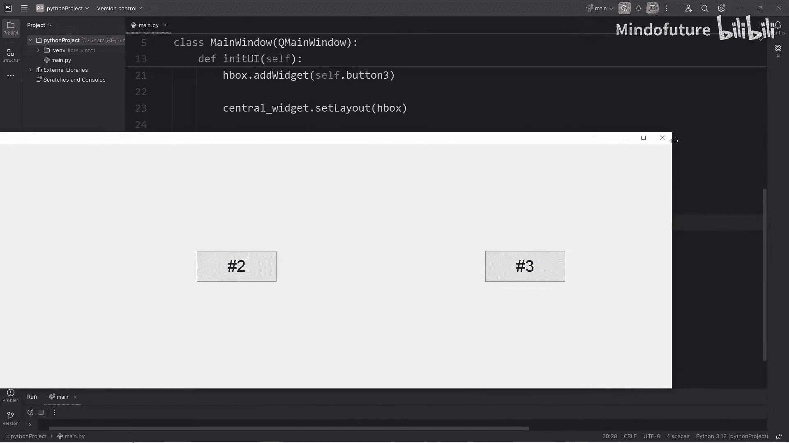
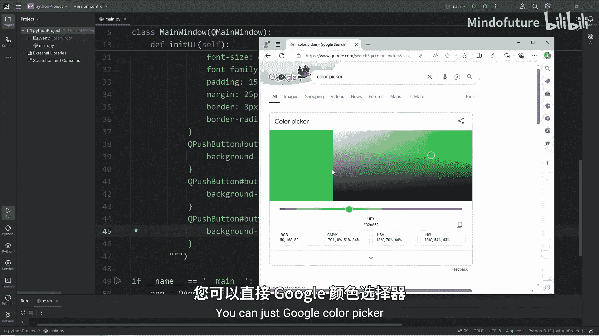
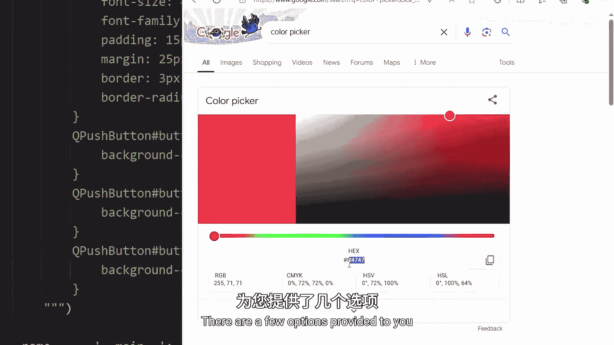
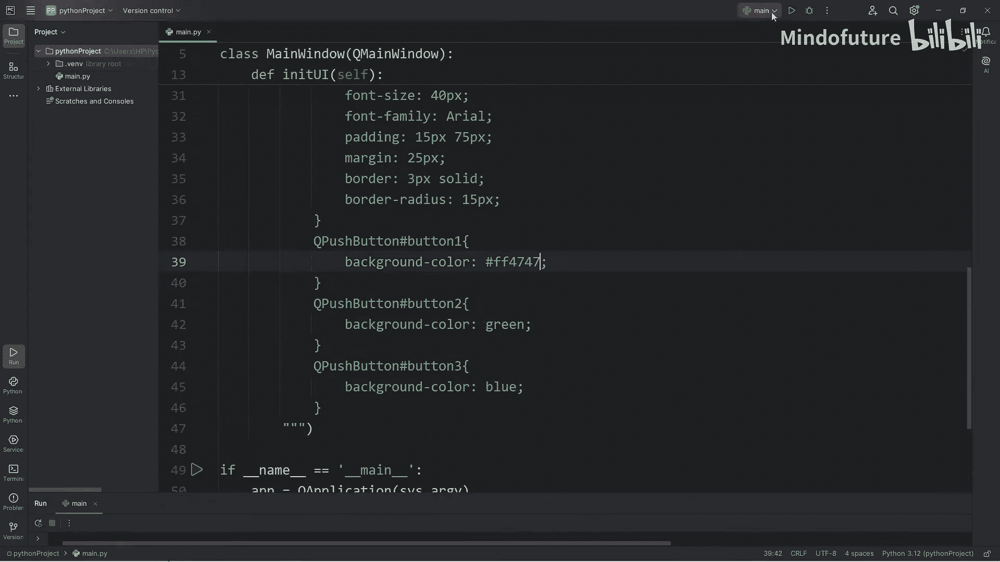
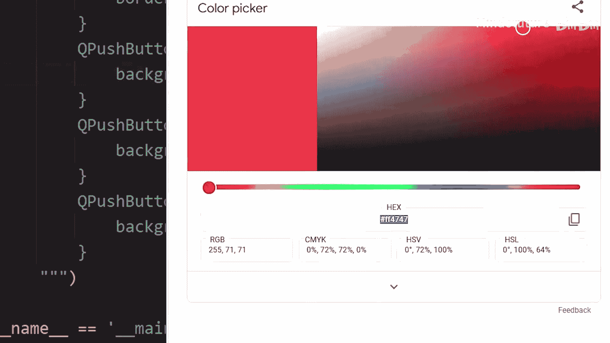
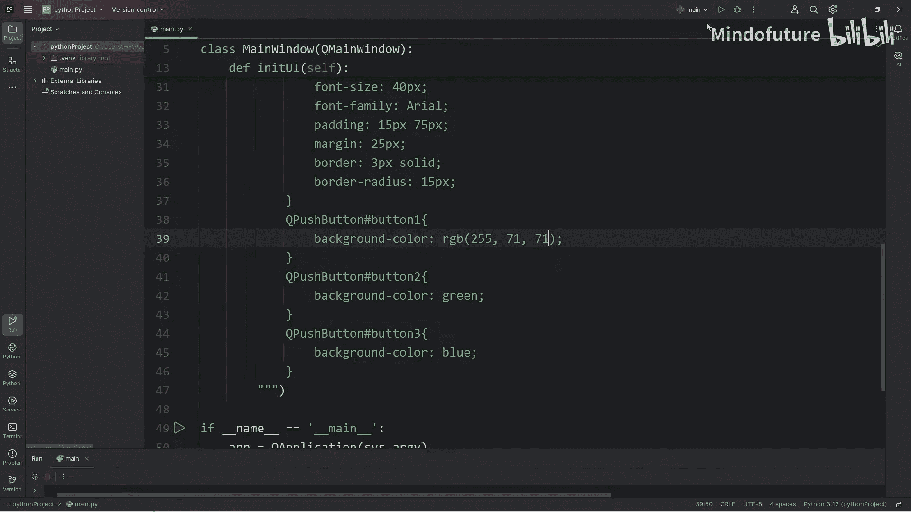
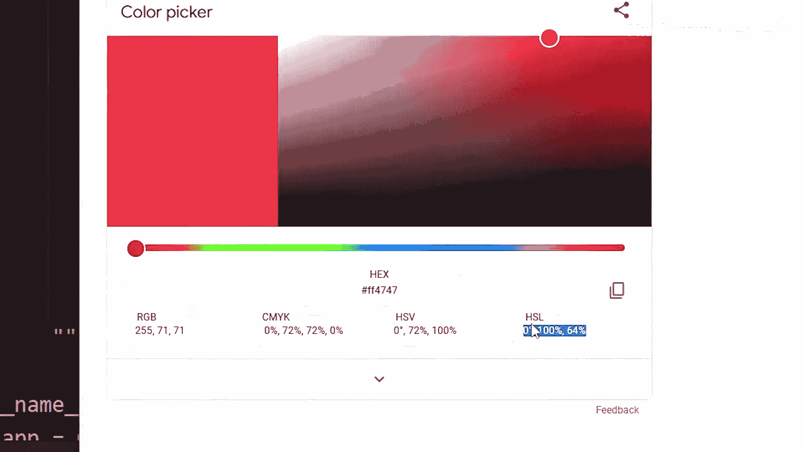
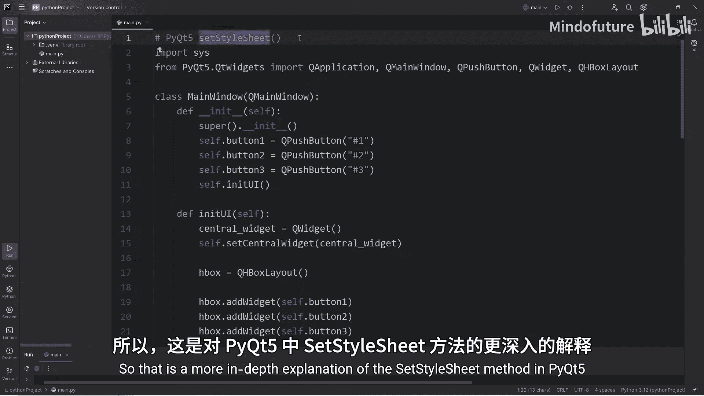

**Python超全入门教程：P86：PyQt5中轻松添加CSS样式属性**

在本节课中，我们将学习如何在PyQt5中使用`setStyleSheet`方法为应用程序添加类似CSS的样式。我们将从设置全局样式开始，然后学习如何为单个控件定制样式，最后介绍使用伪类实现交互效果。

---

上一节我们介绍了PyQt5的基本控件和布局。本节中，我们来看看如何美化这些控件。

首先，我们需要导入必要的模块并创建一个带有按钮的基本窗口。

```python
from PyQt5.QtWidgets import QApplication, QMainWindow, QPushButton, QWidget, QHBoxLayout

class MainWindow(QMainWindow):
    def __init__(self):
        super().__init__()
        self.initUI()

    def initUI(self):
        # 创建三个按钮
        self.button1 = QPushButton('按钮一')
        self.button2 = QPushButton('按钮二')
        self.button3 = QPushButton('按钮三')

        # 为按钮设置对象名，以便后续单独设置样式
        self.button1.setObjectName('button1')
        self.button2.setObjectName('button2')
        self.button3.setObjectName('button3')

        # 创建中央部件和水平布局
        central_widget = QWidget()
        self.setCentralWidget(central_widget)
        layout = QHBoxLayout()
        layout.addWidget(self.button1)
        layout.addWidget(self.button2)
        layout.addWidget(self.button3)
        central_widget.setLayout(layout)
```

现在，窗口已经创建好了。接下来，我们将使用`setStyleSheet`方法为整个窗口应用样式。

**为所有按钮设置全局样式**

我们可以通过选择控件类名（如`QPushButton`）来为所有同类控件设置样式。以下是如何操作：

```python
        self.setStyleSheet("""
            QPushButton {
                font-size: 40px;
                font-family: Arial;
                padding: 15px 75px;
                margin: 25px;
                border: 3px solid black;
                border-radius: 15px;
            }
        """)
```

这段代码为所有`QPushButton`设置了字体大小、字体、内边距、外边距、边框和圆角。

**为单个按钮设置特定样式**



如果只想改变某个特定按钮的样式，我们需要使用其对象名进行选择。以下是具体方法：

```python
        self.setStyleSheet("""
            QPushButton {
                font-size: 40px;
                font-family: Arial;
                padding: 15px 75px;
                margin: 25px;
                border: 3px solid black;
                border-radius: 15px;
            }
            QPushButton#button1 {
                background-color: red;
            }
            QPushButton#button2 {
                background-color: green;
            }
            QPushButton#button3 {
                background-color: blue;
            }
        """)
```

这里，`#button1` 选择了对象名为`button1`的按钮，并单独将其背景色设置为红色。其他按钮同理。

**使用更丰富的颜色值**

除了颜色名称，我们还可以使用十六进制、RGB或HSL值来定义更精确的颜色。

以下是不同颜色格式的示例：
*   **十六进制**：`#ff5733`
*   **RGB**：`rgb(255, 87, 51)`
*   **HSL**：`hsl(11, 100%, 60%)`

例如，将按钮二的颜色改为特定的绿色：
```python
            QPushButton#button2 {
                background-color: hsl(120, 100%, 40%);
            }
```





**添加交互效果（悬停状态）**







我们可以使用CSS伪类（如`:hover`）为控件添加交互效果。以下是为按钮添加悬停时变亮的效果：



```python
            QPushButton#button1:hover {
                background-color: hsl(0, 100%, 70%);
            }
            QPushButton#button2:hover {
                background-color: hsl(120, 100%, 60%);
            }
            QPushButton#button3:hover {
                background-color: hsl(240, 100%, 70%);
            }
```

当鼠标悬停在按钮上时，其背景色的亮度会增加，产生视觉反馈。

---



本节课中我们一起学习了PyQt5中`setStyleSheet`方法的核心用法。我们掌握了如何为所有同类控件设置全局样式，如何通过对象名为单个控件定制样式，以及如何使用颜色值和伪类来增强界面的视觉效果和交互性。通过结合这些技巧，你可以轻松地创建出美观且专业的PyQt5应用程序界面。