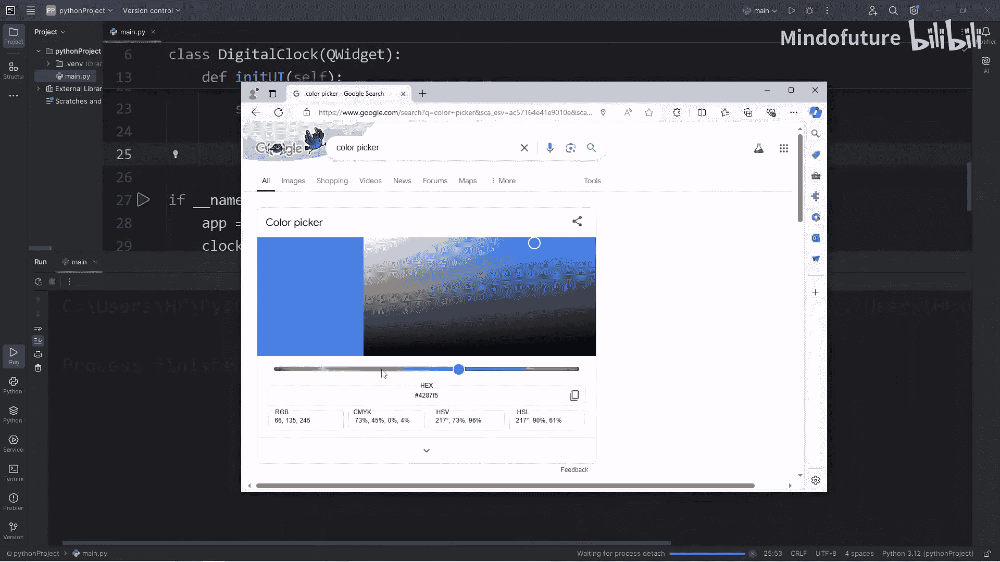
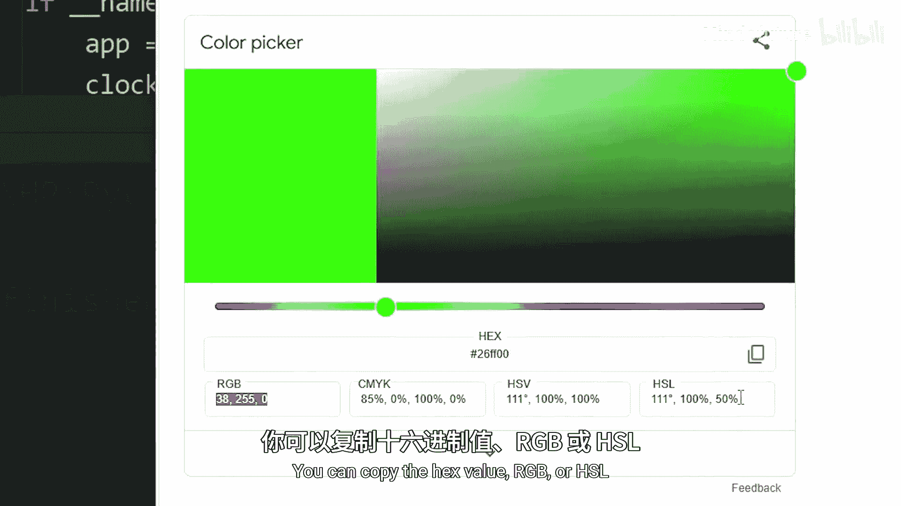
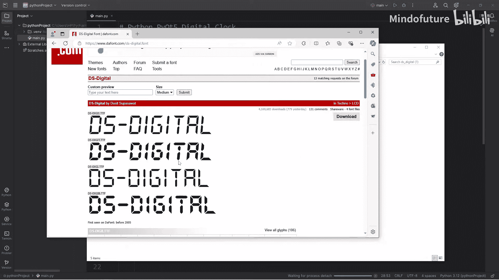
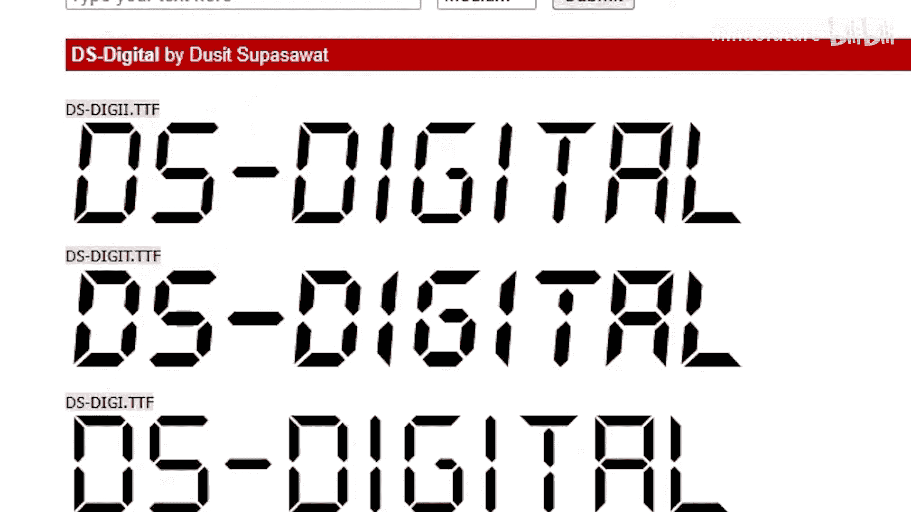
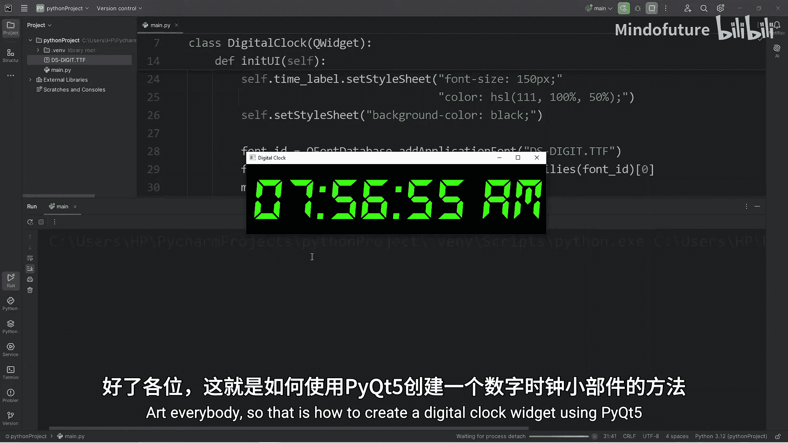

# 087：使用Python创建数字时钟

在本节课中，我们将学习如何使用Python的PyQt5库构建一个数字时钟小部件。我们将从设置环境开始，逐步创建窗口、设计布局、显示时间，并最终实现一个每秒自动更新的数字时钟。

---

## 导入必要的库

首先，我们需要导入构建应用程序所需的模块。

```python
import sys
from PyQt5.QtWidgets import QApplication, QWidget, QLabel, QVBoxLayout
from PyQt5.QtCore import QTimer, QTime, Qt
from PyQt5.QtGui import QFont, QFontDatabase
```

*   `sys` 模块用于处理系统相关的操作。
*   `PyQt5.QtWidgets` 提供了创建GUI应用程序的基本构件。
*   `PyQt5.QtCore` 包含非GUI的核心功能，如计时器。
*   `PyQt5.QtGui` 用于处理字体等图形界面元素。

---

## 创建数字时钟类

我们将创建一个继承自 `QWidget` 的类，作为我们自定义的数字时钟小部件。

```python
class DigitalClock(QWidget):
    def __init__(self):
        super().__init__()
        self.initUI()
```

在构造函数中，我们调用了父类的构造函数，并执行 `initUI` 方法来初始化用户界面。

---

## 初始化用户界面

`initUI` 方法负责设置窗口的标题、大小、布局和样式。

```python
    def initUI(self):
        self.setWindowTitle('数字时钟')
        self.setGeometry(600, 300, 300, 100)

        # 创建时间标签
        self.time_label = QLabel(self)
        self.time_label.setAlignment(Qt.AlignCenter)

        # 设置字体和颜色
        font_id = QFontDatabase.addApplicationFont("DS-DIGI.TTF")
        font_family = QFontDatabase.applicationFontFamilies(font_id)[0]
        my_font = QFont(font_family, 150)
        self.time_label.setFont(my_font)
        self.time_label.setStyleSheet("color: hsl(120, 100%, 50%);")

        # 设置窗口背景色
        self.setStyleSheet("background-color: black;")

        # 设置布局
        vbox = QVBoxLayout()
        vbox.addWidget(self.time_label)
        self.setLayout(vbox)

        # 创建并启动计时器
        self.timer = QTimer(self)
        self.timer.timeout.connect(self.update_time)
        self.timer.start(1000)

        # 初始更新时间显示
        self.update_time()
```

以下是上述代码中关键步骤的说明：



1.  **设置窗口属性**：定义了窗口标题和初始位置、大小。
2.  **创建时间标签**：`QLabel` 用于显示时间文本，并设置为居中对齐。
3.  **加载自定义字体**：通过 `QFontDatabase` 加载项目文件夹中的 `DS-DIGI.TTF` 字体文件，并应用到标签上。
4.  **设置样式**：使用CSS样式表将时间文本颜色设置为亮绿色，窗口背景设置为黑色。
5.  **管理布局**：使用 `QVBoxLayout` 垂直布局管理器将标签添加到窗口中。
6.  **设置计时器**：创建一个 `QTimer`，将其 `timeout` 信号连接到 `update_time` 方法，并设置为每1000毫秒（1秒）触发一次。



---

## 更新时间的方法

`update_time` 方法用于获取当前时间，并将其格式化为字符串显示在标签上。

```python
    def update_time(self):
        current_time = QTime.currentTime().toString("hh:mm:ss AP")
        self.time_label.setText(current_time)
```

*   `QTime.currentTime()` 获取当前时间。
*   `.toString("hh:mm:ss AP")` 将时间格式化为“时:分:秒 上午/下午”的字符串格式。

---

## 启动应用程序





最后，我们需要编写启动应用程序的代码。这部分代码通常放在文件末尾。

```python
if __name__ == '__main__':
    app = QApplication(sys.argv)
    clock = DigitalClock()
    clock.show()
    sys.exit(app.exec_())
```

1.  创建一个 `QApplication` 实例，它是所有PyQt5桌面应用程序的基础。
2.  实例化我们的 `DigitalClock` 类。
3.  调用 `show()` 方法显示窗口。
4.  `app.exec_()` 启动应用程序的主事件循环，使窗口保持运行直到被关闭。`sys.exit()` 确保应用程序能正确退出。

---

## 总结



本节课中我们一起学习了如何使用PyQt5创建一个功能完整的数字时钟。我们涵盖了从导入库、创建自定义窗口部件、设计用户界面、使用计时器动态更新时间，到加载自定义字体美化显示的全过程。通过这个项目，你掌握了PyQt5中窗口、标签、布局、计时器和字体处理等核心概念，为开发更复杂的GUI应用程序打下了基础。