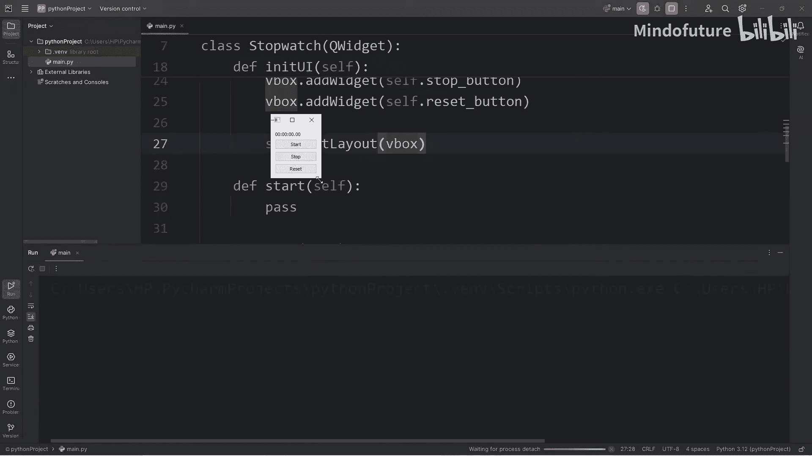
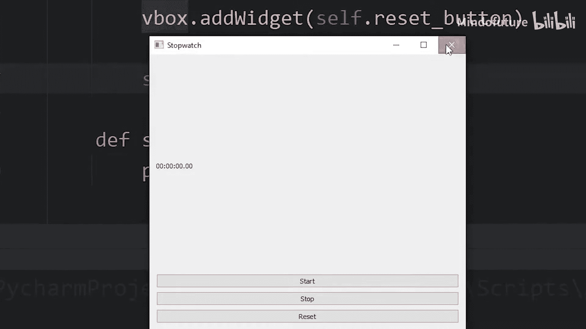
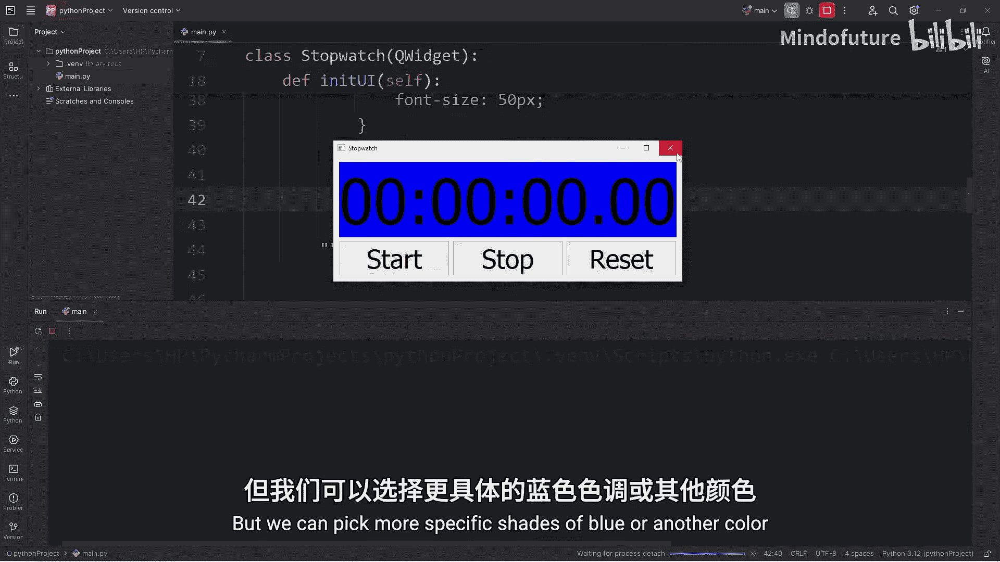
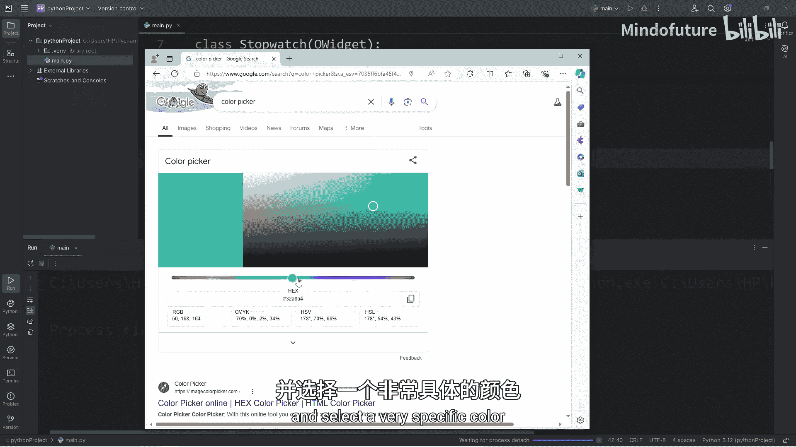
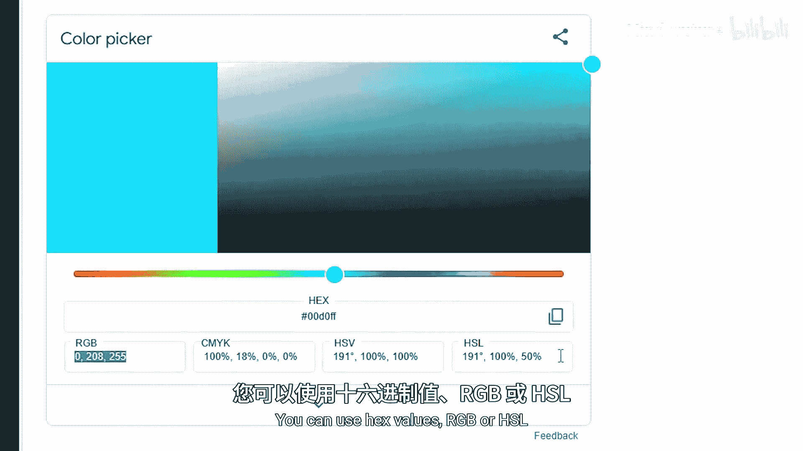
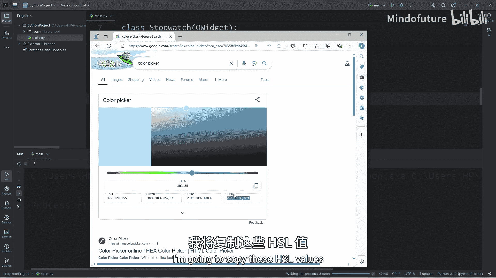
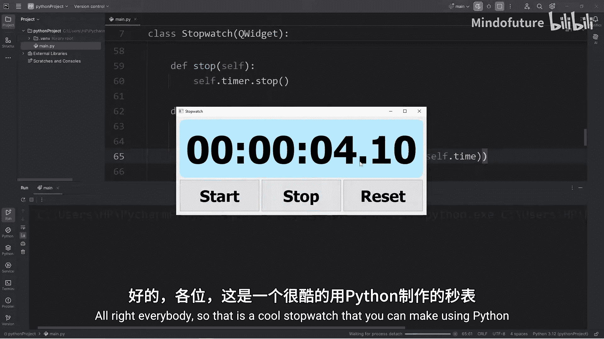

# 088：使用Python创建秒表程序 🕒

在本节课中，我们将学习如何使用Python的PyQt5库来创建一个功能完整的秒表应用程序。我们将从设置基础窗口开始，逐步添加时间显示、控制按钮和计时逻辑。

---

## 导入必要的库

首先，我们需要导入构建应用程序所需的所有模块和组件。

```python
import sys
from PyQt5.QtWidgets import QApplication, QWidget, QLabel, QPushButton, QVBoxLayout, QHBoxLayout
from PyQt5.QtCore import QTimer, QTime, Qt
```

*   `sys`：用于处理系统变量。
*   `PyQt5.QtWidgets`：提供应用程序的界面组件（控件）。
*   `PyQt5.QtCore`：提供核心功能，如计时器和时间处理。

---

## 构建应用程序骨架

上一节我们导入了必要的库，本节中我们来看看如何搭建应用程序的基本框架。

我们将创建一个继承自`QWidget`的`Stopwatch`类，并设置主程序入口。

```python
class Stopwatch(QWidget):
    def __init__(self):
        super().__init__()
        # 初始化代码将放在这里

if __name__ == '__main__':
    app = QApplication(sys.argv)
    stopwatch = Stopwatch()
    stopwatch.show()
    sys.exit(app.exec_())
```

这段代码创建了一个基本的PyQt5应用程序窗口。当直接运行此脚本时，它会显示一个空窗口。

---

## 初始化用户界面组件

现在，我们有了一个窗口框架。接下来，我们需要在`Stopwatch`类的`__init__`方法中初始化所有必要的组件。

以下是需要创建的组件列表：
*   `self.time`：一个`QTime`对象，用于存储和计算时间。
*   `self.time_label`：一个`QLabel`控件，用于显示时间。
*   `self.start_button`, `self.stop_button`, `self.reset_button`：三个`QPushButton`控件，用于控制秒表。
*   `self.timer`：一个`QTimer`对象，用于定期触发时间更新。

我们还需要调用一个方法来设置这些组件的布局和样式，这个方法我们称之为`init_ui`。

---

## 设计用户界面布局

在`init_ui`方法中，我们将安排控件的位置并设置它们的样式。





首先，设置窗口标题。
```python
self.setWindowTitle('Stopwatch')
```

接着，使用布局管理器来排列控件。我们将使用垂直布局（`QVBoxLayout`）来放置时间标签和按钮组，使用水平布局（`QHBoxLayout`）来水平排列三个按钮。

```python
vbox = QVBoxLayout()
hbox = QHBoxLayout()

# 将按钮添加到水平布局
hbox.addWidget(self.start_button)
hbox.addWidget(self.stop_button)
hbox.addWidget(self.reset_button)

# 将标签和按钮组添加到垂直布局
vbox.addWidget(self.time_label)
vbox.addLayout(hbox)

# 将垂直布局设置为主窗口的布局
self.setLayout(vbox)
```



为了让时间标签看起来更美观，我们将其文本居中对齐，并应用一些CSS样式。





```python
self.time_label.setAlignment(Qt.AlignCenter)
self.setStyleSheet("""
    QPushButton, QLabel {
        font-size: 20px;
        padding: 10px;
        font-weight: bold;
        font-family: Calibri;
    }
    QLabel {
        font-size: 48px;
        background-color: hsl(210, 100%, 90%);
        border-radius: 20px;
    }
""")
```



---

## 连接信号与槽

界面已经设计好了，但按钮还没有功能。我们需要将按钮的“点击”信号连接到对应的功能函数（槽）。

以下是需要连接的信号：
*   开始按钮 -> `self.start` 方法
*   停止按钮 -> `self.stop` 方法
*   重置按钮 -> `self.reset` 方法
*   计时器超时信号 -> `self.update_display` 方法

```python
self.start_button.clicked.connect(self.start)
self.stop_button.clicked.connect(self.stop)
self.reset_button.clicked.connect(self.reset)
self.timer.timeout.connect(self.update_display)
```

---

## 实现核心功能方法

现在，我们来逐一实现控制秒表逻辑的方法。

**1. `start` 方法**
此方法启动计时器，使其每10毫秒触发一次超时信号。
```python
def start(self):
    self.timer.start(10) # 每10毫秒触发一次
```

**2. `stop` 方法**
此方法停止计时器。
```python
def stop(self):
    self.timer.stop()
```

**3. `reset` 方法**
此方法停止计时器，将时间重置为00:00:00.00，并更新显示。
```python
def reset(self):
    self.timer.stop()
    self.time = QTime(0, 0, 0, 0) # 重置为0
    self.time_label.setText(self.format_time(self.time))
```

**4. `format_time` 方法**
此方法接收一个`QTime`对象，并将其格式化为`HH:MM:SS.mm`的字符串。
```python
def format_time(self, time):
    hours = time.hour()
    minutes = time.minute()
    seconds = time.second()
    milliseconds = time.msec() // 10 # 转换为2位毫秒
    return f"{hours:02d}:{minutes:02d}:{seconds:02d}.{milliseconds:02d}"
```

**5. `update_display` 方法**
这是计时器超时时调用的方法。它将当前时间增加10毫秒，并更新标签的显示。
```python
def update_display(self):
    self.time = self.time.addMSecs(10) # 增加10毫秒
    self.time_label.setText(self.format_time(self.time))
```

---

## 运行与测试

所有代码都已就绪。运行程序，你将看到一个带有“开始”、“停止”、“重置”按钮的秒表窗口。点击“开始”，时间开始走动；点击“停止”，时间暂停；点击“重置”，时间归零。

---



本节课中我们一起学习了如何使用PyQt5构建一个图形界面的秒表程序。我们涵盖了从导入库、创建窗口、设计布局、应用样式，到实现计时逻辑和连接事件响应的完整流程。你可以在此基础上进一步美化界面或添加更多功能，如记录圈数等。