# 089：使用Python编写一个天气应用 🌤️

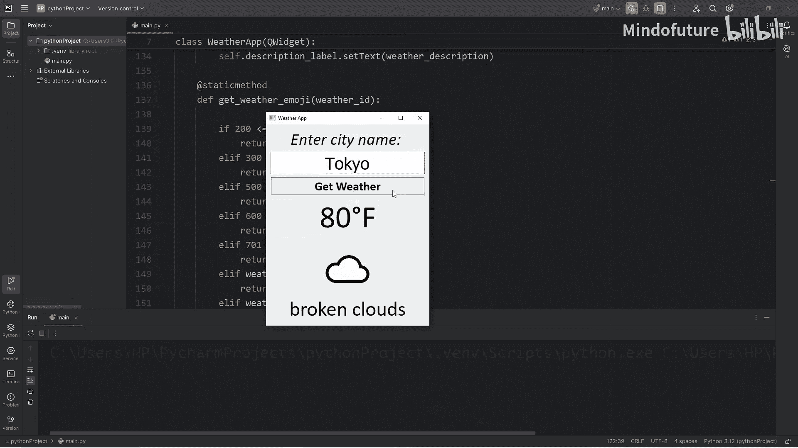

在本节课中，我们将创建一个能够从API获取实时天气数据的天气应用。这是一个综合性项目，请根据自己的节奏学习，可以花几天甚至几周时间来完成。完成后，你甚至可以将其添加到你的作品集中。

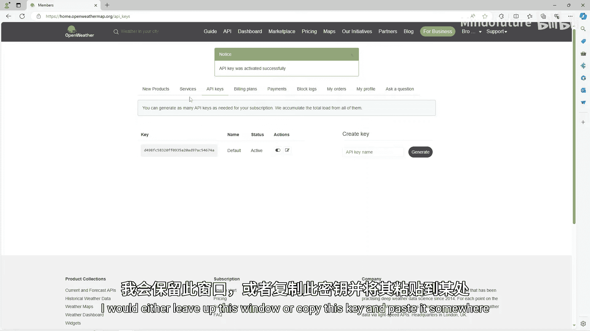

## 概述
我们将使用Python的PyQt5库来构建图形用户界面，并通过OpenWeatherMap API获取天气数据。教程将涵盖API注册、界面设计、网络请求、数据处理和异常处理等核心内容。

## 1. 项目准备与API获取

首先，我们需要获取用于获取天气数据的API密钥。我们将使用OpenWeatherMap提供的免费服务。

以下是获取API密钥的步骤：
1.  访问网站 `openweathermap.org`。
2.  点击“Sign In”并创建一个免费账户。
3.  登录后，点击右上角的下拉菜单，选择“My API Keys”。
4.  复制生成的API密钥。如果状态显示为“Inactive”，请点击切换按钮将其激活。激活过程可能需要几分钟。

**注意**：请妥善保管你的API密钥，我们将在后续代码中使用它。

## 2. 环境搭建与基础窗口

如果你是本系列教程的新手，需要先安装必要的库。我们将使用PyQt5来构建图形界面。

首先，通过pip安装PyQt5：
```bash
pip install PyQt5
```

安装完成后，我们需要导入必要的模块。以下是完整的导入列表：

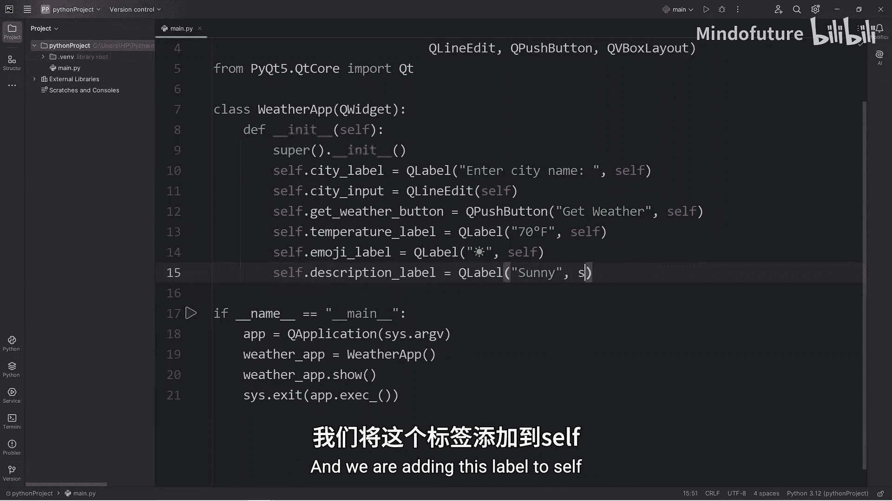

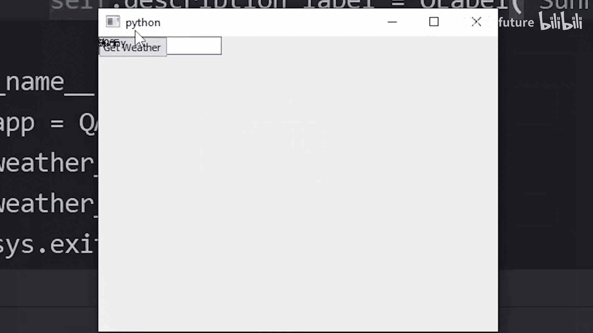

```python
import sys
import requests
from PyQt5.QtWidgets import QApplication, QWidget, QLabel, QLineEdit, QPushButton, QVBoxLayout
from PyQt5.QtCore import Qt
```

接下来，我们创建一个基础的应用程序窗口类。

```python
class WeatherApp(QWidget):
    def __init__(self):
        super().__init__()
        self.initUI()

if __name__ == '__main__':
    app = QApplication(sys.argv)
    weather_app = WeatherApp()
    weather_app.show()
    sys.exit(app.exec_())
```

这段代码创建了一个继承自`QWidget`的`WeatherApp`类，并设置了应用程序的主循环，确保窗口能正常显示和关闭。

## 3. 设计用户界面

上一节我们创建了基础窗口，本节中我们来设计应用的用户界面。我们将添加标签、输入框和按钮等控件。

在`initUI`方法中，我们首先设置窗口标题，然后创建并排列各个控件。

```python
def initUI(self):
    self.setWindowTitle('Weather App')

    # 创建控件
    self.city_label = QLabel('Enter city name', self)
    self.city_input = QLineEdit(self)
    self.get_weather_button = QPushButton('Get Weather', self)
    self.temperature_label = QLabel(self)
    self.emoji_label = QLabel(self)
    self.description_label = QLabel(self)

    # 创建垂直布局管理器并添加控件
    vbox = QVBoxLayout()
    vbox.addWidget(self.city_label)
    vbox.addWidget(self.city_input)
    vbox.addWidget(self.get_weather_button)
    vbox.addWidget(self.temperature_label)
    vbox.addWidget(self.emoji_label)
    vbox.addWidget(self.description_label)

    # 设置布局
    self.setLayout(vbox)

    # 水平居中除按钮外的所有控件
    self.city_label.setAlignment(Qt.AlignCenter)
    self.city_input.setAlignment(Qt.AlignCenter)
    self.temperature_label.setAlignment(Qt.AlignCenter)
    self.emoji_label.setAlignment(Qt.AlignCenter)
    self.description_label.setAlignment(Qt.AlignCenter)
```

现在，界面上的控件已经垂直排列，并且大部分控件都居中对齐了。

## 4. 美化界面样式

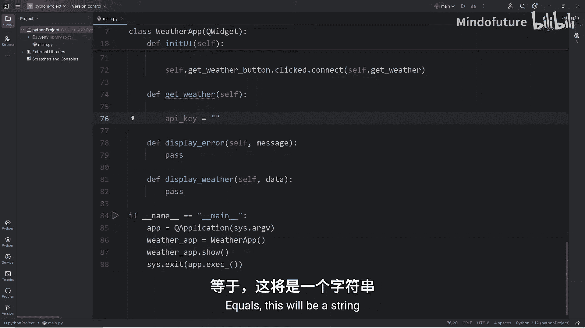

界面虽然有了布局，但样式比较简陋。本节我们将使用CSS样式表来美化应用的外观。

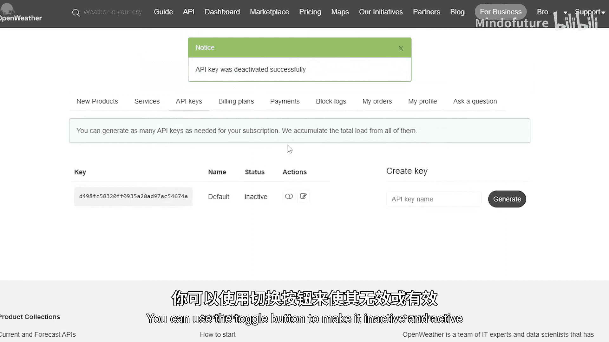

我们为每个控件设置一个唯一的对象名，然后通过样式表来定义它们的字体、大小等属性。

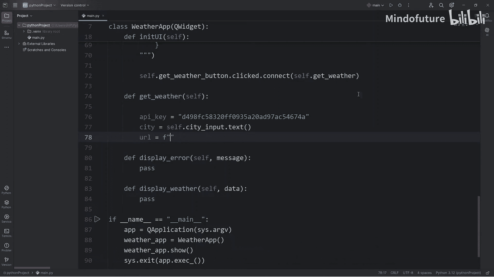

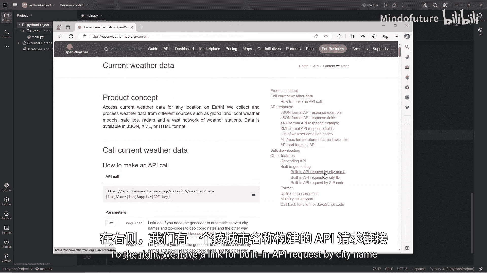

```python
def initUI(self):
    # ... (之前的控件创建和布局代码)

    # 为控件设置对象名，用于CSS选择器
    self.city_label.setObjectName('city_label')
    self.city_input.setObjectName('city_input')
    self.get_weather_button.setObjectName('get_weather_button')
    self.temperature_label.setObjectName('temperature_label')
    self.emoji_label.setObjectName('emoji_label')
    self.description_label.setObjectName('description_label')

    # 应用样式表
    self.setStyleSheet('''
        QLabel, QPushButton {
            font-family: Calibri;
        }
        QLabel#city_label {
            font-size: 40px;
            font-style: italic;
        }
        QLineEdit#city_input {
            font-size: 40px;
        }
        QPushButton#get_weather_button {
            font-size: 30px;
            font-weight: bold;
        }
        QLabel#temperature_label {
            font-size: 75px;
        }
        QLabel#emoji_label {
            font-size: 100px;
            font-family: "Segoe UI Emoji";
        }
        QLabel#description_label {
            font-size: 50px;
        }
    ''')
```

应用样式后，我们的天气应用界面看起来更加美观和专业了。

## 5. 连接按钮与功能

界面已经就绪，现在需要让按钮点击后执行获取天气的功能。本节我们将为按钮的点击信号连接一个自定义的槽函数。

在`initUI`方法的末尾，添加以下代码来连接信号与槽：

```python
    self.get_weather_button.clicked.connect(self.get_weather)
```

然后，我们定义`get_weather`方法作为槽函数。目前它只是一个占位符。

```python
def get_weather(self):
    pass
```

现在，点击“Get Weather”按钮就会调用`get_weather`方法。接下来，我们将在这个方法里实现核心的API请求逻辑。

## 6. 获取并处理天气数据

这是应用的核心功能部分。我们将在`get_weather`方法中构造API请求URL，发送网络请求，并处理返回的JSON数据。

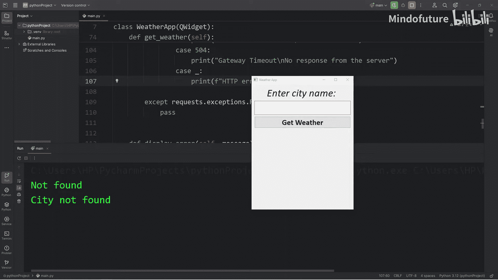

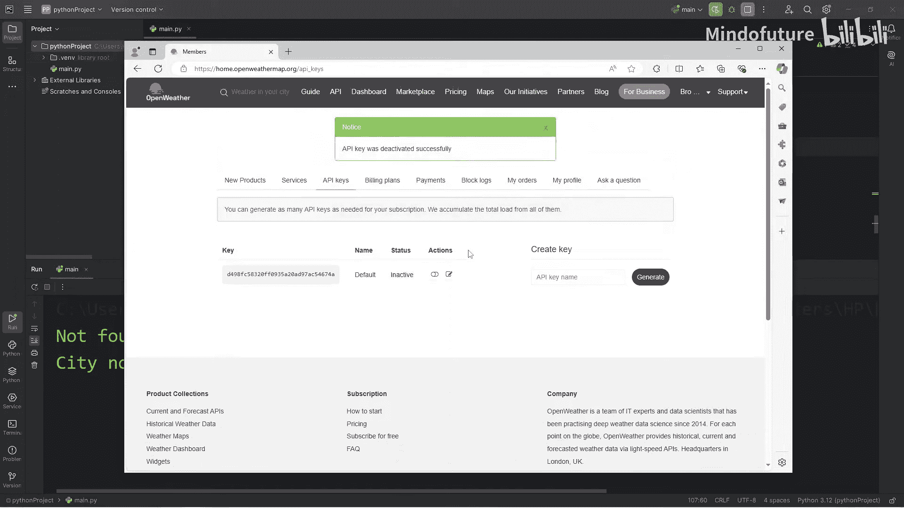

首先，我们需要API密钥和用户输入的城市名。

```python
def get_weather(self):
    api_key = ‘你的API密钥’ # 请替换为你的真实API密钥
    city = self.city_input.text()

    # 构造API请求URL
    url = f‘http://api.openweathermap.org/data/2.5/weather?q={city}&appid={api_key}’

    try:
        # 发送GET请求
        response = requests.get(url)
        response.raise_for_status() # 如果响应状态码是4xx或5xx，则抛出HTTPError异常
        data = response.json()

        # 根据状态码处理结果
        if data[‘cod’] == 200:
            self.display_weather(data)
        else:
            # 处理API返回的非200错误（如404城市未找到）
            self.display_error(f‘Error {data[“cod”]}: {data.get(“message”, “Unknown error”)}’)

    except requests.exceptions.HTTPError as http_err:
        # 处理HTTP错误（状态码4xx, 5xx）
        self.handle_http_error(response)
    except requests.exceptions.ConnectionError:
        self.display_error(‘Connection Error\nCheck your Internet connection.’)
    except requests.exceptions.Timeout:
        self.display_error(‘Timeout Error\nThe request timed out.’)
    except requests.exceptions.RequestException as req_err:
        self.display_error(f‘Request Error\n{req_err}’)
```

我们使用了`try...except`块来捕获可能发生的各种网络和请求异常，确保程序的健壮性。

## 7. 处理HTTP错误状态码

当API请求返回错误状态码（如404、401等）时，我们需要向用户显示友好的错误信息。本节我们实现`handle_http_error`方法。

我们使用`match...case`语句（Python 3.10+）或`if...elif`链来根据不同的状态码显示不同的信息。

```python
def handle_http_error(self, response):
    status_code = response.status_code
    match status_code:
        case 400:
            msg = ‘Bad Request\nPlease check your input.’
        case 401:
            msg = ‘Unauthorized\nInvalid API key.’
        case 403:
            msg = ‘Forbidden\nAccess is denied.’
        case 404:
            msg = ‘Not Found\nCity not found.’
        case 500:
            msg = ‘Internal Server Error\nPlease try again later.’
        case 502:
            msg = ‘Bad Gateway\nInvalid response from server.’
        case 503:
            msg = ‘Service Unavailable\nServer is down.’
        case 504:
            msg = ‘Gateway Timeout\nNo response from server.’
        case _:
            msg = f‘HTTP Error occurred\n{status_code}’
    self.display_error(msg)
```

这样，用户就能清楚地知道问题出在哪里，例如是网络问题、输入错误还是API密钥无效。

## 8. 显示错误信息

当发生错误时，我们需要在应用界面上显示错误信息，并清空可能残留的天气数据和表情符号。

`display_error`方法负责更新温度标签来显示错误信息，并清空其他相关标签。

```python
def display_error(self, message):
    # 显示错误信息
    self.temperature_label.setText(message)
    # 临时调整错误信息的字体大小
    self.temperature_label.setStyleSheet(‘font-size: 30px;’)
    # 清空其他标签
    self.emoji_label.clear()
    self.description_label.clear()
```

## 9. 解析并显示天气数据

如果API请求成功（状态码为200），我们将调用`display_weather`方法来解析数据并更新界面。

我们需要从返回的JSON数据中提取温度、天气描述和天气ID。

```python
def display_weather(self, data):
    # 恢复温度标签的字体大小
    self.temperature_label.setStyleSheet(‘font-size: 75px;’)

    # 提取温度（开尔文）
    temp_k = data[‘main’][‘temp’]
    # 转换为华氏度（可根据需要改为摄氏度）
    temp_f = (temp_k * 9/5) - 459.67
    self.temperature_label.setText(f‘{temp_f:.0f}°F’)

    # 提取天气描述
    weather_desc = data[‘weather’][0][‘description’].title()
    self.description_label.setText(weather_desc)

    # 提取天气ID并获取对应的表情符号
    weather_id = data[‘weather’][0][‘id’]
    emoji = self.get_weather_emoji(weather_id)
    self.emoji_label.setText(emoji)
```

## 10. 根据天气ID显示表情符号

为了增加应用的趣味性，我们根据OpenWeatherMap的天气ID来显示对应的表情符号。我们创建一个静态方法`get_weather_emoji`来实现这个映射关系。

```python
@staticmethod
def get_weather_emoji(weather_id):
    if 200 <= weather_id <= 232:
        return ‘⛈️’ # 雷阵雨
    elif 300 <= weather_id <= 321:
        return ‘🌧️’ # 毛毛雨/细雨
    elif 500 <= weather_id <= 531:
        return ‘🌧️’ # 雨
    elif 600 <= weather_id <= 622:
        return ‘❄️’ # 雪
    elif 701 <= weather_id <= 741:
        return ‘🌫️’ # 雾/薄雾
    elif weather_id == 762:
        return ‘🌋’ # 火山灰
    elif weather_id == 771:
        return ‘💨’ # 飑
    elif weather_id == 781:
        return ‘🌪️’ # 龙卷风
    elif weather_id == 800:
        return ‘☀️’ # 晴
    elif 801 <= weather_id <= 804:
        return ‘☁️’ # 多云
    else:
        return ‘’ # 未知天气，返回空字符串
```

现在，应用会根据不同的天气状况显示生动的表情符号了。

## 总结

本节课中我们一起学习了如何使用Python和PyQt5构建一个完整的桌面天气应用。我们涵盖了从项目规划、API获取、GUI设计、网络请求、数据解析到异常处理的完整开发流程。

**核心要点回顾**：
1.  **GUI框架**：使用PyQt5的`QWidget`, `QLabel`, `QLineEdit`, `QPushButton`等控件构建界面。
2.  **布局管理**：使用`QVBoxLayout`进行垂直布局，并使用`Qt.AlignCenter`进行对齐。
3.  **样式美化**：通过`setStyleSheet`方法应用CSS样式表来美化控件外观。
4.  **网络请求**：使用`requests`库向OpenWeatherMap API发送GET请求获取JSON格式的天气数据。
5.  **数据处理**：解析JSON数据，提取温度、描述等信息，并进行单位换算。
6.  **异常处理**：使用`try...except`块妥善处理网络错误、HTTP状态码错误等，提升应用健壮性。
7.  **功能增强**：根据天气ID映射显示对应的表情符号，提升用户体验。

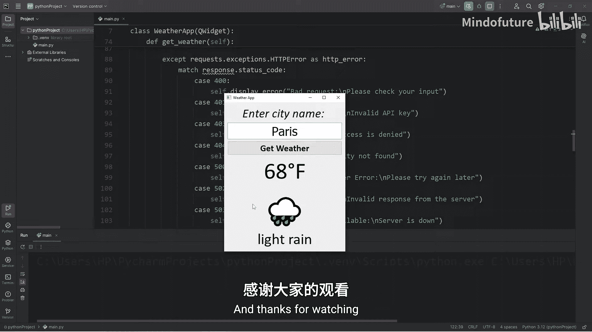

你可以在此基础上继续扩展功能，例如添加多城市管理、天气预报、更详细的天气信息（湿度、风速等）或更换更精美的图标。这个项目是巩固Python GUI编程和网络请求知识的绝佳实践。