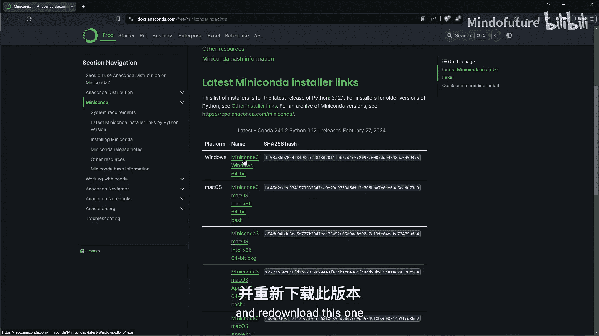
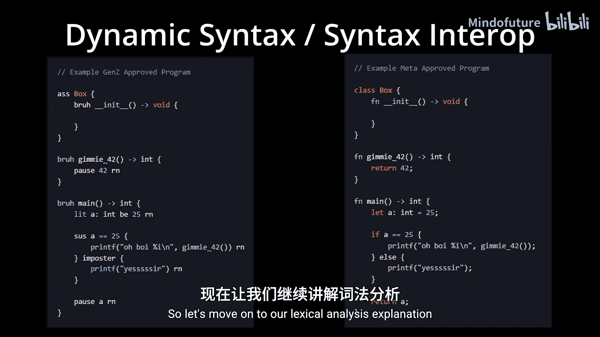
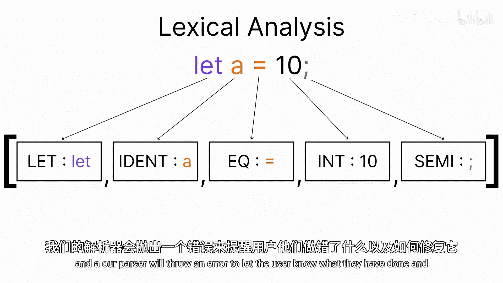
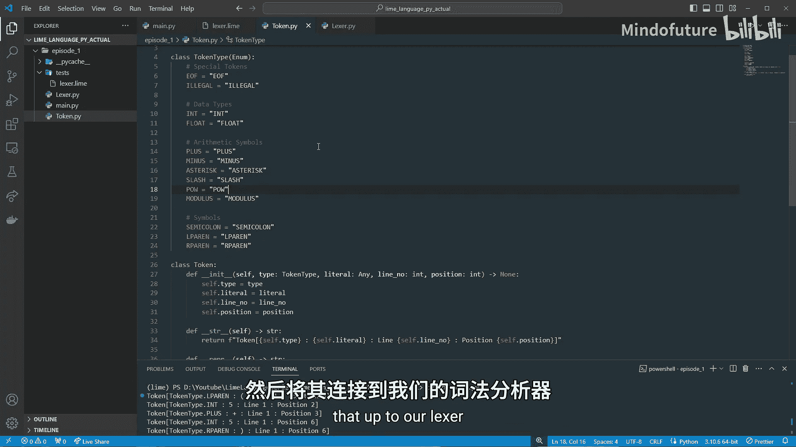

# 001：引言与词法分析器 🚀

在本节课中，我们将学习如何从零开始构建自己的编程语言。我们将使用 Python 和 LLVM Light（一个 LLVM 编译器架构的绑定库）来实现。选择 Python 是因为它易于使用且对初学者友好。我们的目标不仅仅是构建一个简单的玩具语言，而是从一个具有语句和表达式的基础计算器语言开始，逐步扩展，以完整地展示语言构建的过程。我们不会一开始就加入变量、函数等复杂概念，而是循序渐进地学习。



## 环境准备 🛠️

首先，你需要安装 Miniconda 或 Anaconda。推荐使用 Miniconda，因为它依赖更少。Conda 是一个 Python 环境管理器，我们使用它是因为在 Conda 环境中安装 LLVM Light 非常容易。



以下是安装步骤：
1.  下载并安装最新版本的 Miniconda。
2.  如果你有旧版本，请更新或卸载后重新安装。

我们将要构建的语言名为 **Limeme**。它将是一种静态类型、即时编译的语言，使用 Python 和 LLVM 构建。



## 语言特性预览 ✨

Limeme 语言将包含以下特性：
*   条件语句（if, if-else, else-if-else）
*   循环（while, for）
*   所有算术运算符
*   可变与常量变量
*   类、类方法、属性
*   类的继承
*   函数、函数作用域与变量
*   导入语句
*   内置函数和基础标准库
*   独特的语法互换功能（例如，同时支持 Gen Z 风格和常规风格的语法）

## 词法分析器（Lexer）介绍 🔍

上一节我们介绍了课程概览，本节中我们来看看词法分析器。词法分析器负责进行词法分析，其任务是将人类可读的源代码转换为计算机解析器更容易处理和理解的格式，例如一个由词法单元（Token）组成的列表。这些词法单元是描述源代码片段的对象。

以下是一个 JavaScript 变量声明的例子：
`let myVar = 10;`

词法分析器会将其分解为以下词法单元序列：
1.  `let` (类型: let, 字面值: "let")
2.  `myVar` (类型: 标识符, 字面值: "myVar")
3.  `=` (类型: 赋值, 字面值: "=")
4.  `10` (类型: 整数, 字面值: 10)
5.  `;` (类型: 分号, 字面值: ";")

解析器会检查这些词法单元的顺序和结构，以构建抽象语法树。如果顺序错误（例如分号出现在等号之前），解析器将抛出语法错误。

## 开始编码 💻

现在，让我们进入代码部分。首先创建一个项目文件夹，并进入该目录。

### 1. 创建 Conda 环境

使用以下命令创建一个名为 `lime` 的 Python 3.12 环境：
```bash
conda create --name lime python=3.12
```
创建完成后，激活环境：
```bash
conda activate lime
```

### 2. 创建主文件

创建 `main.py` 文件，作为程序执行的入口点。
```python
if __name__ == "__main__":
    pass
```

### 3. 创建词法单元（Token）类

创建 `token.py` 文件。首先，我们需要定义词法单元的类型。

```python
from enum import Enum
from typing import Any

class TokenType(Enum):
    # 特殊词法单元
    EOF = "EOF"        # 文件结束
    ILLEGAL = "ILLEGAL" # 非法字符

    # 数据类型
    INT = "INT"
    FLOAT = "FLOAT"

    # 算术运算符
    PLUS = "PLUS"       # +
    MINUS = "MINUS"     # -
    ASTERISK = "ASTERISK" # *
    SLASH = "SLASH"     # /
    CARET = "CARET"     # ^
    PERCENT = "PERCENT" # %

    # 符号
    SEMICOLON = "SEMICOLON" # ;
    LPAREN = "LPAREN"     # (
    RPAREN = "RPAREN"     # )
```

接下来，创建 `Token` 类，用于表示每一个词法单元。

```python
class Token:
    def __init__(self, type: TokenType, literal: Any, line: int, position: int):
        self.type = type
        self.literal = literal
        self.line = line
        self.position = position

    def __str__(self):
        return f"{self.type} {self.literal} {self.line}:{self.position}"

    def __repr__(self):
        return self.__str__()
```

### 4. 创建词法分析器（Lexer）类

创建 `lexer.py` 文件。词法分析器将读取源代码字符串，并将其转换为词法单元流。

```python
from token import Token, TokenType
from typing import Any

class Lexer:
    def __init__(self, source: str):
        self.source = source          # 源代码字符串
        self.position = -1           # 当前位置索引
        self.read_position = 0       # 下一个待读取位置索引
        self.line = 1                # 当前行号
        self.current_char = None     # 当前字符
        self._read_char()            # 初始化，读取第一个字符

    def _read_char(self):
        """读取下一个字符，更新状态"""
        if self.read_position >= len(self.source):
            self.current_char = None  # 到达文件末尾
        else:
            self.current_char = self.source[self.read_position]

        self.position = self.read_position
        self.read_position += 1

    def _skip_whitespace(self):
        """跳过空白字符（空格、制表符、换行）"""
        while self.current_char is not None and self.current_char in (' ', '\t', '\n', '\r'):
            if self.current_char == '\n':
                self.line += 1
            self._read_char()

    def _new_token(self, type: TokenType, literal: Any) -> Token:
        """辅助函数：创建新的词法单元"""
        return Token(type, literal, self.line, self.position)

    def _is_digit(self, ch: str) -> bool:
        """判断字符是否为数字"""
        return '0' <= ch <= '9'

    def _read_number(self) -> Token:
        """读取一个数字（整数或浮点数）"""
        start_pos = self.position
        dot_count = 0
        output = ""

        while self.current_char is not None and (self._is_digit(self.current_char) or self.current_char == '.'):
            if self.current_char == '.':
                dot_count += 1
                if dot_count > 1:
                    print(f"错误：数字中包含过多小数点，位于第{self.line}行，位置{self.position}")
                    return self._new_token(TokenType.ILLEGAL, self.source[start_pos:self.position + 1])

            output += self.current_char
            self._read_char()

        if dot_count == 0:
            return self._new_token(TokenType.INT, int(output))
        else:
            return self._new_token(TokenType.FLOAT, float(output))

    def next_token(self) -> Token:
        """获取下一个词法单元"""
        self._skip_whitespace()
        token = None

        if self.current_char is None:
            return self._new_token(TokenType.EOF, "")

        # 使用 match 语句匹配当前字符
        match self.current_char:
            case '+':
                token = self._new_token(TokenType.PLUS, self.current_char)
            case '-':
                token = self._new_token(TokenType.MINUS, self.current_char)
            case '*':
                token = self._new_token(TokenType.ASTERISK, self.current_char)
            case '/':
                token = self._new_token(TokenType.SLASH, self.current_char)
            case '^':
                token = self._new_token(TokenType.CARET, self.current_char)
            case '%':
                token = self._new_token(TokenType.PERCENT, self.current_char)
            case ';':
                token = self._new_token(TokenType.SEMICOLON, self.current_char)
            case '(':
                token = self._new_token(TokenType.LPAREN, self.current_char)
            case ')':
                token = self._new_token(TokenType.RPAREN, self.current_char)
            case _:
                # 如果不是符号，检查是否为数字
                if self._is_digit(self.current_char):
                    return self._read_number()
                else:
                    # 无法识别的字符，视为非法词法单元
                    token = self._new_token(TokenType.ILLEGAL, self.current_char)

        # 读取下一个字符，为下一次调用做准备
        self._read_char()
        return token
```

### 5. 测试词法分析器

回到 `main.py` 文件，编写测试代码。

```python
from lexer import Lexer

DEBUG = True

if __name__ == "__main__":
    # 从测试文件读取源代码
    with open('tests/lexer.lime', 'r') as f:
        code = f.read()

    if DEBUG:
        debug_lex = Lexer(code)
        while debug_lex.current_char is not None:
            token = debug_lex.next_token()
            print(token)
```

创建一个 `tests` 文件夹，并在其中创建 `lexer.lime` 文件，输入测试代码：
```
5 + 5;
2 * (3 - 1);
4.2 / 2.1;
10 ^ 2;
15 % 4;
```

运行 `main.py`，你应该能看到词法分析器输出的所有词法单元。

## 总结 📝

本节课中，我们一起学习了如何开始构建自己的编程语言。我们首先介绍了课程目标和语言特性，然后详细讲解了词法分析器（Lexer）的作用——将源代码字符串分解为有意义的词法单元序列。我们逐步实现了 `Token` 类和 `Lexer` 类，目前能够识别数字、基本算术运算符和括号等符号。这为我们语言的算术运算功能打下了基础。



你可以尝试添加更多的词法单元类型（例如比较运算符 `==`, `>` 等）来扩展词法分析器的功能。在下一节课中，我们将构建解析器（Parser），并将它与词法分析器连接起来，开始构建抽象语法树。