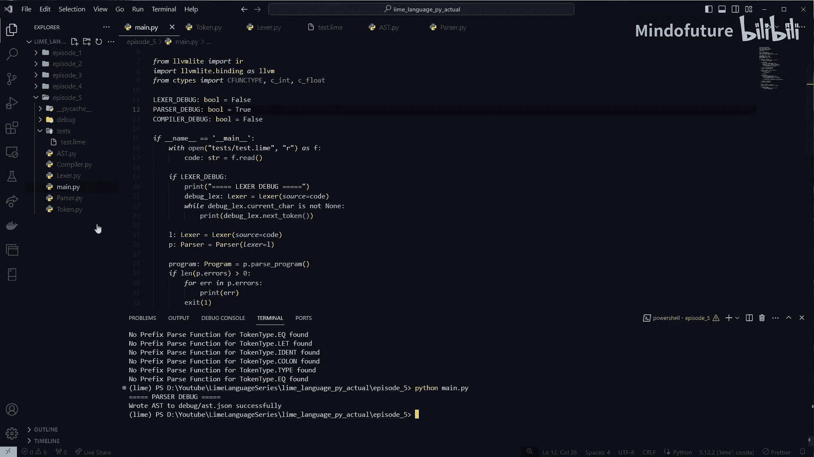
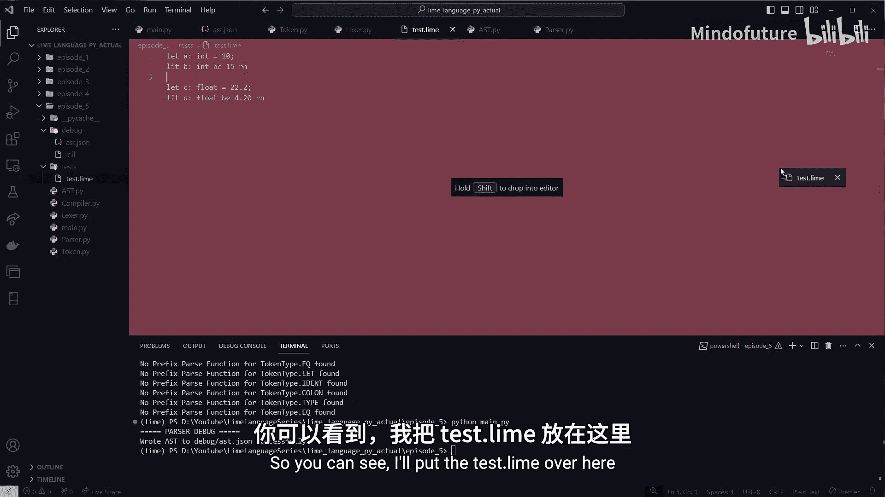
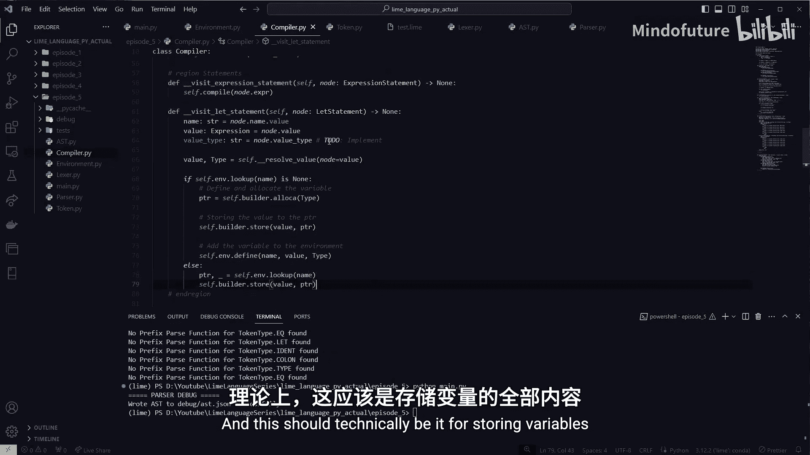
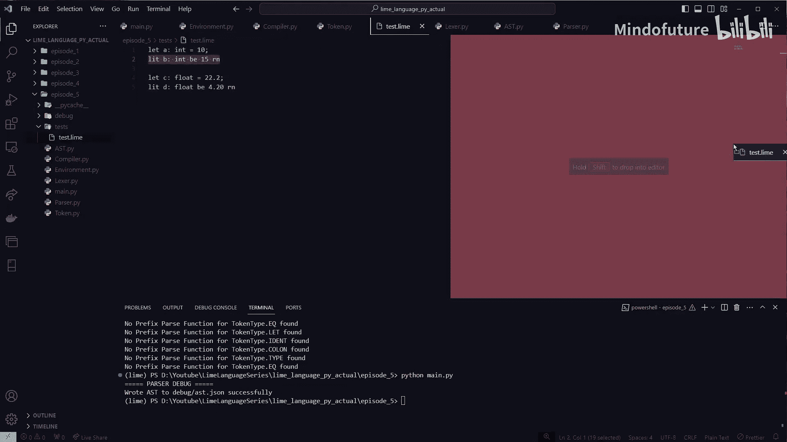
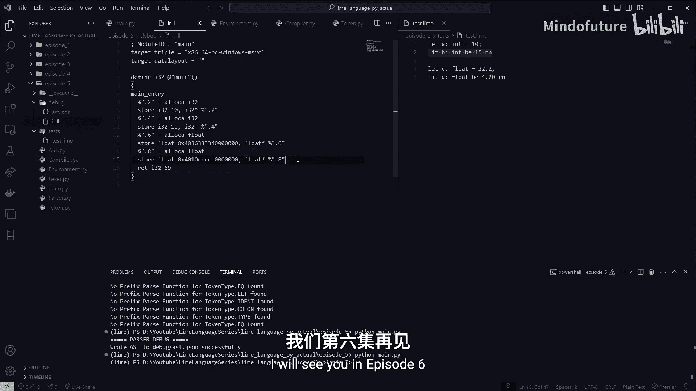

# 005：变量、符号表与 GenZ 语法

在本节课中，我们将学习如何为我们的编程语言添加变量声明功能。我们将实现一个符号表（环境）来管理变量，并支持两种语法风格：传统的 `let` 语句和更简洁的 “GenZ” 语法。

## 概述

我们将从扩展词法分析器（Lexer）开始，使其能够识别新的关键字和符号，例如 `let`、`:`、`=` 以及 “GenZ” 风格的替代词 `lit`、`B` 和 `RN`。接着，我们将更新抽象语法树（AST）和解析器（Parser），以支持变量声明节点。最后，我们将创建一个环境类（符号表）来存储和查找变量，并在编译器后端生成相应的 LLVM IR 代码。

## 词法分析器（Lexer）的扩展

首先，我们需要更新词法分析器，使其能够识别变量声明所需的新标记（Token）。

### 新增 Token 类型

在 `token.py` 文件中，我们添加以下新的 Token 类型：

```python
# 在 TokenType 枚举类中添加
LET = auto()      # let 关键字
TYPE = auto()     # 类型关键字（如 int, float）
IDENT = auto()    # 标识符（变量名）
COLON = auto()    # 冒号 :
EQ = auto()       # 等号 =
```

### 关键字与替代词映射

我们需要创建字典来映射关键字和“GenZ”风格的替代词到对应的 Token 类型。

```python
# 标准关键字映射
keywords: Dict[str, TokenType] = {
    "let": TokenType.LET
}

# “GenZ”风格替代词映射
alt_keywords: Dict[str, TokenType] = {
    "lit": TokenType.LET,  # lit 对应 let
    "B": TokenType.EQ,     # B 对应 =
    "RN": TokenType.SEMI   # RN 对应 ;
}

# 类型关键字列表
type_keywords: List[str] = ["int", "float"]
```

### 标识符查找函数

我们创建一个函数，用于判断一个字符串是关键字、替代词、类型关键字还是普通标识符。

```python
def lookup_ident(ident: str) -> TokenType | None:
    # 检查是否为标准关键字
    tt = keywords.get(ident)
    if tt is not None:
        return tt
    # 检查是否为替代词
    tt = alt_keywords.get(ident)
    if tt is not None:
        return tt
    # 检查是否为类型关键字
    if ident in type_keywords:
        return TokenType.TYPE
    # 否则，是普通标识符
    return TokenType.IDENT
```

### 更新 Lexer 逻辑

在 Lexer 的 `next_token` 方法中，我们需要添加对等号 `=` 和冒号 `:` 的识别，并添加识别标识符的逻辑。

```python
# 在 match 语句中添加对 `=` 和 `:` 的识别
case '=':
    tok = self.new_token(TokenType.EQ, self.cur_char)
case ':':
    tok = self.new_token(TokenType.COLON, self.cur_char)

# 在默认分支前，添加识别字母（标识符）的逻辑
if self._is_letter(self.cur_char):
    literal = self._read_identifier()
    tok_type = lookup_ident(literal)
    return self.new_token(tok_type, literal)
```

同时，需要实现辅助函数 `_is_letter` 和 `_read_identifier` 来识别由字母、数字和下划线组成的标识符。

## 抽象语法树（AST）的更新

接下来，我们定义两种新的 AST 节点来表示变量声明和标识符。

### Let 语句节点

`LetStatement` 节点表示一个变量声明语句。

```python
class LetStatement(Statement):
    def __init__(self, name: 'IdentifierLiteral', value: Expression, value_type: str):
        self.name = name        # 变量名（IdentifierLiteral 节点）
        self.value = value      # 初始值表达式
        self.value_type = value_type  # 声明的类型（如 “int”）
```

### 标识符字面量节点

`IdentifierLiteral` 节点表示一个变量名（标识符）。

```python
class IdentifierLiteral(Expression):
    def __init__(self, value: str):
        self.value = value      # 标识符的字符串值
        self.node_type = NodeType.IDENTIFIER_LITERAL
```

## 解析器（Parser）的更新

现在，我们需要更新解析器，使其能够解析变量声明语句。

### 解析语句的入口

在 `parse_statement` 函数中，我们根据当前 Token 的类型来决定如何解析。

```python
def parse_statement(self) -> Statement | None:
    match self.cur_token.type:
        case TokenType.LET:
            return self._parse_let_statement()
        case _:
            # 默认解析为表达式语句
            return self._parse_expression_statement()
```

### 解析 Let 语句

`_parse_let_statement` 函数负责解析完整的 `let` 声明语句。

```python
def _parse_let_statement(self) -> LetStatement | None:
    # 创建 LetStatement 节点
    stmt = LetStatement(None, None, None)

    # 1. 期望并消耗 `let` 关键字后的标识符（变量名）
    if not self._expect_peek(TokenType.IDENT):
        return None
    stmt.name = IdentifierLiteral(self.cur_token.literal)

    # 2. 期望并消耗类型前的冒号 `:`
    if not self._expect_peek(TokenType.COLON):
        return None

    # 3. 期望并消耗类型关键字（如 int）
    if not self._expect_peek(TokenType.TYPE):
        return None
    stmt.value_type = self.cur_token.literal

    # 4. 期望并消耗赋值等号 `=`
    if not self._expect_peek(TokenType.EQ):
        return None

    # 5. 解析等号右侧的表达式作为初始值
    stmt.value = self._parse_expression(Precedence.LOWEST)

    # 6. 可选：消耗语句结束的分号 `;` (或 RN)
    while not (self._cur_token_is(TokenType.SEMI) or self._cur_token_is(TokenType.EOF)):
        self.next_token()

    return stmt
```

## 符号表（环境）的实现





为了管理变量，我们需要创建一个 `Environment` 类作为符号表。

### Environment 类定义

```python
from llvmlite import ir

class Environment:
    def __init__(self, records: Dict[str, Tuple[ir.Value, ir.Type]] = None, parent: 'Environment' = None, name: str = "global"):
        self.records = records if records is not None else {}
        self.parent = parent
        self.name = name
```

### 定义变量

`define` 方法用于在环境中定义（存储）一个新变量。

```python
def define(self, name: str, value: ir.Value, value_type: ir.Type) -> ir.Value:
    self.records[name] = (value, value_type)
    return value
```

### 查找变量

`lookup` 方法用于查找一个变量。它首先在当前环境中查找，如果找不到，则递归地在父环境中查找。

```python
def lookup(self, name: str) -> Tuple[ir.Value, ir.Type] | None:
    # 内部解析函数
    def _resolve(n: str) -> Tuple[ir.Value, ir.Type] | None:
        if n in self.records:
            return self.records[n]
        elif self.parent is not None:
            return self.parent.lookup(n)  # 递归向上查找
        else:
            return None
    return _resolve(name)
```

## 编译器后端的更新

最后，我们需要更新编译器，使其能够处理 `LetStatement` 节点并生成分配内存和存储值的 LLVM IR 指令。

### 初始化环境

在编译器的 `__init__` 方法中，初始化全局环境。

```python
self.env = Environment()  # 全局符号表
```

### 编译 Let 语句

在 `visit_let_statement` 方法中，我们处理变量声明。

```python
def visit_let_statement(self, node: LetStatement) -> None:
    name = node.name.value      # 变量名
    # 解析初始值表达式，得到 LLVM 值和类型
    value, value_type = self._resolve_value(node.value)

    # 检查变量是否已定义
    existing = self.env.lookup(name)
    if existing is None:
        # 新变量：分配内存并存储
        ptr = self.builder.alloca(value_type, name=name)
        self.builder.store(value, ptr)
        self.env.define(name, ptr, value_type)
    else:
        # 已存在变量：直接存储新值到原有内存位置
        ptr, _ = existing
        self.builder.store(value, ptr)
```

### 处理标识符表达式

当在表达式中遇到标识符（如 `a`）时，我们需要从环境中加载其值。

```python
def _resolve_value(self, node: ASTNode) -> Tuple[ir.Value, ir.Type]:
    match node.node_type:
        case NodeType.IDENTIFIER_LITERAL:
            # 查找变量
            ptr, var_type = self.env.lookup(node.value)
            if ptr is None:
                raise NameError(f"Undefined variable: {node.value}")
            # 生成加载指令，获取变量的值
            loaded_value = self.builder.load(ptr, name=node.value)
            return loaded_value, var_type
        # ... 处理其他类型节点（如整数、浮点数）的代码 ...
```

## 测试与验证



现在，我们可以测试我们的实现了。以下是一些有效的示例代码：



```
let a: int = 10;
lit b B 15 RN
let k: int = 3 RN
```

运行编译器后，应该能生成正确的 LLVM IR 代码，其中包含为变量 `a`、`b`、`k` 分配内存和存储初始值的指令。

## 总结



在本节课中，我们一起学习了如何为我们的编程语言添加变量支持。我们扩展了词法分析器以识别新的关键字和符号，更新了 AST 和解析器来构建变量声明语句的语法树，实现了一个简单的符号表（`Environment` 类）来管理变量的作用域和存储，最后在编译器后端生成了分配和访问变量的 LLVM IR 代码。现在，我们的语言已经可以声明和使用变量了。在下一节课中，我们将添加用户自定义函数的功能，并实现一个 `printf` 函数来输出结果。