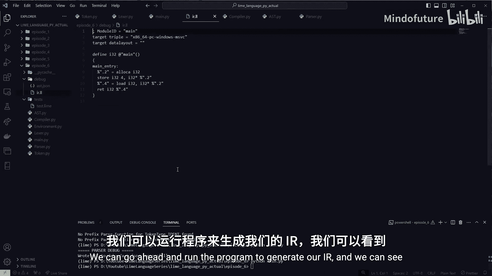
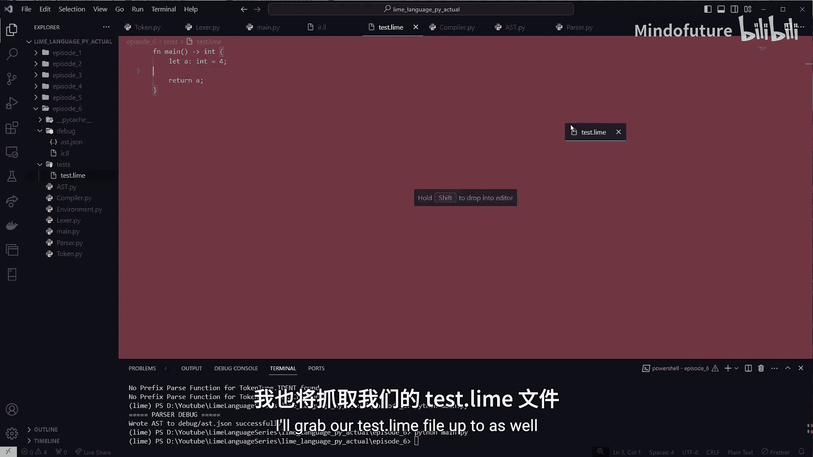
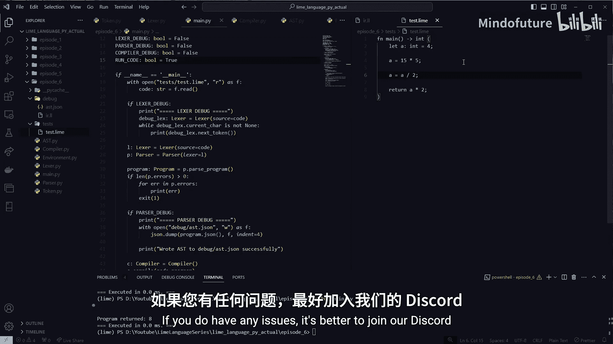

# 006：函数声明与 MCJIT 🚀

在本节课中，我们将学习如何实现用户自定义函数。我们将创建一个 `main` 函数，并将其作为程序的入口点。此外，我们还将使用 MCJIT 编译器来运行我们的程序，并验证其功能。

## 概述
本节课的目标是实现第一个用户自定义函数，即 `main` 函数，并将其作为程序的入口点。我们将编译这个函数，并在其中声明一个值为 4 的变量，然后返回这个变量。最后，我们将通过 MCJIT 编译器运行程序，验证其正确性。

---

## 6.1：扩展词法分析器（Lexer）🔧

上一节我们完成了基础解析，本节中我们来看看如何扩展词法分析器以支持新的关键字和符号。

首先，我们需要在 `token.py` 中添加新的令牌类型。以下是需要添加的关键字和符号：

*   `FN`：用于声明函数。
*   `RETURN`：用于返回语句。
*   `ARROW` (`->`)：用于函数类型声明。
*   `LBRACE` (`{`) 和 `RBRACE` (`}`)：用于代码块。

在 `token.py` 中，我们更新 `TokenType` 枚举和 `keywords` 字典。

```python
# 在 TokenType 枚举中添加
class TokenType(Enum):
    # ... 其他类型
    FN = 'FN'
    RETURN = 'RETURN'
    ARROW = 'ARROW'
    LBRACE = '{'
    RBRACE = '}'

# 在 keywords 字典中添加映射
keywords = {
    'fn': TokenType.FN,
    'return': TokenType.RETURN,
    # ... 其他关键字
}
```

接下来，在 `lexer.py` 中，我们需要处理新的符号，特别是箭头符号 `->`。

首先，添加一个辅助函数来预读字符：

```python
def _peek_char(self):
    if self._read_position >= len(self.input):
        return '\0'
    return self.input[self._read_position]
```

然后，在 `_next_token` 方法中处理减号和箭头符号：

```python
def _next_token(self):
    # ... 处理其他字符的逻辑

    elif ch == '-':
        # 处理箭头 (->)
        if self._peek_char() == '>':
            ch = self._ch
            self._read_char()
            tok = Token(TokenType.ARROW, ch + self._ch)
        else:
            tok = Token(TokenType.MINUS, ch)
        self._read_char()
        return tok

    # ... 处理左花括号和右花括号
    elif ch == '{':
        self._read_char()
        return Token(TokenType.LBRACE, ch)
    elif ch == '}':
        self._read_char()
        return Token(TokenType.RBRACE, ch)

    # ... 其他逻辑
```

---

## 6.2：扩展抽象语法树（AST）🌳

现在我们的词法分析器可以识别新的令牌了，接下来需要定义对应的 AST 节点。

我们需要三个新的节点类：
1.  `BlockStatement`：表示由花括号包裹的代码块。
2.  `ReturnStatement`：表示返回语句。
3.  `FunctionStatement`：表示函数声明。

在 `ast.py` 中定义这些类：

```python
class BlockStatement(Statement):
    def __init__(self, statements=None):
        self.statements = statements if statements is not None else []

class ReturnStatement(Statement):
    def __init__(self, return_value):
        self.return_value = return_value

class FunctionStatement(Statement):
    def __init__(self, name, parameters, return_type, body):
        self.name = name
        self.parameters = parameters  # 目前是空列表
        self.return_type = return_type
        self.body = body  # 一个 BlockStatement
```

---

## 6.3：扩展语法解析器（Parser）📝

有了 AST 节点后，我们需要在解析器中添加相应的解析逻辑。

首先，在 `parser.py` 中导入新的 AST 节点，并为标识符添加前缀解析函数：

```python
from ast import BlockStatement, FunctionStatement, ReturnStatement

# 在 _prefix_parse_fns 字典中注册标识符的解析方法
self._prefix_parse_fns[TokenType.IDENT] = self._parse_identifier

def _parse_identifier(self):
    return Identifier(self._cur_token.literal)
```

接着，在 `_parse_statement` 方法中添加对 `FN` 和 `RETURN` 令牌的处理：

```python
def _parse_statement(self):
    if self._cur_token.type == TokenType.FN:
        return self._parse_function_statement()
    elif self._cur_token.type == TokenType.RETURN:
        return self._parse_return_statement()
    # ... 处理其他语句类型
```

现在，我们来逐一实现这三个新的解析方法。首先是 `_parse_block_statement`：

```python
def _parse_block_statement(self):
    block = BlockStatement()
    self._next_token()  # 跳过 '{'
    while not self._cur_token.type in (TokenType.RBRACE, TokenType.EOF):
        stmt = self._parse_statement()
        if stmt:
            block.statements.append(stmt)
        self._next_token()
    return block
```

然后是 `_parse_return_statement`：

```python
def _parse_return_statement(self):
    stmt = ReturnStatement(None)
    self._next_token()  # 跳过 'return'
    stmt.return_value = self._parse_expression(LOWEST)
    if not self._expect_peek(TokenType.SEMICOLON):
        return None
    return stmt
```

最后是 `_parse_function_statement`，它稍微复杂一些：

```python
def _parse_function_statement(self):
    stmt = FunctionStatement(None, [], None, None)
    if not self._expect_peek(TokenType.IDENT):
        return None
    stmt.name = Identifier(self._cur_token.literal)
    if not self._expect_peek(TokenType.LPAREN):
        return None
    # TODO: 未来会在这里解析参数
    if not self._expect_peek(TokenType.RPAREN):
        return None
    if not self._expect_peek(TokenType.ARROW):
        return None
    if not self._expect_peek(TokenType.IDENT):  # 期望类型标识符，如 'int'
        return None
    stmt.return_type = self._cur_token.literal
    if not self._expect_peek(TokenType.LBRACE):
        return None
    stmt.body = self._parse_block_statement()
    return stmt
```

---

## 6.4：扩展编译器（Compiler）⚙️

解析器生成 AST 后，编译器需要将这些节点转换为 LLVM IR。

首先，在 `compiler.py` 的 `compile` 方法中添加对新节点的处理分支：

```python
def compile(self, node):
    method_name = f'_visit_{type(node).__name__}'
    visitor = getattr(self, method_name, self._no_visit_method)
    return visitor(node)

# 在编译方法的分支中添加
if isinstance(node, BlockStatement):
    return self._visit_BlockStatement(node)
elif isinstance(node, ReturnStatement):
    return self._visit_ReturnStatement(node)
elif isinstance(node, FunctionStatement):
    return self._visit_FunctionStatement(node)
```

然后实现各个访问方法。首先是 `BlockStatement`，它很简单：

```python
def _visit_BlockStatement(self, node):
    for statement in node.statements:
        self.compile(statement)
```

接着是 `ReturnStatement`：

```python
def _visit_ReturnStatement(self, node):
    return_val = self._resolve_value(node.return_value)
    self.builder.ret(return_val)
```

最后是核心的 `FunctionStatement`：

```python
def _visit_FunctionStatement(self, node):
    func_name = node.name.value
    return_type = self._type_map[node.return_type]  # 例如 llvm.IntType(32)
    param_types = []  # 目前没有参数
    func_type = llvm.FunctionType(return_type, param_types, False)
    function = llvm.Function(self.module, func_type, func_name)

    # 创建基本块
    entry_block = function.append_basic_block(f"{func_name}_entry")
    old_builder = self.builder
    self.builder = llvm.IRBuilder(entry_block)

    # 保存旧环境并创建新作用域
    old_env = self.env
    self.env = Environment(parent=old_env)
    self.env.define(func_name, function)

    # 编译函数体
    self.compile(node.body)

    # 恢复旧环境
    self.env = old_env
    self.env.define(func_name, function)  # 在全局作用域也定义该函数
    self.builder = old_builder
```





此外，我们需要修复 `Let` 语句中的一个 bug，确保存储的是指针地址而不是值：

```python
def _visit_LetStatement(self, node):
    # ... 之前的分配和存储逻辑
    # 修复：存储到指针，而不是值本身
    self.builder.store(value, ptr)  # 原来是 self.builder.store(value, value)
```

最后，更新 `_visit_Program` 方法，移除之前硬编码的 `main` 函数创建逻辑，使其直接编译程序中的语句列表。

---

## 6.5：使用 MCJIT 运行程序 🏃

现在，我们的编译器可以生成 LLVM IR 了。为了实际运行程序，我们将使用 MCJIT（运行时编译执行引擎）。

在 `main.py` 中，我们添加运行代码的逻辑：

```python
import llvm
import ctypes
import time

# ... 之前的编译代码，生成 self.module (一个 llvm.Module)

if run_code:
    llvm.initialize()
    llvm.initialize_native_target()
    llvm.initialize_native_asmprinter()

    try:
        llvm_ir_parsed = llvm.parse_assembly(str(self.module))
        llvm_ir_parsed.verify()
    except Exception as e:
        print(f"IR 验证失败: {e}")
        raise

    target = llvm.Target.from_default_triple()
    target_machine = target.create_target_machine()
    engine = llvm.create_mcjit_compiler(llvm_ir_parsed, target_machine)

    # 获取 main 函数地址
    func_ptr = engine.get_function_address("main")
    cfunc = ctypes.CFUNCTYPE(ctypes.c_int)(func_ptr)

    # 计时并执行
    start_time = time.time()
    result = cfunc()
    elapsed_time = time.time() - start_time

    print(f"程序返回: {result}")
    print(f"执行时间: {elapsed_time:.6f} 秒")
```

---

## 总结
本节课中我们一起学习了如何为我们的语言实现函数声明。我们扩展了词法分析器以识别 `fn`、`return`、`->`、`{` 和 `}` 等新令牌。然后，我们定义了 `BlockStatement`、`ReturnStatement` 和 `FunctionStatement` 等 AST 节点，并在解析器中实现了相应的解析逻辑。接着，我们在编译器中将这些 AST 节点转换为正确的 LLVM IR，包括创建函数、管理作用域和生成返回指令。最后，我们使用 LLVM 的 MCJIT 引擎来编译并运行生成的 IR 代码，成功执行了第一个返回值为 4 的 `main` 函数。



目前，我们已经实现了函数声明、返回语句和代码块。在下一节课（P07）中，我们将实现变量重新赋值功能，使变量可以被修改。