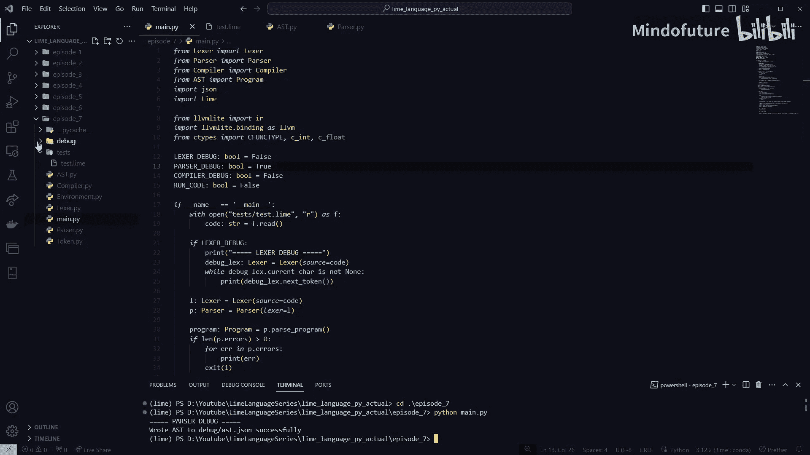
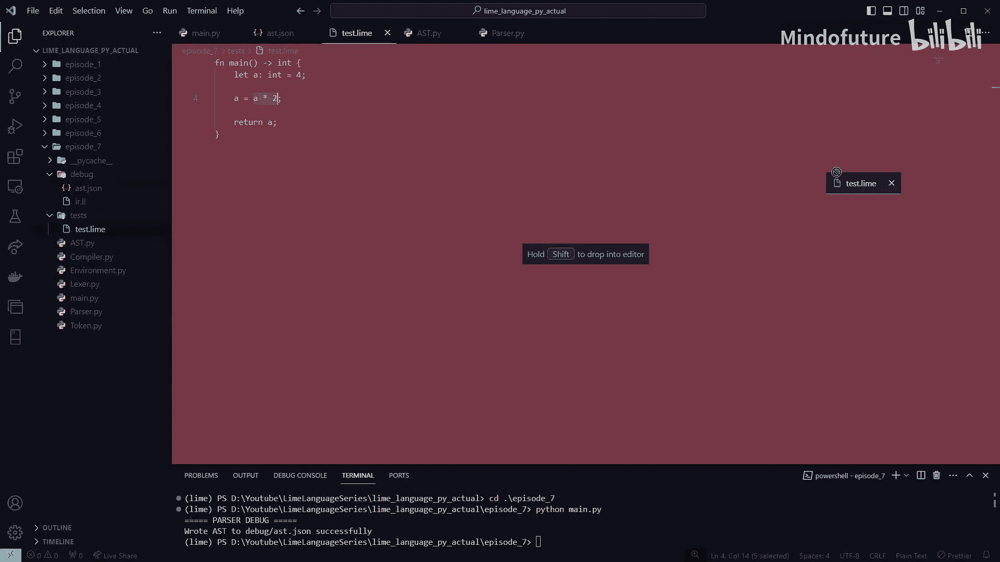
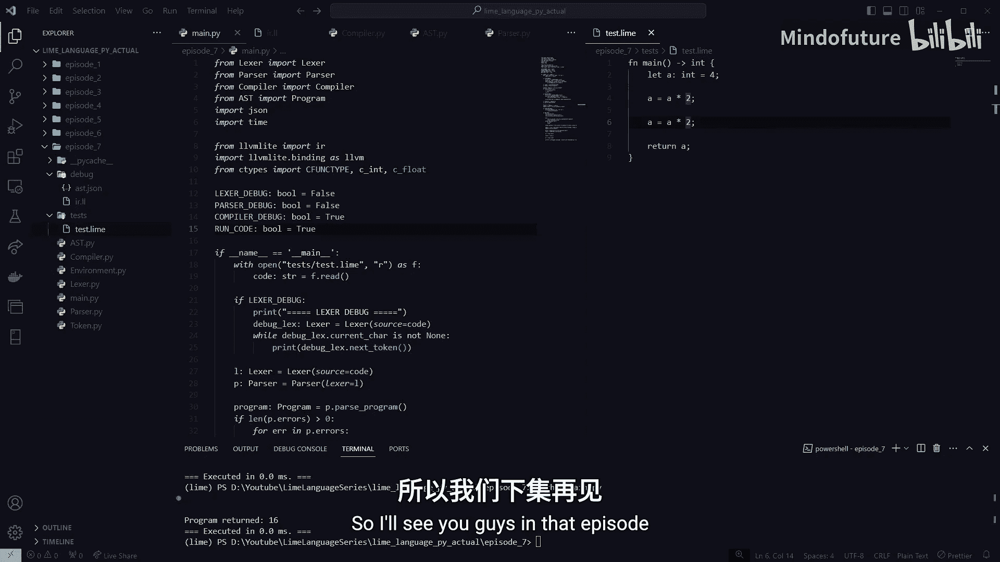

# 007：变量重新赋值

在本节课中，我们将学习如何为我们的编程语言实现变量重新赋值功能。我们将从定义抽象语法树节点开始，逐步完成解析和编译过程，最终让程序能够计算并返回重新赋值后的结果。

## 概述

上一节我们实现了用户自定义函数和主函数。本节我们将实现一个更简单的功能：变量重新赋值。我们将编写一个程序，先初始化一个变量，然后对其进行重新赋值，并返回新值。

## 解析器与抽象语法树

首先，我们需要在抽象语法树中定义一个新的节点类型来表示赋值语句。

在 `ast.py` 文件中，我们添加一个名为 `AssignStatement` 的类。这个类包含两个属性：`ident` 表示变量标识符，`right_value` 表示赋值表达式。

```python
class AssignStatement:
    def __init__(self, ident, right_value):
        self.ident = ident
        self.right_value = right_value

    def type(self):
        return NodeType.ASSIGN_STATEMENT

    def to_json(self):
        return {
            'type': self.type().value,
            'ident': self.ident.to_json(),
            'right_value': self.right_value.to_json()
        }
```

接下来，我们需要在解析器中识别并解析这种新的语句。

在 `parser.py` 的 `parse_statement` 函数中，我们检查当前令牌是否为标识符，并且下一个令牌是否为等号。如果是，则调用 `parse_assignment_statement` 函数。

```python
def parse_statement(self):
    if self.current_token.type == TokenType.IDENT and self.peek_token.type == TokenType.EQ:
        return self.parse_assignment_statement()
    # ... 其他语句的解析逻辑
```

`parse_assignment_statement` 函数负责构建 `AssignStatement` 节点。它首先跳过标识符和等号令牌，然后解析等号右侧的表达式。





```python
def parse_assignment_statement(self):
    stmt = AssignStatement(ident=self.current_token)
    self.next_token()  # 跳过标识符
    self.next_token()  # 跳过程序员
    stmt.right_value = self.parse_expression(Precedence.LOWEST)
    self.next_token()  # 为下一个语句做准备
    return stmt
```

## 编译器实现

解析器完成后，我们需要在编译器中处理新的赋值语句节点。

在 `compiler.py` 中，我们首先在 `compile_statement` 函数中添加对 `AssignStatement` 的处理。

```python
def compile_statement(self, node):
    node_type = node.type()
    if node_type == NodeType.ASSIGN_STATEMENT:
        return self.visit_assign_statement(node)
    # ... 其他语句的编译逻辑
```

然后，我们实现 `visit_assign_statement` 函数。这个函数的核心逻辑是：
1.  获取要赋值的变量名。
2.  编译右侧的表达式，得到新值。
3.  在符号表中查找该变量的内存地址（指针）。
4.  使用 LLVM 的 `store` 指令将新值存入该内存地址。

```python
def visit_assign_statement(self, node):
    name = node.ident.value
    value = self._resolve_value(node.right_value)

    # 在符号表中查找变量
    ptr = self.env.lookup(name)
    if ptr is None:
        self.errors.append(f"Undefined variable '{name}'")
        return

    # 生成存储指令：将新值存入变量地址
    self.builder.store(value, ptr)
```

## 测试与验证

完成实现后，我们编写一个测试程序来验证功能。

```python
def main():
    let a = 4
    a = a * 2
    return a
```

运行编译器，生成的 LLVM IR 代码应包含加载原值、计算新值、存储新值并返回的指令。执行该程序，应返回结果 `8`。

我们可以进一步测试连续赋值，例如 `a = a * 2` 执行两次，最终应返回 `16`。

## 总结

本节课我们一起学习了如何为编程语言实现变量重新赋值功能。我们完成了从抽象语法树定义、解析器识别到编译器代码生成的全过程。现在，我们的语言已经能够处理变量值的更新。



下一节，我们将为语言添加条件语句和布尔类型，实现更复杂的程序逻辑。