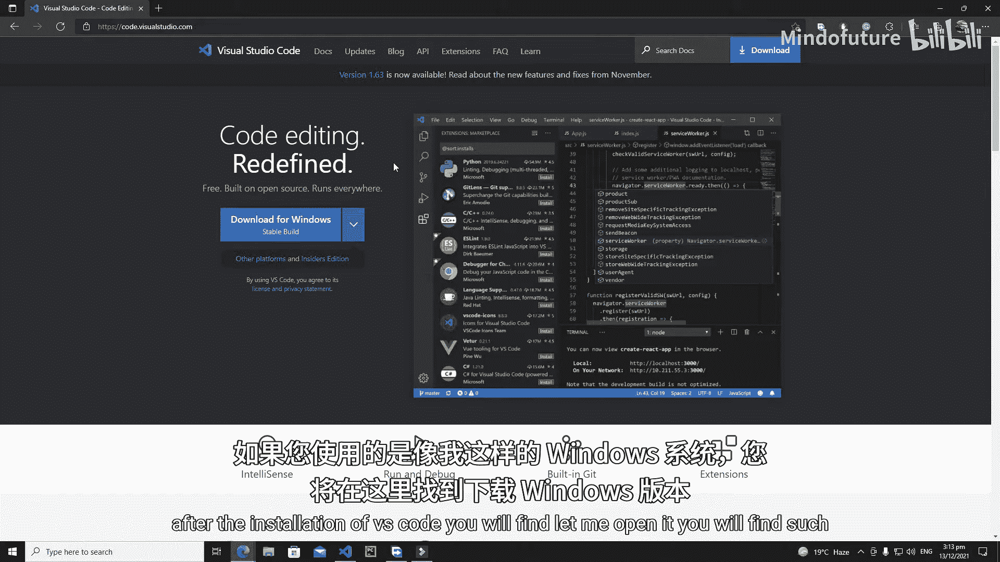
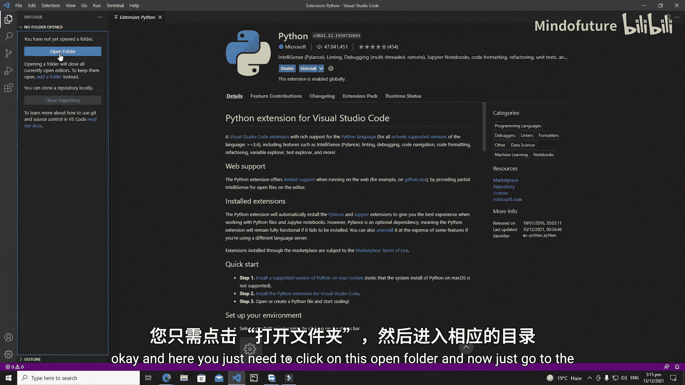
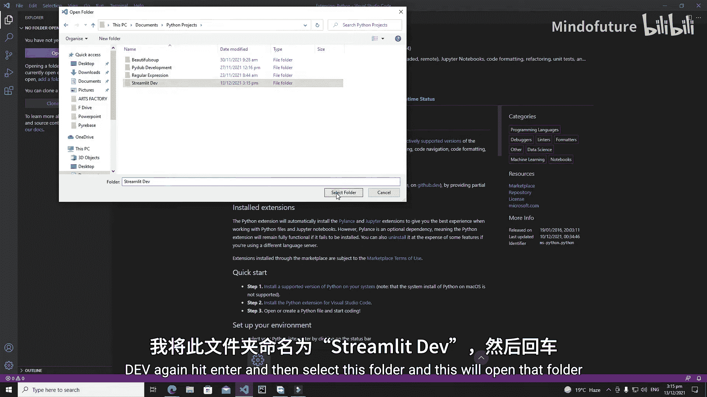
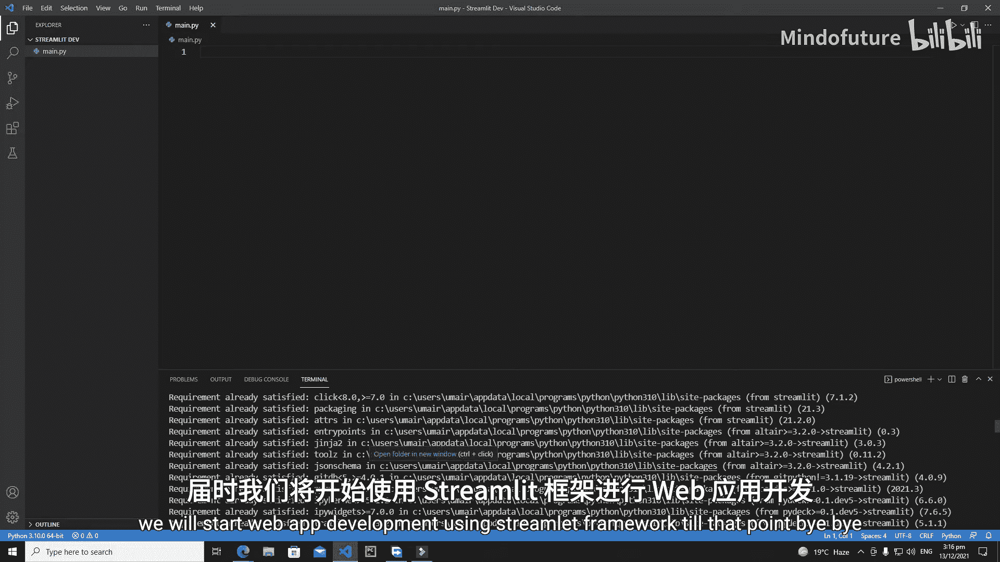

# 002：搭建 Streamlit 开发环境 🛠️

在本节课中，我们将学习如何为 Streamlit 开发搭建一个完整的编程环境。我们将安装必要的软件、配置开发工具，并准备好第一个项目。

## 概述

要开始使用 Streamlit 开发 Web 应用程序，首先需要一个集成开发环境（IDE）和 Python 环境。本节将指导你完成 Visual Studio Code 的安装、Python 扩展的配置、项目文件夹的创建以及 Streamlit 库的安装。

---

## 安装 Visual Studio Code

首先，你需要一个用于 Streamlit 开发的 IDE。本教程将使用 Visual Studio Code。Visual Studio Code 是开发 Web 应用程序的优秀工具。

如果你已经安装了 Visual Studio Code，可以跳过本部分。如果尚未安装，请按照以下步骤操作：

1.  访问 Visual Studio Code 官方网站：`https://code.visualstudio.com/`。
2.  根据你的操作系统（Windows、Mac 或 Linux）选择相应的下载选项。
3.  下载完成后，双击安装程序，按照提示点击“下一步”完成安装。

安装完成后，你将看到类似下图的界面。




---

## 安装 Python 扩展

上一节我们安装了 IDE，本节中我们来看看如何为其添加 Python 支持。在 Visual Studio Code 中，你需要安装 Python 扩展来获得代码高亮、调试、智能提示等功能。

以下是安装步骤：

1.  点击左侧活动栏的“扩展”图标（或使用快捷键 `Ctrl+Shift+X`）。
2.  在搜索框中输入“Python”并按下回车。
3.  在搜索结果中找到由 Microsoft 发布的“Python”扩展，点击“安装”按钮。


这个扩展对于 Python 开发非常有帮助，提供了链接、调试、代码提示等诸多功能。

---

## 创建项目文件夹

安装好 Python 扩展后，我们需要创建一个文件夹来存放所有的项目文件。

操作步骤如下：

1.  点击左侧活动栏的“资源管理器”图标（或使用快捷键 `Ctrl+Shift+E`）。
2.  点击“打开文件夹”按钮。
3.  浏览到你希望创建项目的目录（例如“文档”或“桌面”）。
4.  点击“新建文件夹”按钮，创建一个新文件夹，可以将其命名为 `streamlit_dev`。
5.  选择这个新文件夹并点击“选择文件夹”。系统可能会询问你是否信任该文件夹的作者，选择“是”。





现在，你的项目文件夹已经在 Visual Studio Code 中成功打开。

---

## 创建 Python 文件

环境准备就绪后，我们可以在项目中创建第一个 Python 文件。

以下是创建方法：

1.  在资源管理器中，将鼠标悬停在你的项目文件夹名称上，会出现几个图标。
2.  点击“新建文件”图标。
3.  为文件命名，并确保以 `.py` 作为扩展名。例如，可以命名为 `main.py`，然后按下回车。



现在，你就可以在这个文件中开始编写 Streamlit 应用程序代码了。


---

## 安装 Streamlit 库

最后一步是安装 Streamlit 框架本身。我们将使用 Python 的包管理工具 `pip` 来完成安装。

以下是安装步骤：

1.  在 Visual Studio Code 中，打开终端。你可以通过菜单栏选择“终端”->“新建终端”，或使用快捷键 `` Ctrl+` ``。
2.  在终端中，输入以下命令并按下回车：
    ```bash
    pip install streamlit
    ```
3.  等待安装完成。如果之前已经安装过，终端会显示“Requirement already satisfied”。

安装完成后，你的 Streamlit 开发环境就全部配置好了。

---

## 总结


本节课中，我们一起学习了搭建 Streamlit 开发环境的完整流程。我们安装了 Visual Studio Code 作为 IDE，配置了必要的 Python 扩展，创建了项目文件夹和 Python 文件，并最终通过 `pip` 安装了 Streamlit 库。现在，你的开发环境已经准备就绪，在下一节课中，我们将开始使用 Streamlit 框架进行真正的 Web 应用开发。