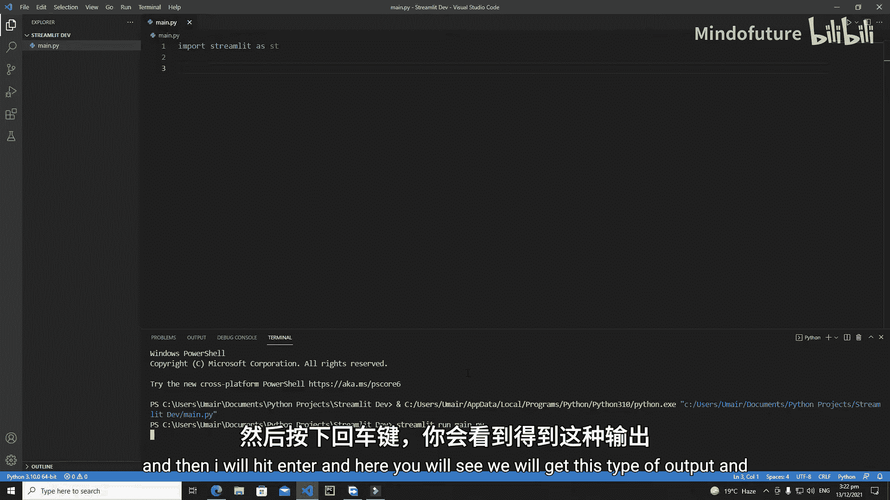
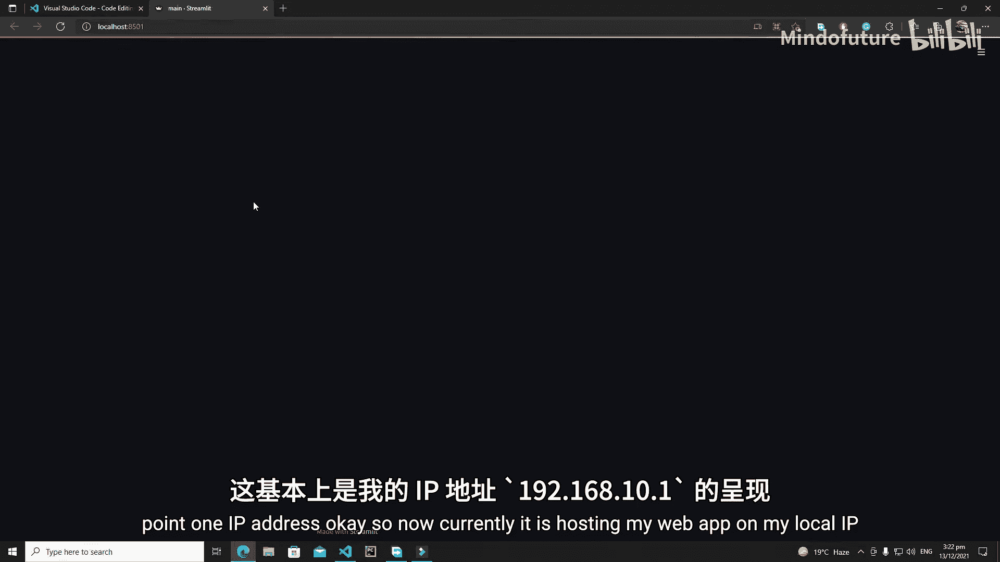
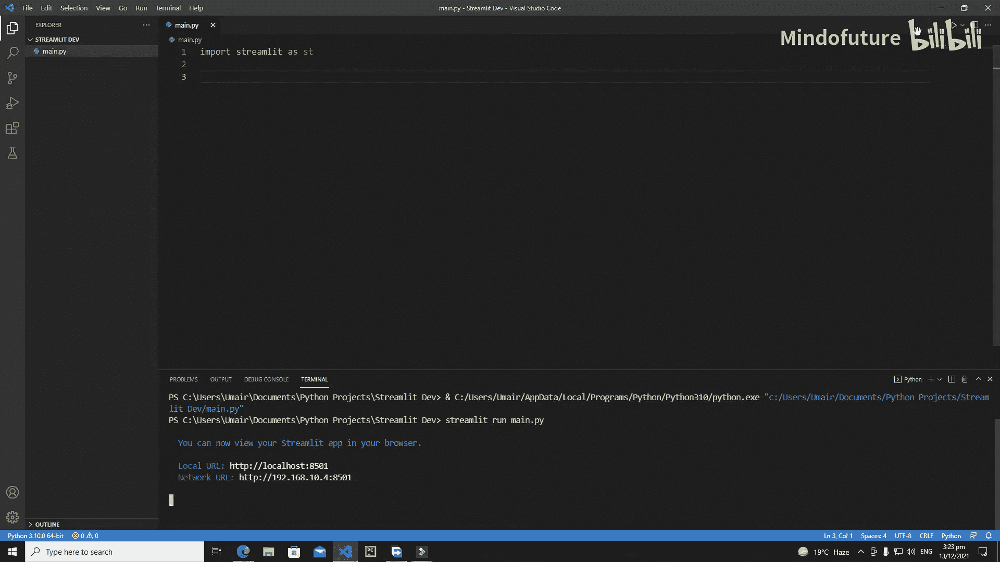
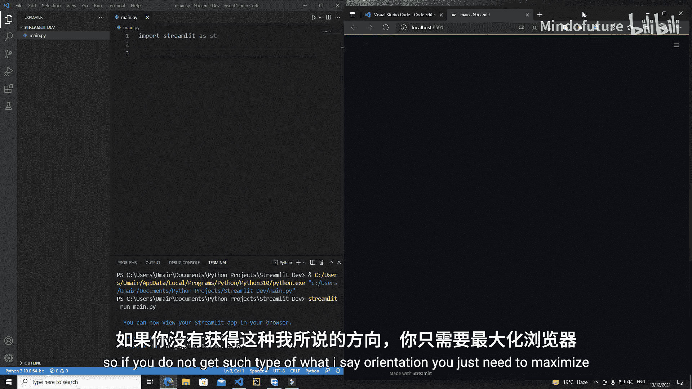
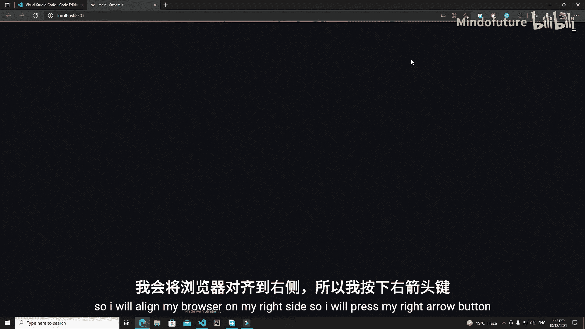
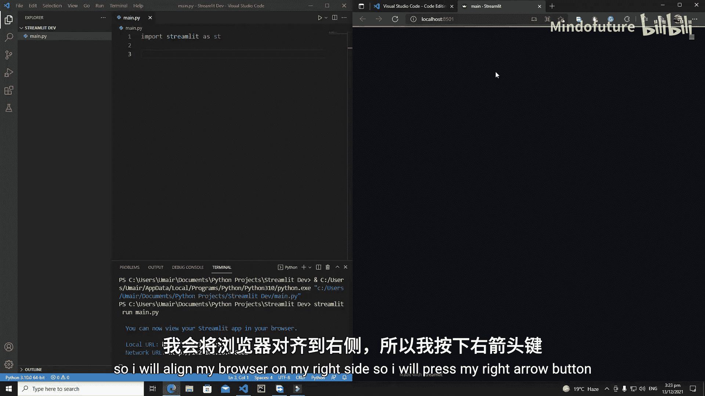
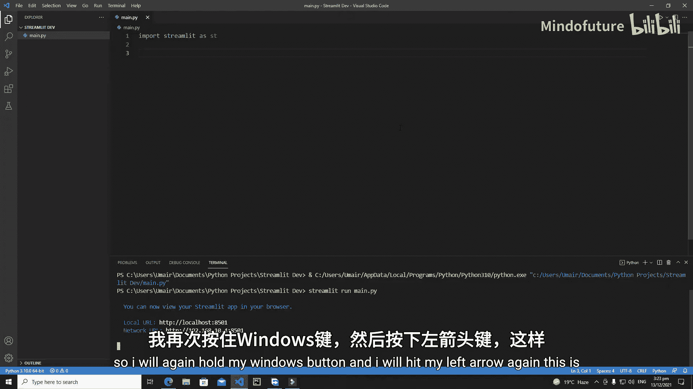
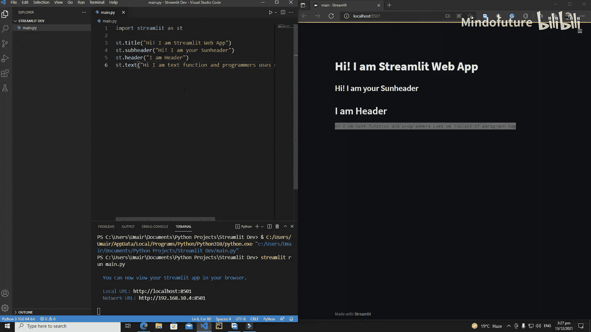

# 003：Streamlit 基础文本元素 🎯

在本节课中，我们将开始使用 Streamlit 进行实际的 Web 应用开发。我们将学习如何导入 Streamlit 库、运行一个应用，并创建基础的文本元素，如标题、页眉、子标题和普通文本。

## 导入与运行 Streamlit 应用

首先，我们需要导入 Streamlit 库。大多数程序员习惯使用 `st` 作为别名，但本教程将使用 `s` 作为别名。

```python
import streamlit as s
```

导入后，保存文件。但请注意，运行 Streamlit 应用的方式与运行普通 Python 脚本不同。你不能直接点击 IDE 中的“运行”按钮。

以下是运行 Streamlit 应用的正确方法：

1.  打开终端。
2.  输入命令 `streamlit run`，后跟你的 Python 文件名。
3.  例如，如果文件名为 `main.py`，则命令为：`streamlit run main.py`。



执行此命令后，终端会显示一个本地 URL（通常是 `http://localhost:8501`）和一个网络 URL。在浏览器中打开本地 URL，即可看到你的 Streamlit 应用。



为了便于开发，你可以将代码编辑器（如 VS Code）和浏览器窗口并排排列。在 Windows 系统中，你可以按住 `Windows` 键并使用方向键来调整窗口位置。

## 创建基础文本元素

成功运行应用后，我们就可以开始添加内容了。Streamlit 提供了几个简单的函数来创建文本元素。

### 添加标题





使用 `s.title()` 函数可以创建一个主标题。它接受一个字符串参数作为标题内容。







```python
s.title("Hi, I am a Streamlit Web App")
```

保存文件后，浏览器中的页面会自动刷新，显示出你创建的大标题。

### 添加页眉与子标题

除了主标题，你还可以添加页眉和子标题，它们通常用于组织章节或次要标题。

*   **页眉**：使用 `s.header()` 函数。
*   **子标题**：使用 `s.subheader()` 函数。

以下是示例代码：

```python
s.header("I am a header")
s.subheader("Hi, I am your subheader")
```

页眉和子标题在字体大小和样式上略有区别，子标题通常比页眉更小、颜色更浅。

### 添加普通文本

如果你需要添加段落式的普通文本，可以使用 `s.text()` 函数。这个函数类似于 HTML 中的 `<p>`（段落）标签。

```python
s.text("Hi, I am text function and programmers use me in place of paragraph tag.")
```

`s.text()` 函数会以等宽字体显示文本，适合展示代码片段或简单的说明文字。

## 总结

本节课我们一起学习了 Streamlit 应用开发的起点。我们掌握了如何正确导入库并使用 `streamlit run` 命令来启动应用。接着，我们探索了四个基础的文本元素函数：`s.title()`、`s.header()`、`s.subheader()` 和 `s.text()`。通过这些函数，我们能够快速地为 Web 应用添加不同层级的标题和说明文字，整个过程完全使用 Python 代码完成，无需接触前端 HTML/CSS。



在下一节教程中，我们将继续探讨 Streamlit 的其他功能和方法，为应用添加更多交互性和丰富的组件。