# 004：Streamlit 的更多文本元素

在本节课中，我们将学习 Streamlit 中用于处理文本的几个重要函数，包括 `st.markdown`、`st.caption`、`st.latex`、`st.json` 和 `st.code`。这些函数能帮助你为应用添加格式丰富的文本、数学公式、结构化数据和代码片段。

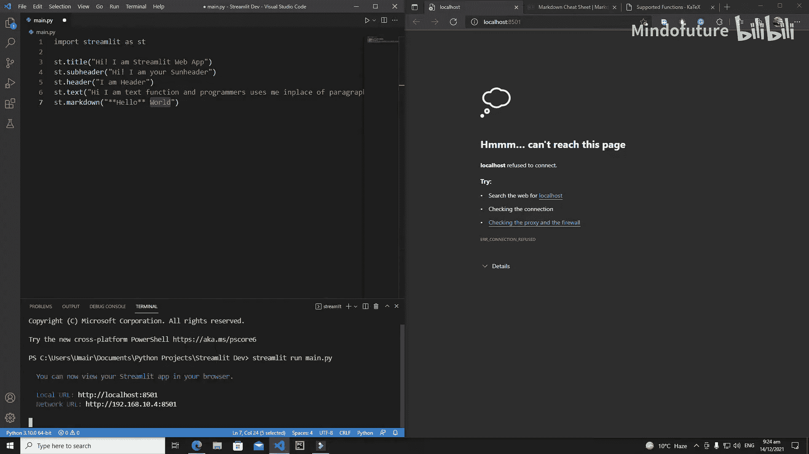

## 使用 Markdown 格式化文本

上一节我们介绍了基本的文本输出，本节中我们来看看如何使用 `st.markdown` 函数来应用 Markdown 语法，从而在应用中实现加粗、斜体、标题、列表、链接等多种富文本效果。

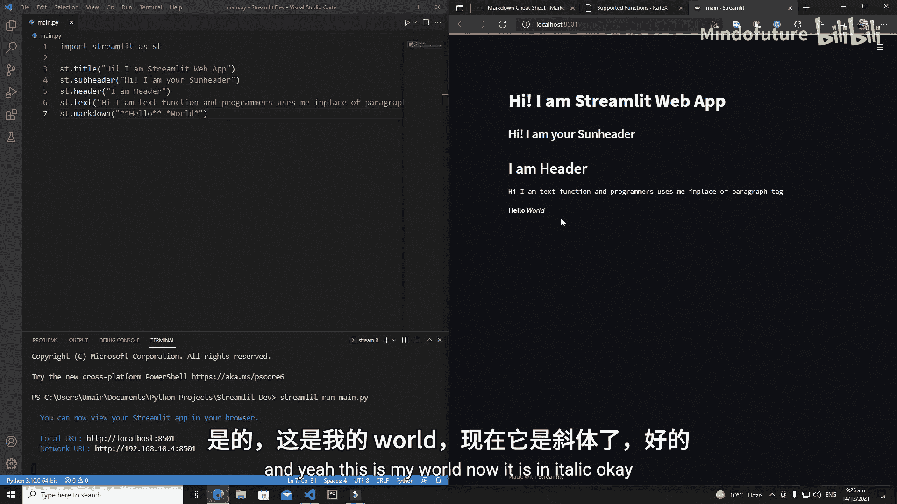

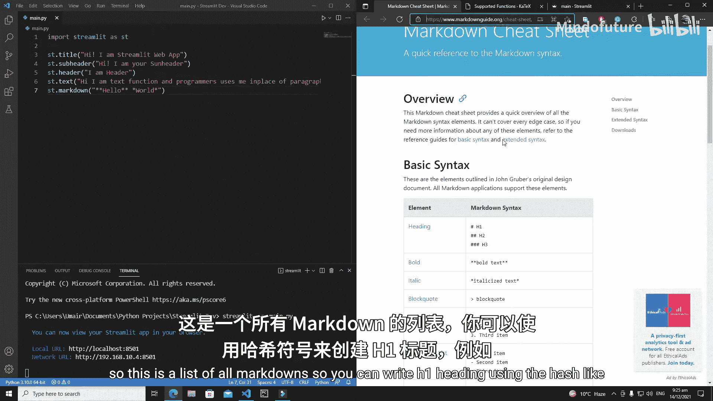

其基本语法是：
```python
st.markdown("你的Markdown文本")
```

例如，要显示加粗的“Hello”和普通的“World”：
```python
st.markdown("**Hello** World")
```
要显示斜体的“World”：
```python
st.markdown("*World*")
```

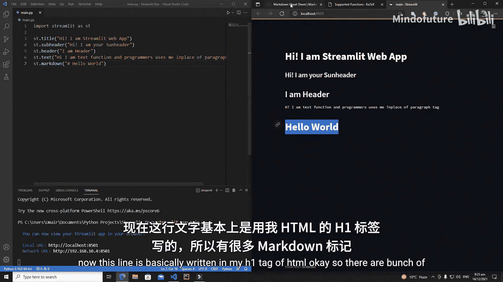

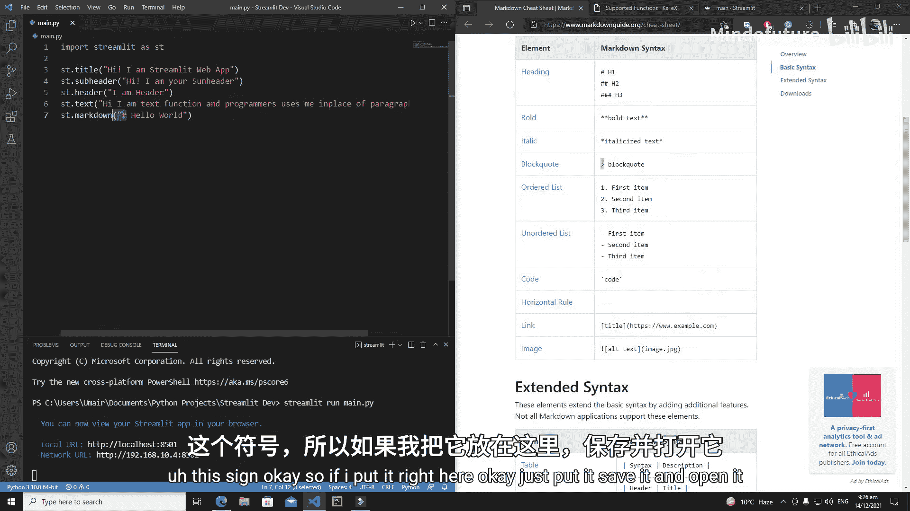

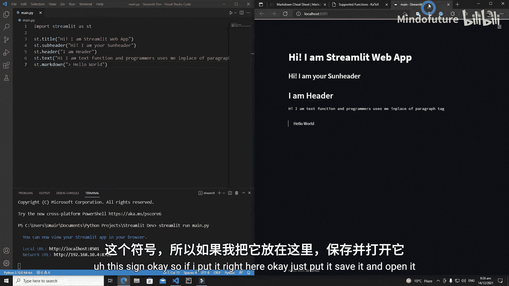

以下是常用的 Markdown 语法示例列表：
*   **标题**：使用 `#` 符号，例如 `# 一级标题`。
*   **加粗文本**：使用两个星号 `**` 包裹文本，例如 `**加粗**`。
*   **斜体文本**：使用一个星号 `*` 包裹文本，例如 `*斜体*`。
*   **代码块**：使用三个反引号 ``` 包裹代码。
*   **有序列表**：使用数字和点，例如 `1. 第一项`。
*   **无序列表**：使用短横线 `-` 或星号 `*`，例如 `- 项目`。
*   **水平线**：使用三个短横线 `---`。
*   **链接**：使用 `[链接文本](网址)` 格式，例如 `[Google](https://www.google.com)`。
*   **图片**：使用 `` 格式。

你可以通过专门的 Markdown 指南网站查看更多详细语法。

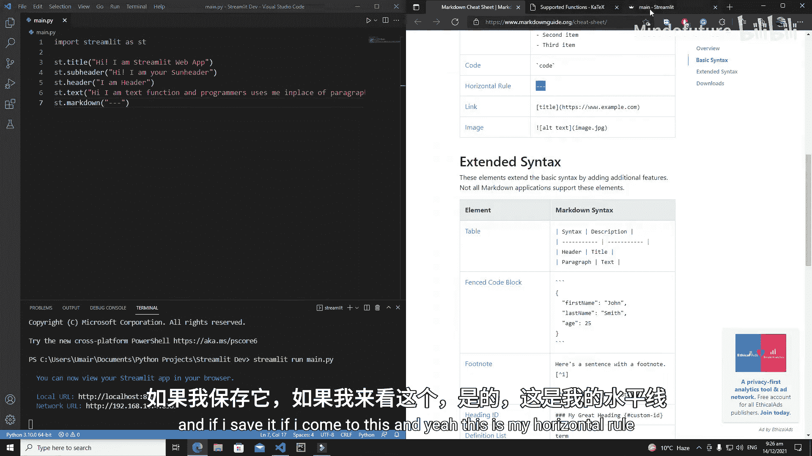

## 添加标题和说明文字

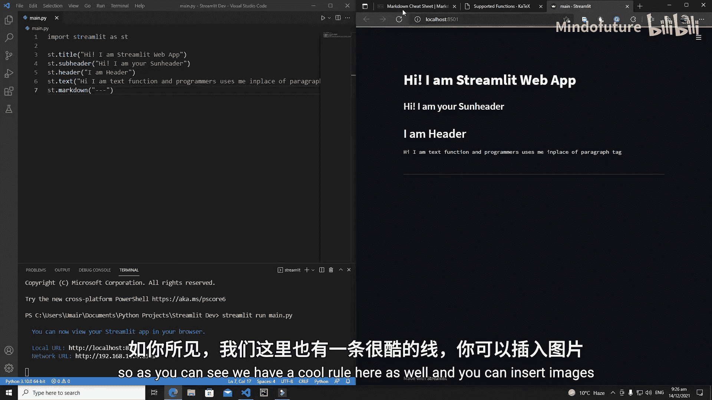

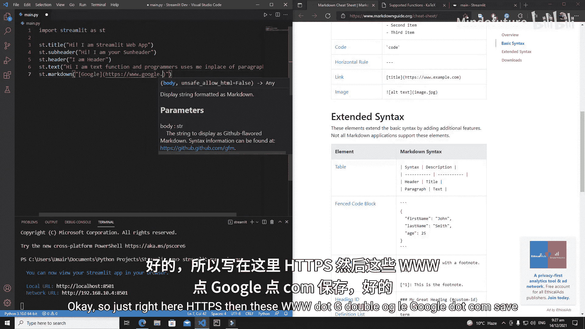

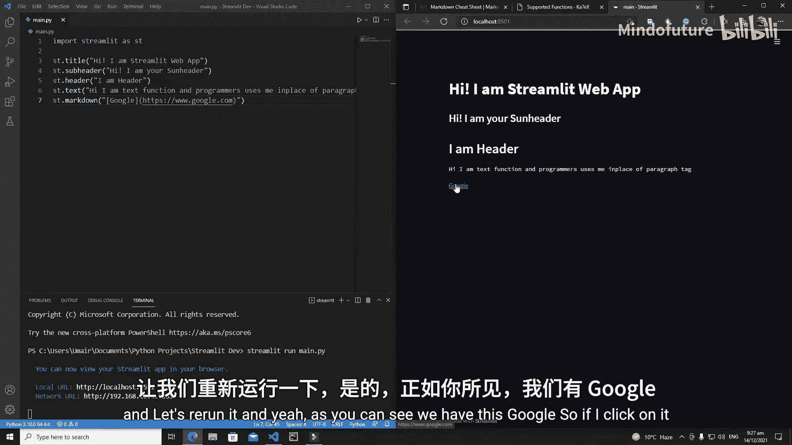

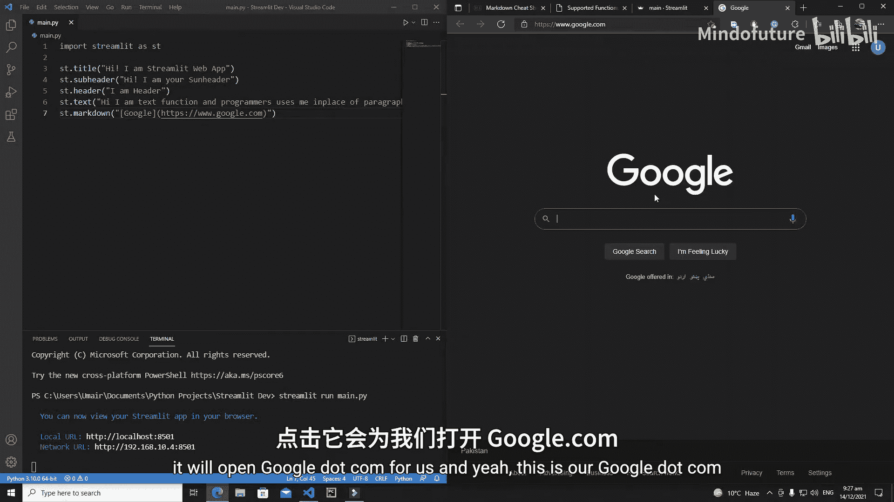

除了主内容，我们经常需要添加一些辅助性文字。`st.caption` 函数用于显示小号的说明文字，通常用于图注或补充说明。

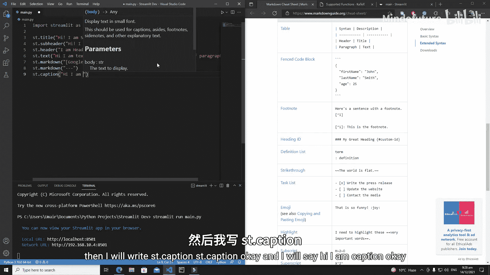

```python
st.caption("这是一条说明文字")
```

## 嵌入数学公式

如果你的应用涉及数学或科学计算，可以使用 `st.latex` 函数来渲染 LaTeX 格式的数学公式。这需要在字符串前加上 `r` 将其标记为原始字符串，以防止转义字符被误解。

例如，显示一个 2x2 矩阵：
```python
st.latex(r"""
\begin{pmatrix}
a & b \\
c & d
\end{pmatrix}
""")
```

互联网上有丰富的 LaTeX 语法资源，你可以查找并复制所需的公式代码。

## 展示 JSON 数据

在数据科学应用中，经常需要清晰展示 JSON 格式的数据结构。`st.json` 函数可以美观地渲染 JSON 对象，并支持折叠展开，便于查看。

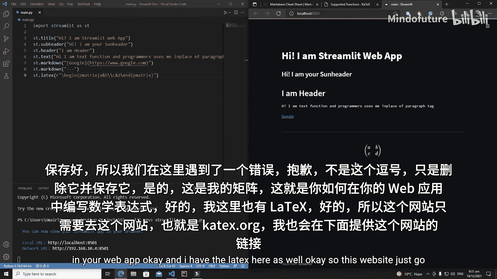

```python
import json
data = {"a": [1, 2, 3], "b": [4, 5, 6]}
st.json(data)
```

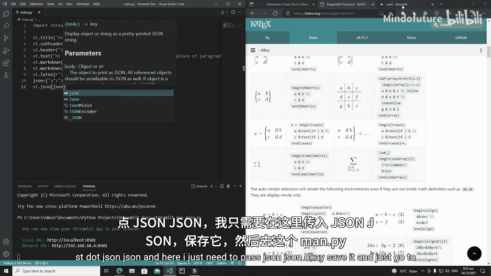

## 高亮显示代码

最后，`st.code` 函数允许你在应用中嵌入并高亮显示代码片段。这对于展示算法、示例代码或配置非常有用。你可以通过 `language` 参数指定编程语言以获得正确的语法高亮。

显示一段 Python 代码：
```python
code = '''
def hello():
    print("Hello World")
    return 0
'''
st.code(code, language='python')
```

---

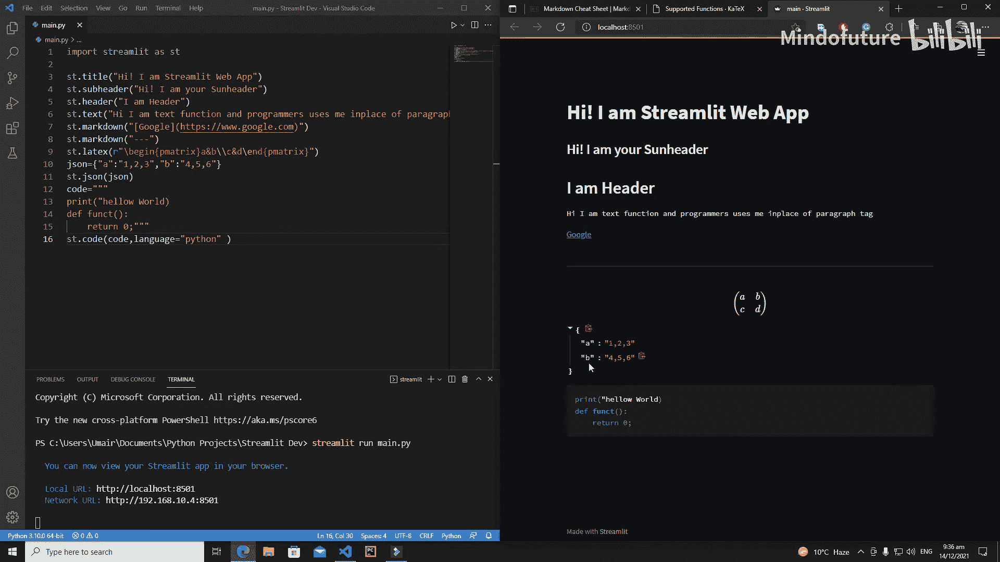

本节课中我们一起学习了 Streamlit 中五个强大的文本处理函数：`st.markdown` 用于富文本格式化，`st.caption` 用于添加说明，`st.latex` 用于渲染数学公式，`st.json` 用于展示结构化数据，以及 `st.code` 用于高亮显示代码。灵活运用这些函数，可以极大地增强你应用的表达力和专业性。