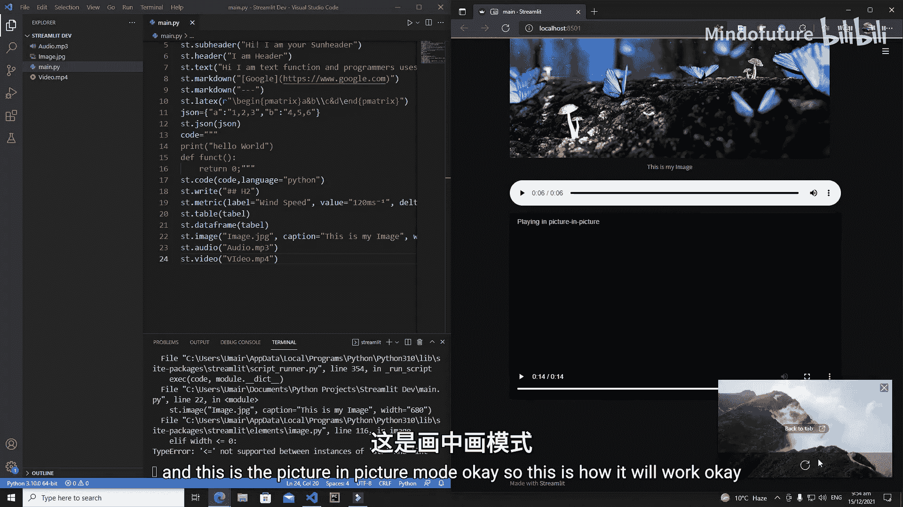
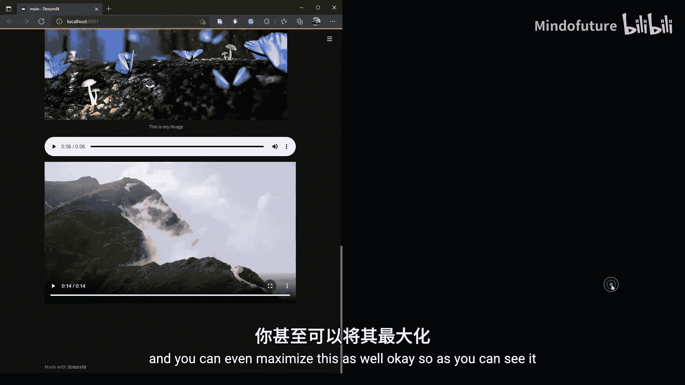
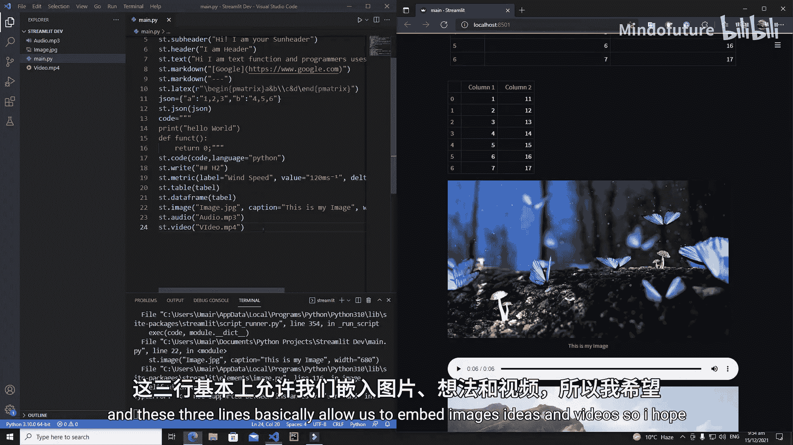

# 006：Streamlit媒体组件

在本节课中，我们将学习如何在你的Streamlit网络应用中嵌入音频、图片和不同类型的视频。嵌入这些媒体元素是增强应用交互性和吸引力的重要方式。

## 概述

Streamlit提供了简单直观的函数来处理媒体文件。我们将学习使用 `st.image()`、`st.audio()` 和 `st.video()` 这三个核心函数，分别用于嵌入图片、音频和视频。这些函数封装了复杂的HTML和JavaScript代码，让开发者能够通过一行Python代码实现丰富的媒体展示功能。

## 嵌入图片

上一节我们介绍了课程概述，本节中我们来看看如何嵌入图片。使用 `st.image()` 函数可以轻松地在应用中显示图片。

以下是 `st.image()` 函数的基本用法和参数：

```python
st.image(image, caption=None, width=None, use_column_width=None, clamp=False, channels=“RGB”, output_format=“auto”)
```

*   **`image`**： 要显示的图片。可以是图片路径（字符串）、类似文件的对象、或表示图片的numpy数组。
*   **`caption`**： 图片下方的标题文字。
*   **`width`**： 指定图片的显示宽度（像素）。例如 `width=680`。
*   **`use_column_width`**： 如果设置为 `True`，图片宽度将自动调整为列宽。
*   **`channels`**： 颜色通道，默认为 `“RGB”`。如果图片是 `“BGR”` 格式则需要指定。
*   **`output_format`**： 输出格式，如 `“JPEG”`、`“PNG”` 或 `“auto”`。

让我们通过一个例子来实践。假设我们有一个名为 `image.jpg` 的图片文件。

```python
import streamlit as st

# 嵌入一张图片
st.image(‘image.jpg’)
```

运行上述代码后，图片就会显示在应用中。我们可以为图片添加标题和调整宽度，使展示效果更好。

```python
import streamlit as st

# 嵌入一张带有标题和指定宽度的图片
st.image(‘image.jpg’, caption=‘这是一张示例图片’, width=680)
```

## 嵌入音频

学会了嵌入图片后，接下来我们看看如何为应用添加声音。使用 `st.audio()` 函数可以嵌入音频文件。

以下是 `st.audio()` 函数的基本用法：

```python
st.audio(data, format=“audio/wav”, start_time=0)
```

*   **`data`**： 音频数据。可以是文件路径（字符串）、类似文件的对象、字节或numpy数组。
*   **`format`**： 音频文件的格式，如 `“audio/mp3”`、`“audio/wav”`。Streamlit会根据文件扩展名自动推断，但也可以手动指定。
*   **`start_time`**： 从音频的第几秒开始播放（默认从0秒开始）。

假设我们有一个名为 `audio.mp3` 的音频文件，嵌入方法非常简单。

```python
import streamlit as st

# 嵌入一个音频文件
st.audio(‘audio.mp3’)
```

运行后，页面上会出现一个音频播放器。用户可以播放、暂停、调整音量、下载音频，甚至可以调整播放速度。

## 嵌入视频

最后，我们来学习如何嵌入视频，这是展示动态内容最直接的方式。使用 `st.video()` 函数可以嵌入视频文件。

以下是 `st.video()` 函数的基本用法：

```python
st.video(data, format=“video/mp4”, start_time=0)
```

*   **`data`**： 视频数据。可以是文件路径（字符串）、类似文件的对象、字节或numpy数组。
*   **`format`**： 视频文件的格式，如 `“video/mp4”`、`“video/webm”`。通常会自动推断。
*   **`start_time`**： 从视频的第几秒开始播放。

假设我们有一个名为 `video.mp4` 的视频文件。

```python
import streamlit as st

# 嵌入一个视频文件
st.video(‘video.mp4’)
```

嵌入后，应用中将显示一个功能完整的视频播放器。用户可以进行播放、全屏、画中画、下载、调速等操作，体验与主流视频网站一致。



## 总结





本节课中我们一起学习了Streamlit中三个强大的媒体组件。我们掌握了如何使用 `st.image()` 嵌入并自定义图片，使用 `st.audio()` 添加音频播放功能，以及使用 `st.video()` 嵌入交互式视频。这些组件极大地简化了在Web应用中集成多媒体内容的过程，只需几行代码即可实现专业的效果。掌握它们，能让你的Streamlit应用更加生动和富有表现力。