# 008：Streamlit 基础交互组件 🎛️

在本节课中，我们将学习 Streamlit 中的一些基础交互组件。这些组件能让你的网页应用与用户进行互动，是构建动态应用的核心。

我们将从**复选框**开始，然后逐一学习**单选按钮**、**按钮**、**下拉选择框**和**多选下拉框**。每个组件都有其独特的属性和用途，我们将通过简单的代码示例来理解它们的工作原理。

---

## 复选框 ✅

首先，我们来看看复选框。复选框允许用户在两种状态（选中/未选中）之间切换。

在 Streamlit 中，我们使用 `st.checkbox` 来创建复选框。它有几个重要的参数：
*   `label`：复选框旁边显示的标签文本。
*   `value`：复选框的默认状态，`True` 为选中，`False` 为未选中。
*   `on_change`：当复选框状态改变时触发的回调函数。
*   `key`：为复选框分配一个唯一的标识符，用于在会话状态中访问它。

以下是创建和使用复选框的代码示例：

```python
import streamlit as st

# 创建一个复选框，默认未选中
cb_state = st.checkbox('这是一个复选框', value=False)

# 根据复选框的状态显示不同内容
if cb_state:
    st.write('你好！')
else:
    pass  # 什么都不做
```

运行上面的代码，你会看到一个复选框。勾选它，页面会显示“你好！”；取消勾选，文字消失。

### 使用回调函数和会话状态

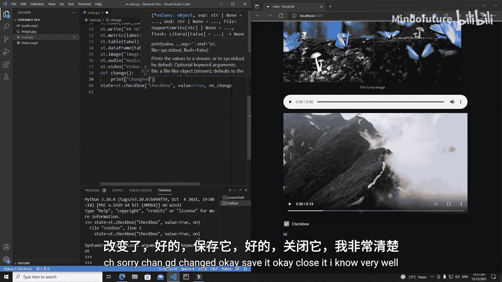

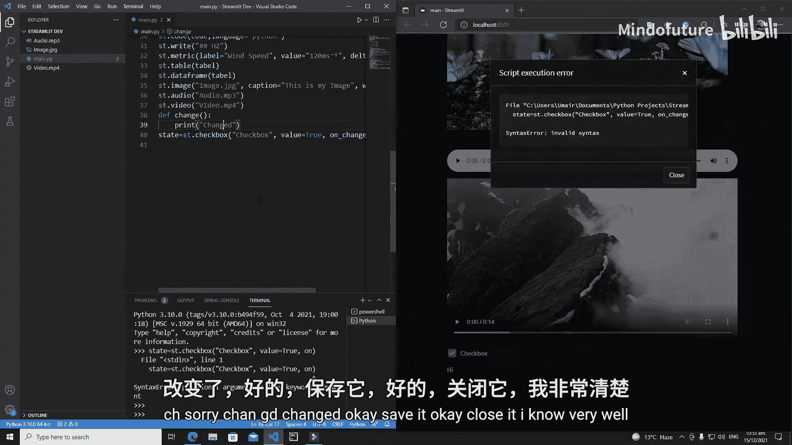

我们可以为复选框添加一个回调函数，并在函数内部通过 `key` 访问其状态。

```python
import streamlit as st

# 定义回调函数
def change():
    # 通过 key 访问复选框的当前值
    current_state = st.session_state.my_checker
    print(f"复选框状态已改变为：{current_state}")

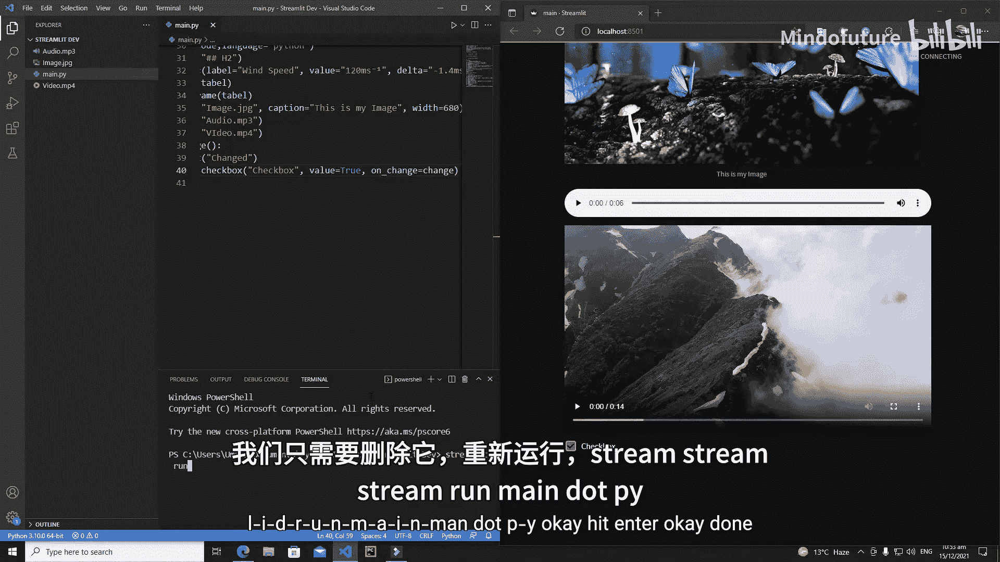

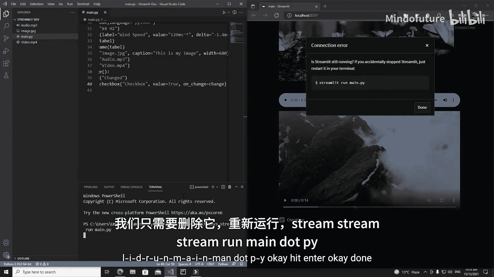

# 创建带 key 和回调函数的复选框
st.checkbox('带回调的复选框',
            value=True,
            on_change=change, # 状态改变时调用 change 函数
            key='my_checker')
```

每当用户点击这个复选框，控制台就会打印出其最新的状态。

---

## 单选按钮 🔘

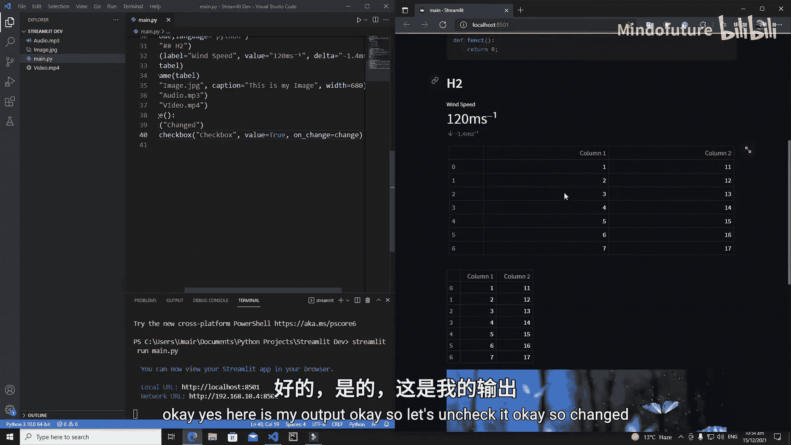

上一节我们介绍了复选框，它适合二元选择。本节中我们来看看**单选按钮**，它允许用户从一组互斥的选项中选择一个。

使用 `st.radio` 创建单选按钮。其核心参数是 `label`（问题或标题）和 `options`（一个包含所有选项的列表或元组）。

以下是创建单选按钮的示例：

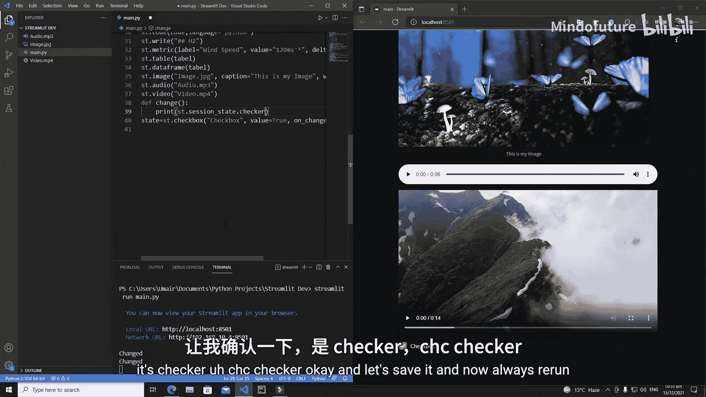

```python
import streamlit as st

# 创建一个单选按钮
radio_choice = st.radio(
    '你住在哪个国家？', # 标签/问题
    options=('美国', '英国', '加拿大') # 选项元组
)

# 显示用户的选择
st.write(f'你选择了：{radio_choice}')
```

页面上会出现一个问题“你住在哪个国家？”，下面有三个选项。用户只能选择其中一个，被选中的选项会通过 `st.write` 显示出来。

---

## 按钮 🖱️

任何网页应用都离不开按钮。按钮用于触发一个特定的动作。

在 Streamlit 中，我们使用 `st.button` 创建按钮。最重要的参数是 `label`（按钮上显示的文本）和 `on_click`（点击按钮时触发的回调函数）。

以下是按钮的示例：

```python
import streamlit as st

# 定义按钮点击的回调函数
def button_clicked():
    print('按钮被点击了！')

# 创建一个按钮
st.button('点击我',
          on_click=button_clicked) # 点击时调用 button_clicked 函数
```

点击这个按钮，控制台会输出“按钮被点击了！”。**注意**：在 Streamlit 中，任何交互组件（如按钮、下拉框）被操作后，整个脚本都会从上到下重新运行一次。这有时会导致非预期的输出，我们将在后续关于**表单**的教程中解决这个问题。

---

## 下拉选择框 📥

接下来，我们学习**下拉选择框**。它允许用户从一个下拉列表中选择一个选项，比单选按钮更节省空间。

使用 `st.selectbox` 创建下拉选择框。它同样需要 `label` 和 `options` 参数。

以下是创建下拉选择框的示例：

```python
import streamlit as st

# 创建一个下拉选择框
car = st.selectbox(
    '你最喜欢的汽车品牌是？',
    options=('奥迪', '宝马', '法拉利')
)

# 显示选择结果
st.write(f'你最喜欢的汽车是：{car}')
```

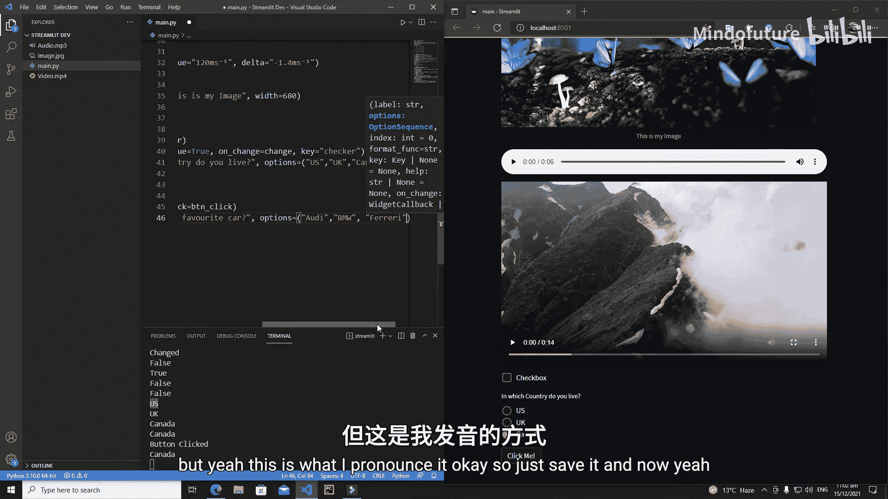

运行后，页面上会出现一个下拉菜单，默认显示第一个选项“奥迪”。点击下拉箭头，可以选择“宝马”或“法拉利”，选择结果会实时显示在下方。

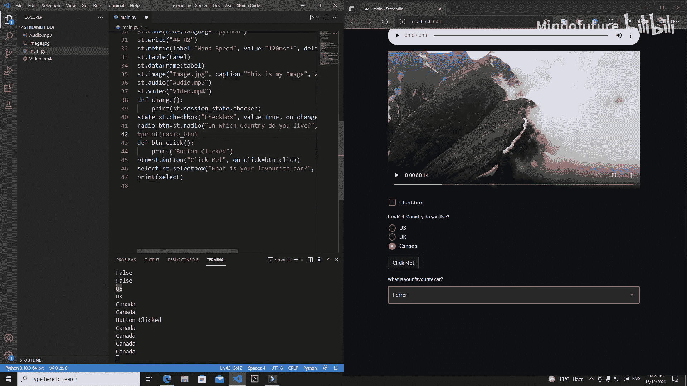

---

## 多选下拉框 📦

最后，我们来看看**多选下拉框**。它与普通下拉框类似，但允许用户同时选择多个选项。

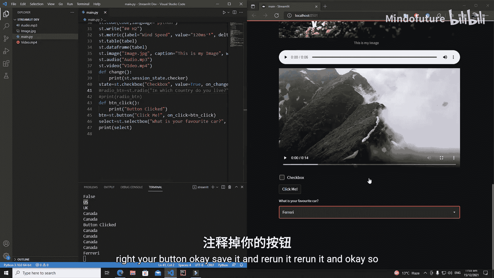

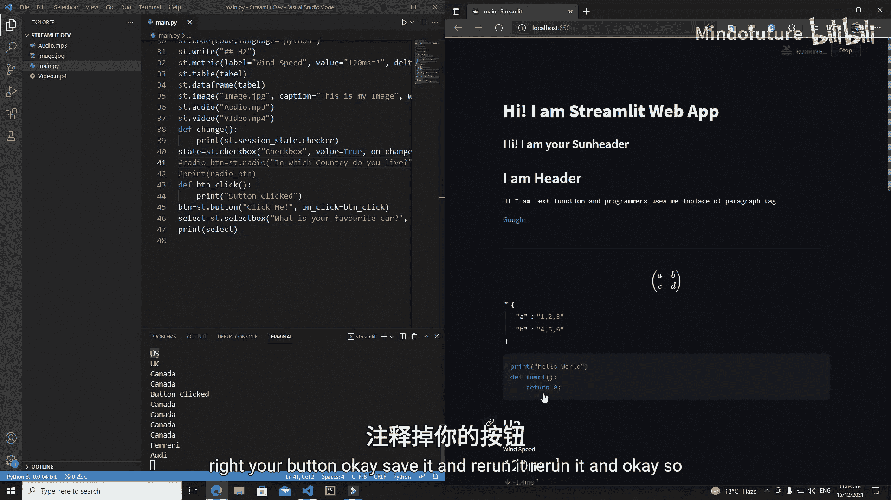

使用 `st.multiselect` 创建多选下拉框。参数 `label` 和 `options` 是必需的。

以下是多选下拉框的示例：

```python
import streamlit as st

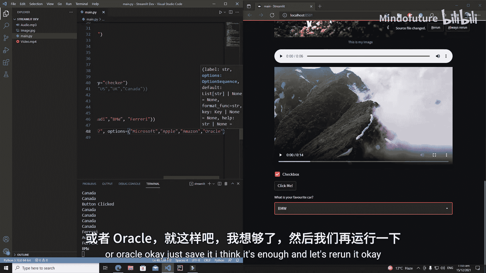

# 创建一个多选下拉框
brands = st.multiselect(
    '你最喜欢的科技品牌是？（可多选）',
    options=('微软', '苹果', '亚马逊', '甲骨文')
)

# 显示所有被选中的选项
st.write(f'你选择的品牌有：{brands}')
```

页面上会出现一个下拉框，点击后可以勾选多个品牌。所有被选中的品牌会以一个列表的形式显示在下方。你可以通过每个选项旁边的“×”图标来取消选择。

---

本节课中我们一起学习了 Streamlit 的五个基础交互组件：**复选框**、**单选按钮**、**按钮**、**下拉选择框**和**多选下拉框**。我们了解了它们的基本用法、关键参数（如 `label`, `options`, `on_change`, `on_click`, `key`），并通过代码示例看到了它们如何工作。

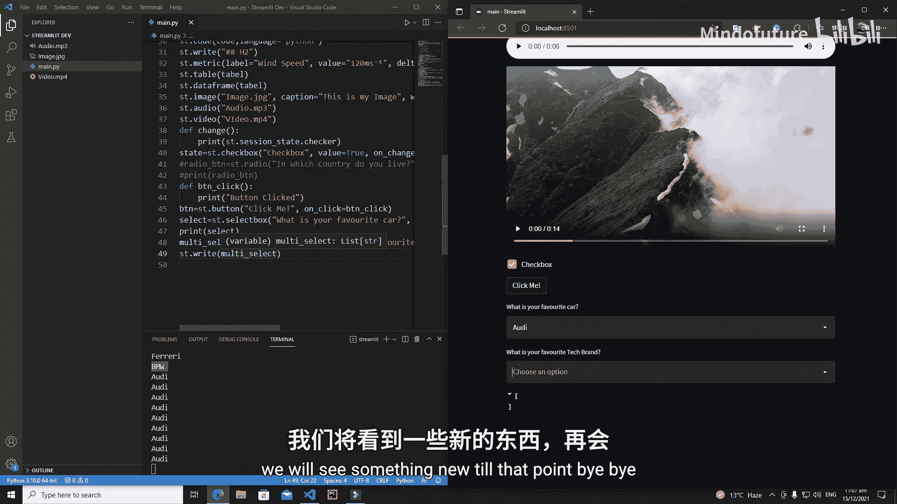

掌握这些组件是构建交互式 Streamlit 应用的第一步。请尝试修改代码中的参数，例如更改标签、选项或回调函数的内容，以加深理解。在下一节课中，我们将学习如何使用**表单**来更好地组织这些交互组件，并解决组件交互导致整个应用重运行的问题。