# 009：Streamlit文件上传器组件

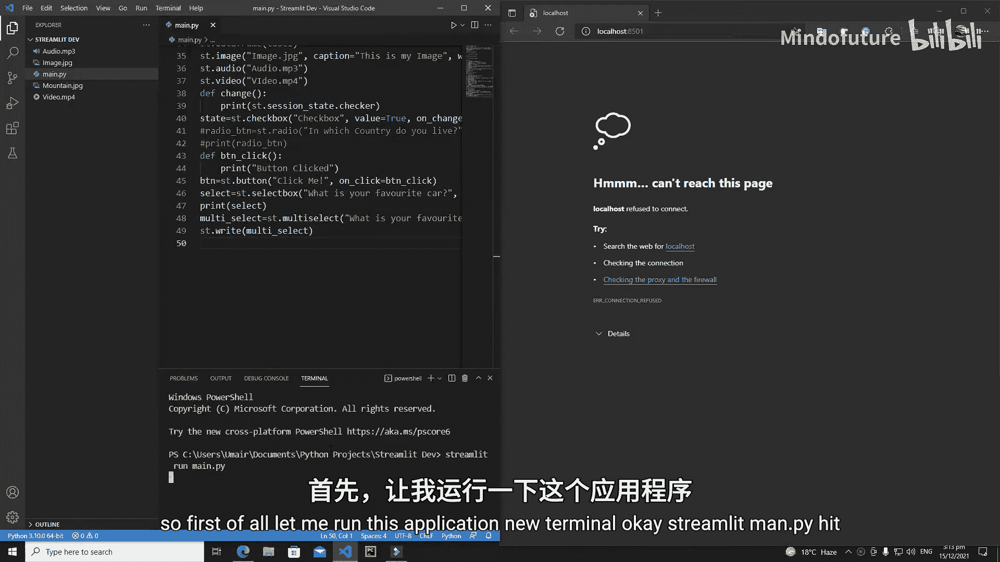

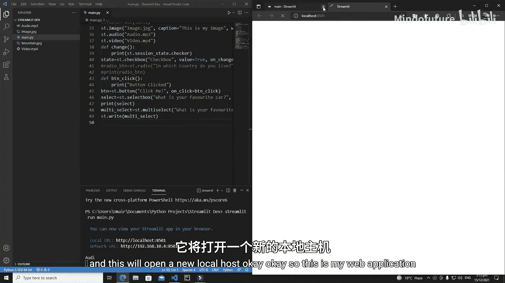

在本教程中，我们将学习如何使用Streamlit框架向你的Web应用程序上传文件。我们将涵盖上传单个文件（如图像、视频）以及上传多个文件的方法。

## 准备工作 🛠️

首先，我们需要启动一个Streamlit应用程序。在终端中运行以下命令：

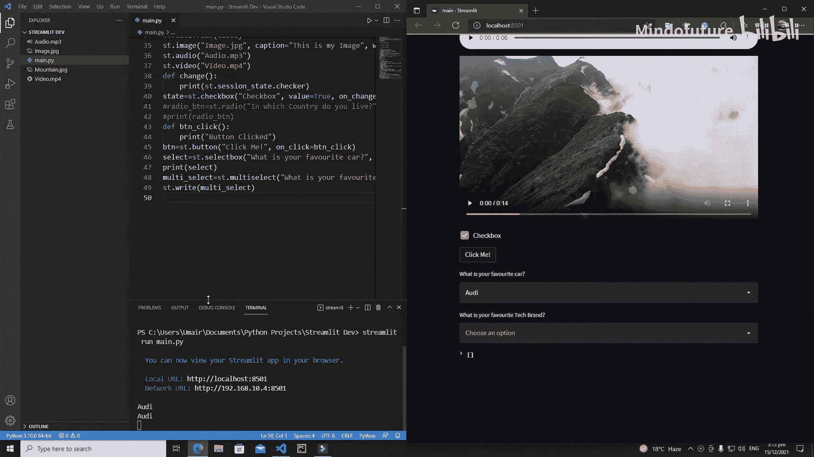

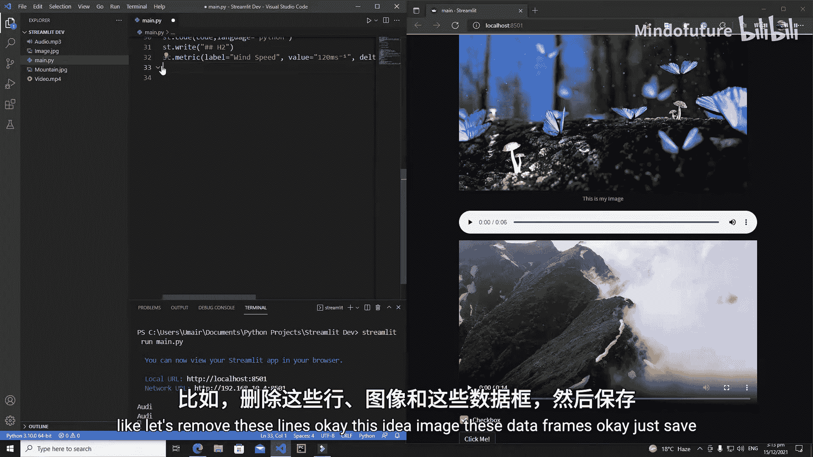

```python
streamlit run app.py
```

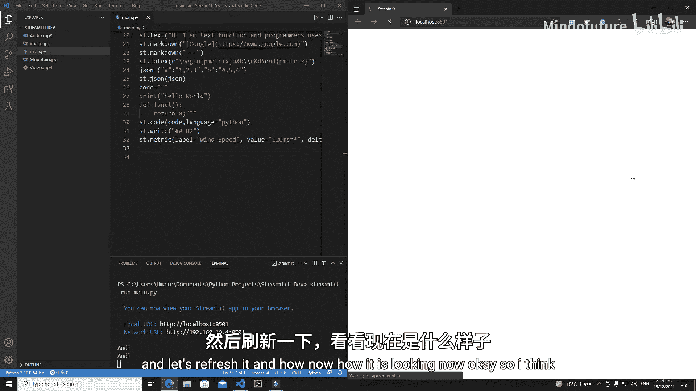

这将打开一个新的本地服务器。我们将从一个干净的Web应用界面开始，只保留一个标题。

```python
import streamlit as st

st.title('文件上传演示')
st.markdown('---')
```

## 上传单个文件 📤

上一节我们设置了基础应用界面，本节中我们来看看如何使用`st.file_uploader`组件上传单个文件。

以下是上传单个图像文件的核心步骤：

1.  使用`st.file_uploader`创建一个文件上传器。
2.  通过`label`参数设置上传器的提示文字。
3.  通过`type`参数限制可上传的文件类型（扩展名）。
4.  检查文件是否成功上传（不为`None`）。
5.  使用`st.image`显示上传的图像。

对应的核心代码如下：

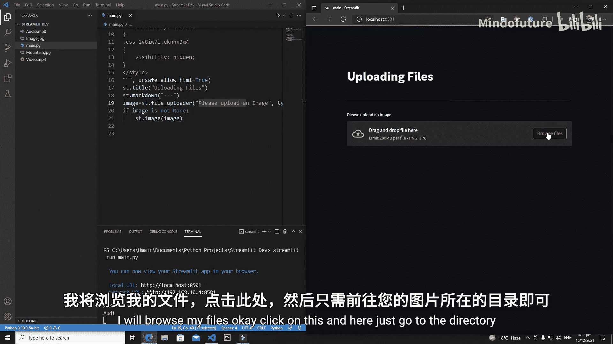

```python
# 创建文件上传器，限制为PNG和JPG格式的图像
uploaded_image = st.file_uploader(
    label='请上传一张图片',
    type=['png', 'jpg', 'jpeg']
)

# 检查文件是否已上传
if uploaded_image is not None:
    # 显示上传的图片
    st.image(uploaded_image)
```

运行此代码后，网页上会出现一个上传区域。你可以通过“浏览文件”按钮选择图片，图片上传后会立即显示在页面上。移除已选文件，图片也会随之消失。

## 上传其他类型文件 🎬

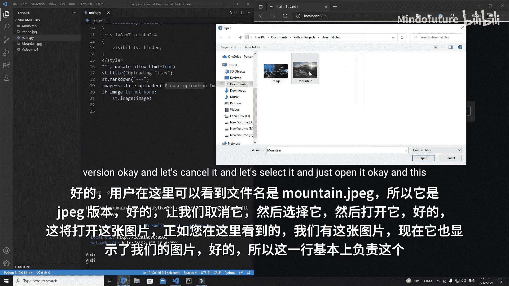

学会了上传图片后，我们可以用同样的方法上传其他类型的文件，例如视频。

只需修改`type`参数和对应的显示函数即可。以下是上传MP4视频文件的代码：

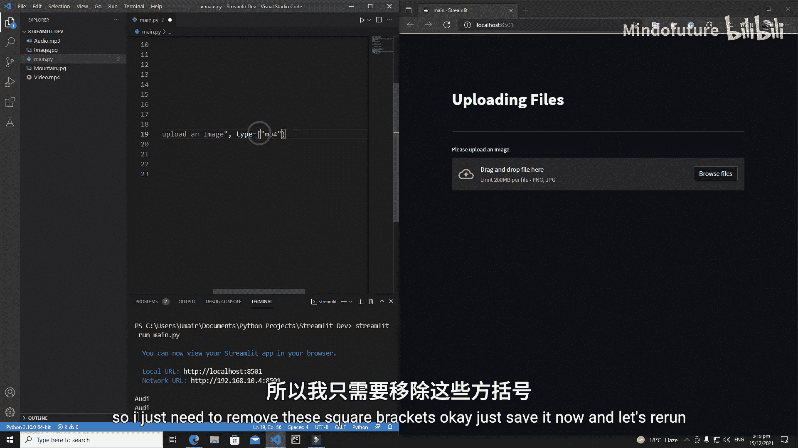

```python
# 创建文件上传器，限制为MP4格式的视频
uploaded_video = st.file_uploader(
    label='请上传一个视频',
    type='mp4'  # 单个类型可以直接用字符串
)

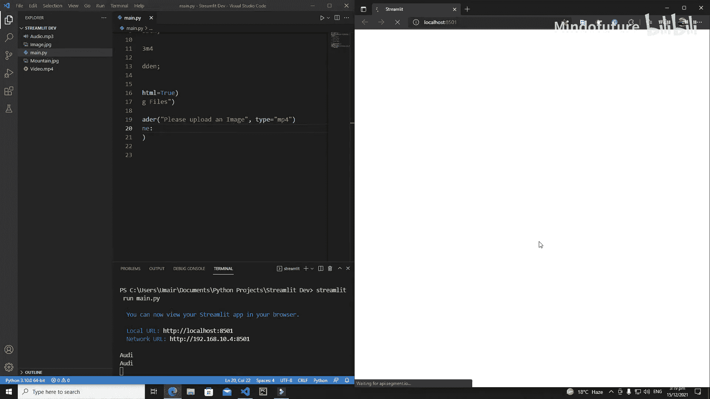

if uploaded_video is not None:
    # 显示上传的视频
    st.video(uploaded_video)
```

**注意**：上传视频时，必须使用`st.video()`来显示，使用`st.image()`会导致错误。

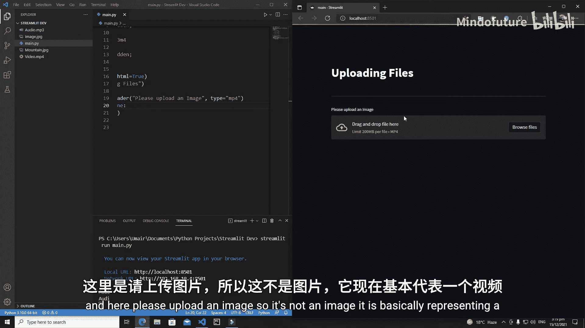

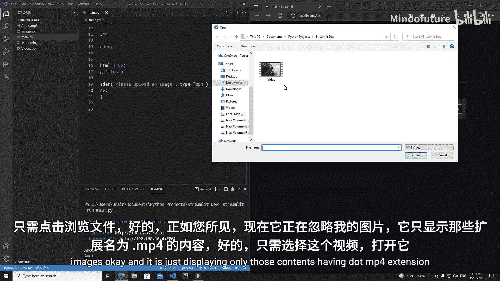

## 上传多个文件 📂

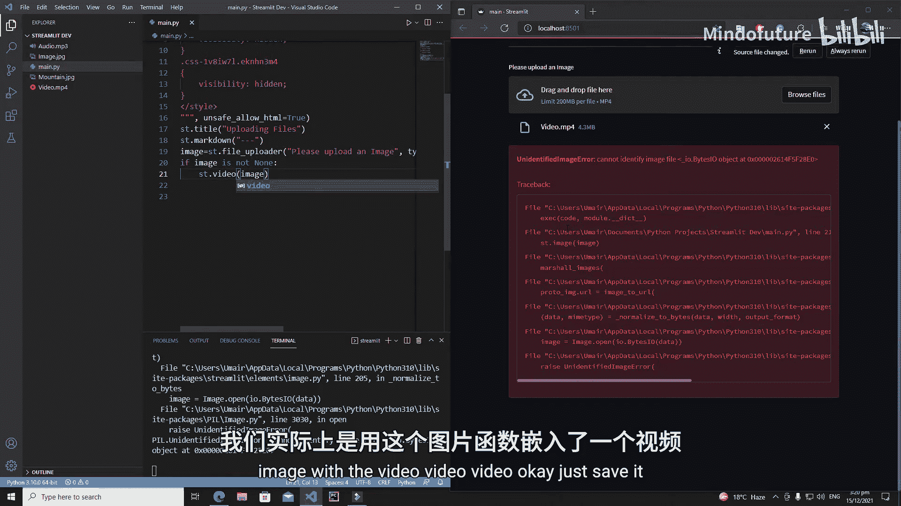

有时我们需要一次性上传多个文件。`st.file_uploader`组件也支持这个功能。

要实现多文件上传，只需在`st.file_uploader`中设置`accept_multiple_files=True`参数。上传后，我们会得到一个文件列表，然后通过循环来处理每一个文件。

以下是上传并显示多张图片的完整代码：

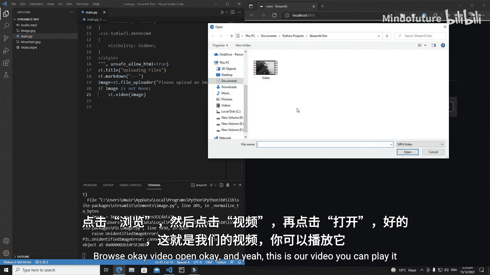

```python
# 创建支持多文件上传的组件
uploaded_images = st.file_uploader(
    label='请上传多张图片',
    type=['png', 'jpg', 'jpeg'],
    accept_multiple_files=True  # 启用多文件选择
)

# 检查列表是否不为空
if uploaded_images:
    # 遍历列表中的每一张图片
    for image in uploaded_images:
        st.image(image)
```

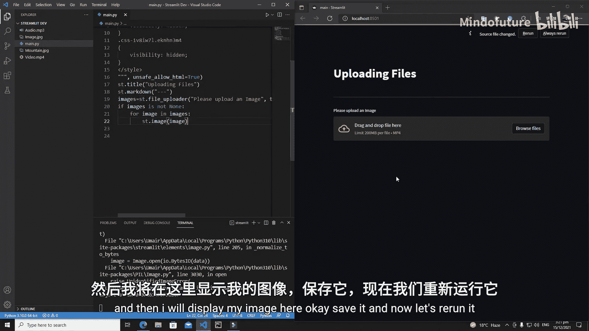

运行代码后，在文件选择器中按住`Ctrl`（Windows/Linux）或`Command`（Mac）键即可选择多个文件。所有选中的图片会依次显示在网页上。

## 总结 📝

本节课中我们一起学习了Streamlit文件上传器`st.file_uploader`的核心用法。

我们掌握了：
*   **上传单个文件**：通过`type`参数指定文件类型，并使用对应的`st.image`或`st.video`函数进行显示。
*   **上传多个文件**：通过设置`accept_multiple_files=True`参数，并循环处理返回的文件列表。

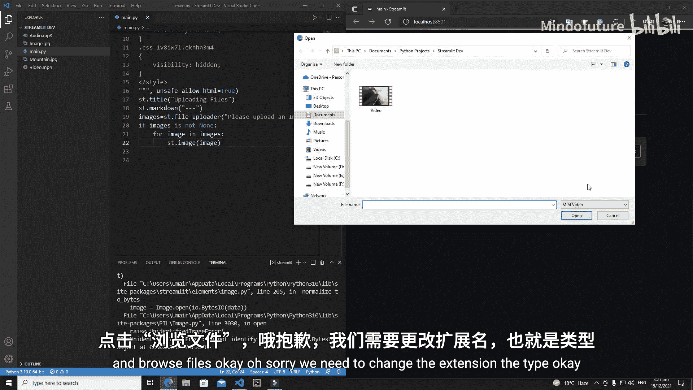

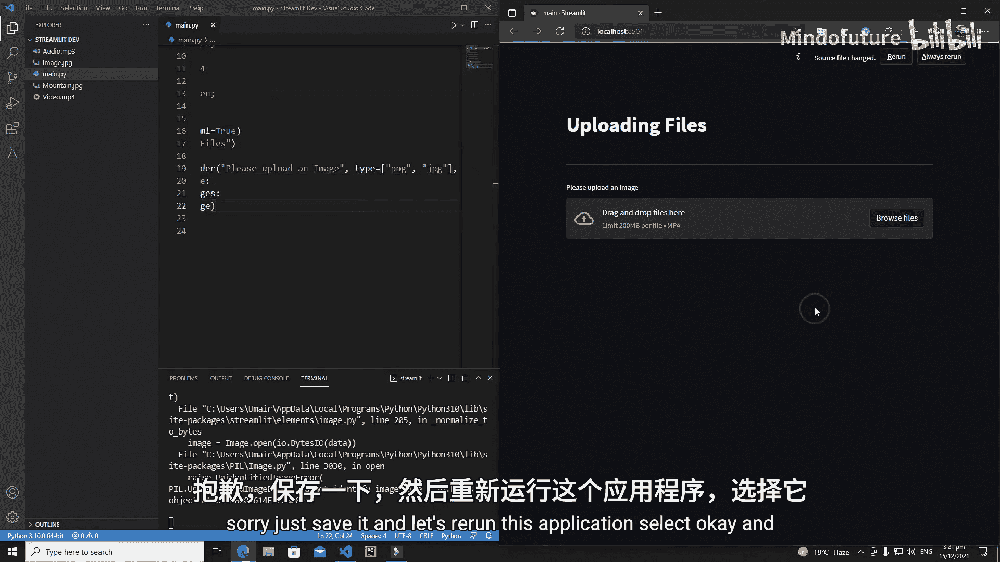

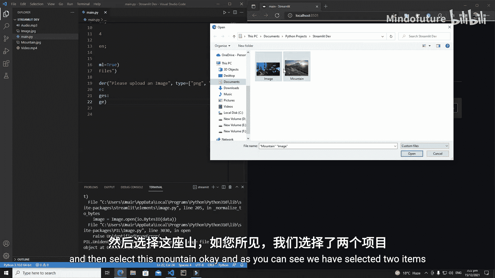

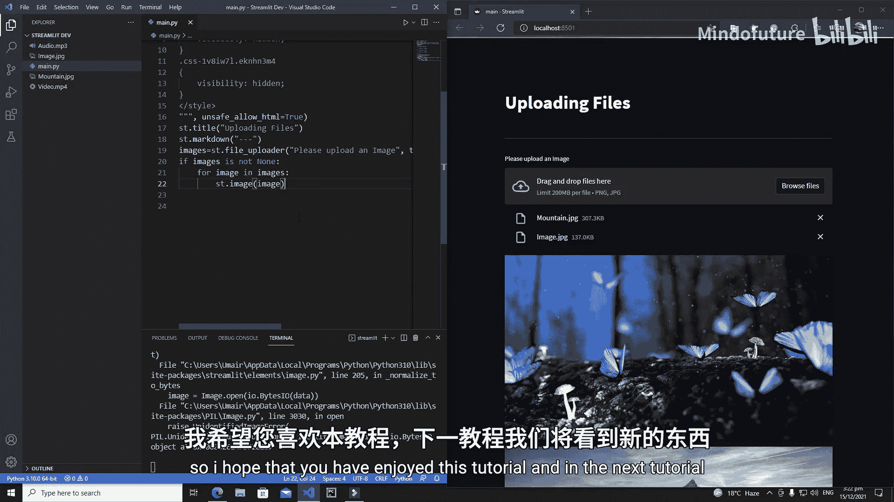

这个组件功能强大且灵活，是构建交互式数据上传和内容管理应用的基石。