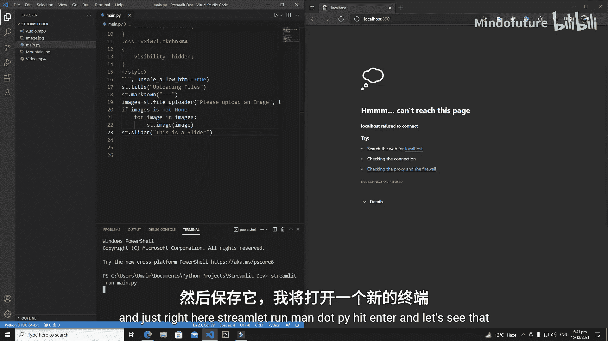
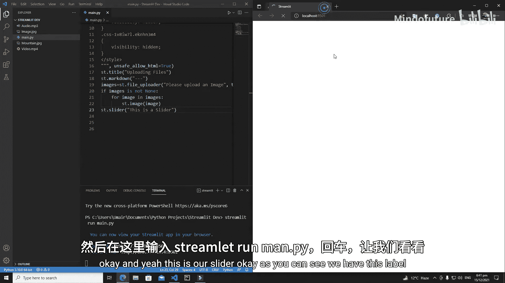
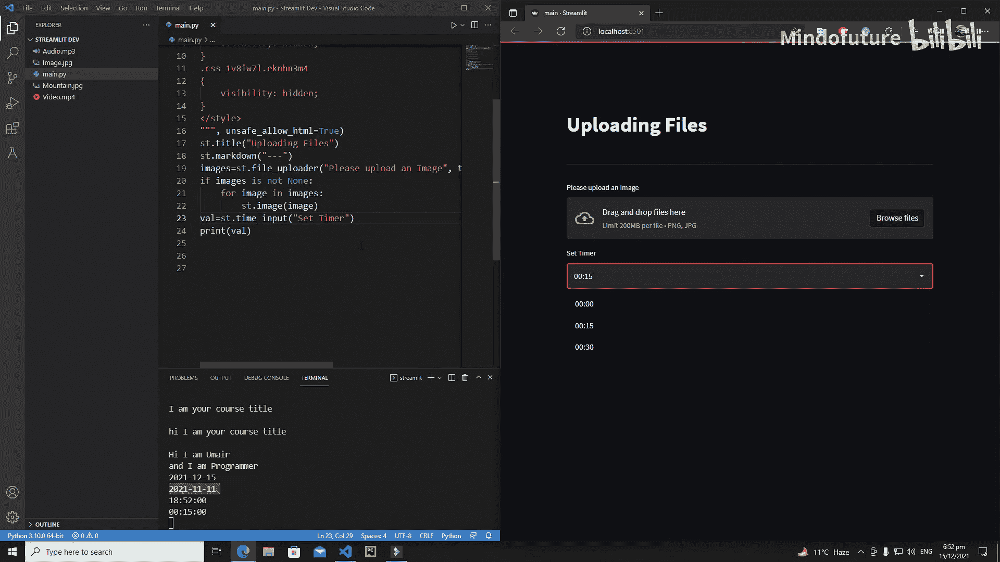

# 010：更多交互式组件

在本节课中，我们将继续学习 Streamlit 的交互式组件。我们将重点介绍滑块、文本输入框、文本域、日期输入和时间输入这几个常用组件。通过本课的学习，你将能够为你的应用添加更多与用户交互的方式。

上一节我们介绍了文件上传器，本节中我们来看看其他几种实用的交互组件。

## 滑块组件 🎚️

滑块是几乎所有 Python 框架中都非常重要的组件。首先，我们来创建一个滑块。

在 Streamlit 中，创建滑块有两种方法：`st.slider` 和 `st.select_slider`。它们之间存在区别。本节我将解释 `st.slider` 的用法，而 `st.select_slider` 的工作原理和区别将作为你的课后作业。

以下是创建一个基本滑块的代码：





```python
import streamlit as st

value = st.slider(
    label='这是一个滑块',  # 滑块的标题
    min_value=50,        # 最小值
    max_value=150,       # 最大值
    value=70,            # 默认值
    step=1               # 步长
)
st.write(f'当前滑块的值是：{value}')
```

*   **`label`**：定义了滑块的标题。
*   **`min_value`** 和 **`max_value`**：分别定义了滑块的最小值和最大值，决定了滑块的左右边界。
*   **`value`**：定义了滑块的默认初始值。
*   **`step`**：定义了滑块移动时的步长。

运行上述代码，你会看到一个滑块。拖动滑块，下方显示的数字会实时变化。滑块组件也支持 `on_change` 回调函数，用于在值改变时触发特定操作。

理解了滑块的基本用法后，接下来我们看看如何从用户那里获取文本输入。

## 文本输入组件 📝

从用户处获取输入是应用开发中的常见需求，文本输入框是最常用的组件之一。

Streamlit 提供了两种文本输入组件：`st.text_input` 和 `st.text_area`。
*   **`st.text_input`**：适用于获取简短的输入，例如标题。
*   **`st.text_area`**：适用于获取段落或描述性长文本。

首先，我们来看 `st.text_input`：

```python
import streamlit as st

course_title = st.text_input(
    label='请输入课程标题',
    max_chars=60,          # 最大字符数限制
    value='默认标题'        # 默认文本
)
st.write(f'您输入的标题是：{course_title}')
```

*   **`max_chars`**：可以限制用户输入的最大字符数。输入框下方会显示计数。
*   **`value`**：可以设置输入框的默认文本。

用户输入内容后，通常需要按下 `Enter` 键来提交（应用）输入。

接下来，我们看看用于获取长文本的 `st.text_area`：

```python
import streamlit as st

course_desc = st.text_area(
    label='请输入课程描述',
    height=150             # 设置文本域的高度
)
st.write(f'课程描述：{course_desc}')
```

`st.text_area` 的显示区域比 `st.text_input` 更大。一个关键区别是换行方式：在文本域中，直接按 `Enter` 键即可换行。若想提交整个文本域的内容，在 Windows/Linux 上需要按住 `Ctrl` 键再按 `Enter`，在 Mac 上则是 `Cmd` + `Enter`。应用会根据你的操作系统显示相应的提示。

学会了处理文本输入，我们再来看看如何获取日期和时间信息。

## 日期与时间输入 📅⏰

Streamlit 提供了专门的组件来获取日期和时间输入，这在需要用户选择特定日期或设定时间的场景中非常有用。

首先是日期输入组件 `st.date_input`：

```python
import streamlit as st

reg_date = st.date_input('请选择注册日期')
st.write(f'您选择的注册日期是：{reg_date}')
```

运行后会显示一个日期选择器。用户可以通过下拉菜单选择年、月、日，也可以使用两侧的箭头快速切换月份。

然后是时间输入组件 `st.time_input`：

```python
import streamlit as st

alarm_time = st.time_input('请设置闹钟时间')
st.write(f'闹钟设定在：{alarm_time}')
```

这个组件会显示一个时间选择器，默认是当前时间。用户可以方便地选择小时、分钟和秒。这在创建闹钟、计时器等功能时非常实用。



本节课中我们一起学习了 Streamlit 的五个核心交互组件：滑块、文本输入框、文本域、日期选择器和时间选择器。你学会了如何创建它们、配置其基本属性，并理解其适用场景。合理运用这些组件，可以极大地增强你应用的交互性和用户体验。在下一节课中，我们将探索 Streamlit 的更多新功能。