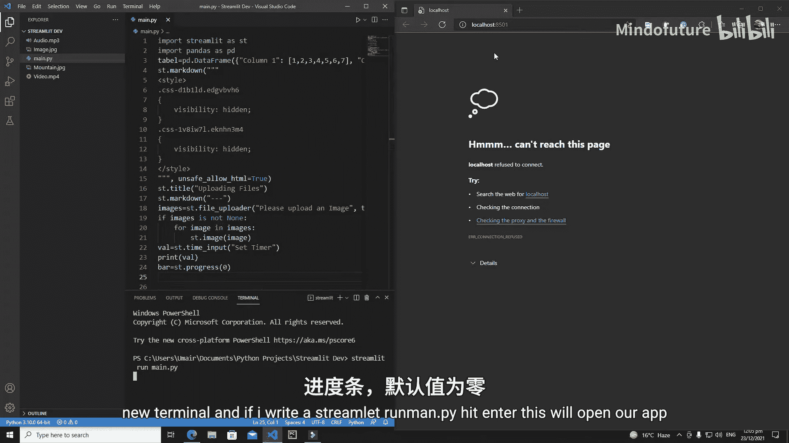
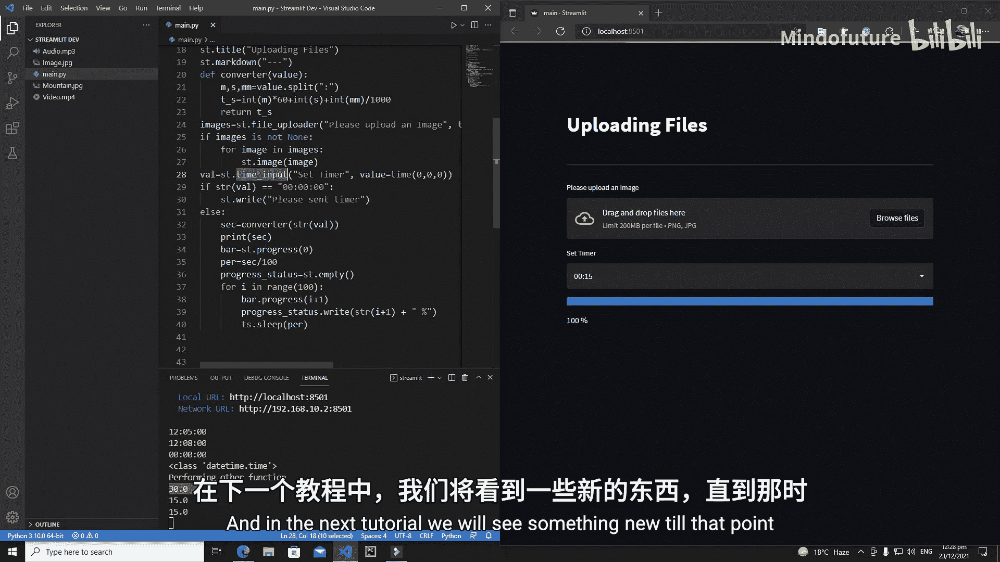

# 011：带进度条的计时器应用

在本节课中，我们将学习如何在 Streamlit 应用中创建和使用进度条。我们将从一个简单的进度条开始，逐步构建一个功能完整的计时器应用，该应用允许用户设置时间，并使用进度条直观地显示时间的流逝。



## 概述

进度条是向用户展示任务完成进度的常用UI组件。在 Streamlit 中，我们可以使用 `st.progress` 轻松创建进度条。本节课，我们将首先演示一个基础进度条，然后将其与时间输入控件结合，创建一个交互式的计时器应用。

## 创建基础进度条

首先，我们创建一个最简单的进度条。在 Streamlit 中，使用 `st.progress` 函数即可创建进度条，其进度值是一个介于 0 到 100 之间的整数。

```python
import streamlit as st

progress_bar = st.progress(0)  # 创建一个初始进度为0的进度条
```

运行上述代码，你将看到一个进度为 0% 的进度条。

接下来，我们让进度条动起来。我们将使用一个循环，在 10 步内将进度从 0% 增加到 100%。为了让进度变化可见，我们使用 `time.sleep` 函数在每一步之间暂停。

```python
import streamlit as st
import time

progress_bar = st.progress(0)  # 创建进度条

for i in range(10):
    # 计算当前进度百分比。i从0到9，所以需要加1
    progress = (i + 1) * 10
    progress_bar.progress(progress)  # 更新进度条
    time.sleep(1)  # 暂停1秒
```

运行这段代码，你将看到进度条每隔一秒增加 10%，直到 100%。

## 构建交互式计时器应用

上一节我们介绍了基础进度条，本节中我们来看看如何将其与用户输入结合，创建一个可以自定义时长的计时器。

### 添加时间输入控件

我们将使用 `st.time_input` 让用户选择计时器的时长。为了设置默认值，我们需要使用 `datetime.time` 对象。

```python
import streamlit as st
from datetime import time as ts  # 导入datetime.time并重命名为ts，避免与time模块冲突

# 创建时间输入控件，默认值为 00:00:00
selected_time = st.time_input("设置计时器", value=ts(0, 0, 0))
```

### 处理用户输入并启动进度条

我们需要检查用户是否设置了时间。如果时间仍为默认值（00:00:00），则提示用户设置；否则，开始执行计时功能。

```python
import streamlit as st
from datetime import time as ts
import time

selected_time = st.time_input("设置计时器", value=ts(0, 0, 0))

# 将时间对象转换为字符串，以便比较
if str(selected_time) == "00:00:00":
    st.write("请设置计时器")
else:
    st.write("正在执行计时功能...")
    # 后续将在这里添加进度条逻辑
```

### 将时间转换为秒数

`time.sleep` 函数接受以秒为单位的参数。因此，我们需要一个函数将用户选择的“时:分:秒”格式的时间转换为总秒数。

以下是转换函数：

```python
def time_to_seconds(time_value):
    """
    将 datetime.time 对象转换为总秒数。
    参数:
        time_value (datetime.time): 输入的时间对象。
    返回:
        int: 总秒数。
    """
    # 将时间拆分为小时、分钟、秒
    hours = time_value.hour
    minutes = time_value.minute
    seconds = time_value.second

    # 计算总秒数
    total_seconds = (hours * 3600) + (minutes * 60) + seconds
    return total_seconds
```

### 整合进度条与计时器

现在，我们将所有部分整合起来。当用户设置时间后，我们将总时长（秒）平均分成 100 份，每份代表进度条的 1%。在循环中，每完成一份，就暂停相应的时间，并更新进度条。

同时，为了动态显示当前进度百分比，我们将使用 `st.empty` 创建一个占位符，然后在循环中更新其内容。

```python
import streamlit as st
from datetime import time as ts
import time

def time_to_seconds(time_value):
    hours = time_value.hour
    minutes = time_value.minute
    seconds = time_value.second
    total_seconds = (hours * 3600) + (minutes * 60) + seconds
    return total_seconds

# 用户界面
st.title("⏱️ 带进度条的计时器")

selected_time = st.time_input("设置计时器时长", value=ts(0, 0, 0))

if str(selected_time) == "00:00:00":
    st.info("请在上方设置计时器时长。")
else:
    # 转换时间为秒
    total_seconds = time_to_seconds(selected_time)
    st.write(f"计时器已设置为 {total_seconds} 秒。")

    # 创建进度条和状态文本占位符
    progress_bar = st.progress(0)
    status_text = st.empty()

    # 计算每一步的等待时间（总秒数 / 100步）
    step_duration = total_seconds / 100.0

    # 执行进度更新
    for percent_complete in range(101):  # 从0到100
        progress_bar.progress(percent_complete)  # 更新进度条
        status_text.text(f"{percent_complete}% 已完成")  # 更新状态文本
        time.sleep(step_duration)  # 等待相应时间

    status_text.text("✅ 计时完成！")
```

运行此应用，选择一个时间（例如 15 秒），进度条将平滑地在指定时间内从 0% 填充到 100%，并实时显示百分比。

## 总结

本节课中我们一起学习了 Streamlit 中进度条的核心用法。我们首先创建了一个基础的进度条，然后将其与 `st.time_input` 控件结合，构建了一个交互式的计时器应用。关键步骤包括：
1.  使用 `st.progress` 创建和更新进度条。
2.  使用 `st.time_input` 获取用户输入的时间。
3.  编写函数将时间对象转换为秒数。
4.  使用 `st.empty` 占位符动态更新文本内容。
5.  通过循环和 `time.sleep` 控制进度更新的节奏。



通过这个项目，你掌握了如何将不同的 Streamlit 组件组合起来，创建具有动态反馈的用户界面。