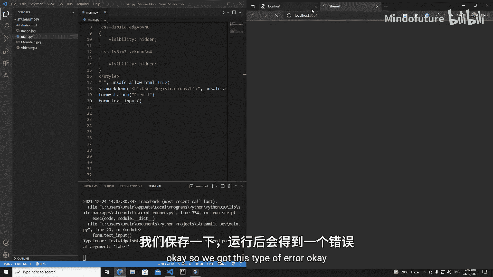
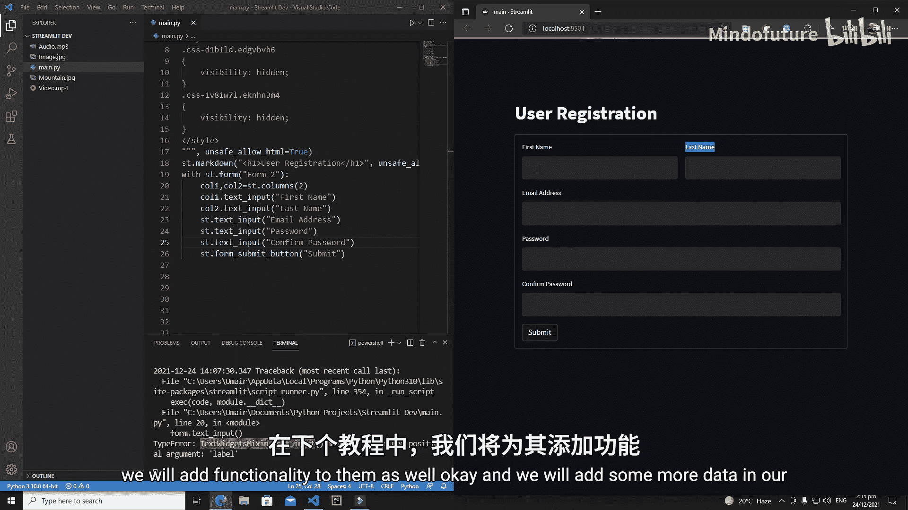

# 012：Streamlit 表单与列布局

在本节课中，我们将学习 Streamlit 中的两个重要组件：**表单**和**列布局**。表单组件允许我们在应用中创建交互式表单，例如用户注册或登录界面。列布局组件则能将页面屏幕划分为多个列，以便更灵活地排列和展示不同的控件。我们将结合这两个组件，创建一个完整的用户注册表单。

## 创建表单的两种方法

Streamlit 提供了两种创建表单的方法。第一种方法是先创建一个表单对象，然后向该对象添加控件。第二种方法是使用 `with` 语句来定义表单的范围。接下来，我们将详细介绍这两种方法。

### 方法一：使用表单对象

首先，我们创建一个表单对象，并为其指定一个唯一的键。然后，通过该对象添加控件。

```python
import streamlit as st

st.markdown("<h1>用户注册</h1>", unsafe_allow_html=True)

# 创建表单对象
form1 = st.form(key='form1')

# 在表单对象中添加一个文本输入框
form1.text_input(label="First Name")

# 为表单添加一个提交按钮
form1.form_submit_button(label="提交")
```



**注意**：每个表单都必须包含一个提交按钮，否则 Streamlit 会报错。

### 方法二：使用 `with` 语句

第二种方法是使用 `with` 语句。在 `with` 代码块内定义的所有控件都会自动归属于该表单。

```python
import streamlit as st

st.markdown("<h1>用户注册</h1>", unsafe_allow_html=True)

# 使用 with 语句创建表单
with st.form(key='form2'):
    st.text_input(label="First Name")
    st.form_submit_button(label="提交")
```

以上两种方法都能成功创建一个包含输入框和提交按钮的基本表单。

## 使用列布局优化表单

在许多注册表单中，我们经常看到“名”和“姓”并排显示。为了实现这种布局，我们可以使用 Streamlit 的 `columns` 组件将表单区域分割成多个列。

以下是具体步骤：

1.  使用 `st.columns(num)` 创建指定数量的列，该方法会返回一个列对象的列表。
2.  在对应的列对象上调用控件方法，控件就会显示在该列中。

```python
import streamlit as st

st.markdown("<h1>用户注册</h1>", unsafe_allow_html=True)

with st.form(key='registration_form'):
    # 创建两列
    col1, col2 = st.columns(2)

    # 在第一列中添加“名”输入框
    with col1:
        st.text_input(label="名")

    # 在第二列中添加“姓”输入框
    with col2:
        st.text_input(label="姓")

    # 在列布局下方添加其他输入项
    st.text_input(label="邮箱地址")
    st.text_input(label="密码", type="password")
    st.text_input(label="确认密码", type="password")

    st.form_submit_button(label="注册")
```

通过以上代码，我们创建了一个布局清晰、包含多个输入字段的用户注册表单。“名”和“姓”并排显示，其他字段则依次排列在下方的完整宽度区域。

## 总结



本节课中，我们一起学习了 Streamlit 中表单和列布局的使用。我们掌握了创建表单的两种方法，并学会了如何利用 `columns` 组件将页面分割，从而创建出更美观、更符合常见设计模式的表单界面。在下一节课中，我们将为这个表单添加数据验证和提交处理功能。