# 013：Streamlit 表单 II 🎛️

在本节课中，我们将继续学习 Streamlit 表单，为其添加更多功能，包括表单布局优化、输入验证以及表单提交后的自动清空。

## 概述

上一节我们介绍了 Streamlit 表单的基本创建方法。本节中，我们将进一步完善用户注册表单，学习如何居中显示标题、添加日期输入字段、验证用户输入以及控制表单提交后的行为。

## 居中显示标题

首先，我们注意到“用户注册”标题没有居中。由于我们使用了 `st.markdown` 来显示标题，因此可以利用 HTML 和 CSS 样式来调整其对齐方式。

以下是实现标题居中的代码：

```python
st.markdown('<h1 style="text-align: center;">用户注册</h1>', unsafe_allow_html=True)
```

这段代码通过内联 CSS 样式 `text-align: center;` 将标题文本居中显示。

## 扩展表单：添加日期输入

现在，让我们回到表单本身。我们需要为用户添加出生日期的输入字段。我们将把日期分为日、月、年三个部分，并使用 `st.columns` 将它们并排布局。

以下是创建三个并列输入框的步骤：

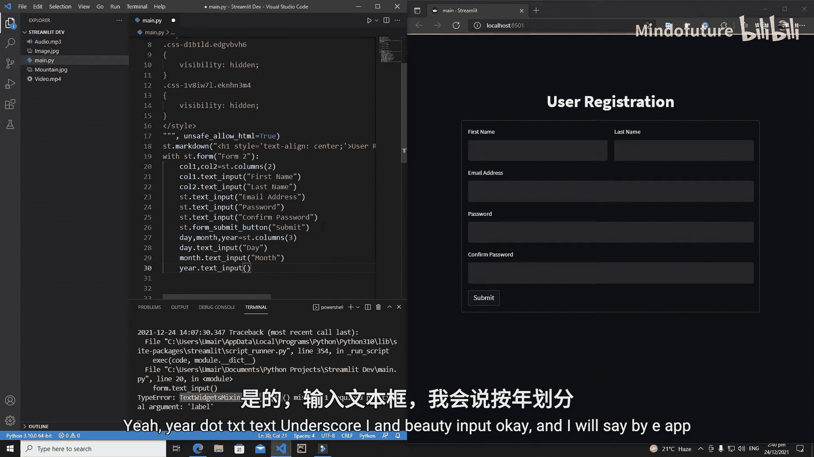

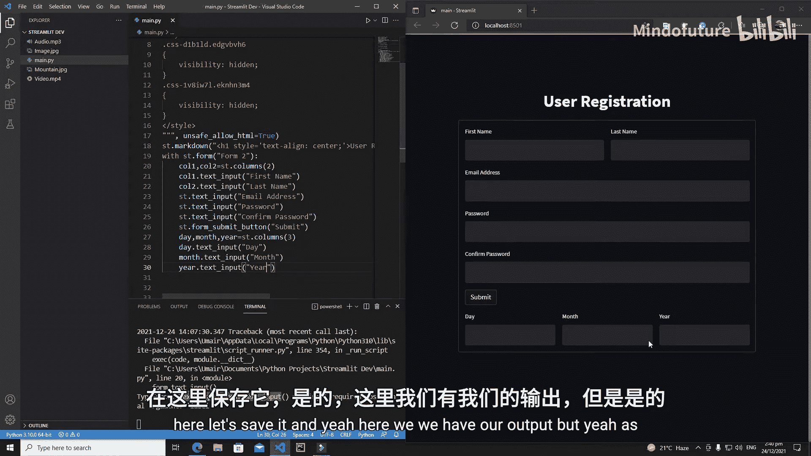

1.  首先，使用 `st.columns` 创建三个等宽的列容器。
2.  然后，在每个列容器中分别创建一个文本输入框。

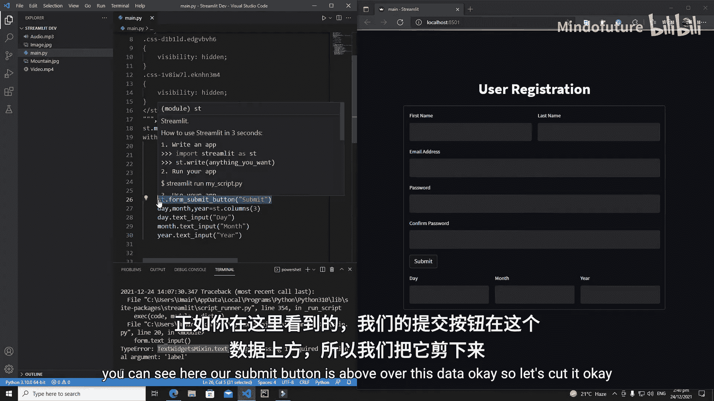

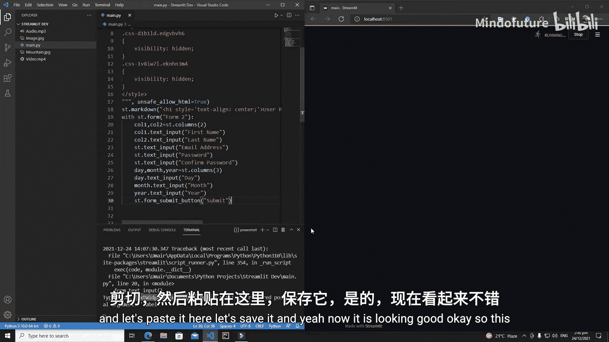

具体代码如下：

```python
# 创建三列
col1, col2, col3 = st.columns(3)

# 在第一列中添加“日”输入框
with col1:
    day = st.text_input("日")

# 在第二列中添加“月”输入框
with col2:
    month = st.text_input("月")

# 在第三列中添加“年”输入框
with col3:
    year = st.text_input("年")
```

通过这种方式，日、月、年三个输入框将水平排列，使表单布局更加紧凑美观。

## 为表单添加验证功能

接下来，我们需要为表单的提交按钮添加逻辑，以验证用户是否填写了必填字段。

以下是实现输入验证的步骤：

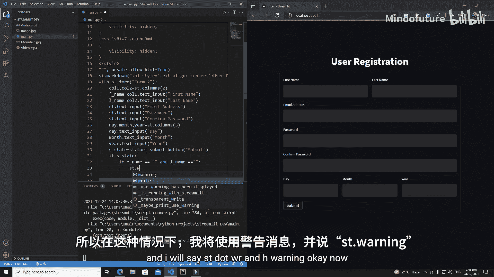

1.  首先，获取“提交”按钮的状态。当用户点击按钮时，其状态会变为 `True`。
2.  然后，检查“名”和“姓”输入框是否为空。
3.  根据检查结果，使用 Streamlit 的内置消息函数向用户提供反馈。

具体代码如下：

```python
# 获取“名”和“姓”的输入值
first_name = st.text_input("名")
last_name = st.text_input("姓")

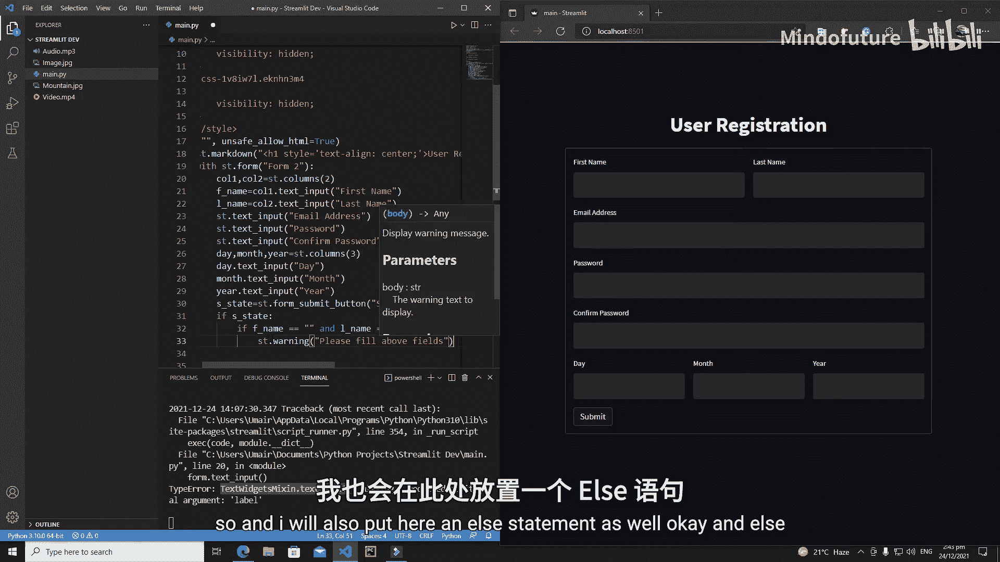

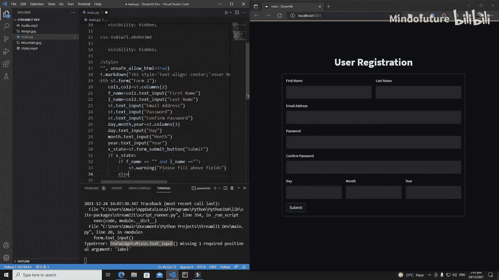

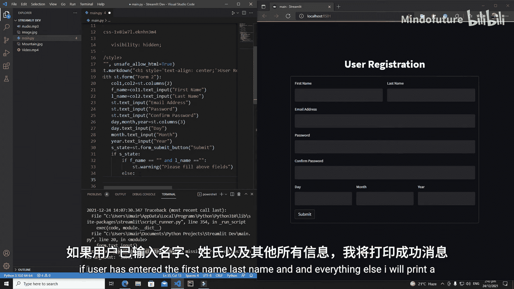

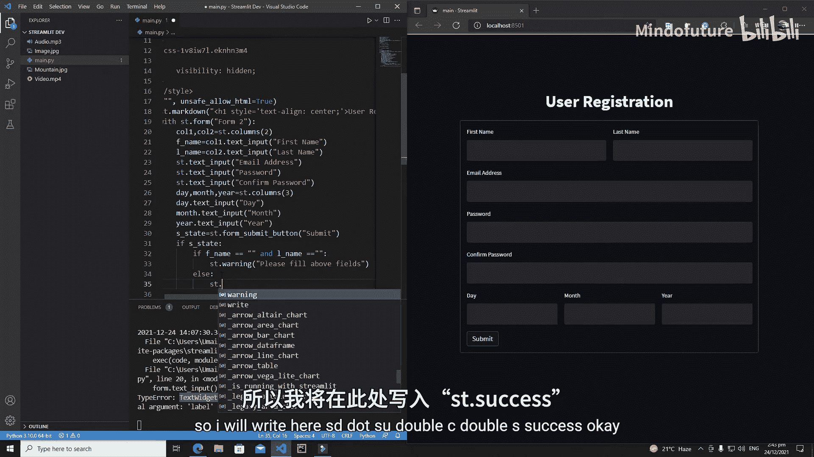

# 获取“提交”按钮的状态
submitted = st.form_submit_button("提交")

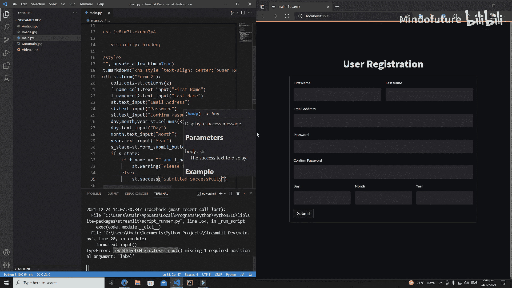

if submitted:
    # 检查必填字段是否为空
    if first_name == "" or last_name == "":
        # 如果为空，显示警告信息
        st.warning("请填写以上字段。")
    else:
        # 如果已填写，显示成功信息
        st.success("提交成功！")
```

这段代码确保了用户在提交表单前必须填写“名”和“姓”字段，否则会收到提示。

## 表单提交后自动清空

默认情况下，提交表单后，已输入的内容会保留在输入框中。有时，我们希望提交后能自动清空表单，以便进行下一次输入。

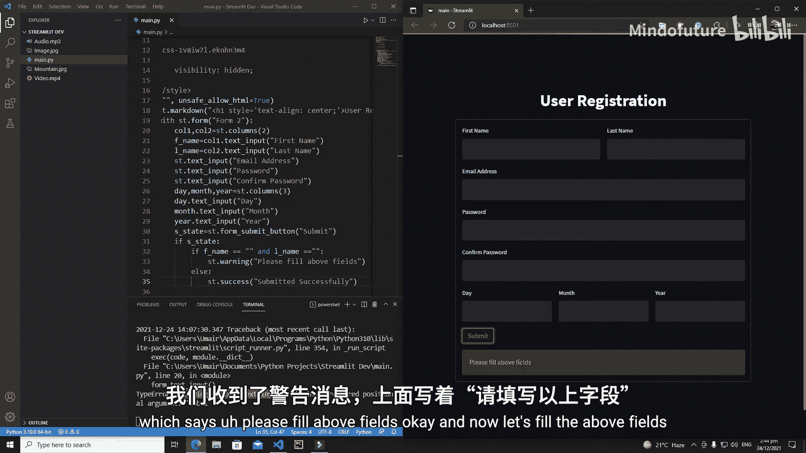

Streamlit 的 `st.form` 组件提供了一个 `clear_on_submit` 参数来实现此功能。

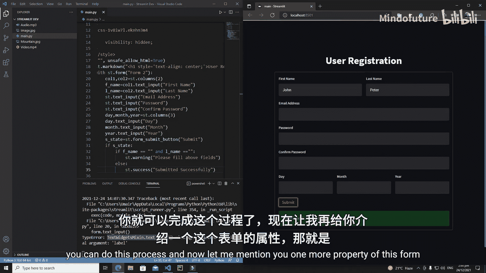

以下是启用自动清空功能的代码：

```python
# 创建表单，并设置提交后清空内容
with st.form(key='my_form', clear_on_submit=True):
    first_name = st.text_input("名")
    last_name = st.text_input("姓")
    submitted = st.form_submit_button("提交")
    # ... 其余验证逻辑
```

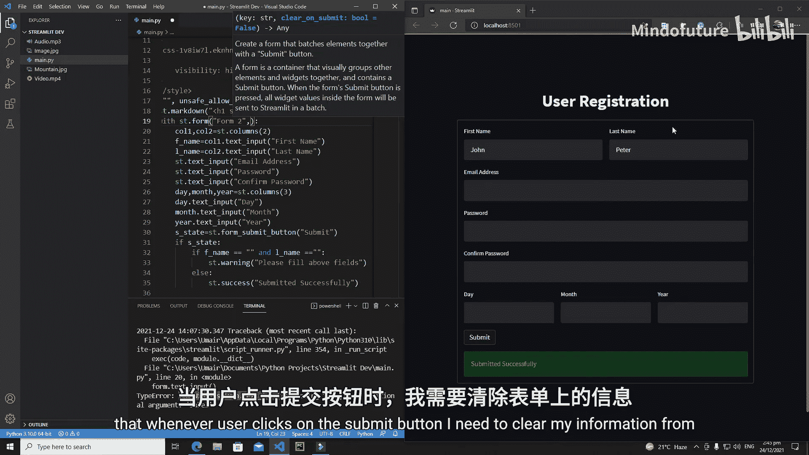

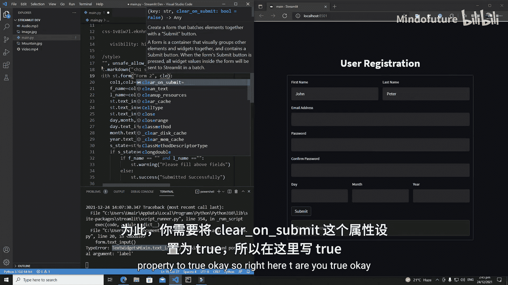

将 `clear_on_submit` 参数设置为 `True` 后，每当用户点击提交按钮，表单内的所有输入控件都会被重置为空状态。

## 总结

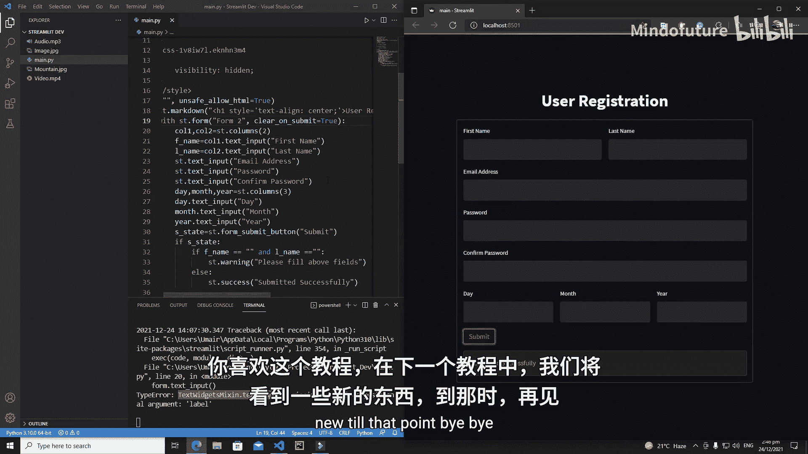

本节课中我们一起学习了如何增强 Streamlit 表单的功能。我们掌握了使用 CSS 样式居中标题、利用 `st.columns` 创建多列布局以添加日期字段、通过条件判断实现表单输入验证，以及使用 `clear_on_submit` 参数在提交后自动清空表单内容。这些技巧能帮助你创建出交互性更强、用户体验更好的数据输入界面。