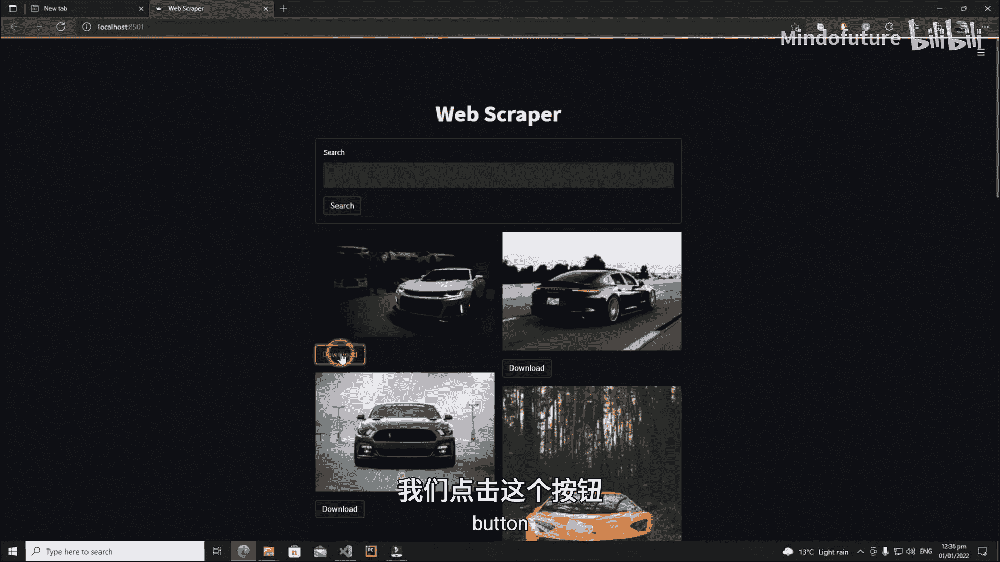
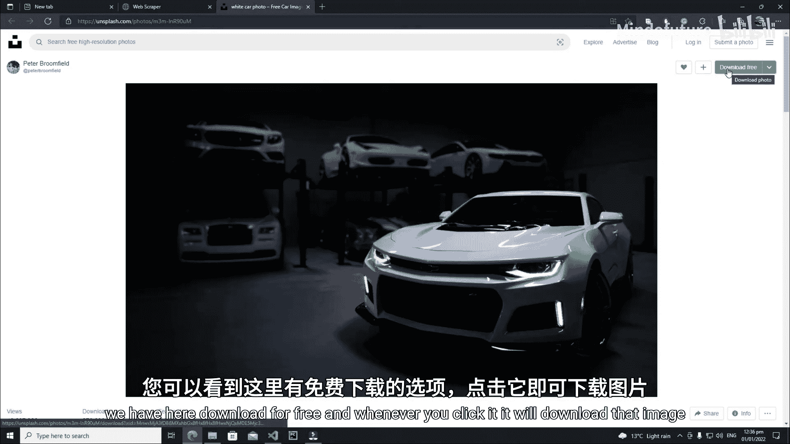
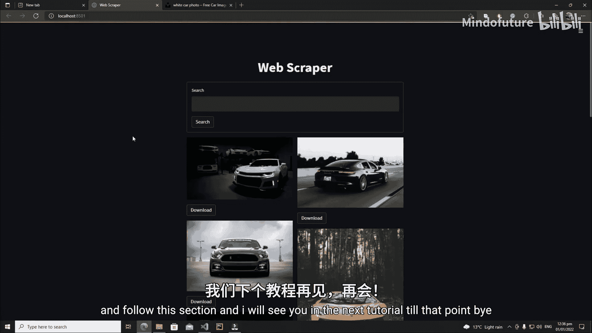

# 015：Streamlit 网页图片爬取应用介绍

在本节课中，我们将学习如何使用 Streamlit 构建一个网页图片爬取应用。这个应用允许用户输入关键词，并展示与关键词相关的图片，同时提供图片下载功能。

## 应用功能概述

我们将要构建的应用界面包含一个图标、一个标题和一个搜索栏。用户可以在搜索栏中输入关键词，例如“cars”，点击搜索按钮后，应用会展示与“cars”相关的图片。每张图片下方都有一个下载按钮，点击该按钮会跳转到该图片的原始下载页面。

## 应用界面与操作演示

以下是应用界面的示意图。

用户可以在搜索框中输入关键词。

输入关键词并点击搜索后，应用会展示相关的图片。例如，搜索“cars”会得到一系列汽车图片。

每张图片下方都有一个“Download”按钮。点击此按钮，浏览器会跳转到该图片的原始下载页面。在该页面上，用户可以点击“Download for free”等按钮来下载原图。

## 学习路径指引

上一节我们介绍了应用的整体功能，本节中我们来看看具体的实现目标。如果您想学习如何开发这个应用，请跟随本节的后续教程内容。

我们将在接下来的教程中逐步实现这个应用的所有功能。

## 本节总结

本节课中我们一起学习了计划构建的 Streamlit 网页图片爬取应用的核心功能：通过关键词搜索图片并实现下载跳转。在下一节教程中，我们将开始动手编写代码。