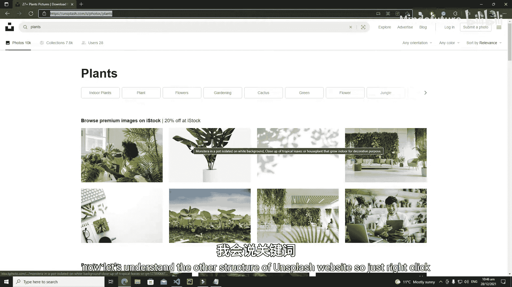
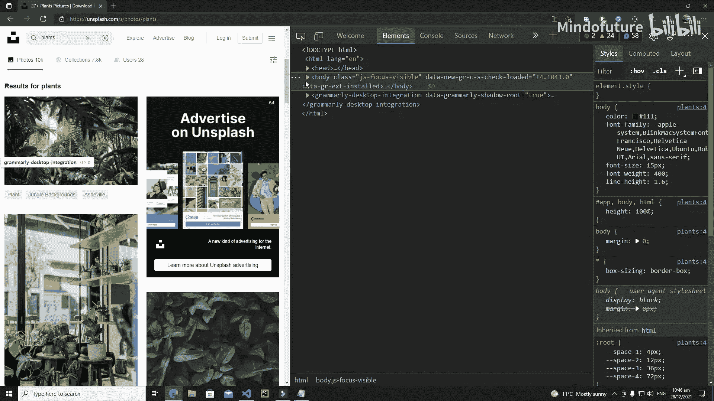
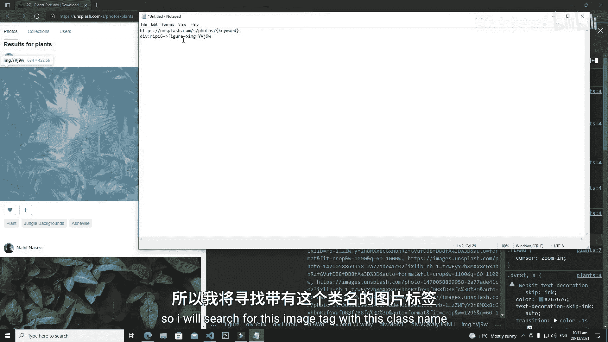
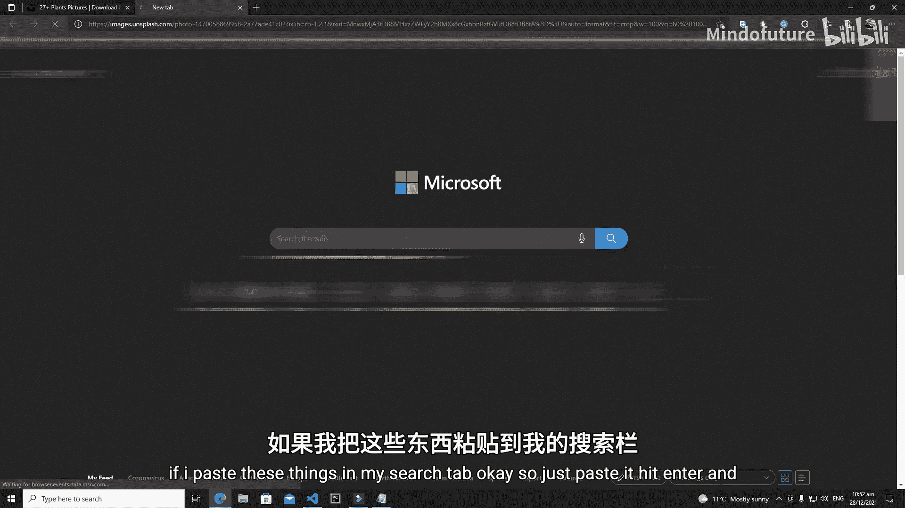
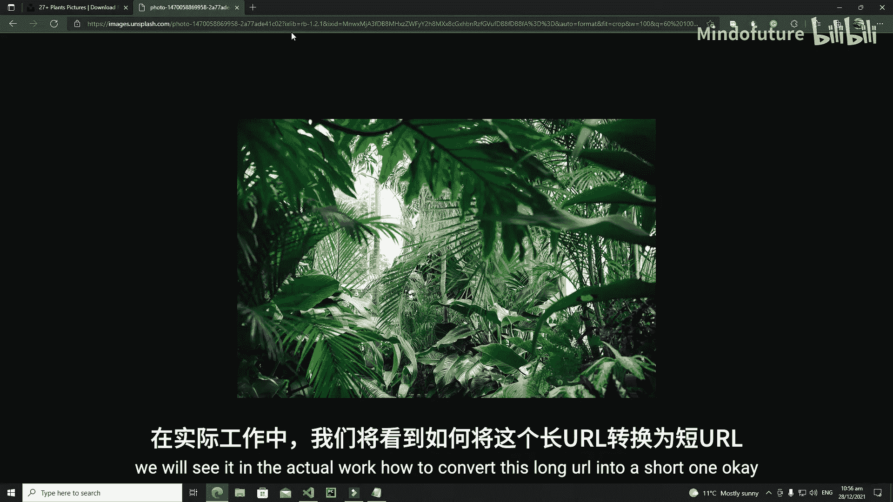
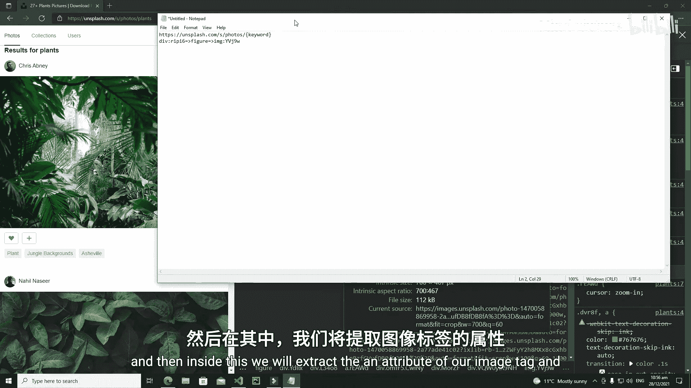

# 016：Streamlit 网页爬虫 - 目标网站结构分析 🕸️

在本节课中，我们将开始开发一个基于 Streamlit 的网页爬虫。我们将以 Unsplash 这个真实的网站为目标，学习如何爬取其上的图片并展示在我们的 Streamlit 应用中。首先，理解目标网站的结构至关重要。本节我们将详细分析 Unsplash 网站的 URL 构成和 HTML 结构。

## 分析目标网站 URL

我们首先从目标网站的 URL 开始。Unsplash 的网址是 `unsplash.com`。

当我们在网站上搜索内容时，URL 会发生变化。例如，搜索关键词 `trees` 后，URL 变为：
```
https://unsplash.com/s/photos/trees
```

观察这个 URL，我们可以发现几个关键部分：
*   `s/photos/`：这代表了网站的一个筛选器。Unsplash 主要提供三个筛选器：`photos`（图片）、`collections`（合集）和 `users`（用户）。我们主要关注 `photos` 筛选器。
*   `trees`：这是我们搜索的关键词。





因此，在我们的应用中，我们将请求用户输入一个关键词，并用它替换 URL 中的 `trees` 部分。例如，如果用户输入 `plants`，我们构造的 URL 将是：
```
https://unsplash.com/s/photos/plants
```

## 分析网页 HTML 结构

为了爬取图片，我们需要了解图片在网页 HTML 代码中的位置。以下是分析步骤：

1.  在浏览器中打开 Unsplash 并搜索一个关键词（如 `plants`）。
2.  右键点击页面，选择“检查”或“审查元素”，打开开发者工具。
3.  我们将从 `<body>` 标签开始，逐步定位到图片元素。

以下是定位图片的核心路径：

*   首先，找到包含所有搜索结果行的容器。这个容器通常是一个 `<div>` 元素，并具有特定的类名。例如，它可能类似于 `MorZF`。
    *   我们将通过这个类名来定位容器。
*   在这个容器内部，包含了多个代表行的 `<div>` 元素。每一行又包含多个 `<figure>` 元素，每个 `<figure>` 对应一张图片卡片。
    *   我们将在这个容器内搜索所有的 `<figure>` 标签。
*   在每个 `<figure>` 标签内部，我们需要找到实际的图片 `` 标签。这个 `` 标签通常也带有一个特定的类名，例如 `YVj9w`。
    *   我们将在每个 `<figure>` 内搜索具有此类名的 `` 标签。
*   最后，在目标 `` 标签上，有一个名为 `srcset` 的属性。这个属性的值包含了图片的实际源地址（URL）。
    *   我们将提取 `srcset` 属性的值来获得图片链接。

**核心定位逻辑可以用以下伪代码描述：**
```python
# 1. 构建搜索URL
base_url = "https://unsplash.com/s/photos/"
keyword = "用户输入的关键词"
search_url = base_url + keyword

# 2. 获取网页内容并解析
# 3. 定位容器
container = soup.find('div', class_='MorZF') # 类名需根据实际情况调整

# 4. 在容器内定位所有图片卡片
figures = container.find_all('figure')

# 5. 遍历每个卡片，定位图片标签并提取链接
for figure in figures:
    img_tag = figure.find('img', class_='YVj9w') # 类名需根据实际情况调整
    if img_tag and 'srcset' in img_tag.attrs:
        image_url = img_tag['srcset']
        # 处理 image_url 用于显示
```

## 总结





本节课中，我们一起学习了如何为网页爬虫项目分析目标网站的结构。我们掌握了以下关键点：

1.  **URL 构造**：理解了如何根据用户输入的关键词动态生成 Unsplash 的搜索 URL，其模式为 `https://unsplash.com/s/photos/{关键词}`。
2.  **HTML 结构分析**：通过开发者工具，我们逐步分析了网页的 DOM 结构，找到了从外层容器到具体图片元素的完整路径。
3.  **数据定位策略**：确定了通过特定的 HTML 标签（如 `<div>`、`<figure>`）和类名来定位元素，并通过提取 `` 标签的 `srcset` 属性来获取图片的真实地址。





下一节，我们将基于本节课的分析，开始动手编写 Streamlit 爬虫应用，实现自动抓取和显示 Unsplash 图片的功能。