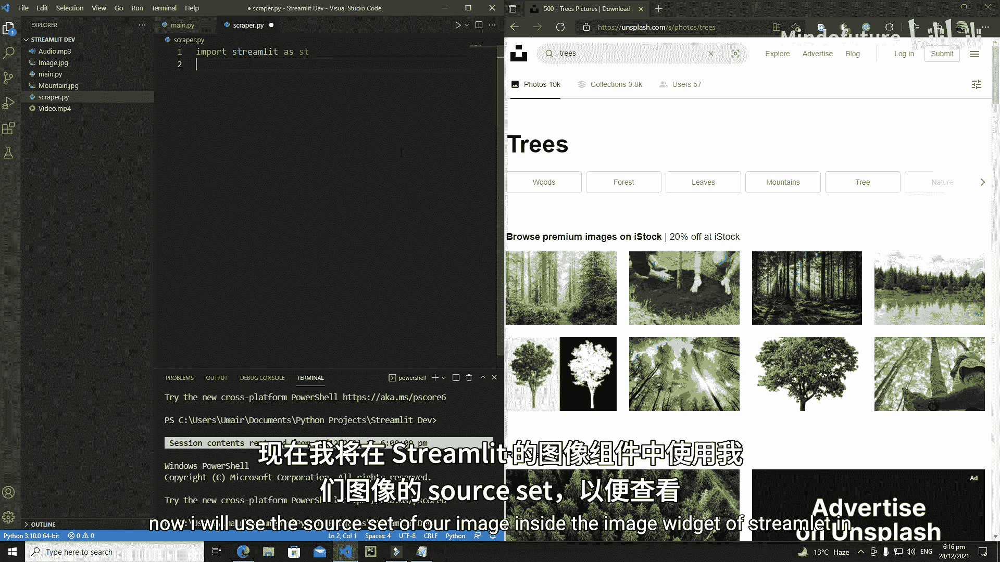
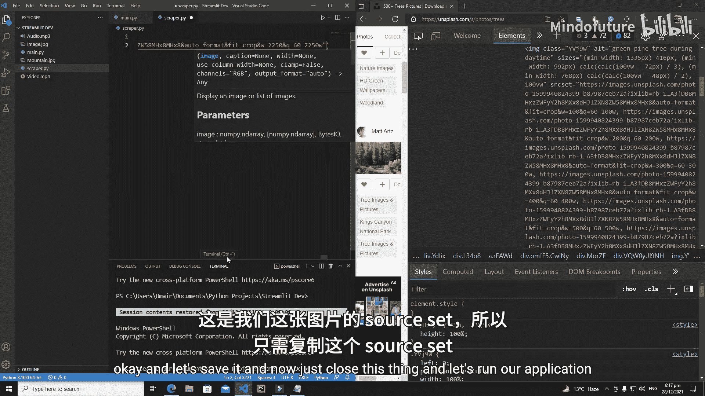
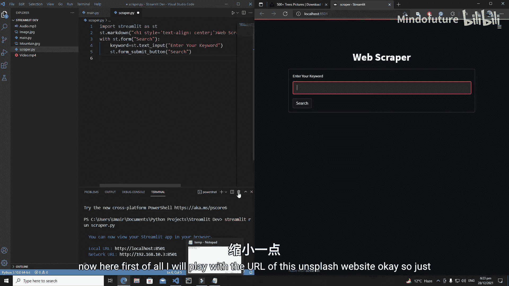
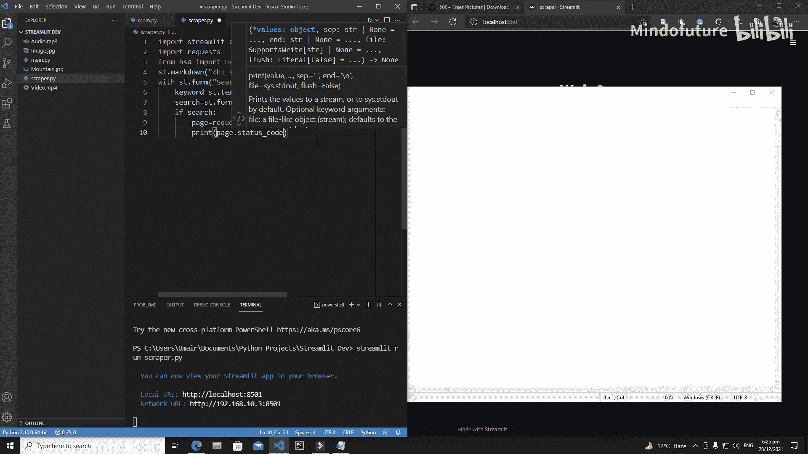
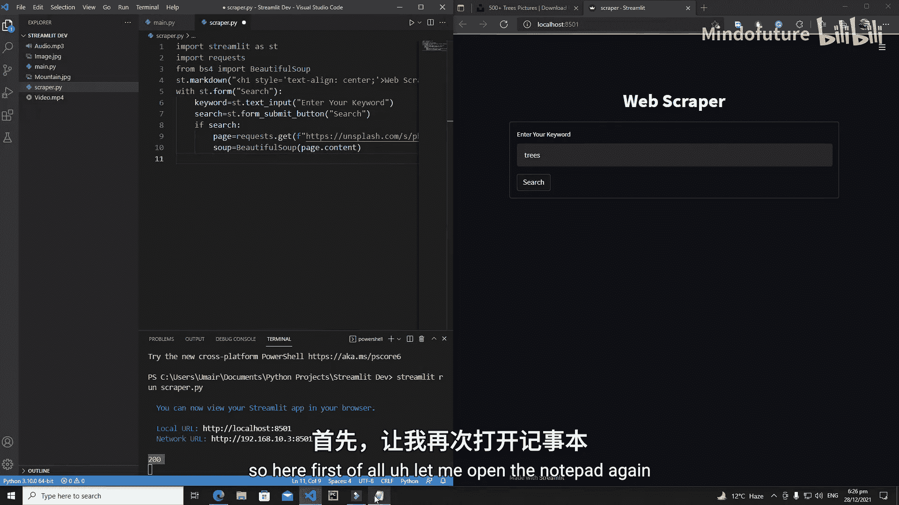
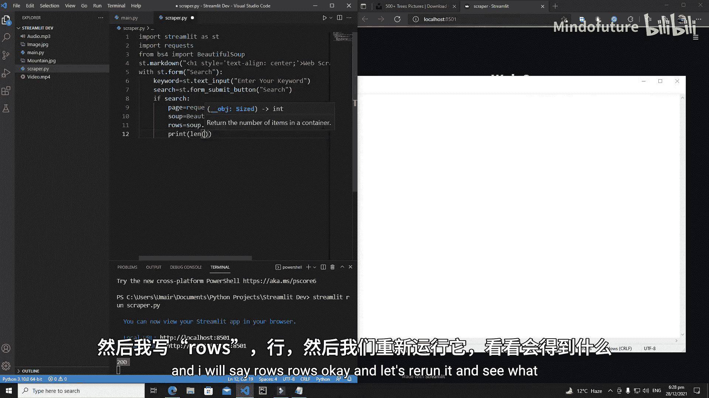
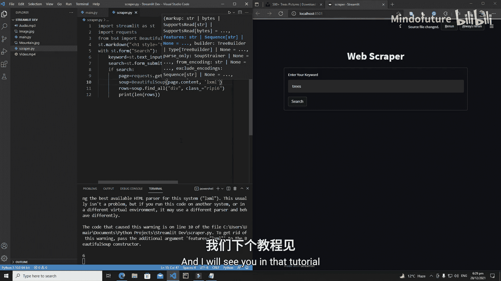

# 017：Streamlit 网页爬虫 - 准备 HTML Soup



## 概述
在本节课中，我们将开始使用 Streamlit 编写一个网页爬虫应用。我们将学习如何发送网络请求、解析 HTML 内容，并提取网页中的特定元素。

---



## 创建项目文件
首先，我们需要创建一个新的 Python 文件。

以下是创建步骤：
1.  创建一个新文件。
2.  将其命名为 `scrapper.py`。

---

## 导入必要库
编写应用的第一步是导入所需的库。

我们将导入以下库：
*   `streamlit`：用于构建 Web 应用界面。
*   `requests`：用于向目标网站发送 HTTP 请求。
*   `BeautifulSoup`：用于解析 HTML 内容。

```python
import streamlit as st
import requests
from bs4 import BeautifulSoup
```

---

## 构建应用界面
上一节我们导入了必要的库，本节中我们来看看如何构建应用的用户界面。

我们将创建一个包含标题、输入框和提交按钮的简单表单。

```python
# 创建应用标题
st.markdown("""
<h1 style='text-align: center;'>网页爬虫</h1>
""", unsafe_allow_html=True)



# 创建一个表单，用于接收用户输入
with st.form(key='search_form'):
    # 文本输入框，让用户输入搜索关键词
    keyword = st.text_input('请输入关键词')
    # 提交按钮
    search_submitted = st.form_submit_button('搜索')
```

---

## 发送网络请求与解析 HTML
在用户点击搜索按钮后，我们需要向目标网站发送请求并获取网页内容。

以下是处理逻辑：
1.  检查搜索按钮是否被点击。
2.  构建动态 URL，将用户输入的关键词插入到 URL 中。
3.  使用 `requests.get()` 方法发送 GET 请求。
4.  检查请求状态，确保成功获取网页。
5.  使用 `BeautifulSoup` 解析返回的 HTML 内容。



```python
if search_submitted:
    # 目标网站的基础URL，其中 `{keyword}` 将被替换为用户输入
    base_url = "https://unsplash.com/s/photos/{keyword}"
    # 格式化URL，插入用户关键词
    target_url = base_url.format(keyword=keyword)
    
    # 发送GET请求
    page = requests.get(target_url)
    # 打印状态码，200表示成功
    print(page.status_code)
    
    # 使用 BeautifulSoup 解析网页内容，指定解析器为 'lxml'
    soup = BeautifulSoup(page.content, 'lxml')
```

---

## 提取目标元素
成功解析 HTML 后，我们就可以查找和提取页面中的特定元素了。

我们将尝试查找所有具有特定 CSS 类名的 `<div>` 元素，这通常对应着图片的行或列容器。

```python
    # 查找所有 class 为特定值的 div 元素
    rows = soup.find_all('div', class_='特定的类名')
    # 打印找到的元素数量
    print(len(rows))
```



**注意**：在实际操作中，你需要使用浏览器开发者工具检查目标网页，找到包含图片列表的容器的正确类名，并替换代码中的 `'特定的类名'`。

---



## 总结
本节课中我们一起学习了如何使用 Streamlit 构建一个网页爬虫应用的基础框架。我们完成了以下步骤：
1.  创建项目文件并导入库。
2.  构建包含表单的用户界面。
3.  响应用户操作，发送网络请求到目标网站。
4.  使用 BeautifulSoup 解析返回的 HTML 内容。
5.  初步尝试查找页面中的特定元素。



在下一节课中，我们将深入探索如何从这些元素中精确提取图片链接等信息。