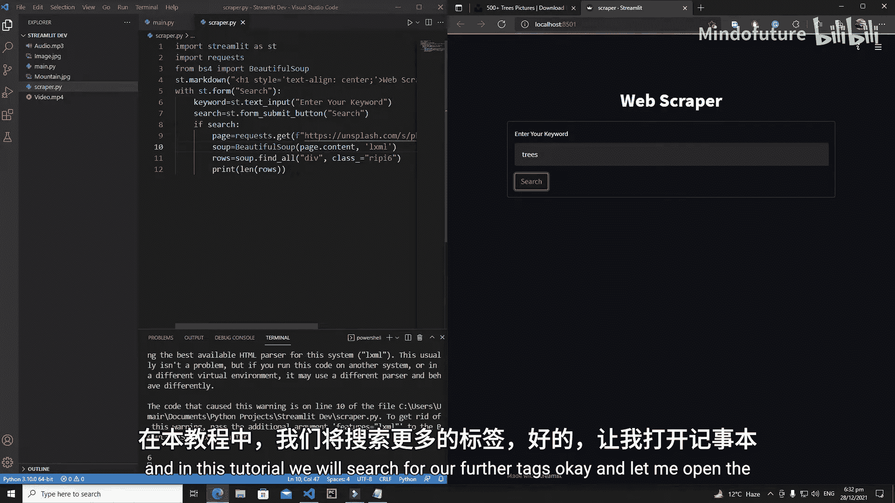
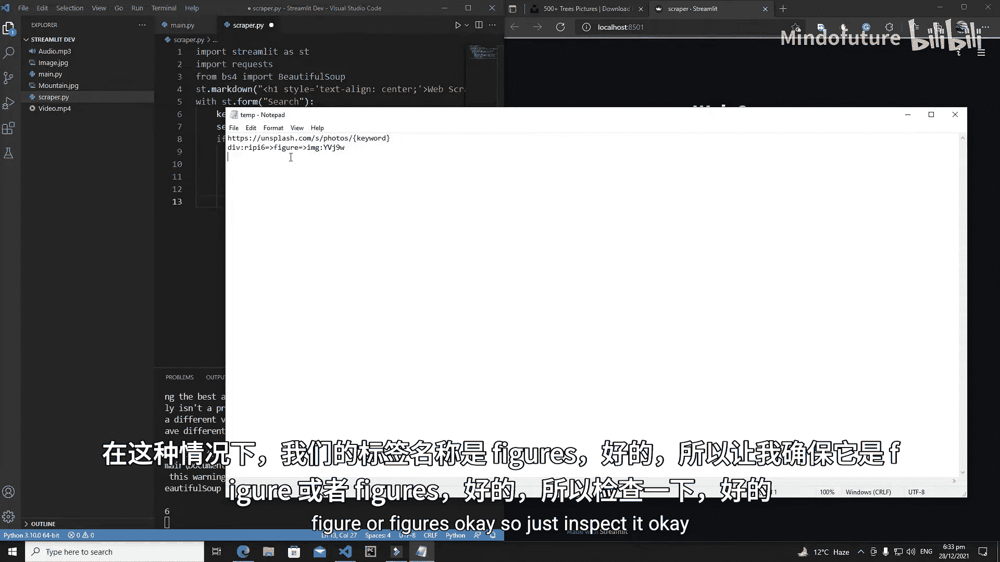
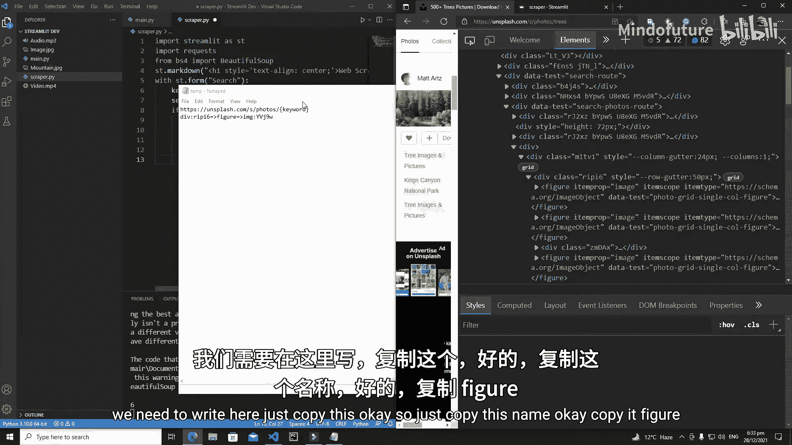
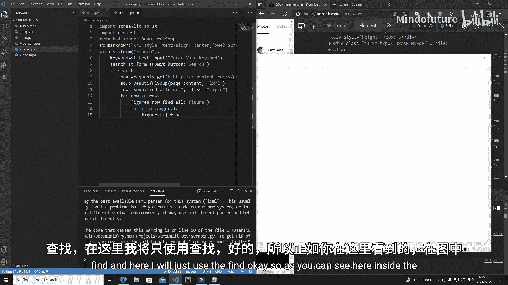
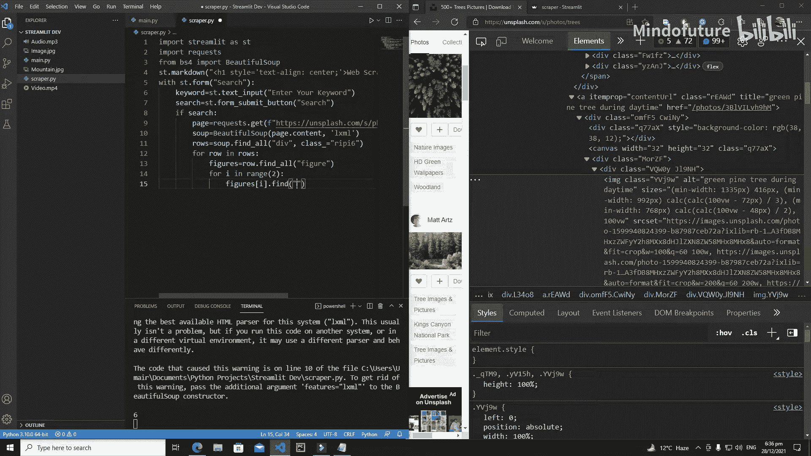
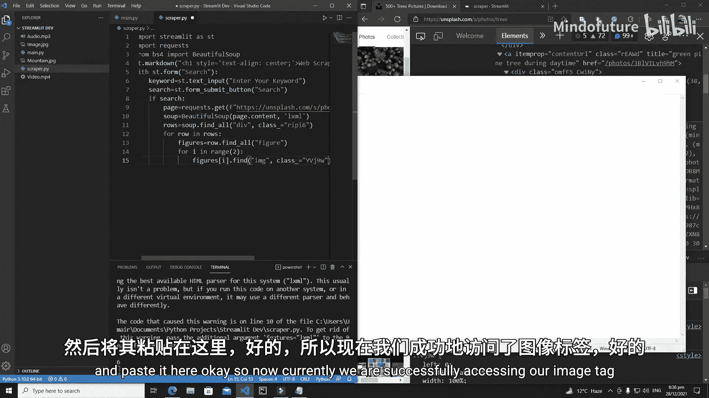
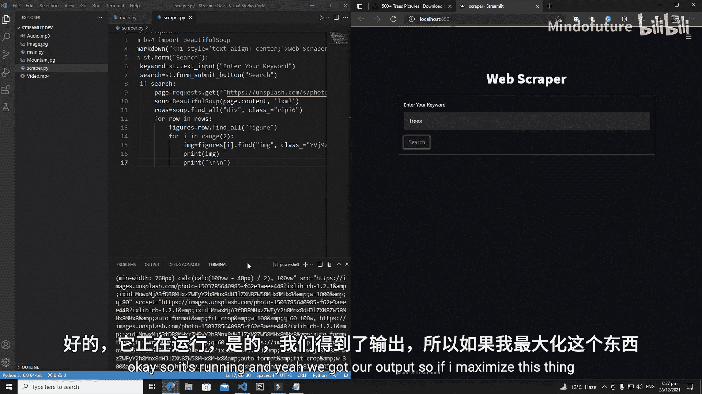
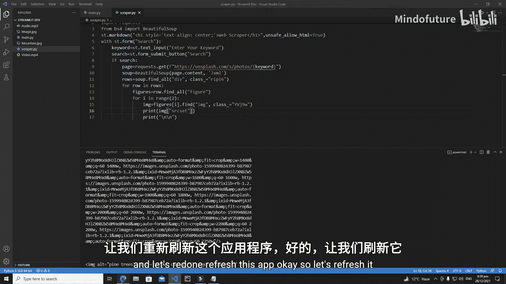
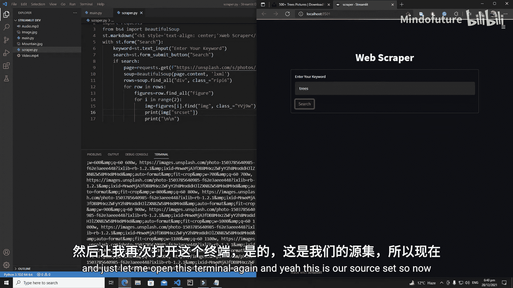

# 018：Streamlit 网页爬虫 - 提取图片URL

## 概述
在本节课中，我们将继续开发网页爬虫。我们将学习如何从已定位的HTML标签中进一步搜索，并提取出图片的URL信息。





上一节我们成功定位了包含图片的`<div>`标签。本节中，我们来看看如何深入这些`<div>`标签，找到其中的`<figure>`和``标签，并最终获取图片的源地址。

## 从行中提取图片标签
首先，我们需要遍历之前找到的每一行（row）。在每一行中，通常包含多个`<figure>`标签，每个`<figure>`标签内又包含一个``标签。



以下是实现这一步骤的代码逻辑：
```python
for row in rows:
    figures = row.find_all('figure')
```
这段代码对每个`row`元素使用`.find_all('figure')`方法，查找其内部所有的`<figure>`标签，并将结果存储在`figures`列表中。

## 限制提取的图片数量
考虑到一个页面可能包含大量图片，为了提升爬虫效率并简化教程，我们决定只提取每一行的前两张图片。



以下是限制循环次数的代码：
```python
for i in range(2):
    figure = figures[i]
```
这里使用`for i in range(2):`循环，确保我们只处理`figures`列表中的前两个元素。

## 定位图片标签并获取属性
在获取到`<figure>`标签后，我们需要进一步定位其内部的``标签。由于每个`<figure>`标签内通常只有一个``标签，我们可以使用`.find()`方法。





以下是查找图片标签的代码：
```python
image_tag = figure.find('img', class_='your-class-name')
```
代码中，`figure.find('img', class_='your-class-name')`用于在`figure`元素内查找具有特定类名的``标签。类名参数是可选的，但指定它可以使代码更健壮。

## 提取图片源地址
成功获取``标签对象后，我们的目标是提取其`srcset`属性，该属性包含了图片的URL地址。

以下是提取并打印`srcset`属性的代码：
```python
print(image_tag.get('srcset'))
print("\n")
```
`image_tag.get('srcset')`用于获取标签的`srcset`属性值。打印一个空行`print("\n")`是为了让终端输出更清晰易读。







运行爬虫后，你将在终端看到类似以下的长字符串输出，这就是图片的`srcset`信息：
```
https://example.com/image1.jpg 1x, https://example.com/image1-2x.jpg 2x
```

## 总结
本节课中我们一起学习了网页爬虫开发的深入步骤。我们实现了从行元素中定位`<figure>`标签，限制处理图片的数量，精确查找到``标签，并最终成功提取了包含图片URL的`srcset`属性。在下一教程中，我们将学习如何解析这个长字符串，从中分离出我们真正需要的图片地址。