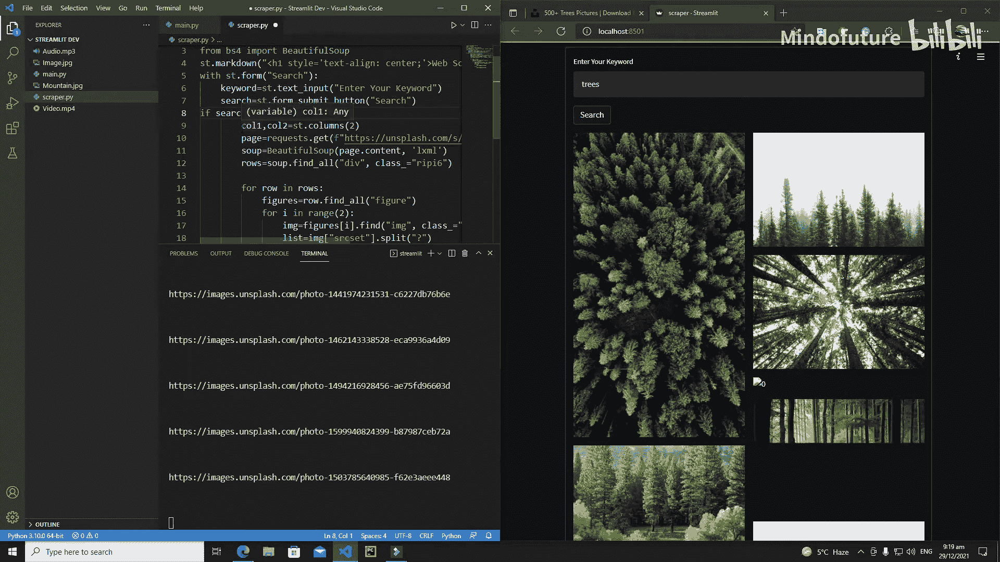
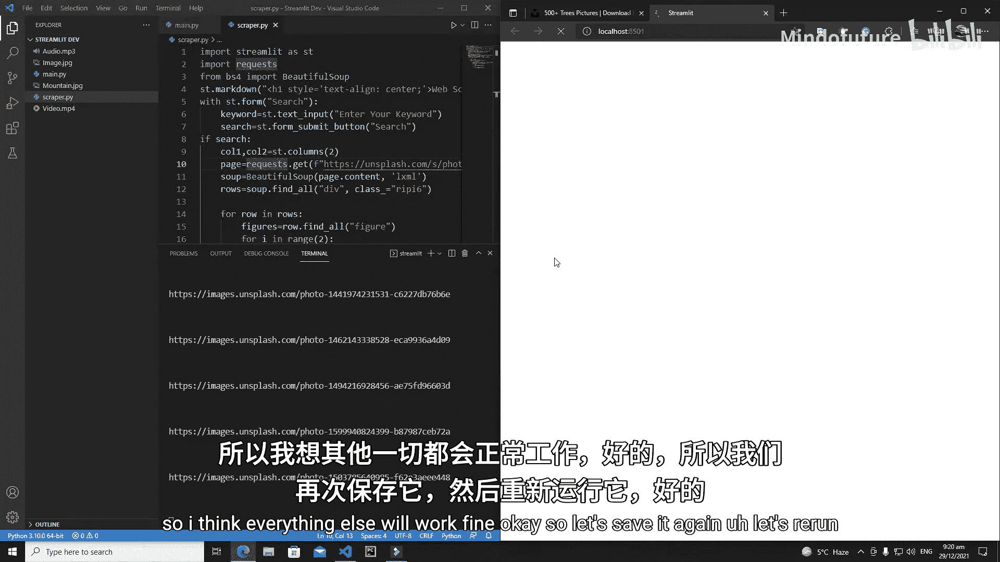
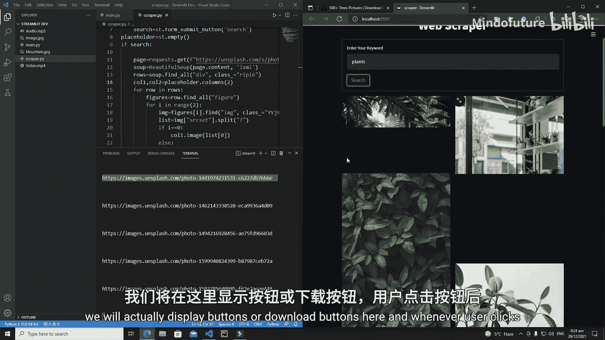
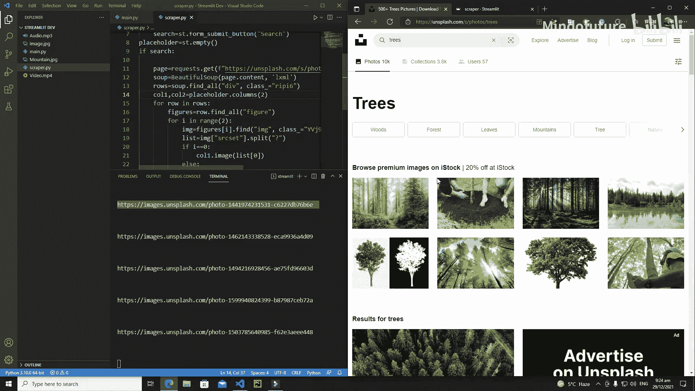

# 019：Streamlit 网页图片爬取与展示

在本节课中，我们将继续开发网页图片爬取应用。我们将学习如何从爬取的原始链接中提取出纯净的图片URL，并使用Streamlit的布局功能，将这些图片以两列的形式优雅地展示在网页上。

上一节我们完成了网页请求和初步的数据提取。本节中，我们来看看如何精确地提取图片链接并进行展示。

## 提取纯净图片URL

首先，我们需要从爬取到的原始数据中提取出可以直接用于显示图片的URL。观察原始链接，我们发现目标图片地址位于URL中问号 `?` 之前的部分。

以下是提取逻辑：
1.  使用字符串的 `split` 方法，以问号 `?` 为分隔符，将原始URL分割。
2.  分割后得到的列表的第一个元素，就是纯净的图片地址。

让我们在代码中实现这个逻辑。我们将打印原始链接以进行观察，然后应用分割方法。

```python
# 假设 srcset 是包含原始图片链接的字符串
# 例如: “https://images.unsplash.com/photo-xxx?ixlib=rb-1.2.1...”

# 分割URL
split_list = srcset.split('?')
# 提取纯净的图片URL
pure_image_url = split_list[0]
print(pure_image_url)
```

运行代码并输入关键词（如“trees”）后，终端将成功输出一系列纯净的图片URL。这证明我们的提取逻辑是正确的。

## 在Streamlit中展示图片

成功提取URL后，下一步是在Streamlit应用界面上展示这些图片。我们将使用 `st.image()` 组件。

为了获得更好的布局效果，我们计划将图片分两列显示。这需要用到Streamlit的列布局功能。

以下是创建两列布局并展示图片的步骤：
1.  使用 `st.columns(2)` 创建两个列对象。
2.  在循环遍历图片URL列表时，根据索引的奇偶性，将图片分配到不同的列中显示。

初始实现代码如下：

```python
import streamlit as st

# 假设 img_urls 是包含所有纯净图片URL的列表
col1, col2 = st.columns(2)

for i, img_url in enumerate(img_urls):
    if i % 2 == 0:  # 偶数索引图片放入第一列
        col1.image(img_url)
    else:           # 奇数索引图片放入第二列
        col2.image(img_url)
```



然而，直接运行上述代码可能会遇到布局问题，图片被限制在输入表单内部。为了解决这个问题，我们需要将布局和图片展示的代码移到表单 `st.form` 的外部。



## 优化布局与状态管理

调整代码结构后，图片得以正常显示在两列布局中。但是，当我们尝试搜索一个新的关键词（如“plants”）时，发现页面仍然显示上一次搜索（“trees”）的结果。

这是因为Streamlit会缓存组件的状态。要确保每次搜索都更新内容，我们需要引入一个“占位符”。

以下是解决方案：
1.  在表单外部，使用 `st.empty()` 创建一个空的占位符。
2.  在表单提交、获取到新数据后，对这个占位符进行操作。
3.  将占位符划分为两列，并在其中填入新的图片内容。

这样，每次提交表单时，都会清空并重新填充占位符的内容，从而实现结果的动态更新。

最终的核心代码结构如下：

```python
import streamlit as st

# 1. 在页面主体创建空占位符
image_placeholder = st.empty()

# 2. 创建输入表单
with st.form("search_form"):
    keyword = st.text_input("输入关键词")
    submitted = st.form_submit_button("搜索")

# 3. 表单提交后执行
if submitted:
    # ... (网页请求与数据提取代码，生成 img_urls 列表) ...

    # 4. 在占位符内创建两列并展示图片
    with image_placeholder.container():
        col1, col2 = st.columns(2)
        for i, img_url in enumerate(img_urls):
            if i % 2 == 0:
                col1.image(img_url)
            else:
                col2.image(img_url)
```

应用此结构后，无论是搜索“trees”还是“plants”，页面都能正确显示对应的图片，并且布局整洁美观。

本节课中我们一起学习了Streamlit网页图片爬取与展示的核心步骤。我们掌握了从复杂URL中提取纯净图片地址的方法，并学会了使用 `st.columns` 进行两列布局，以及通过 `st.empty()` 占位符来管理动态内容更新，从而构建出一个交互式的图片搜索展示应用。





在下一教程中，我们将为每张图片添加下载按钮，并实现点击后跳转到Unsplash官方下载页面的功能。