# 020：为图片添加下载按钮

在本节课中，我们将为上一节爬取的Unsplash图片添加下载按钮。我们将学习如何为每个图片创建独立的按钮，并解决按钮ID重复的问题，最终实现点击按钮后在新标签页中打开图片的下载页面。

## 概述

上一节我们成功地从Unsplash网站爬取了图片并显示在Streamlit应用中。本节中，我们来看看如何为每一张图片添加一个下载按钮，让用户能够方便地访问原图下载页面。

## 为图片列添加按钮

首先，我们需要在显示图片的列中，同时添加一个下载按钮。以下是实现步骤：

1.  在图片下方，使用 `st.button` 函数创建一个按钮。
2.  为按钮定义一个标签，例如“下载”。
3.  将按钮的状态保存到一个变量中，以便后续判断用户是否点击了它。

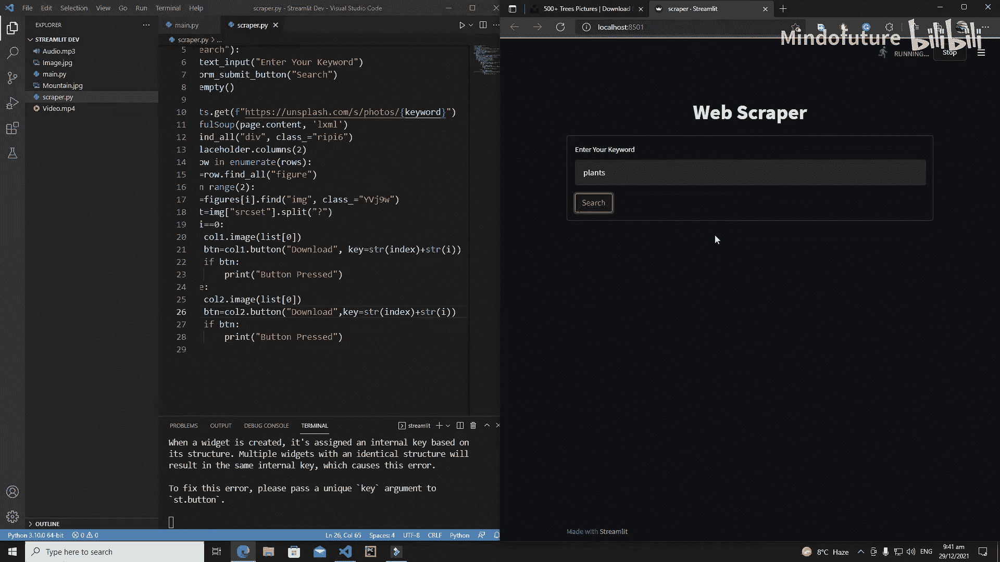

初始的按钮创建代码如下：
```python
btn = st.button(“下载”)
if btn:
    print(“按钮被按下”)
```
我们需要将此代码应用到每一列的图片显示逻辑中。

## 解决按钮ID重复错误

当我们运行上述代码时，会遇到一个错误：“duplicate widget ID”。这是因为Streamlit要求页面上的每一个小组件（Widget）都必须有一个唯一的键（key）。

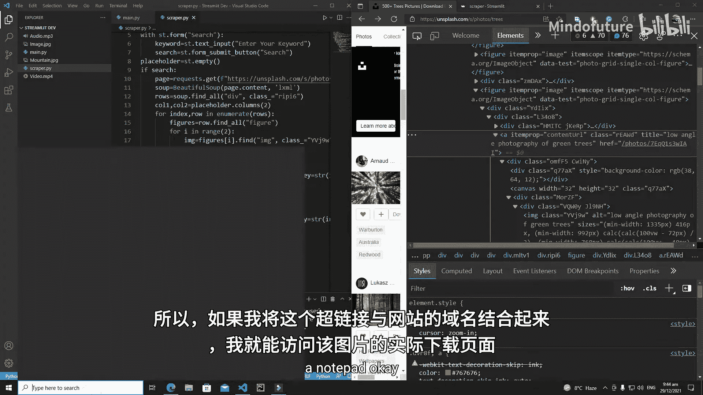

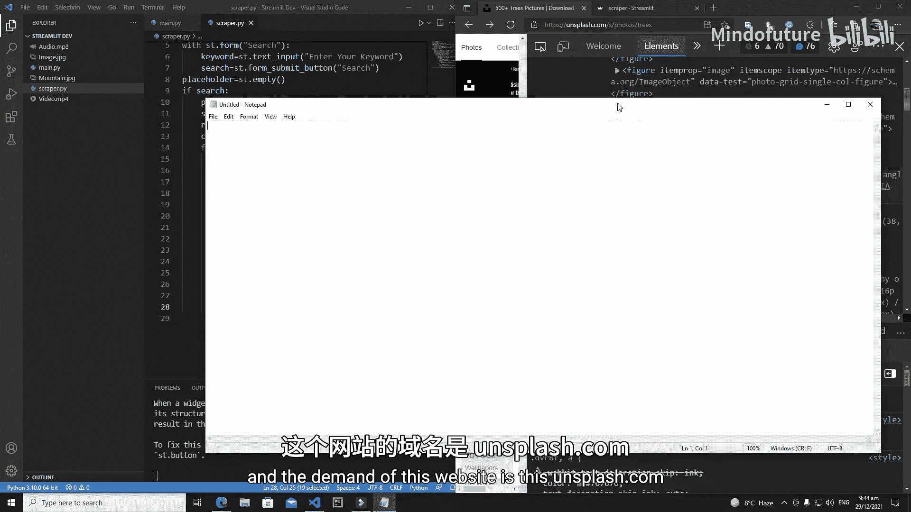

为了解决这个问题，我们需要为每个按钮分配一个独一无二的 `key` 参数。

1.  首先，使用 `enumerate` 函数来获取每一行数据的索引。`enumerate` 函数会返回两个值：索引和实际的数据值。
    ```python
    for index, row in enumerate(rows):
    ```
2.  然后，利用行索引 `index` 和列索引 `i` 来构造一个唯一的键。例如，第一行第一列的按钮键可以是 `“00”`，第一行第二列的按钮键可以是 `“01”`。
    ```python
    key = str(index) + str(i)
    ```
3.  最后，在创建按钮时传入这个 `key`。
    ```python
    btn = st.button(“下载”, key=key)
    ```

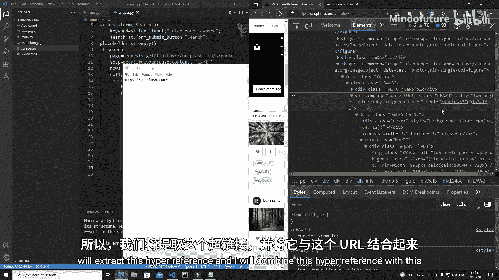

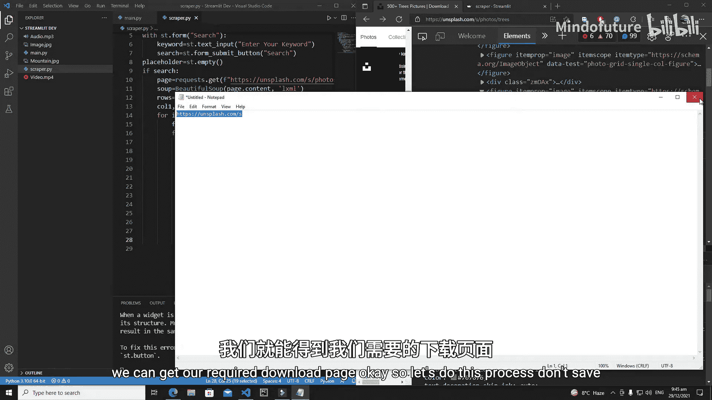

## 提取图片下载链接

我们的目标是点击按钮后，在新标签页中打开图片在Unsplash上的下载页面。为此，我们需要从网页结构中提取出每张图片对应的详情页链接。

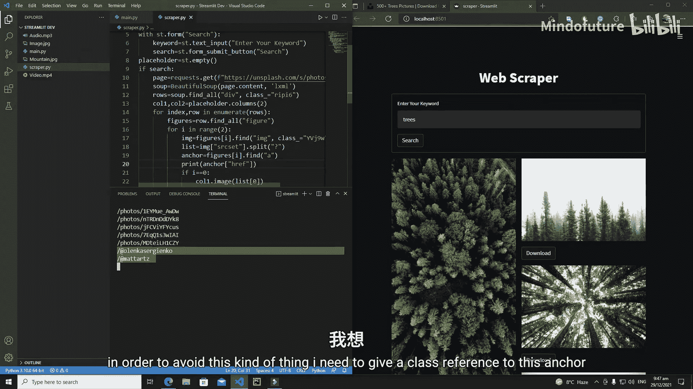

1.  通过检查网页元素，我们发现图片被包裹在一个 `<figure>` 标签内，而该标签内包含一个 `<a>`（锚）标签。
2.  这个 `<a>` 标签的 `href`（超链接）属性值，例如 `/photos/abc123`，就是图片详情页的相对路径。
3.  我们需要在爬取图片 `src` 的同时，也爬取这个 `href` 值。
4.  为了精确地定位到这个 `<a>` 标签，我们可能需要使用其 `class` 名称进行筛选，以避免抓取到其他无关的链接。

提取链接的代码逻辑如下：
```python
anchor_tag = figure.find(“a”, class_=“特定的class名”)
image_url = anchor_tag[“href”]
```

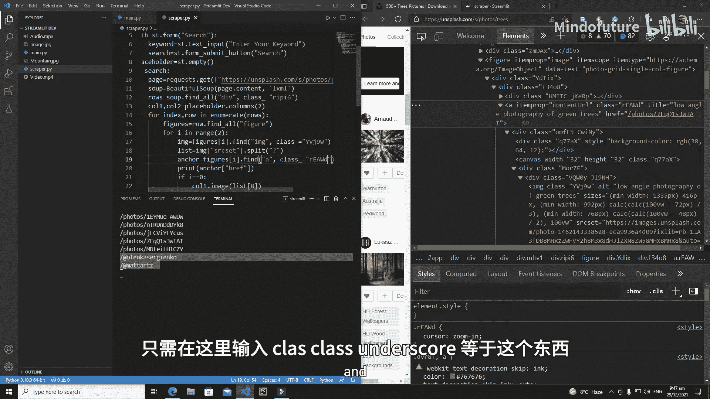

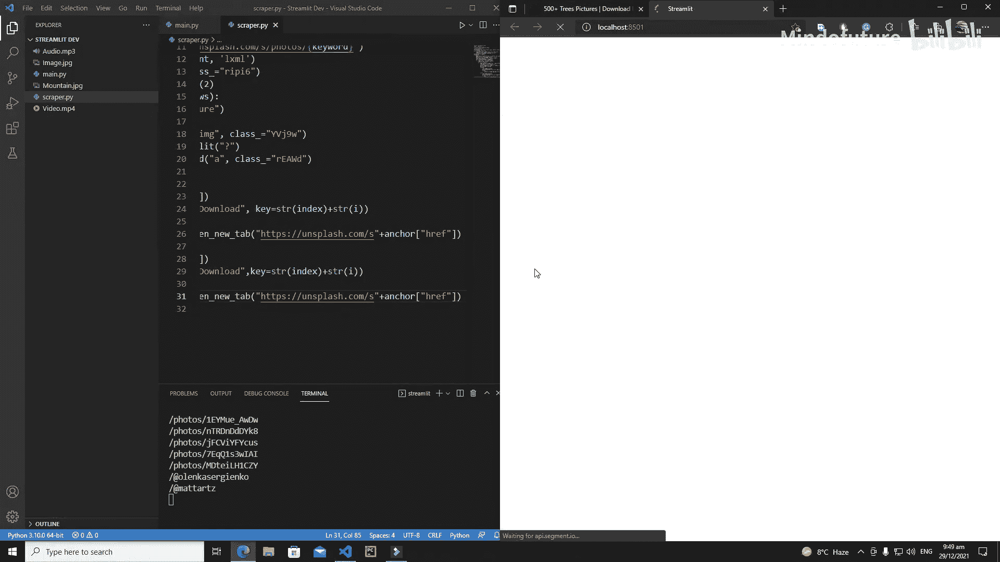

## 整合功能并打开下载页面

现在，我们已经有了图片详情页的相对路径。接下来需要完成以下步骤：

1.  将相对路径与Unsplash的域名拼接，形成完整的图片详情页URL。
    ```python
    base_url = “https://unsplash.com”
    full_download_url = base_url + image_url
    ```
2.  导入Python内置的 `webbrowser` 模块，它可以帮助我们在浏览器中打开新标签页。
    ```python
    import webbrowser
    ```
3.  在按钮的点击事件中，使用 `webbrowser.open_new_tab(full_download_url)` 来打开拼接好的完整URL。

此外，我们还需要修复一个应用逻辑上的小问题：将图片搜索和显示的逻辑判断条件，从“搜索表单按钮被点击”改为“用户输入的关键词不为空”，这样可以确保应用在各种交互下都能正确响应。

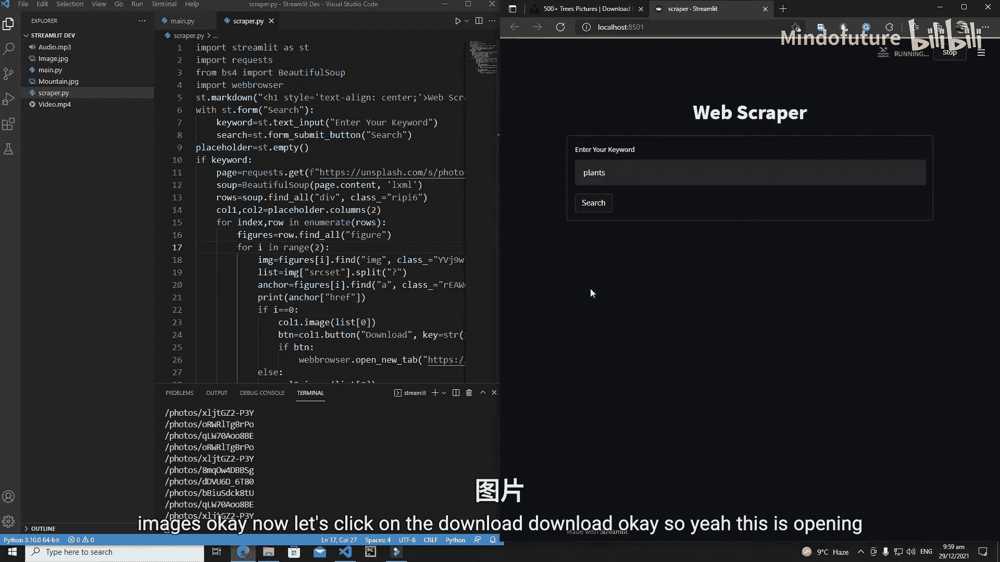

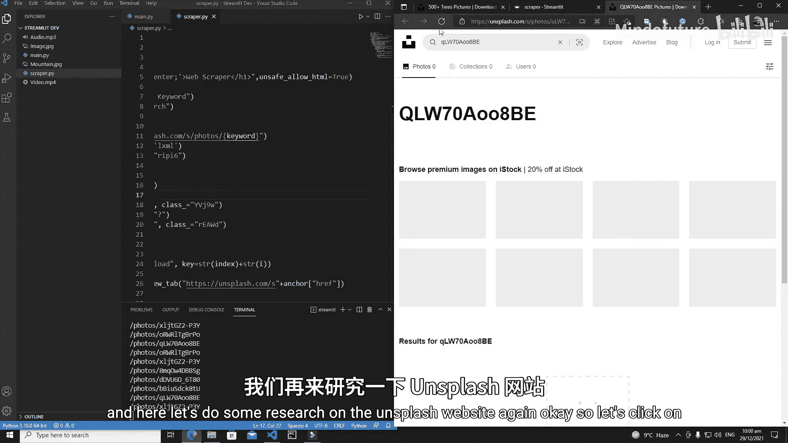

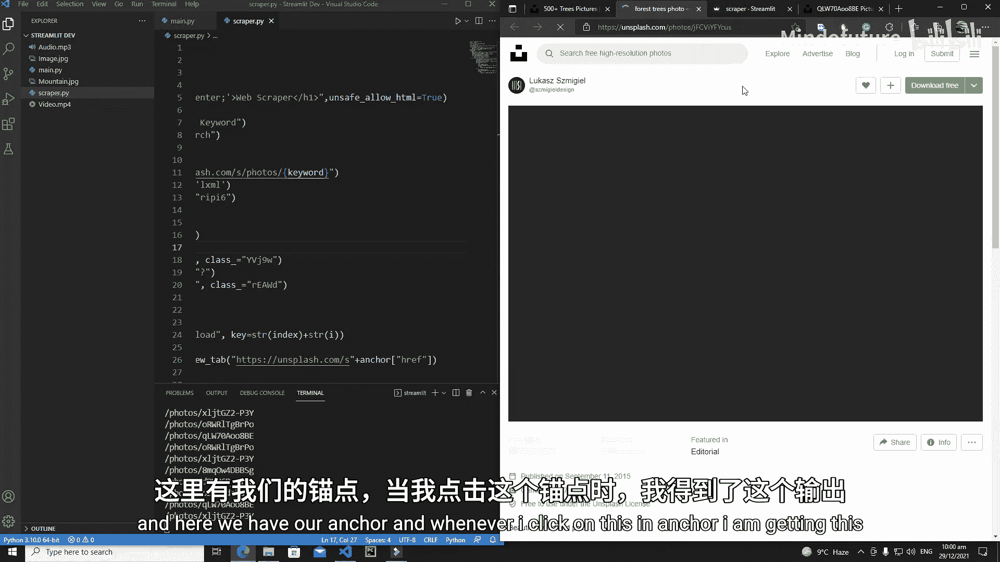

## 总结

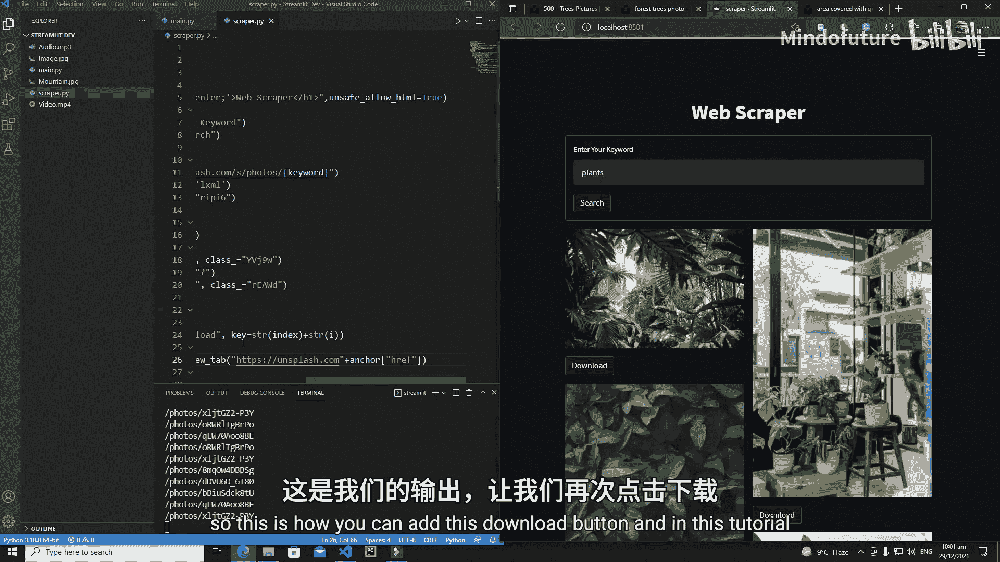

本节课中我们一起学习了如何为Streamlit网页爬虫应用中的图片添加下载功能。我们解决了按钮ID重复的关键问题，学会了从网页中提取更深层的链接信息，并最终实现了点击按钮跳转至图片下载页面的完整流程。通过本节的学习，你的应用交互性得到了进一步增强。在接下来的教程中，我们将探索更多功能来完善这个网页爬虫。