# 021：页面配置 🛠️

在本教程中，我们将学习如何配置 Streamlit 网页应用的外观，包括修改页面标题、图标、布局等。

## 概述

`st.set_page_config` 是 Streamlit 提供的一个核心函数，它允许我们自定义应用页面的基本配置。通过它，我们可以轻松改变页面的标题、图标、布局等属性，使应用更具个性化。

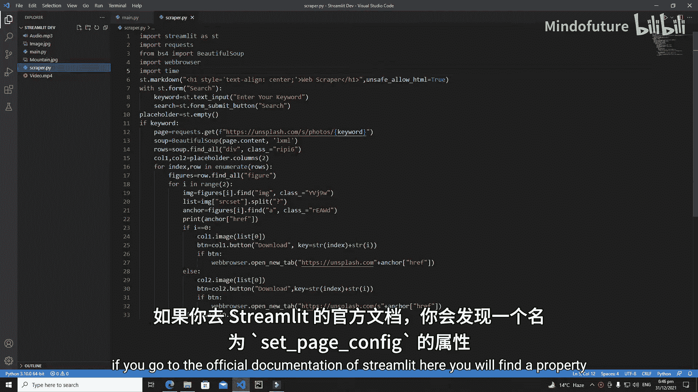

## 配置页面标题与图标

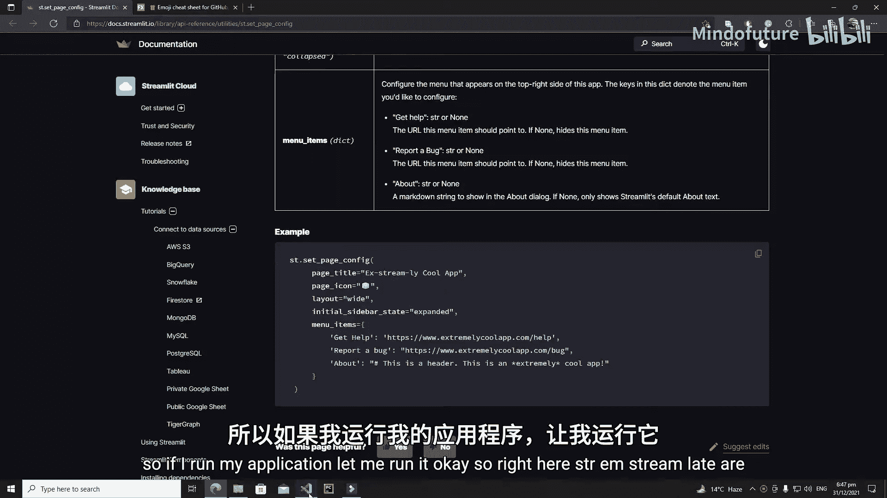

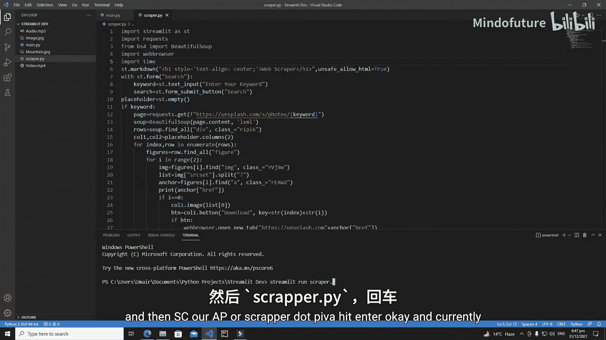

首先，我们需要了解 `st.set_page_config` 函数必须放在所有其他 Streamlit 函数或属性的最顶部。

以下是设置页面标题和图标的基本语法：

```python
st.set_page_config(
    page_title="你的页面标题",
    page_icon="🎯"
)
```

*   **`page_title`**：此参数用于设置浏览器标签页上显示的标题。
*   **`page_icon`**：此参数用于设置浏览器标签页上显示的图标。你可以使用表情符号（如 `🎯`）或图标名称。

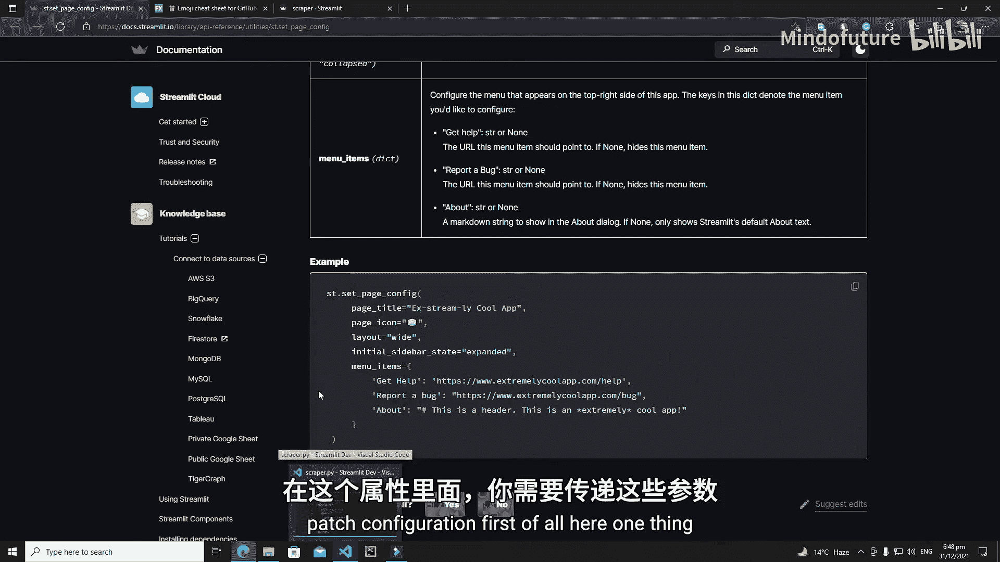

例如，将标题设置为“网页抓取工具”，图标设置为笑脸表情：

```python
st.set_page_config(
    page_title="网页抓取工具",
    page_icon="😊"
)
```

运行应用后，你将看到浏览器标签页的标题和图标已更新。

## 调整页面布局

除了标题和图标，我们还可以通过 `layout` 参数来调整页面的整体布局。

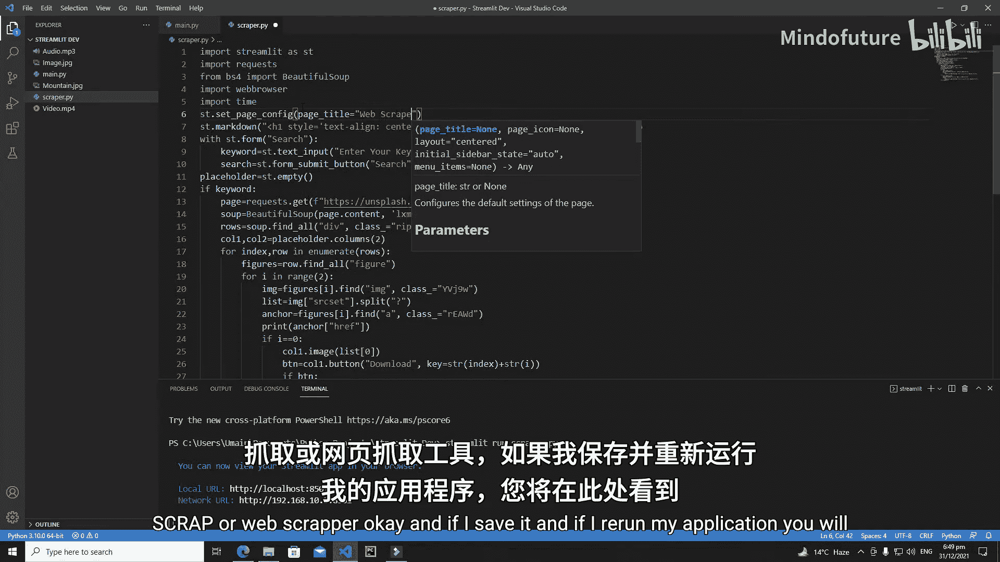

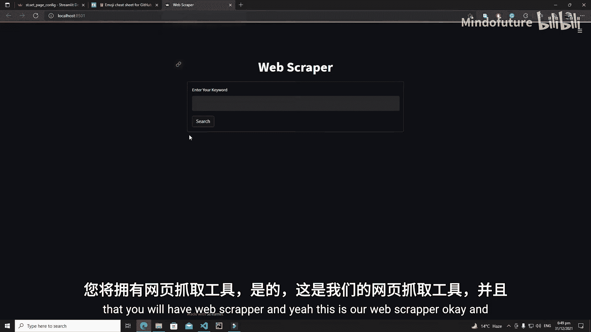

Streamlit 默认的布局是居中的（`"centered"`）。我们可以将其改为宽屏模式（`"wide"`），让内容区域更宽。

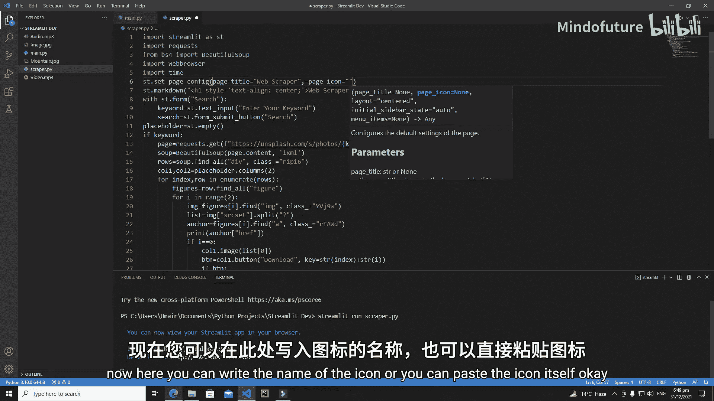

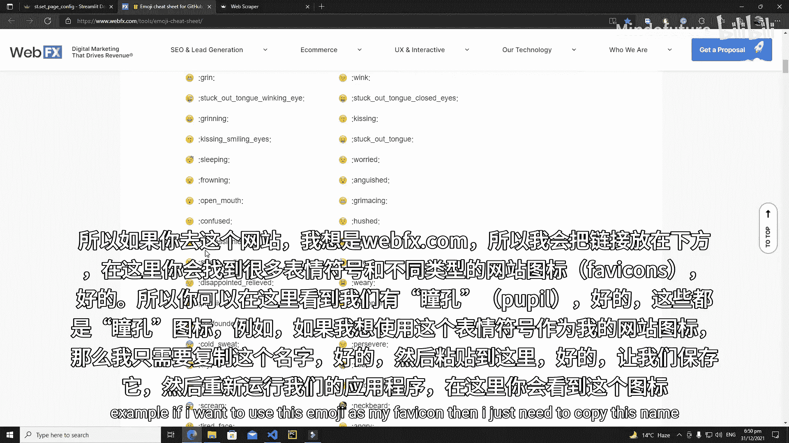

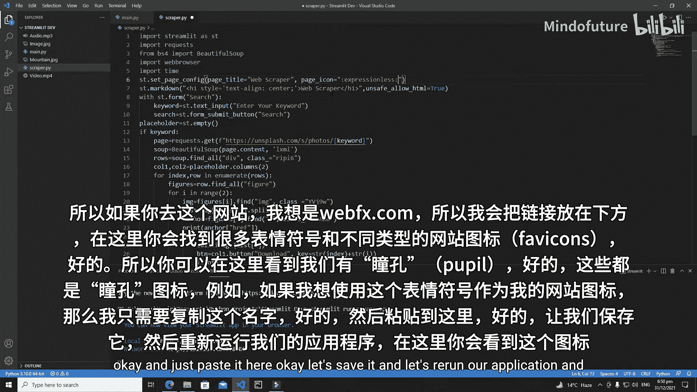

以下是设置宽屏布局的代码：

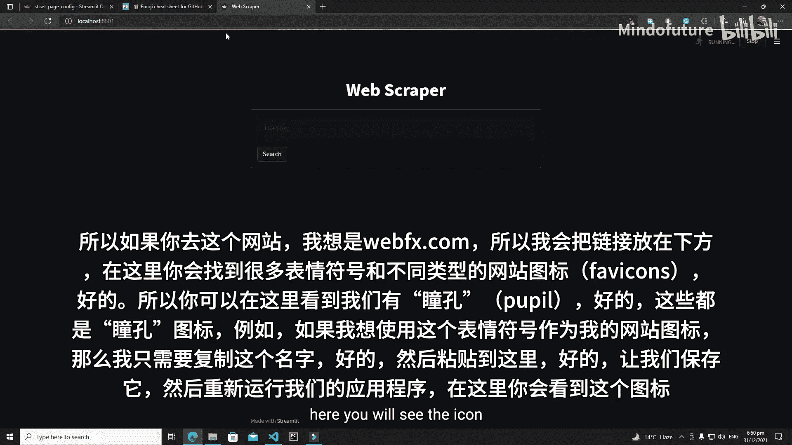

```python
st.set_page_config(
    page_title="网页抓取工具",
    page_icon="😊",
    layout="wide"
)
```

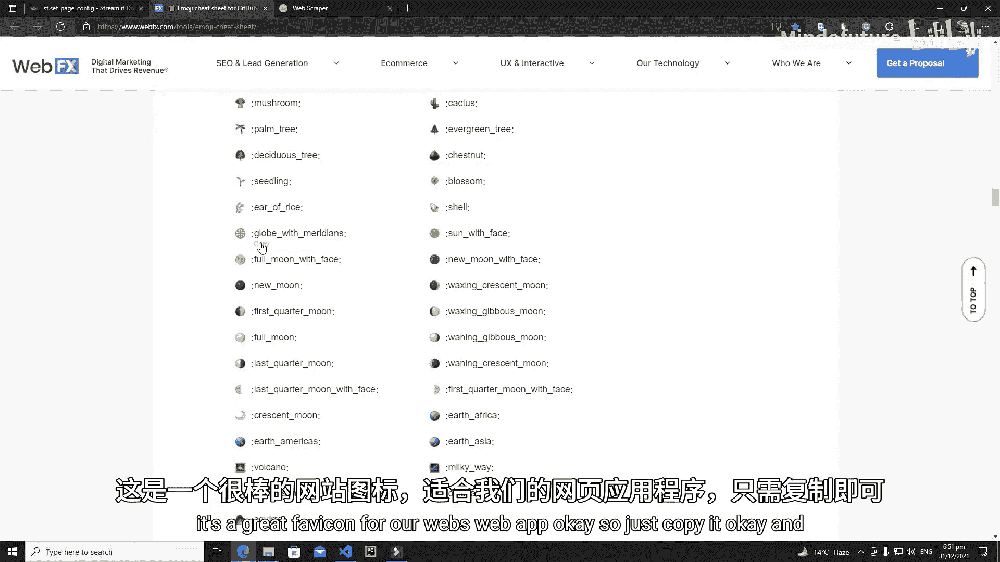

将 `layout` 设置为 `"wide"` 后，应用的内容区域将占据更多的水平空间。

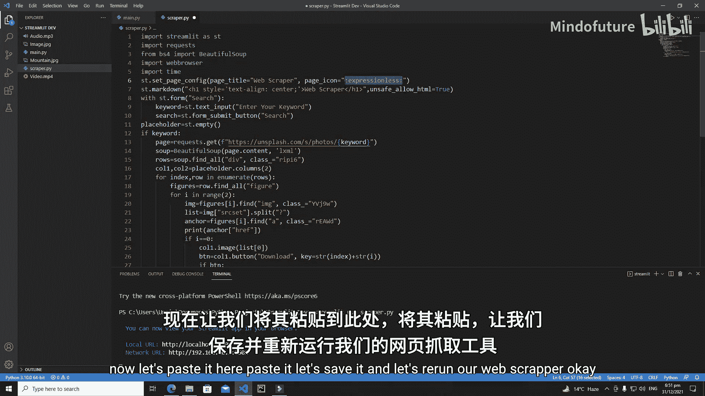

## 其他配置选项

`st.set_page_config` 函数还提供了其他有用的配置选项：

*   **`initial_sidebar_state`**：此参数用于设置侧边栏的初始状态（例如 `"expanded"` 或 `"collapsed"`）。当你的应用创建了侧边栏后，可以使用此参数进行控制。
*   **`menu_items`**：此参数允许你自定义应用右上角汉堡菜单中的项目。你可以修改“获取帮助”、“报告问题”和“关于”等菜单项的链接和文本。

例如，自定义“关于”菜单项：

```python
st.set_page_config(
    page_title="网页抓取工具",
    page_icon="😊",
    layout="wide",
    menu_items={
        'About': '这是一个由Streamlit构建的网页抓取工具。'
    }
)
```

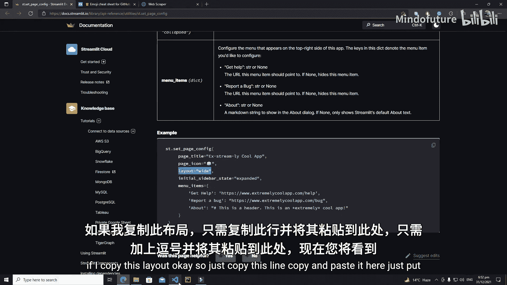

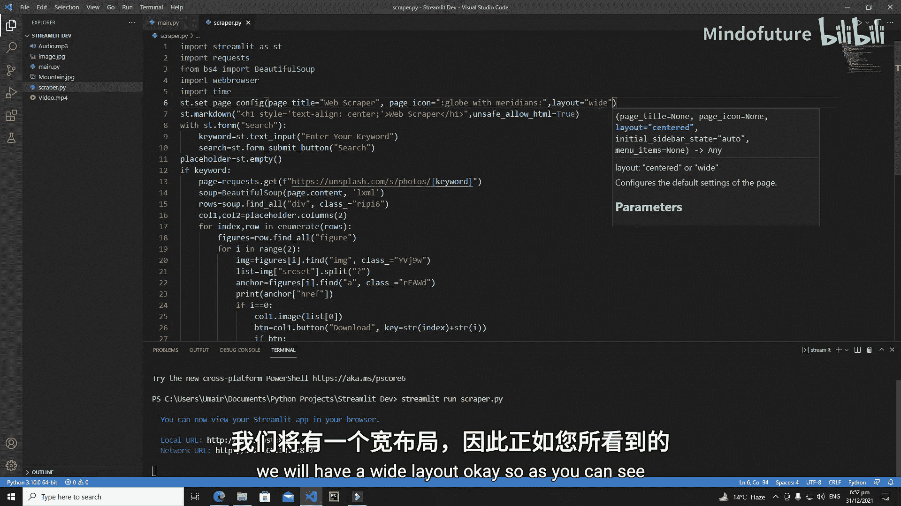

## 总结

本节课我们一起学习了如何使用 `st.set_page_config` 函数来配置 Streamlit 应用的基本页面属性。

我们掌握了如何：
1.  使用 `page_title` 和 `page_icon` 参数自定义页面标题和图标。
2.  使用 `layout` 参数在“居中”和“宽屏”布局之间切换。
3.  了解了 `initial_sidebar_state` 和 `menu_items` 等高级配置选项的用途。

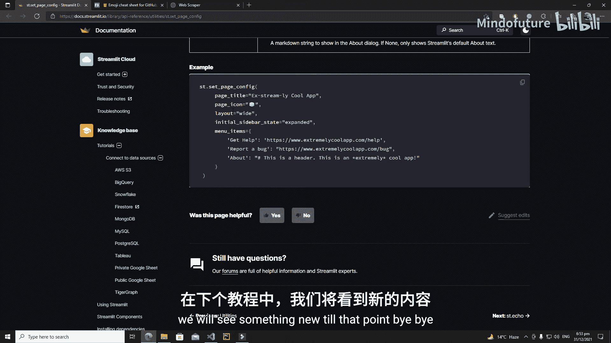

通过合理配置这些选项，你可以让自己的 Streamlit 应用看起来更专业、更符合需求。