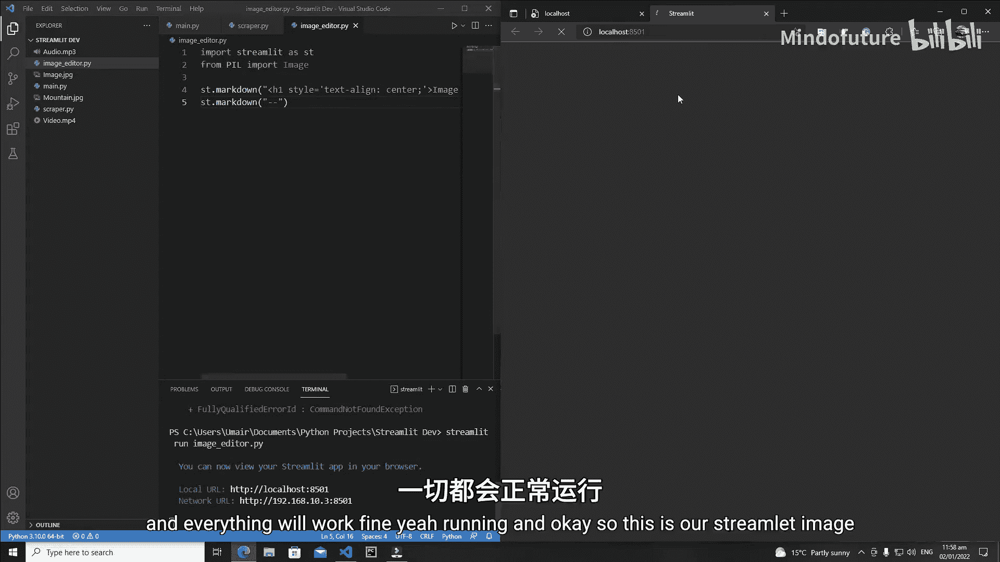
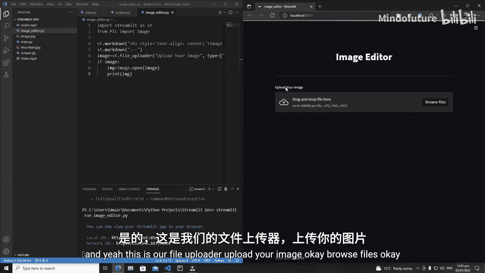
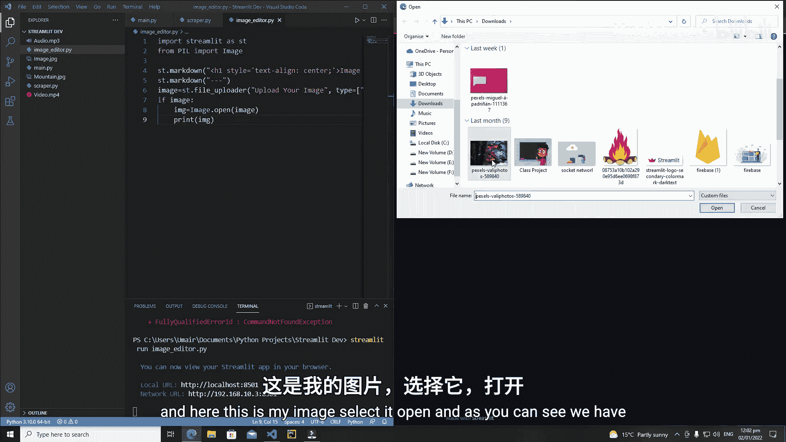
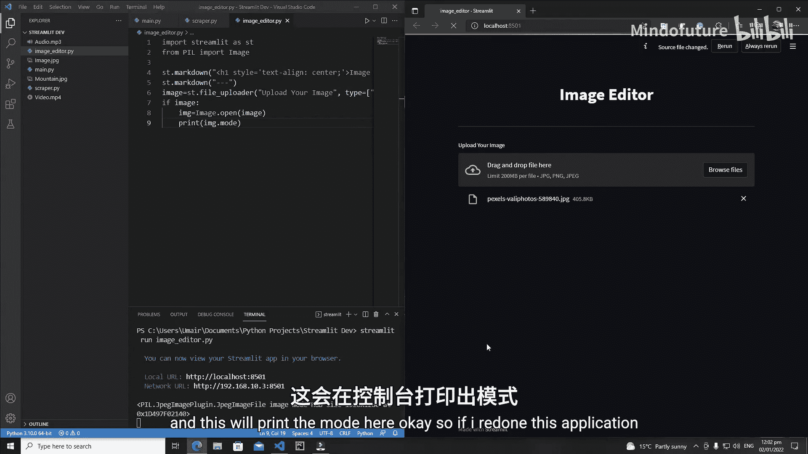
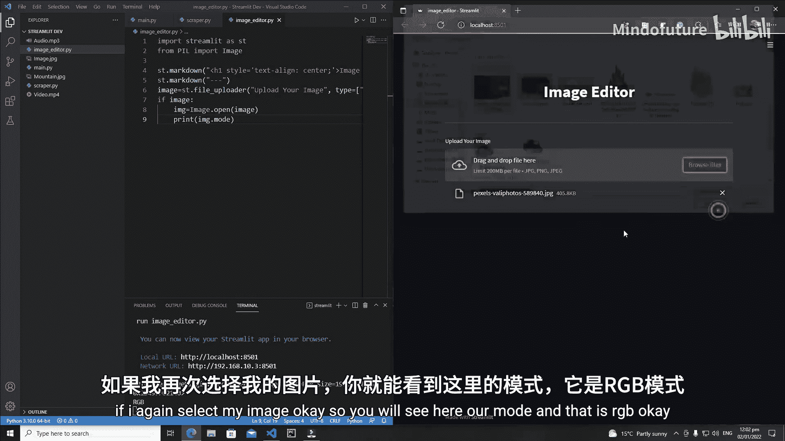
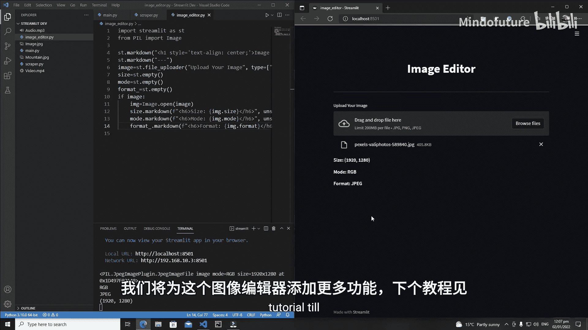

# 022：Streamlit 图像编辑器

## 概述
在本节课中，我们将学习如何使用 Streamlit 和 Pillow 库创建一个基础的图像编辑器。我们将从设置环境开始，逐步实现一个能够上传图片并显示其基本属性（如尺寸、模式和格式）的 Web 应用。

---

### 环境设置与库导入
首先，我们需要创建一个新的 Python 文件并导入必要的库。

创建一个名为 `image_editor.py` 的新文件。

接下来，导入 Streamlit 和 Pillow 库。Pillow 是 Python 的图像处理库，我们将使用它来操作图像。

```python
import streamlit as st
from PIL import Image
```

如果尚未安装 Pillow，请在终端中运行以下命令进行安装：
```bash
pip install pillow
```



---

### 创建应用标题与界面
上一节我们导入了必要的库，本节中我们来看看如何构建应用的基本界面。

首先，为应用程序创建一个居中的标题。

```python
st.markdown("<h1 style='text-align: center;'>图像编辑器</h1>", unsafe_allow_html=True)
```

然后，在标题下方添加一条分隔线，使界面更清晰。

```python
st.markdown("---")
```

运行应用以检查界面是否正常显示。
```bash
streamlit run image_editor.py
```

---





### 添加文件上传功能
界面创建好后，我们需要让用户能够上传图片。以下是实现文件上传器的步骤。

我们将使用 `st.file_uploader` 创建一个文件上传组件，允许用户上传常见格式的图片。

```python
uploaded_file = st.file_uploader("上传你的图片", type=['jpg', 'jpeg', 'png'])
```





---

### 处理上传的图像
文件上传器准备就绪后，我们需要处理用户上传的图像。以下是使用 Pillow 打开并检查图像属性的方法。

首先，检查用户是否已成功上传文件。如果已上传，则使用 Pillow 的 `Image.open()` 方法打开它。

```python
if uploaded_file is not None:
    img = Image.open(uploaded_file)
```

为了在界面上显示图像信息，我们创建三个占位符，分别用于显示图像的尺寸、模式和格式。

```python
size_placeholder = st.empty()
mode_placeholder = st.empty()
format_placeholder = st.empty()
```

然后，将获取到的图像属性填充到对应的占位符中。

```python
size_placeholder.markdown(f"<h6>尺寸: {img.size}</h6>", unsafe_allow_html=True)
mode_placeholder.markdown(f"<h6>模式: {img.mode}</h6>", unsafe_allow_html=True)
format_placeholder.markdown(f"<h6>格式: {img.format}</h6>", unsafe_allow_html=True)
```

---

### 总结
本节课中我们一起学习了如何使用 Streamlit 和 Pillow 创建一个基础的图像编辑器。我们实现了以下功能：
1.  设置开发环境并导入必要的库。
2.  创建了一个带有标题和分隔线的 Web 应用界面。
3.  添加了文件上传器，允许用户上传图片。
4.  使用 Pillow 处理上传的图像，并在界面上显示其基本属性（尺寸、模式、格式）。



在下一节课中，我们将为这个图像编辑器添加更多功能，例如图像滤镜和调整选项。